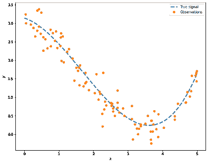
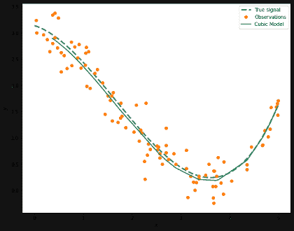

# 用 Python 构建具有交叉验证的健壮模型

> 原文：<https://www.dominodatalab.com/blog/guide-to-building-models-with-cross-validation>

所以，你有了一个机器学习模型！恭喜你！现在怎么办？正如我经常提醒同事的那样，没有完美的模式，只有足够好的模式。考虑到这一点，自然要做的是确保你训练的机器学习模型是稳健的，可以很好地推广到看不见的数据。一方面，我们需要确保我们的模型没有欠拟合或过拟合，另一方面，我们需要优化模型中存在的任何超参数。换句话说，我们对模型验证和选择感兴趣。

在这篇博文中，我们将看到交叉验证技术如何帮助我们使我们的模型像橡树一样健壮结实。

## 交叉验证-是什么？

我们在上面提到过，交叉验证可以帮助我们改进我们的模型，并在给定可用数据的情况下选择最佳模型。毕竟，我们知道没有完美的模型。交叉验证技术允许我们评估机器学习模型的性能，特别是在数据可能有限的情况下。

在模型验证方面，在[之前的帖子](https://blog.dominodatalab.com/what-is-machine-learning-model-training)中，我们已经看到了模型训练如何受益于我们数据的巧妙使用。通常，我们将数据分为训练集和测试集，以便我们可以使用训练数据来创建模型，然后用测试集来评估它。模型验证是工作流程的一个重要部分，我们之前在这个博客中也讨论过它的一些方面。

关于模型选择，通常情况下，我们使用与上述相同的技术来避免过度拟合。当我们有大量数据时，它工作得最好。或者，我们可以使用正则化技术，如果参数变得太大(即可能存在过拟合)，该技术会向模型引入有效的惩罚。当引入正则化时，我们可以选择用于惩罚的值。然而，这些值不一定能从数据中学习到。我们称之为超参数，交叉验证技术可用于优化它们，而不是手动更改值。我们已经在的博客文章[中介绍了超参数调整。](https://blog.dominodatalab.com/towards-predictive-accuracy-tuning-hyperparameters-and-pipelines)

我们可以认为交叉验证不仅是一种防止过度拟合 T2 的方法，也是一种比较不同模型的方法，以确定哪种模型最适合解决特定的预测问题。让我们举一个例子:假设我们的任务是将数据拟合为多项式曲线，我们决定使用回归模型。对于给定的数据集，多项式模型的阶数决定了自由参数的数量，从而决定了其复杂性。如果我们使用正则化，超参数\(\lambda\) 增加了我们模型的复杂性。我们的任务在于确定模型的参数以及\(\λ\)。

让我们生成一些人工数据，让这个例子变得生动起来。假设有一个我们未知的信号\(f(x)\) ，给定输出数据我们尝试确定一个模型使得\(y(x)= f(x)+【ε\)，其中\(\ε\)呈正态分布。

考虑由\(f(x)= 0.1x^3 -0.5x^2-0.3x+3.14 \)给出的真实信号。在这种情况下，我们感兴趣的是仅从数据观测中恢复这个多项式。我们可以使用 Python 来创建我们的人工数据。首先让我们创建一个函数来获取我们的真实信号:

```py
import numpy as np

from matplotlib import pyplot as plt

import pandas as pd

np.random.seed(14)

def f(x):

    return  0.1*x**3 - 0.5*x**2 - 0.3*x + 3.14

```

我们的样本可以通过抽样一个随机的均匀分布并加上一些具有标准差的高斯噪声得到\(\sigma\) 。让我们考虑一个范围\([0，5]\) ，\(\sigma=0.25\) 并创建\(N=100\) 个样本:

```py
N = 100

sigma = 0.25

a, b = 0, 5

# N samples from a uniform distribution

X = np.random.uniform(a, b, N)

# N sampled from a Gaussian dist N(0, sigma)

eps = np.random.normal(0, sigma, N)

# Signal

x = np.linspace(a, b, 200)

signal = pd.DataFrame({'x': x, 'signal': f(x)})

# Creating our artificial data

y = f(X) + eps

obs = pd.DataFrame({'x': X, 'y': y})

```

一张图片抵得上一千个 NumPy 数组，所以让我们来看看我们生成的数据:

```py
x = np.linspace(a, b, 200)

fig, ax = plt.subplots(figsize=(10,8))

ax.plot(signal['x'], signal['signal'], '--', label='True signal', linewidth=3)

ax.plot(obs['x'], obs['y'], 'o', label='Observations')

ax.legend()

plt.xlabel(r'$x$')

plt.ylabel(r'$y$')

```



如果我们有上图中点所示的数值，我们能确定虚线吗？我们可以利用所有的观察结果，提出一个模型。然而，我们如何评估模型是否足够好呢？如果我们有足够的数据，我们可以将数据分成两组，一组用于训练模型，另一组用于评估。即使在这种情况下，模型在训练数据上的表现也不足以建立一个稳健的模型，因为我们可能已经记住了数据，并欺骗自己认为我们有一个完美的模型。

我们可以做得更好:我们可以将集合分成几个训练和验证集合(不仅仅是一个！)，然后我们使用不同的训练集来训练模型。正如在[的第 3 章使用 Python 进行数据科学和分析](http://bit.ly/DataSciencePython)中所讨论的，这是可行的，因为我们用不同的数据片段来呈现模型，因此它“看到”不同的数据观察。用每个不同的分裂获得的一般化误差预计是不同的。然后，我们可以取例如所有训练模型的结果的平均值，从而获得更好的预测器。现在让我们讨论一些使用 Python 的有用的交叉验证技术。

## 验证集

让我们从考虑使用单个验证集来估计通过拟合不同模型获得的错误率开始。

在这种情况下，我们简单地将数据分成两部分:训练集和测试集。训练集专门用于训练模型，为我们提供了评估训练误差的机会。反过来，测试集用于评估模型，我们可以从中获得泛化误差。最后，我们可以对新数据使用该模型，并观察样本外误差。我们在下图中描述了这种情况:


让我们将上述步骤应用于我们的 obs 数据。在这种情况下，我们简单地将数据分成两组，一组用于训练，一组用于测试。让我们采取拆分:

```py
from sklearn import model_selection

x_train, x_test, \

y_train, y_test = model_selection.train_test_split(obs['x'], obs['y'], 

                                                   test_size=0.2, random_state=14)

x_train= x_train.values.reshape(-1, 1)

x_test= x_test.values.reshape(-1, 1)

```

在上面的代码中，我们使用 Scikit-learn 的 train_test_split 函数来创建我们的两个数据集。我们只需提供要分割的数组和测试数据集的大小。在这种情况下，我们持有 20%的数据进行测试。
我们继续使用 Scikit-learn 对训练集中的数据进行线性回归:

```py
from sklearn import linear_model

lm = linear_model.LinearRegression()

vs_lm = lm.fit(x_train, y_train)

```

我们可以查看我们的预测，并估计均方误差:

```py
vs_pred = vs_lm.predict(x_test)

from sklearn.metrics import mean_squared_error

vs_mse = mean_squared_error(y_test, vs_pred)

print("Linear model MSE: ", vs_mse)

```

```py
Linear model MSE:  0.41834407342049484

```

我们知道，考虑到我们之前所做的可视化，线性模型可能不是最好的。让我们比较一下二次多项式和三次多项式。在这种情况下，我们将使用多项式特性函数:

```py
from sklearn.preprocessing import PolynomialFeatures

# Quadratic

qm = linear_model.LinearRegression()

poly2 = PolynomialFeatures(degree=2)

x_train2 = poly2.fit_transform(x_train)

x_test2 = poly2.fit_transform(x_test)

vs_qm = qm.fit(x_train2, y_train)

vs_qm_pred = vs_qm.predict(x_test2)

print("Quadratic polynomial MSE: ", mean_squared_error(y_test, vs_qm_pred))

# cubic

cm = linear_model.LinearRegression()

poly3 = PolynomialFeatures(degree=3)

x_train3 = poly3.fit_transform(x_train)

x_test3 = poly3.fit_transform(x_test)

vs_cm = cm.fit(x_train3, y_train)

vs_cm_pred = vs_cm.predict(x_test3)

print("Cubic polynomial MSE: ",mean_squared_error(y_test, vs_cm_pred))

```

```py
Quadratic polynomial MSE:  0.08791650686920466

Cubic polynomial MSE:  0.051152012599421336

```

我们可以看到，将单个样本分成训练集和验证集可以帮助我们确定三种模型的错误率，即线性、二次和三次模型。我们可以看到，立方的均方误差较小，我们可以看到获得的系数:

```py
print('Cubic Coefficients:', cm.coef_)

```

```py
Cubic Coefficients: [ 0\.         -0.30748612 -0.50263565  0.10141443]

```

我们可以看到，我们很好地恢复了真实信号的参数！

```py
prediction = pd.DataFrame({'x': x_test[:,0], 'y': vs_cm_pred}).sort_values(by='x')

fig, ax = plt.subplots(figsize=(10,8))

ax.plot(signal['x'], signal['signal'], '--', label='True signal', linewidth=3)

ax.plot(obs['x'], obs['y'], 'o', label='Observations')

ax.plot(prediction['x'], prediction['y'], '-', label='Cubic Model', lw=2)

ax.legend()

plt.xlabel(r'$x$')

plt.ylabel(r'$y$')

```



## k 倍交叉验证

在上一节中，我们看到了拆分数据如何帮助我们评估模型。然而，这种划分可能有点生硬，我们最终可能会忽略一些重要的信息，从而增加模型中的偏差或过度拟合。为了避免这一点我们可以采用\(k \)-折叠交叉验证。

在这种情况下，我们不是将数据分成两部分，而是将其分成\(k\) 子集。我们使用\(k-1\) 子集来训练模型，并保留一个用于之前使用的相同过程中的验证。不同的是，现在我们重复过程\(k\) 次，逐个使用每个\(k\) 子集进行验证。我们最终得到\(k\) 经过训练的模型，其结果被汇总。在下图中，我们描述了 4 个-折叠交叉验证的情况:


让我们把这个想法用在我们的 obs 数据上。在这个例子中，我们将使用\(k=15\)和 Scikit-learn，用 KFold 函数:可以很容易地创建我们的\(k\)折叠

```py
from sklearn.model_selection import KFold

kcv = KFold(n_splits=15, random_state=14, shuffle=True)

```

在这种情况下，我们将使用 14 个子集来训练一个模型，并针对一个模型进行测试。在上面的代码中，我们传递了一个随机状态以保证再现性，并且我们确保了在应用分割之前数据是混洗的。我们现在对使用多项式特征的模型感兴趣，范围从线性模型到 8 次多项式。在每种情况下，我们使用我们的\(k\)折叠来训练我们的模型并评估分数。这里我们将使用 Scikit-learn 中的 cross_val_score 函数，它让我们通过交叉验证来评估分数。我们使用一个等于负均方误差的评分参数。这相当于均方误差，但较低的返回值比较高的更好。

```py
from sklearn.model_selection import cross_val_score

for d in range(1, 9):

    poly = PolynomialFeatures(degree=d)

    X_now = poly.fit_transform(obs['x'].values.reshape(-1, 1))

    model = lm.fit(X_now, obs['y'])

    scores = cross_val_score(model, X_now, obs['y'], scoring='neg_mean_squared_error', cv=kcv, n_jobs=1)

    print(f'Degree-{d} polynomial MSE: {np.mean(np.abs(scores)):.5f}, STD: {np.std(scores):.5f}')

```

```py
Degree-1 polynomial MSE: 0.43271, STD: 0.26384

Degree-2 polynomial MSE: 0.13131, STD: 0.06729

Degree-3 polynomial MSE: 0.06907, STD: 0.04105

Degree-4 polynomial MSE: 0.07014, STD: 0.04125

Degree-5 polynomial MSE: 0.07012, STD: 0.04215

Degree-6 polynomial MSE: 0.07141, STD: 0.04332

Degree-7 polynomial MSE: 0.07146, STD: 0.04248

Degree-8 polynomial MSE: 0.07224, STD: 0.04419

```

太好了！我们使用 对我们的数据进行不同的分割，评估了 模型。从以上结果来看，3 次多项式似乎是最好的。

## 留一交叉验证

在留一法交叉验证方法(或简称为 LOOCV)中，我们简单地将一个数据观察值从训练中剔除——因此得名。这是\(k\) 的一个特例——其中\(k\) 等于观察次数。在这种情况下，我们最终在训练中使用所有可用的数据，降低了模型的偏差。执行时间更长，因为我们必须重复这个过程\(k\) 次。让我们来看看:

```py
from sklearn.model_selection import LeaveOneOut

loocv = LeaveOneOut()

for d in range(1, 9):

    poly = PolynomialFeatures(degree=d)

    X_now = poly.fit_transform(obs['x'].values.reshape(-1, 1))

    model = lm.fit(X_now, obs['y'])

    scores = cross_val_score(model, X_now, obs['y'], scoring='neg_mean_squared_error', cv=loocv, n_jobs=1)

    print(f'Degree-{d} polynomial MSE: {np.mean(np.abs(scores)):.5f}, STD: {np.std(scores):.5f}')

```

```py
Degree-1 polynomial MSE: 0.42859, STD: 0.63528

Degree-2 polynomial MSE: 0.13191, STD: 0.15675

Degree-3 polynomial MSE: 0.07011, STD: 0.10510

Degree-4 polynomial MSE: 0.07127, STD: 0.10677

Degree-5 polynomial MSE: 0.07165, STD: 0.10693

Degree-6 polynomial MSE: 0.07302, STD: 0.10871

Degree-7 polynomial MSE: 0.07326, STD: 0.11076

Degree-8 polynomial MSE: 0.07397, STD: 0.11213

```

## 离开 P-Out (LPOCV)

我们可以考虑这样一种情况，而不是将一个单独的数据观察排除在训练之外，我们根据一组(p)观察来评估我们的模型。这意味着对于具有\(n\)个观察值的数据集，我们将使用\(n-p\)个数据点进行训练。在 Python 中，我们可以使用 Scikit-learn 中的 LeavePOut 函数来创建拆分。请注意，省略\(p\)观察并不等同于使用\(k \)-fold withk = int(n/p)，因为后者不会创建重叠集。
请注意，使用 LPOCV 创建的样本数量以组合方式增长，因此成本可能非常高。让我们来看看我们将为 obs 数据集生成的样本数量，其中有 100 个观测值:

```py
from sklearn.model_selection import LeavePOut

for p in range(1,11):

    lpocv = LeavePOut(p)

    print(f'For p={p} we create {lpocv.get_n_splits(X)} samples ')

```

```py
For p=1 we create 100 samples 

For p=2 we create 4950 samples 

For p=3 we create 161700 samples 

For p=4 we create 3921225 samples 

For p=5 we create 75287520 samples 

For p=6 we create 1192052400 samples 

For p=7 we create 16007560800 samples 

For p=8 we create 186087894300 samples 

For p=9 we create 1902231808400 samples 

For p=10 we create 17310309456440 samples 

```

我们可以看到，对于\(p=1\) 我们追回了 LOOCV 案。当我们不考虑 2 个 时，我们需要 4950 个 样本，而对于\(p=3\) 我们需要超过 161000 个 样本。

对于大型数据集，最好使用混合分裂或分层-褶皱。让我们来看看。

## 洗牌拆分

我们可以采用一种策略，像在 中一样生成给定数量的分裂，而不是将 的观察结果排除在外，让我们面临一项非常耗时的任务。折叠交叉验证，但样本首先被打乱，然后分成一对训练集和测试集。我们可以用一个随机数种子来控制随机性。

```py
from sklearn.model_selection import ShuffleSplit

ss = ShuffleSplit(n_splits=40, test_size=0.2, random_state=14)

for d in range(1, 9):

    poly = PolynomialFeatures(degree=d)

    X_now = poly.fit_transform(obs['x'].values.reshape(-1, 1))

    model = lm.fit(X_now, obs['y'])

    scores = cross_val_score(model, X_now, obs['y'], scoring='neg_mean_squared_error', cv=ss, n_jobs=1)

    print(f'Degree-{d} polynomial MSE: {np.mean(np.abs(scores)):.5f}, STD: {np.std(scores):.5f}')

```

```py
Degree-1 polynomial MSE: 0.42941, STD: 0.13004

Degree-2 polynomial MSE: 0.13789, STD: 0.03389

Degree-3 polynomial MSE: 0.07390, STD: 0.02189

Degree-4 polynomial MSE: 0.07531, STD: 0.02177

Degree-5 polynomial MSE: 0.07636, STD: 0.02215

Degree-6 polynomial MSE: 0.07914, STD: 0.02174

Degree-7 polynomial MSE: 0.07806, STD: 0.02154

Degree-8 polynomial MSE: 0.07899, STD: 0.02257

```

## 超参数调谐

我们提到，在我们的模型中，可以对[调整超参数](/data-science-dictionary/hyperparameter-tuning)使用交叉验证。让我们考虑使用岭回归，其中我们使用 L2 范数来惩罚我们的模型。我们可以为λ选择一个值，并用不同的值逐个训练多个模型。
相反，我们可以让机器为我们工作，并请求对指定的参数值进行彻底的搜索。让我们考虑λ∈[0.1，100]，我们有兴趣为我们的模型找到最佳值。
让我们从创建我们要搜索的数值网格开始:

```py
lambda_range = np.linspace(0.1, 100, 100)

lambda_grid = [{'alpha': lambda_range}]

```

我们现在可以使用 GridSearchCV 创建我们的管道，它需要一个模型估计器，一个值网格来搜索，我们能够提供交叉验证分割。
让我们使用我们在本帖中创建的初始分割来获得一个数据集，以检验我们的模型，换句话说，我们将使用 x_train 和 y_train 来训练模型:

```py
from sklearn.model_selection import GridSearchCV

from sklearn.linear_model import Ridge

poly = PolynomialFeatures(degree=3)

X_now = poly.fit_transform(x_train)

kcv = KFold(n_splits=15, random_state=14, shuffle=True)

model_ridge = Ridge(max_iter=10000)

cv_ridge = GridSearchCV(estimator=model_ridge, param_grid=lambda_grid, 

                       cv=kcv)

cv_ridge.fit(x_train, y_train)

```

```py
GridSearchCV(cv=KFold(n_splits=15, random_state=14, shuffle=True),

             estimator=Ridge(max_iter=10000),

             param_grid=[{'alpha': array([  0.1       ,   1.10909091,   2.11818182,   3.12727273,

         4.13636364,   5.14545455,   6.15454545,   7.16363636,

         8.17272727,   9.18181818,  10.19090909,  11.2       ,

        12.20909091,  13.21818182,  14.22727273,  15.23636364,

        16.24545455,  17.25454545,  18.26363636,  19.27272727,

        20.2818181...

        68.71818182,  69.72727273,  70.73636364,  71.74545455,

        72.75454545,  73.76363636,  74.77272727,  75.78181818,

        76.79090909,  77.8       ,  78.80909091,  79.81818182,

        80.82727273,  81.83636364,  82.84545455,  83.85454545,

        84.86363636,  85.87272727,  86.88181818,  87.89090909,

        88.9       ,  89.90909091,  90.91818182,  91.92727273,

        92.93636364,  93.94545455,  94.95454545,  95.96363636,

        96.97272727,  97.98181818,  98.99090909, 100\.        ])}])

```

让我们看看所选的超参数:

```py
cv_ridge.best_params_['alpha']

```

```py
20.28181818181818

```

我们现在可以使用这个参数来创建我们的模型，并查看系数:

```py
best_ridge = Ridge(alpha=cv_ridge.best_params_['alpha'], max_iter=10000)

best_ridge.fit(X_now, y_train)

print('Cubic Coefficients:', best_ridge.coef_)

```

```py
Cubic Coefficients: [ 0\.         -0.22246329 -0.47024996  0.0916242 ]

```

我们可以用给出的数据值来可视化我们的模型结果，即 x_test :

```py
ridge_pred = best_ridge.predict(poly.fit_transform(x_test))

prediction = pd.DataFrame({'x': x_test[:,0], 'y': ridge_pred}).sort_values(by='x')

fig, ax = plt.subplots(figsize=(10,8))

ax.plot(signal['x'], signal['signal'], '--', label='True signal', linewidth=3)

ax.plot(obs['x'], obs['y'], 'o', label='Observations')

ax.plot(prediction['x'], prediction['y'], '-', label='Regularised Ridge Model', lw=2)

ax.legend()

plt.xlabel(r'$x$')

plt.ylabel(r'$y$')

```


## 其他交叉验证实现

Scikit-learn 有许多其他交叉验证策略，可用于数据具有特定特征的情况。例如，当我们有一个分类问题并且类别标签不平衡时，建议使用分层方法来确保相对类别频率在每个折叠中大致保持不变。在这些情况下，我们可能会考虑使用 StratifiedKFold 或 StratifiedShuffleSplit 。前者是\(k\)-fold 的变体，返回分层折叠，换句话说，每个集合包含与完整数据集大致相同百分比的每个目标类的样本。后者是返回分层拆分的混合拆分的变体。
如果我们需要使用的数据是分组的，例如在一项医学研究中，从每个患者身上重复收集数据，交叉验证需要确保在给定组上训练的模型推广到看不见的组。我们可以使用 GroupKFold 来确保同一个组不会同时出现在测试集和训练集中。 StratifiedGroupKFold 实际上是stratified fold与group fold的组合，以便在将每个组放在单个分割中的同时保持每个分割中的等级分布。可以想象，也有 LeaveOneGroupOut 和 LeavePGroupsOut 以及 GroupShuffleSplit 。
另一个有趣的例子是时间序列的交叉验证。与上面使用的示例不同，在时间序列中，我们不能简单地使用随机样本来分配给训练集和测试集。这是因为我们可能不想用未来的值来“预测”过去的值。一个简单的解决方案是使用验证集，用过去的值训练模型，用未来的值进行测试。但是我们能做得比这更好吗？
答案是肯定的，选择的方法是在滚动的基础上应用交叉验证，我们从数据集的一部分开始，然后立即预测一小部分观察值，并评估模型。然后，我们在下一次培训中包括一小部分预测观察，等等。这在时代周刊的 Scikit-learn 中得到了很好的实现。它是\(k\)-fold 的变体，其中我们使用第一个\(k \)fold 进行训练，然后\(k+1 是我们的测试集:

```py
from sklearn.model_selection import TimeSeriesSplit

X = np.array([[10, 20], [30, 40], [10, 20], [30, 40], [10, 20], [30, 40]])

y = np.array([100, 200, 300, 400, 500, 600])

tscv = TimeSeriesSplit(n_splits=4)

for train_index, test_index in tscv.split(X):

    print("TRAIN:", train_index, "TEST:", test_index)

    #To get the indices 

    X_train, X_test = X[train_index], X[test_index]

    y_train, y_test = y[train_index], y[test_index]

    print(X_train, y_train)

```

```py
TRAIN: [0 1] TEST: [2]

[[10 20]

 [30 40]] [100 200]

TRAIN: [0 1 2] TEST: [3]

[[10 20]

 [30 40]

 [10 20]] [100 200 300]

TRAIN: [0 1 2 3] TEST: [4]

[[10 20]

 [30 40]

 [10 20]

 [30 40]] [100 200 300 400]

TRAIN: [0 1 2 3 4] TEST: [5]

[[10 20]

 [30 40]

 [10 20]

 [30 40]

 [10 20]] [100 200 300 400 500]

```

## 摘要

这就对了，将我们的数据分成训练和测试子集的想法似乎比最初看起来要有用得多。将这种想法扩展到交叉验证，不仅有助于我们更有效地利用数据，还为我们提供了一些不可否认的好处。它帮助我们:

*   评估我们模型的质量
*   避免过紧或过紧
*   选择更好的型号

然而这也不是没有代价的。交叉验证的使用使得我们的过程需要更长的时间，我们希望这些额外的时间和努力是值得的，因为模型更加健壮。