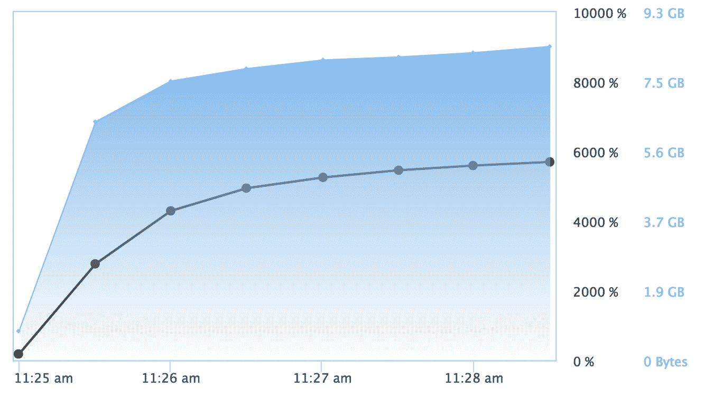
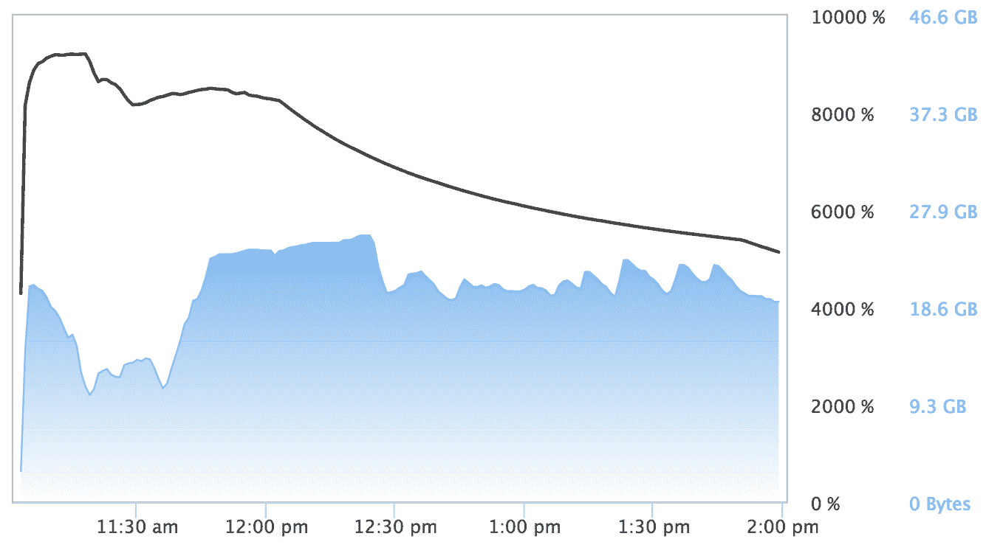
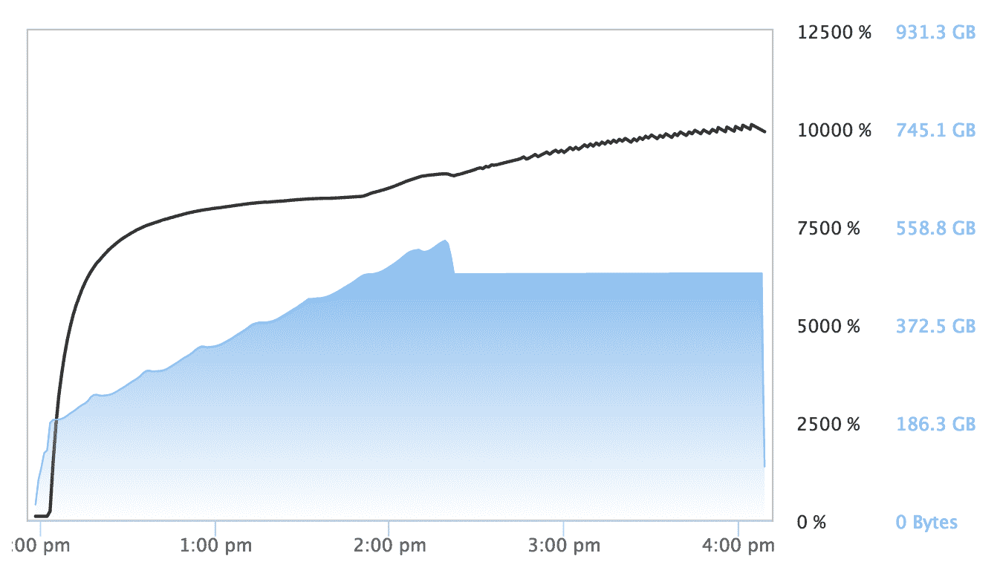

# 用 Amazon 的 X1 实例实现高性能计算-第二部分

> 原文：<https://www.dominodatalab.com/blog/high-performance-computing-amazons-x1-instance-part-ii>

当您拥有 128 个内核和 2TB 的 RAM 时，很难不进行实验，并尝试找到利用触手可及的能力的方法。我们很高兴地提醒我们的读者，我们在 Domino 中支持 Amazon 的 X1 实例，您可以在具有 128 个内核和 2TB RAM 的机器上进行数据科学研究——只需单击一下:

X1 硬件层在我们的云托管环境中可用，并且可以提供给在 VPC 中使用 Domino 的客户。不用说，有了这种前所未有的计算能力，我们继续享受我们第一篇文章的乐趣。在业内一些联系人的鼓励下，我决定看看其他算法是否可以利用 X1 的能力。特别是一个深度学习神经网络和一些随机森林。

## 深度学习

虽然深度学习神经网络最常在 GPU 上训练，但 H2O.ai 有一个深度学习模型，在 CPU 上运行得很好。使用 H2O 的`h2o.deeplearning`模型和带有两个隐藏层的整流器激活函数，每个隐藏层有 200 个神经元，我能够在短短 4 分钟内在航空数据集的 1000 万行上训练一个网络！深度学习模型没有扩展到所有 128 个核心(更准确地说，是 AWS vCPUs)，但利用了近 50%的可用 CPU 容量，并在验证测试集上生成了非常可观的 AUC 0.7255915。

## 随机森林

众所周知，随机森林的训练速度很慢。它们具有令人印象深刻的性能特征和真实世界的行为，但构建起来可能会很慢，尤其是对于大型数据集。与 GBM 不同，随机森林训练更具并行性。对于第一个测试，我使用了 H2O 的随机森林实现，过去在 Kaggle 比赛和客户解决方案中都使用过，发现它表现良好。对于这个测试，我在 X1 实例的 1000 万行数据上训练了一个有 1000 棵树的随机森林。该算法能够利用 X1 实例的几乎所有处理能力。

如前所述，训练一个随机的森林模型可能很耗时。X1 花了近 3 个小时完成培训。然而，相对于验证数据，模型的 AUC 为 0.7699968，这说明了对非常大的数据集使用随机森林的预测能力。

对于第二个测试，我决定试试 scikit-learn 的`RandomForestClassifier`,因为它已经证明自己是随机森林算法的一个成熟且健壮的实现。为了在 128 个内核上并行训练 RandomForestClassifier，我需要做的就是将参数`n_jobs=-1`传递给构造函数。Scikit-learn 不是并行重采样和交叉验证，而是单个`RandomForestClassifier`对象的实际构造。

scikit-learn `RandomForestClassifer`比 H2O 兰登森林多花了一个多小时训练，用了 4 个多小时完成。该实施方案的 AUC 为 0.759779，低于 H2O 模型。所有的随机森林算法并不相同，在这种情况下，H2O 的算法提供了比 scikit-learn 实现更快的性能和更高的精度。

scikit-learn 的`RandomForestClassifier`也比 H2O 的算法使用了更多的内存:训练 scikit-learn 分类器使用了 540GB 的内存，接近峰值时 24GB H2O 随机森林的 20 倍。这两种内存占用都非常适合 X1 实例的巨大可寻址内存空间。也就是说，540GB 的内存是 X1 的内存。人们可以想象 scikit-learn 的内存使用严重限制了可以使用它的`RandomForestClassifier`训练的模型的大小。

在接下来的几个月里，我们将继续撰写关于高性能机器学习的文章，探索 X1，亚马逊的新 P2 GPU 实例(16 个 NVIDIA K80 GPUs，64 个 vCPUs，732GB RAM)，以及我们可以找到的任何其他东西。值得注意的是，这些博客帖子不应该被视为关于我们使用的任何库或算法的性能的权威帖子。相反，它们对于理解利用如此巨大的计算能力所面临的挑战非常有用。我们希望我们的客户和其他供应商将开始发布类似的帖子，描述社区如何利用这些新平台的力量并推动艺术向前发展。

Loren Kerns 制作的标题为“森林”的横幅图片。2.0 下 [CC 授权](https://creativecommons.org/licenses/by/2.0/)