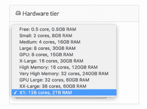
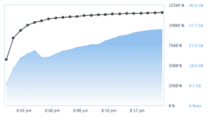
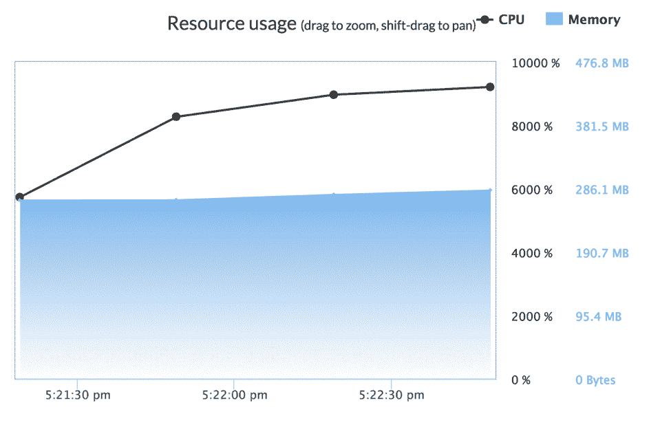

# 亚马逊 X1 实例的高性能计算

> 原文：<https://www.dominodatalab.com/blog/high-performance-computing-with-amazons-x1-instance>

我们很高兴宣布支持亚马逊的 [X1 实例](https://aws.amazon.com/ec2/instance-types/x1/)。现在，在 Domino 中，您可以在具有 128 个内核和 2TB RAM 的机器上进行数据科学研究——只需点击一下:

X1 硬件层在我们的云托管环境中可用，并且可以提供给在自己的 VPC 中使用 Domino 的客户。

不用说，使用这种前所未有的计算能力，我们得到了一些乐趣。请继续阅读我们对使用 X1 实例进行数据科学的一些思考。

## 处理能力:使用 128 个内核

几年前，在一台机器上访问 128 个内核几乎是闻所未闻的，更不用说在一个可以按分钟租赁的平台上了。这种规模的核心数量以前只是分布式和 HPC 系统的领域。

将机器学习工作负载分布到 128 个内核的能力是一个重要的问题，但两种常见的技术是(1)并行化机器学习本身和(2)并行化跨多种可能配置的算法拟合(即，网格搜索)。

并行化网格搜索相当简单，像 [scikit-learn](http://scikit-learn.org/stable/) 和 [caret](http://caret.r-forge.r-project.org) 这样的包为此提供了很好的解决方案。然而，机器学习算法的并行化是一个具有挑战性的问题。这种方法有许多天然的限制，尤其是许多机器学习算法核心的大规模矩阵运算。这些对有益的并行性的数量有自然的限制。

为了探索这些限制，我对两个现代机器学习工具包 H2O 和 XGBoost 进行了简短而不完整的分析，以在规范的航空数据集上拟合具有 1000 棵树的 GBM。我不承担验证生成的模型的拟合优度的任务。在这种情况下，我只是想知道在给定大量内核的情况下，这两个包能够利用多少并行性。

使用 3.10.0.6 H2O 的 R 包版本，并在航空公司数据集的 10 万行上进行训练，该系统能够在 813 秒内训练一个具有 1000 棵树的单一模型。理论上，处理器的全部利用率为 12，800%，即每个内核的利用率为 100%。在训练期间，处理器利用率达到大约 5，600%的峰值，这意味着使用了 56 个内核。

鉴于 GBM 算法的性质，这种限制是可以理解的。对于由算法输入的形状所确定的可能用于训练的并行量有明确的限制。有趣的是，虽然 46GB 的峰值内存使用对于 GBM 来说很高，但它在 X1 上仍然只占总可用 RAM 的很小一部分。尽管 H2O 的 GBM 算法提供了出色的性能，但它无法利用 X1 实例的大部分处理能力和可用内存。

当拟合多个模型并试图搜索大的超参数空间时，X1 实例类型和 H2O 网格工具的能力显示了价值。使用 H2O 的[网格搜索示例](https://github.com/h2oai/h2o-3/blob/master/h2o-docs/src/product/tutorials/GridSearch.md)的修改版本，H2O 的软件包能够利用几乎所有的 128 个内核！

虽然使用 H2O 网格搜索生成任何单个模型受到 GBM 算法的限制，但搜索巨大的超参数空间并利用 X1 为 GBM 找到最佳超参数的能力不应被低估，因为这通常是一项耗时且乏味的任务。

当使用 XGBoost 包为 r 训练类似的单个 GBM 模型时，结果更好。XGBoost 能够利用系统可用处理器能力的近 9300%，即 93 个内核。虽然这仍然使一些处理器没有得到充分利用，但 XGBoost 能够在 117 秒内训练一个有 1000 棵树的 GBM，不到 H2O GBM 所需时间的 1/7。

XGBoost 的作者 Tianqi Chen 广泛地谈到了他利用大规模并行性的许多技巧和方法。XGBoost 专注于提供高性能的 GBM 实现，这表明:它的微调方法能够充分利用 X1 的硬件，训练模型所需的时间比使用 Domino 平台上以前最大的 36 核硬件选项所需的时间少⅓。

同样值得注意的是，XGBoost 在内存使用方面非常高效，在与 H2O 相同的数据集上仅使用了 286 兆字节的内存。这大约是 H2O 实现及其运行时分配的内存的 0.5%。尽管在 X1 实例上这不是问题，但考虑到它们巨大的可寻址内存量，这是一个有趣的发现。

## 足够的处理能力侵入分布式系统

利用 AWS X1 到 Domino 为数据科学家提供的处理能力远远超过了单台机器通常提供的能力。虽然并非所有的处理能力都可以立即简单地获得，并且需要一些智能应用程序，但是例如，当在 XGBoost 内部训练 GBM 时，能够利用 90 多个内核，这拓展了需要分布式系统解决哪些问题的界限。

以前需要 Apache Spark 之类的分布式系统，并需要在可能不熟悉的工具上重新实现和重新培训的问题，现在可以相对简单地解决。使用数据科学家已经知道并喜爱的工具来训练 GBM 和进行大规模并行网格搜索的能力将迫使许多分布式系统的追随者质疑他们真正需要在多大规模上支付分布式系统的代价。当一个人可以在 3 分钟内在 100 万行数据上训练 1，000 棵树时，标杆已经移动了相当大的距离。需要注意的是，这不是模型性能的基准。如果读者对模型性能的深入分析感兴趣，[Szilard Pafka 的这份](http://github.com/szilard/benchm-ml)工作受到高度评价，并比较了本文和其他文章中使用的库。

## 内存:使用 2TB 的内存存在挑战

2TB 的内存是一个荒谬的数量。信封背面的计算表明，在 X1 实例上，可以在 RAM 中加载 420 亿行数据，用于实时交互探索。类似地，当从图形数据的角度考虑这个问题时，可以加载一个比 LiveJournal 图形数据集大 8000 倍的图形。

这种规模的挑战相当令人惊讶:如何将 2TB 的数据加载到 RAM 中，这需要多长时间？利用以前博客文章中的数据，我们发现`data.table` `fread`是一种非常快速的从磁盘读取数据的方式。一些快速基准测试表明，对于来自`readr`包的单线程`read_csv`来说，70MB/s 的读取速度是合理的预期。这意味着 2TB 数据的总读取时间接近 8 小时！虽然有许多多核 CSV 解析器可用，但用户可能仍需要等待一个小时才能完成数据加载。

这是处理如此大的数据集的一个相当出乎意料的方面。

## 结论

利用 Domino 的 X1 实例为数据科学家提供了真正的“机箱中的超级计算机”体验。以前需要移植到复杂的分布式计算环境(如 Apache Spark)和使用不熟悉的语言(如 Scala)的问题，现在可以通过数据科学家熟悉和喜爱的工具来处理:R 和 Python。

传统上可并行化的任务，如网格搜索或蒙特卡罗模拟，可以轻松地利用大量的可用内核。虽然许多现代机器学习库确实利用了并行性，但它们不会立即利用所有内核，并且需要一些工作来充分利用 X1 的能力。

拥有 2TB 的可用 RAM 允许全新类别的“整个数据集”分析，以前这需要昂贵的磁盘访问，并不断计算访问长期存储的对数延迟损失。然而，天下没有免费的午餐:从磁盘快速读取数据到 RAM 仍然是一个有趣的挑战。

我们很高兴有机会在这种规模的硬件上支持您的分析，并迫不及待地想看看这个平台允许您创建什么样的新分析和新模型。X1 实例现在可以在 Domino 的云生产环境中使用，我们将很乐意与任何感兴趣的 VPC 客户合作，将 X1 实例提供到他们的环境中。

好奇还有哪些算法可以受益于 X1 的强大功能？我在第二部中得到了一些乐趣。

Nic McPhee 制作的标题为[“书立”](https://www.flickr.com/photos/nicmcphee/244406784/in/photolist-nADC5-pQF9Ny-4DSWbu-rNvMf-5NPQan-gJsqRe-nHEQdr-dWX4R8-dX3H3b-rJh7Wh-dWX4Ei-9G9cQ3-9aVQYj-e1TN14-dWX5aa-e1Zrtu-GeQFqE-4T35wX-cqqomQ-a2xApF-83z1rm-yFrEnG-DNKRg-4EnQcd-dWX4ix-FpPYHw-dmEfJj-frXuN7-e1TNYz-cEfZey-e1TPye-DUDLp-8XtXiy-cbscub-rnjY6T-e1TPYv-25Je3s-9H8JNx-22BENJ-5Ajk8J-hbAW3-v2DEVc-GWywyU-wYv4Hh-Gzqb6q-GzqaM9-xo3u89-oes2AD-GWyvYA-GWyw5Y)的横幅图片。持牌下 [CC 乘 2.0](https://creativecommons.org/licenses/by/2.0/)