# 具有深度检查的高标准 ML 验证

> 原文：<https://www.dominodatalab.com/blog/high-standard-ml-validation-with-deepchecks>

在 之前，我们已经在 [的博客中谈到了模型验证的重要性，这是一个确保模型按照预期的方式运行并解决其设计要解决的问题的过程。验证和测试是构建您可以信任的机器学习管道的关键要素。我们还谈到了](https://blog.dominodatalab.com/what-is-model-validation) [将测试](https://blog.dominodatalab.com/the-importance-of-structure-coding-style-and-refactoring-in-notebooks) 整合到你的管道中，许多数据科学家发现这是有问题的。这些问题源于这样一个事实，即并非所有的数据科学家都对传统的代码测试方法充满信心，但更重要的是，数据科学不仅仅是代码。在验证管道时，我们需要考虑验证数据完整性、检查其分布、验证数据分割、模型评估、模型比较等。但是，我们如何应对这种复杂性并保持管道的一致性呢？进入[deep checks](https://deepchecks.com/)——一个用于测试和验证机器学习模型和数据的开源 Python 包。

请注意，深度检查可以在模型生命周期的多个阶段插入——您可能希望在接收数据后立即检查数据，但也要确保在预处理完成后，您的训练和测试集没有问题。深度检查还通过提供对模型性能的洞察来促进模型评估阶段。


这个包最初是用表格数据创建的，但最近已经扩展到支持计算机视觉用例。据其创建者称，NLP 功能目前也正在开发中。

## 深度检查入门

安装包很容易，因为它已经是 PyPI 的 [部分。表格数据支持是使用](https://pypi.org/project/deepchecks/)

```py
pip install deepchecks --upgrade
```

并且具有计算机视觉支持的味道是使用

```py
pip install "deepchecks[vision]" --upgrade
```

唯一需要注意的是 CV 支持还需要 Pytorch，您必须单独安装它。


该框架引入了三种不同的范例，为了有效地使用深度检查，您需要理解这三种范例:

*   **检查** -这些是主要的构建模块，它们使您能够探测数据/模型的不同方面。一般来说，有三种类型的检查，根据其目标 ML 管道的阶段进行分类:数据完整性、训练测试验证和模型性能评估。运行检查的结果可以是可视的人工产物(表格、图表等)。)或返回值，您可以将它们与条件一起使用(见下文)
*   **条件** -可以添加到带有通过/失败/警告输出的检查中的功能。Deepchecks 提供的大多数开箱即用的检查都带有预先实现的条件，但是您可以轻松地添加、删除和自定义这些条件。
*   **Suites** -带有相应条件的有序支票集合。套件使您能够一次运行多个检查，还可以显示一个摘要报告，以便您可以看到完整的结果集合。Deepchecks 提供了许多预构建的套件，但也让您能够通过定制现有套件或从头开始创建新套件来构建自己的套件。

## 一个(不那么)简单的保险欺诈用例

现在我们知道了深度检查的一些基础知识，让我们看看如何使用这个框架来分析一个有问题的数据集。我们将使用涉及车辆的欺诈性保险索赔数据集的修改版本。这个数据集在很多层面上都存在问题，看看 Deepchecks 如何捕捉并帮助解决这些问题是很有趣的。请注意，下面的代码片段摘自端到端演示笔记本，可在此处获得。

### 数据接收和验证

我们首先从熊猫数据框架中获取原始数据。

```py
data_df = pd.read_csv("insurance_fraud.csv")

data_df.head()

```

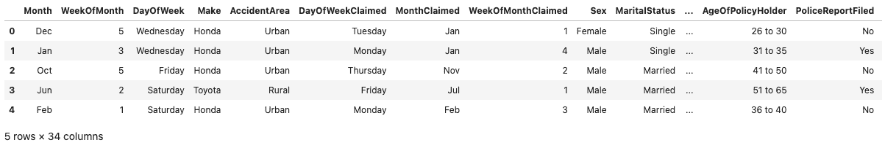

数据集包含各种列，包括数字列、字符串分类列和日期时间相关列。

Deepchecks 可以提供帮助的第一步是当数据“刚出炉”时，即您第一次加载数据时。使用 Deepchecks 的第一种方式是运行包含多个检查的预构建套件。每个检查测试数据或模型的一个方面，可以独立地失败或通过其预定义的“条件”。

现在，我们将加载 single_dataset_integrity 套件，并使用它来检测加载的数据框的完整性问题。

```py
from deepchecks.tabular.suites import
 single_dataset_integrity

result = single_dataset_integrity().run(data_df)

result
```

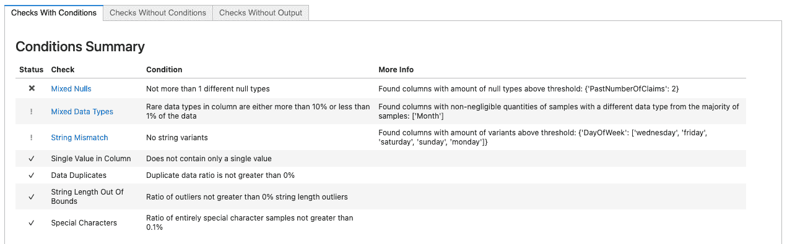

....

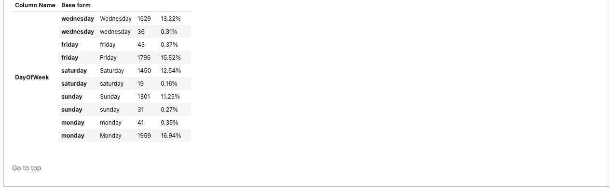

结果显示顶部的条件摘要会立即提醒我们进行三次检查，看看谁的条件失败了。第一个(用失败条件的 x 标记)告诉我们在“PastNumberOfClaims”列中有几种类型的空值。单击该表的 check 列中的链接，我们将看到 Check 显示，它让我们知道该列既有字符串“none ”,又有 numpy NaN 值，标记了该特性中的缺失值。

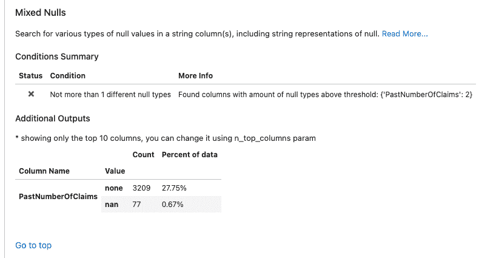

第二个失败条件(标有黄色的“警告”符号，让我们知道这不是一个严重的失败)让我们知道我们在两列中有混合的数据类型。进一步的检查表明，我们有一个单一的样本，在这些列包含零。

```py
data_df['DayOfWeekClaimed'][data_df['DayOfWeekClaimed'].str.isnumeric()]
```

```py
1146    0

Name: DayOfWeekClaimed, dtype: object
```

```py
data_df['MonthClaimed'][data_df['MonthClaimed'].str.isnumeric()]
```

```py
1146    0

Name: MonthClaimed, dtype: object
```

最后，字符串不匹配检查提醒我们，单个类别(月份)在字符串值中有几种不同的表示方式。

```py
data_df['Month'].value_counts()
```

```py
Jan    1014

May     975

Mar     949

Jun     937

Dec     925

Oct     923

Apr     917

Feb     913

Sep     908

Jul     907

Nov     864

Aug     806

5        53

10       50

11       49

3        46

12       45

8        45

6        44

9        44

4        42

1        42

2        36

7        31
```

### 数据预处理和数据验证

我们现在可以在前进之前处理所有这些完整性问题，而不是在建模时(或者更糟，以后)捕捉所有这些问题。

```py
data_clean_df = data_df.copy()

data_clean_df['PastNumberOfClaims'] = data_clean_df['PastNumberOfClaims'].fillna('none')

data_clean_df.drop(index=1146, inplace=True)

data_clean_df['Month'] = data_clean_df['Month'].replace({str(i): datetime.date(1900, i, 1).strftime('%b') for i in range(1, 13)})

data_clean_df['DayOfWeek'] = data_clean_df['DayOfWeek'].str.lower()
```

我们现在可以重新运行 Deepchecks 套件，看看我们是否已经解决了所有这些完整性问题。

```py
single_dataset_integrity().run(data_clean_df)

```

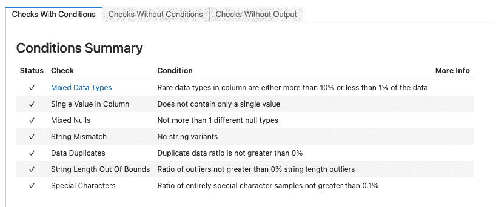

安全了。我们可以继续为模型训练准备数据。

现在我们做一些额外的特征预处理，以帮助模型。我们注意到一些属性包含丢失的值。让我们执行一个简单的特性工程步骤，根据特定的属性类型，用适当的缺失值来替换字符串“none”和“new”。为此，我们将使用以下函数:

```py
import re

def str_to_mean(str_val):

    if isinstance(str_val, (int, float)):

        return str_val

    if str_val.lower() == 'none':

        return np.nan

    if str_val == 'new':

        return 0

    parts = re.findall(r'\d+', str_val)

    parts = list(map(int, parts))

    if len(parts) < 1:

        raise ValueError(str_val)

    return np.mean(parts)
```

现在让我们将它应用到正在讨论的属性中:

```py
data_clean_df['VehiclePrice'] = data_clean_df['VehiclePrice'].apply(str_to_mean)

data_clean_df['Days_Policy_Accident'] = data_clean_df['Days_Policy_Accident'].apply(str_to_mean)

data_clean_df['Days_Policy_Claim'] = data_clean_df['Days_Policy_Claim'].apply(str_to_mean)

data_clean_df['AgeOfVehicle'] = data_clean_df['AgeOfVehicle'].apply(str_to_mean)

data_clean_df['AgeOfPolicyHolder'] = data_clean_df['AgeOfPolicyHolder'].apply(str_to_mean)

data_clean_df['NumberOfCars'] = data_clean_df['NumberOfCars'].apply(str_to_mean)

data_clean_df['PastNumberOfClaims'] = data_clean_df['PastNumberOfClaims'].apply(str_to_mean)
```

我们还需要处理“AddressChange_Claim”属性，要么将其解包为二进制变量，要么用数字表示持续时间。为了简单起见，我们将采用后者。

```py
data_clean_df['AddressChange_Claim'] = data_clean_df['AddressChange_Claim'].replace(

{

    'no change': 10,

    '4 to 8 years': 6,

    '2 to 3 years': 2.5,

    '1 year': 1,

    'under 6 months': 0.5

})
```

最后，我们需要将数据分成训练集和测试集。不过，在我们开始之前，让我们先来看看样本是如何在数据集中每年的每个类中分布的。这样，我们可以根据年份进行拆分，这是当数据具有时间成分时处理拆分的正确方式。

```py
data_clean_df[['Year', 'FraudFound_P', 'Month']].groupby(['Year', 'FraudFound_P']).count()
```

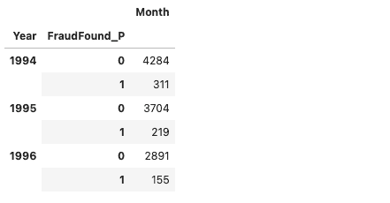

我们现在以这样一种方式分割数据，即 1994 年的所有观测数据将用于训练模型，而其他所有数据将用于评估。

```py
train_df = data_clean_df[data_clean_df.Year == 1994]

test_df = data_clean_df[data_clean_df.Year > 1994]
```

通常在这一步之后，我们将直接尝试用一些模型进行实验，谁能责怪我们呢！但是 Deepchecks 提供了一个特殊的预建检查套件，旨在检测数据集分割方式的问题。我们会运行这个套件以确保。

为了访问 Deepchecks 更高级的功能，我们必须告诉它更多关于我们的数据集的信息。标签是什么？分类特征是什么？为了做到这一点，我们使用 Deepchecks Dataset 对象来包装我们的数据帧，并包含这些元数据信息。

我们首先创建一个包含所有分类变量的列表。

```py
from deepchecks.tabular import Dataset

cat_cols = ['Month',

 'WeekOfMonth',

 'DayOfWeek',

 'Make',

 'AccidentArea',

 'DayOfWeekClaimed',

 'MonthClaimed',

 'WeekOfMonthClaimed',

 'Sex',

 'MaritalStatus',

 'Fault',

 'PolicyType',

 'VehicleCategory',

 'PoliceReportFiled',

 'WitnessPresent',

 'AgentType',

 'NumberOfSuppliments',

 'BasePolicy']
```

我们还需要告诉 Deepchecks 我们的日期时间指示器是什么。这里，是年份栏。然后，Deepchecks 可以在拆分包含时间泄漏的情况下发出警报，尽管在这种情况下，我们知道我们正确地进行了拆分，因此测试数据在时间上在训练数据之后。注意，我们还指出了分割中使用的目标变量。

```py
train_ds = Dataset(train_df, label='FraudFound_P', datetime_name='Year', cat_features=cat_cols)

test_ds = Dataset(test_df, label='FraudFound_P', datetime_name='Year', cat_features=cat_cols)
```

我们现在运行 train_test_validation 套件，它正是为了验证我们的分割而构建的。由于正在运行一些更复杂的逻辑，这可能比完整性检查需要更多的时间。

```py
from deepchecks.tabular.suites import train_test_validation

res = train_test_validation().run(train_ds, test_ds)

res
```

报告摘要如下所示:

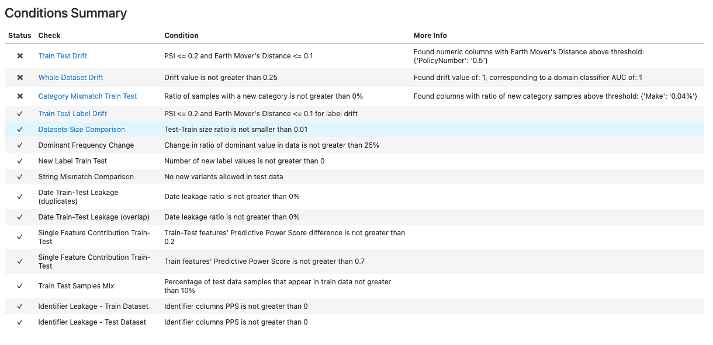

我们经历了许多失败。更深入地看，我们在我们的分歧中看到两个问题:

*   旨在检测训练和测试数据集之间单个特征分布变化的特征漂移检查偶然发现了一个完全不同的问题——我们忽略了 PolicyNumber 列实际上是保险单的运行索引，完全不适合用作特征。

    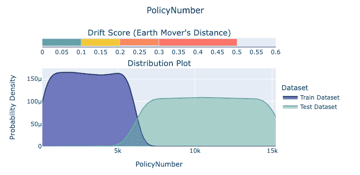
*   类别不匹配训练测试检查提醒我们，分类特征“Make”在测试数据中有一些训练数据中不存在的新类别。如果输入到模型中，这肯定会引起一些混乱，如果不是彻头彻尾的例外的话。

    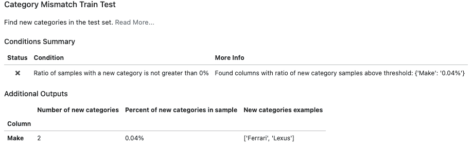

让我们快速解决这些问题。首先，我们删除测试集中出现的额外类别。

```py
test_df = test_df[~test_df.Make.isin(['Ferrari', 'Lexus'])]
```

我们还可以通过显式地将 PolicyNumber 作为 index_name 传递来告诉 deep checks policy number 是我们的索引列，而不是一个特性。对于额外的非特性列，我们可以通过向 Dataset 对象的特性参数传递一个列表来明确定义哪些列将被视为特性。

```py
train_ds = Dataset(train_df, label='FraudFound_P', datetime_name='Year', index_name='PolicyNumber', cat_features=cat_cols)

test_ds = Dataset(test_df, label='FraudFound_P', datetime_name='Year', index_name='PolicyNumber', cat_features=cat_cols)
```

让我们再次运行验证，看看我们的更改是否解决了有问题的发现。

```py
res = train_test_validation().run(train_ds, test_ds)

res
```

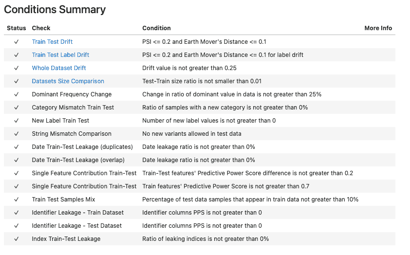

或者，我们可以做一些更 Pythonic 化的事情，而不是再次检查整个输出——我们可以检查每个单独检查的结果(在由名为。结果)并确保他们的条件已经通过。

```py
all(res.results[i].passed_conditions() for i in range(len(res.results)))
```

```py
True
```

再说一遍，一切正常！我们终于可以继续训练我们的模型了。

### 模型训练和验证

为了拟合模型，我们将使用 CatBoost，这是一个高性能的开源库，用于决策树的梯度提升。我们将创建一个 [CatBoostClassifier](https://catboost.ai/) 实例，用于训练和应用分类问题的模型。该类还提供了与 scikit-learn 工具的兼容性。

```py
from catboost import CatBoostClassifier

model = CatBoostClassifier(iterations=100, random_seed=42, verbose=0)

model.fit(train_df.drop(columns=['FraudFound_P', 'Year', 'PolicyNumber']), train_df['FraudFound_P'],
          cat_features=cat_cols)
```

```py
<catboost.core.CatBoostClassifier at 0x7f4e436614f0>
```

现在我们有了一个训练好的模型，让我们看看深度检查如何帮助模式评估。

```py
from deepchecks.tabular.suites import model_evaluation

res = model_evaluation().run(train_ds, test_ds, model)

res
```

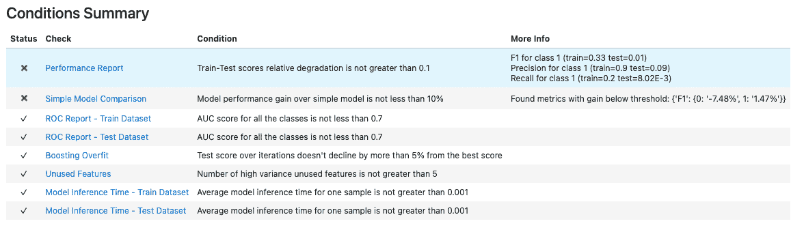

总结表明我们的模型有些问题。例如，我们看到它与常数模型相比具有几乎相同的性能，常数模型总是输出类 0。这是两个阶层高度失衡造成的。

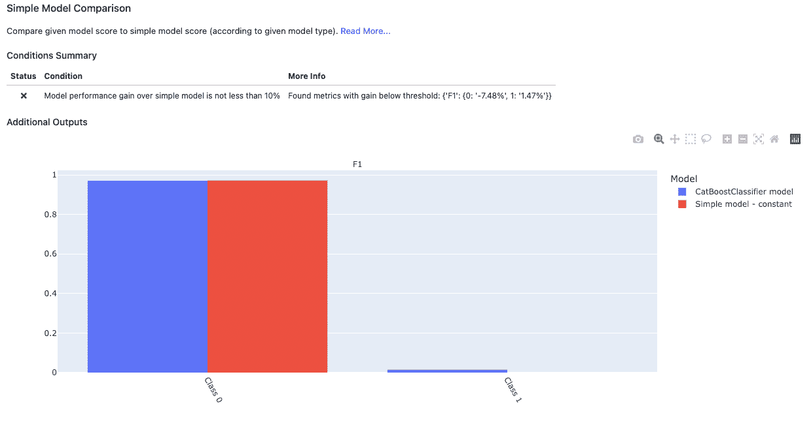

让我们重新训练模型，以解决不平衡的阶级。

```py
model = CatBoostClassifier(iterations=100, random_seed=42, verbose=0,

                           scale_pos_weight=np.sqrt(len(train_df[train_df['FraudFound_P']==0]) / len(train_df[train_df['FraudFound_P']==1])))

model.fit(train_df.drop(columns=['FraudFound_P', 'Year', 'PolicyNumber']), train_df['FraudFound_P'],
          cat_features=cat_cols)
```

```py
<catboost.core.CatBoostClassifier at 0x7fa92f1e5640>
```

我们在开始时提到 Deepchecks 也支持定制套件——一个接一个运行的检查列表，其结果将一起显示。让我们使用此功能来定义一个自定义套件，它执行以下操作:

*   运行检查，验证测试性能与列车相比下降不超过 0.1%
*   为模型生成混淆矩阵，并将其包含在报告中
*   检查因在梯度增强模型中使用过多迭代而导致的过度拟合
*   使用简单的模型试探法来建立基线，并验证模型的性能相对于基线至少提高了 10%

设置和运行定制套件的代码非常简单明了。

```py
from deepchecks.tabular import Suite

from deepchecks.tabular.checks import PerformanceReport, BoostingOverfit, SimpleModelComparison, ConfusionMatrixReport

custom_suite = Suite('My Custom Performance Suite',

                     PerformanceReport().add_condition_train_test_relative_degradation_not_greater_than(0.1),

                     ConfusionMatrixReport(),

                     BoostingOverfit(alternative_scorer=['f1', 'f1']).add_condition_test_score_percent_decline_not_greater_than(0.01),

                     SimpleModelComparison().add_condition_gain_not_less_than(),

                    )

custom_suite.run(train_ds, test_ds, model)
```

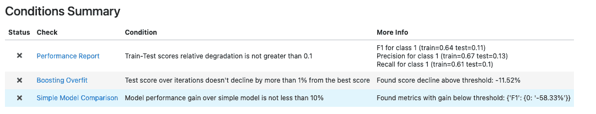

我们看到有三项检查失败了。其中一个指示模型过度拟合，这也可能是其他两个被触发的原因。让我们重新训练该模型，并改变一些可以缓解过度拟合问题的参数。例如，我们可以减少训练迭代的次数，限制其深度等。

```py
model = CatBoostClassifier(iterations=50, random_seed=42, verbose=0, learning_rate=0.2, colsample_bylevel=0.03, subsample=0.5,

                       depth=4,

                           scale_pos_weight=len(train_df[train_df['FraudFound_P']==0]) / len(train_df[train_df['FraudFound_P']==1]))

model.fit(train_df.drop(columns=['FraudFound_P', 'Year', 'PolicyNumber']), train_df['FraudFound_P'],

          cat_features=cat_cols)
```

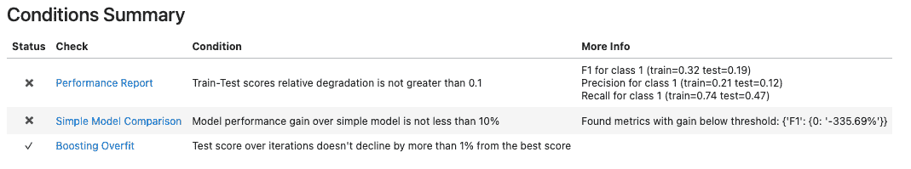

这一次，我们看到增压过量检查变成了绿色。我们还可以看到，训练和测试中的 F1、精度和召回指标都得到了提高。就性能而言，我们还没有达到这一水平，但这主要是由于数据不平衡(这可以很容易地在简单的模型比较细节中看出)。然而，纠正这一点是通过其他技术实现的(参见 [合成少数过采样(SMOTE)技术](https://blog.dominodatalab.com/smote-oversampling-technique) )，不在本文讨论范围之内。

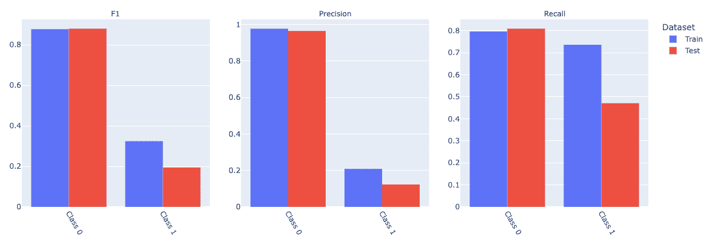

## 摘要

在本文中，我们研究了 deep checks——一个开源包，它使您能够为数据和模型验证构建测试套件。我们展示了它的一些核心功能，并看到了该框架在模型生命周期的不同阶段是多么有用。这里我们使用深度检查来:

*   评估不熟悉的新数据集
*   确保训练/测试集被正确分割，没有数据泄漏
*   检查我们模型的性能

我们没有探索任何 [计算机视觉特有的功能](https://docs.deepchecks.com/en/stable/checks_gallery/vision.html) ，这听起来肯定很有希望。同样值得注意的是，Deepchecks 背后自称为“机器学习极客”的团队正在积极增加新功能。例如，模型比较和模型可解释性是 Deepchecks 路线图上听起来特别有趣的两个项目。

Deepchecks 已经有了很多像 [DataDudes](https://datadudes.ai/) 这样的企业客户。@ Datadudes 的联席首席执行官 Nathaniel Shimoni 说:“我们一直在使用 Deepchecks 来验证我们的数据，每次我们得到一个新的测试集，以及在我们部署到生产之前。我和我的团队喜欢这个包，我们计划将它的使用扩展到其他阶段。

开源也是 Deepchecks 的优势。将框架与 H2O 模型、气流 CI/CD 管道、pytest 测试用例 HuggingFace Transformers 以及当然还有[Domino Enterprise MLOps Platform](https://www.dominodatalab.com/product/domino-enterprise-mlops-platform)结合起来相当简单。