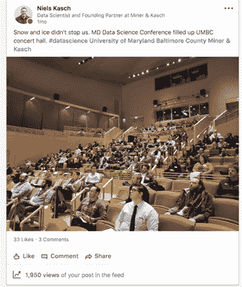
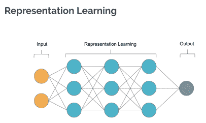
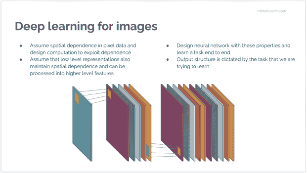
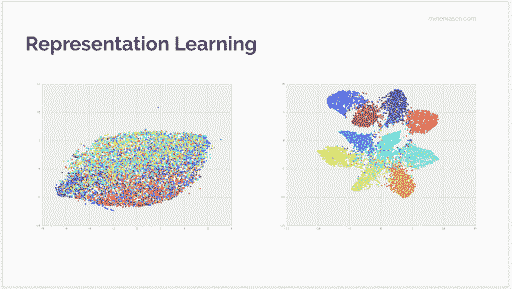
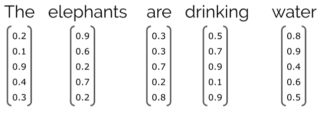
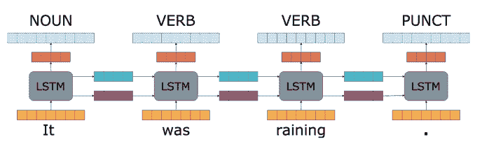
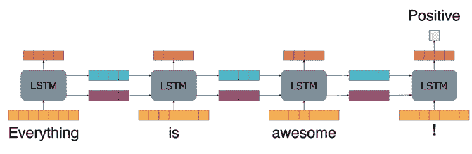
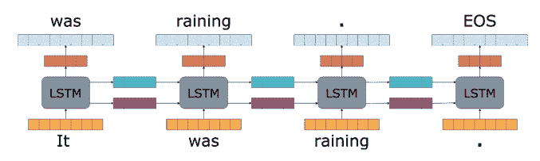

# 马里兰数据科学会议的亮点:图像和文本的深度学习

> 原文：<https://www.dominodatalab.com/blog/highlights-from-the-maryland-data-science-conference-deep-learning-on-imagery-and-text>

人工智能和数据科学咨询公司 Miner & Kasch 的联合创始人 *[尼尔斯·卡斯奇](https://www.linkedin.com/in/nielskasch/)，提供了在马里兰州数据科学大会上举行的深度学习会议的见解。*

## 介绍

这篇博客概述了 Miner & Kasch 在 [UMBC](https://www.umbc.edu//) 举办的首届马里兰数据科学大会，并深入探讨了由 [Florian Muellerklein](https://www.linkedin.com/in/florian-muellerklein-3b1739139/) 和 [Bryan Wilkinson](https://www.linkedin.com/in/bryan-wilkinson-241b86169/) 主持的 [*关于图像和文本的深度学习*演讲](https://drive.google.com/file/d/1i5iWzH7bwCdgncVIM6sD60GCW7bn6srg/view)。

数据科学是一个令人兴奋、快速发展和充满挑战的领域，因此在一所名列全国最具创新性学校第九位的顶尖学校举办这次会议似乎是合适的。(你可能还记得 2018 年 NCAA 锦标赛奇迹中的 [UMBC。)和耶...Miner & Kasch 由 UMBC 校友创办。](https://en.wikipedia.org/wiki/2018_UMBC_vs._Virginia_men%27s_basketball_game)

在这次会议上，我们将工业界和学术界聚集在一起，讨论机器学习、人工智能和数据平台方面的最新发展和前沿科学。我们聚焦于行业从业者——数据科学家、业务经理、企业家、ML 工程师以及学生——来展示和讨论人们在行业和学术界前沿研究中面临的现实问题。

会议并不是一帆风顺的。首先，一场巨大的冰雪风暴迫使我们取消了原定的活动。但是，尽管因为下雪取消了行程，接下来又做了重新安排的噩梦(如果你想听更多关于我们从错过的午餐中优雅恢复的事情，请 PM me)，我们还是让 UMBC 全新的表演艺术和人文建筑的音乐厅坐满了人。

会议主题和发言人阵容包括:

*   前沿的深度学习技术，来自 UMBC 的 Frank Ferraro 博士讲述了用于平易近人的事实预测和验证的*神经语义方法，谷歌的 Marc Pickett 博士讲述了持续学习。*
**   行业对话，如 TRowe 的 Erik von Heijne 关于*量化金融研究中的文本数据*以及地理空间情报初创公司 GeoSpark 的 Serena Kelleher-Vergantini 和 Brendan Slezak 关于 *[用机器学习和开源数据](https://drive.google.com/file/d/1q0eLgP7rSoVdE9z_TK2cfgaLnvcNGIrU/view)* 衡量地缘政治风险。*   数据平台讲座，包括 Databricks 的 Jordan Martz 关于使用 Apache Spark 进行大规模数据分析的讲座*、Miner & Kasch 的蒂姆·伯克关于在云端进行数据科学的讲座、Corey Nolet 关于 NVidia 最新的 DL 框架**   展望，有贾斯汀·勒托、 [*大数据& AI:行业现状、劳动力趋势及未来展望*](https://drive.google.com/file/d/1KEfb-UCkC9nNuLkrjqL92JLXkhT2XXU0/view)*

 *## 图像和文本的深度学习

在社交时间，Florian Muellerklein 和 Bryan Wilkinson 博士以深度学习为重点的演讲吸引了观众的注意力，并引发了许多后续讨论。他们的 talk *[关于图像和文本的深度学习](https://drive.google.com/file/d/1i5iWzH7bwCdgncVIM6sD60GCW7bn6srg/view)* 顾名思义，专注于处理图像和文本数据的深度学习的最新进展。

这个演讲特别有趣，因为:

*   公司拥有大量文本数据，从合同和法律文件到员工调查和社交媒体。公司通常不知道如何开始分析这些数据并从中获取价值。
*   图像和视频数据是公司增长最快的数据来源之一，最近的进步使安全、质量控制和零售智能等许多使用案例成为可能。
*   该演讲对最新技术以及机器学习实践者如何将这些技术应用于他们的问题提供了一个很好的概述。

## 意象的深度学习

深度学习现在经常用于图像分类、对象检测、图像分割和图像生成等任务。Florian 在他们的谈话中表示，这些任务是通过深度学习模型学习训练数据的多阶段表示的能力来实现的。这些多阶段表示是提高模型准确性的核心，它们适用于各种用例。那么 DL 中的表征学习是如何工作的呢？

一个深度学习模型，在基础层面，由*输入*层、*隐藏*层、*输出*层组成。在*输入*，你输入模型数据，也就是图像。负责学习表示的*隐藏*层“使用多层[非线性处理](https://en.wikipedia.org/wiki/Nonlinear_filter)单元的级联进行[特征提取](https://en.wikipedia.org/wiki/Feature_extraction)和转换。每个后续层都使用前一层的输出作为输入。”*输出*层通常为图像生成一个类标签，或者关于图像或图像中的一些其他有用的东西，这取决于您的问题设置。

研究人员正在更好地理解和表征模型组件，例如在*隐藏*层中的不同卷积运算如何对学习表示做出贡献。例如，可以识别为边、直线和曲线等概念激活的网络部分。然而，你在网络中走得越深，网络学习的抽象表示就越多。这是由于网络的设计，其中卷积操作假设图像像素之间的空间相关性，这当然是一个合理的假设。线之所以只是线，是因为空间相关的像素形成了线。由于网络可以保持较低层次概念的空间依赖性，较深层次能够学习高层次的概念，如什么使脸成为脸。

如下面的动画所示，您可以通过网络的不同层跟踪学习到的表示。在可视化中，每个色块代表一个图像类别，您可以看到更深的层如何更好地识别这些组件的本质。这使得用正确的分类适当地标记每个图像变得微不足道。

我们如何在实践中使用它？

首先，关于模型结构的现有研究和见解使我们能够知道哪些模型组件允许我们学习空间/图像数据的良好表示。我们可以将模型组件视为加速创建新模型的构建模块。例如，简单地替换*输出*层并将不同类型的层附加到‘主干’层的末端，允许我们在不同类型的任务上训练模型。这是迁移学习中的常见做法。

Florian 展示了一些预先训练的模型，如 ResNet、Inception V3，以及如何利用这些模型学习的表示来完成自己的定制机器视觉任务，而无需从头开始重新训练这些网络的时间和成本。他使用无人机镜头中实时检测汽车的令人印象深刻的视频展示了这些能力。他基本上是让一架无人机在一个街区上空飞行，并在无人机的视频流中找到所有的汽车。令人印象深刻，但你自己看吧。

## 文本深度学习

虽然图像在计算机世界中有一种固有的表现形式——图像只是像素值的矩阵，而 GPU 在处理矩阵方面非常出色——但文本却没有这种固有的表现形式。那么问题就变成了，- [如何表示深度学习的文本](/a-guide-to-natural-language-processsing)。

Bryan 研究了各种编码方案，以处理与不同自然语言处理(NLP)任务相关的特殊文本。一种广泛使用的表示方法是将单词编码为向量(见下文)，其中每个单词都被转换为一个向量，该向量包括关于单词本身(例如，大写模式)及其周围上下文的信息(例如，单词*是*前面是*大象*，后面是*喝酒*)

文本中的图像之间的区别因素之一是特定句子中的文本具有不同的长度。长短期记忆(LSTM)神经网络很好地处理了这个问题，因为它们可以应用于任意大小的序列。时序数据也是有序的，LSTMs 在这方面也有帮助。

在当今文本丰富的世界中，您可以在 NLP 的所有领域中找到 LSTMs，包括:

*   机器翻译
*   问题回答
*   情感分析
*   语法纠正
*   信息提取
*   信息检索
*   文件分类
*   基于内容的推荐系统
*   更多的

这些字段之间的区别在于 LSTMs 的使用方式。例如，在词性标注中，当您试图识别句子中的单词是动词、名词还是另一个词类时，LSTM 节点会为序列中的每个单词生成一个输出。

在情感分析等其他应用中，您可能对一条推文是正面、负面还是中性的情感感兴趣，LSTMs 将它们的输出传播到推文中的整个单词序列，以产生单个输出。

然而，在语言建模和文本生成中，当您试图预测序列中的下一个单词时，LSTMs 在对单词周围的上下文进行建模时非常有用。

对文本的深度学习有它自己的迁移学习形式——嗯，不完全是迁移学习，而是在大量文本上预先训练一个大型网络，就像对 BERT 所做的那样。这里的想法是从容易获得的文本来源(如维基百科)创建一个通用语言模型，然后将该模型用于您的特定任务。

Brian 提到，预训练模型“不仅提高了性能”，而且“可以减少所需训练实例的数量。”这对从业者有严重的实际好处！作为一个实际的例子，“一个预训练的 ULMFIT 模型只需要 100 个带标签的情感数据的例子，就可以达到与在 10，000 个带标签的例子上从头学习的模型相同的性能。”

## 下一步是什么

深度学习社区在马里兰州很强大。我们的会议取得了巨大的成功，从与会者的人数到他们不同的背景。UMBC 的学生与公司和行业从业者进行了一天的交谈。我们希望许多学生找到了实习机会和/或收到了工作邀请。*