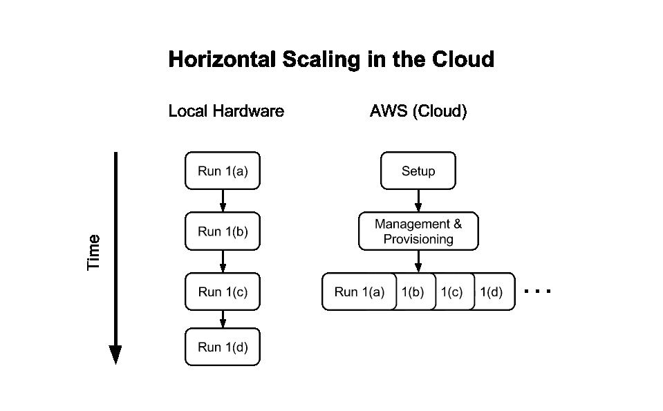
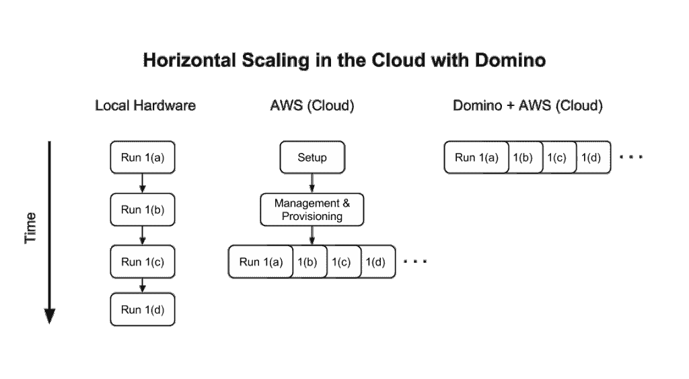
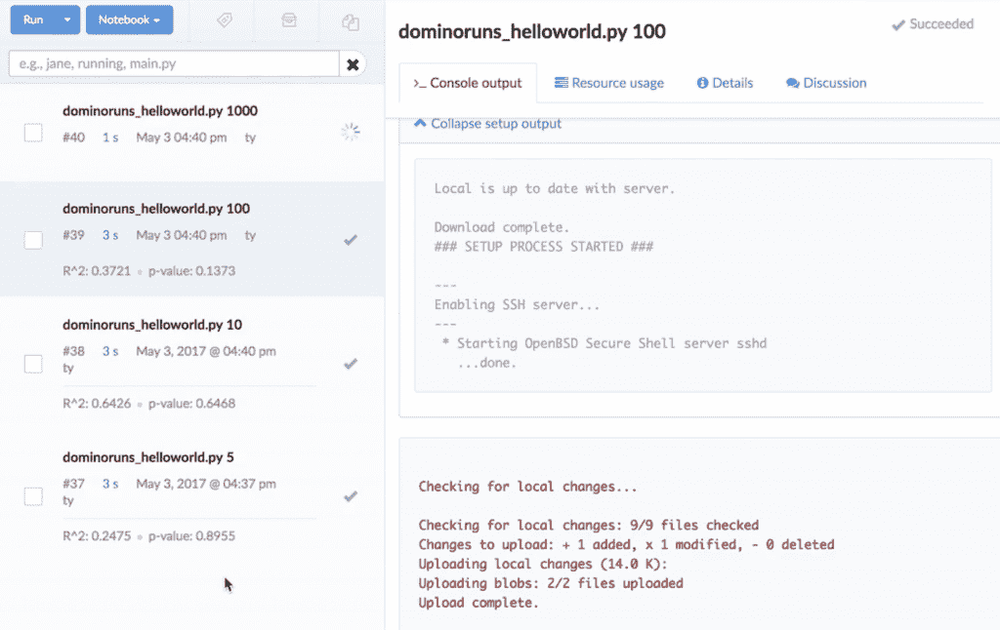
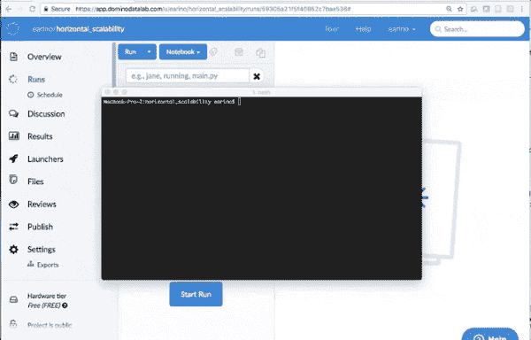

# 平行实验的水平缩放

> 原文：<https://www.dominodatalab.com/blog/horizontal-scaling-parallel-experimentation>

*科学家等待实验结果所花费的时间数据量，就是做出渐进式改进和取得重大进步的区别。通过并行实验，数据科学家可以更快地进行更多实验，从而有更多时间尝试新颖和非正统的方法——这种方法可以带来指数级的改进和发现。*


*在上一篇文章中，我们展示了微观层面上的并行实验:[使用 R 和 Python 包来利用多核处理器的硬件。](https://www.dominodatalab.com/blog/multicore-data-science-r-python)在本文中，我们解释了如何在宏观层面上进行并行实验，以便在云中使用水平扩展更快地获得结果。*

## 什么是水平缩放？

数据科学中的横向扩展是按需添加和删除计算环境以支持多个并发实验的能力。假设您有一个模型训练任务或模拟，即使在高端硬件上运行也需要一个小时，您想尝试它的一些变体。也许你正在测试一个交易策略，你想在多只股票上测试它，或者你正在运行蒙特卡罗模拟，你想为一个随机种子尝试多个值。

在微观层面上，通过播种具有多个参数的模型并将负载分布在多个内核上，可以更快地找到最佳解决方案。但是，如果您想要并行测试多个独立的方法，您可以使用水平缩放来实现。

水平扩展计算资源的能力可以让您尝试多种类型的模型，甚至是工程管道，而不会牺牲性能或灵活性。这在利用基于模拟和代理的方法作为近似和启发式方法时是非常强大的，在这种情况下，集合多个策略可以提供比任何单个策略更好的解决方案，无论调整得多么完美。

数据科学团队经常使用水平可伸缩性，他们需要训练数千个(如果不是数百万个)模型，并对大量独立的例子进行评分。

一个示例用例是广告技术或社交网络公司，它们希望开发一个按用户推荐或预测的模型。模型可以在大型用户群中并行训练*具有水平扩展模型训练的能力允许这些团队构建针对每个特定用户的偏好和特质定制的模型。对这些模型的评分是分批进行的，其中响应被序列化到后端缓存中，以便进行亚毫秒级查找。这种大规模并行评分步骤还可以利用水平可伸缩性，因为缓存基础设施可以支持大量并行插入和更新。*

 *## 挑战

不幸的是，许多数据科学家无法利用水平扩展。原因如下:

如果他们在本地硬件上运行实验，他们必须连续完成这些任务，或者与同事竞争固定的计算资源。

如果他们在云中运行实验，理论上，他们可以创建多个并行运行的实例，但是这样做所需的时间、精力和知识是令人望而却步的。



(有多禁止？一个[流行教程](https://medium.com/@josemarcialportilla/getting-spark-python-and-jupyter-notebook-running-on-amazon-ec2-dec599e1c297)包含了在 EC2 上启动 Jupyter 笔记本的 15 个步骤，所有 15 个步骤都充满了潜在的错误。此外，这些步骤依赖于开源软件，这些软件可能会随时更新，带来意想不到的后果。)

无法使用横向扩展进行平行实验伤害了公司。它制造了一个瓶颈，不仅减缓了进步，也从根本上改变了数据科学家对好奇心和探索的容忍度。没有动力去尝试更有可能带来更大改进、变革性见解和竞争优势的大胆、非传统的方法。

## 解决办法

虽然看起来只有拥有无限资源和 DevOps 支持的大型组织才可以进行并行实验的水平扩展，但现在情况已经不同了。



像 Domino 这样的数据科学平台充当抽象层，让数据科学家直接从命令行按需启动云计算环境，而不需要 DevOps 帮助或漫长而脆弱的配置步骤。Domino 将为每个实验启动一个 AWS EC2 实例(在每个实验指定的机器类型上)，当运行完成时关闭它，并自动检测和存储每个实验的结果。



并行运行几个实验很好，但是真正的可伸缩性不止于此。想象一下，你的团队可以启动*数百个*并行运行的并发实验，每个实验都在他们自己的 AWS 机器上进行。同样，这在理论上是可以在 AWS 中自己设置的，但是配置和维护这样一个基础设施的成本和工作量可能会很快抵消生产力的任何提高。有了 Domino 这样的平台，数据科学家可以通过一个命令或一个 API 来完成这项工作。

## 从 CLI 进行水平缩放的示例

我们希望在分类和回归任务上对 100 多种模型类型进行基准测试。在本地硬件或自我管理的云上训练数百个模型可能需要几个小时，但是利用水平可伸缩性(使用 Domino ),可以在命令行中用一个简单的“runner 脚本”并行训练模型:

```py
input_file=$1
for object in cat $input_file
do
domino run --title "batch: $input_file model: $object" --no-sync
build_classification_models.R $object
done
```

这个脚本将所有实验排队，并让我们生成所有结果。



## 结论

将横向扩展交给数据科学家可以让他们更快地创新。云使得所有数据科学团队都可以进行水平扩展，Domino 使这变得很容易。

如果您有兴趣让您的团队能够进行具有水平可伸缩性的并行实验，那么[学习更多关于在 AWS](https://www.dominodatalab.com/resources/data-science-cloud/?utm_source=blog&utm_medium=post&utm_campaign=horizontal-scaling-parallel-experimentation) 之上使用 Domino 的知识。*