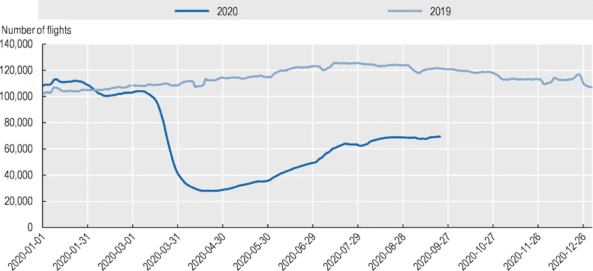
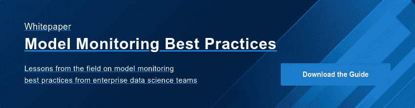

# 新冠肺炎是如何感染人工智能模型的

> 原文：<https://www.dominodatalab.com/blog/how-covid-19-has-infected-ai-models>

 

冠状病毒在全球 188 个国家的野火蔓延是灾难性的。迄今为止，它已经感染了 7400 万人，导致 160 万人死亡，预计将导致 2020 年全球国内生产总值收缩 4.5%至 5.2%至 5.2%之间，约为 4 万亿至 5 万亿美元。

新冠肺炎效应最难观察到的一点是它对人工智能模型的影响。尽管人工智能提供了很多优势，但人工智能应用并不是绝对可靠的。可以说，随着时间的推移，机器学习模型失败的最常见方式是当它们被训练的数据不再反映世界的现状。虽然大多数人工智能模型会逐渐退化，但新冠肺炎在从网上购物到预测航空客运量，再到正确理解图像描述的内容等应用中，突然退化了人工智能模型。

## 机器学习模型如何工作

人工智能模型通过识别将输入与输出匹配的模式(如“if x then y”)来自动化决策过程。为了以概括的方式学习这些模式，人工智能模型需要在大型数据集(称为训练集)上进行训练，有时结合专家的人工输入。通过这种方式，人工智能模型被训练来做出人类专家在相同数据集下会做出的决定。通常，可用于训练人工智能模型的数据集越大，它就越准确。

## 什么是漂移，它如何影响人工智能模型？

数据漂移或模型漂移是一个概念，是指模型的准确性随着时间的推移而下降。熵总是随着时间的推移而增加，因此每个模型的性能都会随着时间的推移而下降，而不管模型的质量指标如何——平均错误率、准确性或其他。对于某些型号，环境足够隔离和/或稳定，可以持续数年而无需校正漂移。然而，对于大多数模型来说，再培训需要更频繁地进行，有时是每天一次。

## 新冠肺炎如何迅速感染全球人工智能模型

如果人工智能只是和用于训练它的数据一样好，那么当一个[黑天鹅事件](https://en.wikipedia.org/wiki/Black_swan_theory)发生时，它会改变人类的行为，这必然会使人工智能模型中的数据集变得多余。COVID 对数据科学模型影响的一些显著例子包括:

### Instacart 的 instaproblem

在线杂货购物服务 Instacart 使用了一个数据科学模型[,该模型通常拥有 93%的准确率](https://blog.dominodatalab.com/data-science-instacart),用于预测特定产品在给定商店是否可用。2020 年 3 月，面对新生的疫情，顾客彻底改变了他们的购物行为，准确率突然下降到 61%。

杂货店购物者通常只会偶尔购买卫生纸之类的东西。在大约一周的时间里，他们吃光了商店里的商品供应，如卫生纸、洗手液、鸡蛋、面粉和其他家庭必需品，因为市民们开始储备，以防供应链中断。

Instacart 通过将输入其人工智能模型的购物数据的时间尺度从数周改为仅 10 天进行了调整，使其模型[对快速变化的购物习惯](https://fortune.com/2020/06/09/instacart-coronavirus-artificial-intelligence/)更加敏感。Instacart 的机器学习主管 Sharath Rao 告诉《财富》杂志，他们在用于训练模型的数据量和数据的“新鲜度”之间进行了权衡。

### 航空客运量

通常情况下，人工智能模型可以高度精确地预测未来的全球航空客运量。但是随着新冠肺炎造成灾难性的数据漂移，没有模型能够预测到 2020 年 4 月客运航空运输同比下降 90%。虽然航班略有恢复，但总体而言，今年对航空业来说是灾难性的。整个民航机队都被封存起来，数百万工人被暂时解雇。

来源:[http://www . OECD . org/coronavirus/policy-responses/新冠肺炎-航空-工业-影响-政策-反应-26d521c1/](http://www.oecd.org/coronavirus/policy-responses/covid-19-and-the-aviation-industry-impact-and-policy-responses-26d521c1/)

### 看图看错

Getty Images 向创意专业人士、新闻媒体和公司出售库存图像、照片和视频，并维护着超过 2 亿资产的图书馆。为了让客户找到合适的图片，Getty 使用广泛的标签和精确的分类法来支持客户的搜索。但新冠肺炎从根本上改变了数亿人的工作、娱乐和着装方式，导致计算机视觉模型难以理解新的社会和文化规范，并恰当地标记新场景和新情况的描述。

Getty Images 数据科学负责人 Andrea Gagliano 向 TechCrunch 提出了这个问题。假设你有一张父亲在家用笔记本电脑工作的照片，而他的儿子在旁边玩耍。Getty 的人工智能模型将此归类为“休闲”或“放松”，而不是“工作”或“办公室”，尽管绝大多数白领现在在家工作。或者想想面具——现在有这么多张脸戴着面具，人工智能模型正在努力准确识别和分类戴面具的人。他们将只检测脸部的上半部分，或者将面具和眼睛识别为两张不同的脸。

## 人工智能模型能像新冠肺炎一样对黑天鹅事件做出反应吗？

预测所有相关的未来事件并建立一个对黑天鹅事件有弹性的人工智能模型是不可能的。

你*能*做的是检测一个模型何时误入歧途，并创建一个决定它是否需要立即再培训或退役的过程。这样，它就不会默默地继续做出表面上消息灵通但实际上不准确的预测。

大多数数据科学团队不会主动监控漂移，尽管有些团队会进行零星和临时的测试。最近，一些数据科学团队已经开始使用[专用模型监控工具](https://www.dominodatalab.com/product/domino-model-monitor/)来自动执行检测漂移、重新训练模型和部署更新模型的过程。这些工具不仅能检测出不良模型，还能立即通知数据科学家，以便他们采取纠正措施。

 

[Twitter](/#twitter) [Facebook](/#facebook) [Gmail](/#google_gmail) [Share](https://www.addtoany.com/share#url=https%3A%2F%2Fwww.dominodatalab.com%2Fblog%2Fhow-covid-19-has-infected-ai-models%2F&title=How%20COVID-19%20Has%20Infected%20AI%20Models)