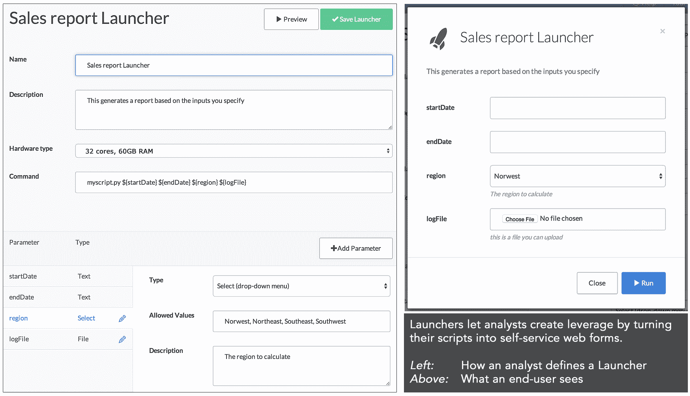

# 用户故事:Domino 如何帮助数据科学家创建“独角兽级别的可交付成果”

> 原文：<https://www.dominodatalab.com/blog/how-domino-helps-a-data-scientist-create-unicorn-level-deliverables>

我们要求用户告诉我们他们如何使用 Domino 的故事。这是我们从 stock upT3 的数据科学家劳拉·洛伦茨那里听到的。

我最近读了《数据科学家的 22 项技能》，我记得我当时想，这种令人难以置信的多样化技能一定只存在于神话中的独角兽身上，而不是生活和工作在现实中的人。然而，我的 JIRA 董事会遇到的许多任务都需要这样一只神话中的独角兽，尽管这可能是不可能的。

由于我不是这样的独角兽，我发现有必要利用服务和框架来帮助我完成繁重的工作。Domino 提供了越来越多的工具，数据科学家需要这些工具来执行跨学科数据问题的解决方案。我发现非常有用的一个工具是[启动器](https://support.dominodatalab.com/hc/en-us/articles/204139569-Launchers)，我将根据自己的经验用两个例子来说明它。

## 自助式按需报告生成

我在 Stockup 的工作之一是为内部报告或外部客户提供间歇性的数据提取和汇总统计。这些报告通常是一次性请求。然而，偶尔我会收到下游的相关请求，要求向新的部门或客户提供更新或类似的报告。举个例子，我正在为完成一个大的 web 应用进行紧张的冲刺，但是对数据拉取的定期更新的需求因为更紧急而打断了它。这种干扰和分心会对生产力产生毁灭性的影响。

Django 已经是一个很好的框架，可以快速整合基于 Python 的 web 应用。我最初考虑使用 Django 为涉众创建一个接口，以便在我们更大的 Django 项目中参数改变时，他们自己运行报告脚本。然而，我们的 sprint 中的工作在接下来的两周内不会部署，我需要定义一个表单，在一个模板中显示它，并将我的脚本移动到一个视图中，以便他们与之交互

Domino 中的启动器特性为我解决了所有这些问题。我所要做的就是将我未修改的代码上传到我的 Domino 项目，并构建一个指向我的脚本的启动器，暴露出我想要的参数。Domino 处理所有的前端开发(我将内置在 Django 中),在它们的服务器上进行作业排队，并通过电子邮件发送结果。启动器也有一个我的利益相关者喜欢的无缝界面。

## 计算密集型报告

启动器的另一个好处是能够改变运行脚本的底层硬件。我收到了另一个请求，要求我为一个计算量特别大的报告构建一个自助报告工具。与第一种情况类似，我可以几乎不加修改地插入我的脚本，指定这个新的启动器应该使用高功率硬件(32 个内核，60GB 的 RAM)，我就一切就绪了。

Domino 将所有的 web 开发从为非技术利益相关者部署简单的接口中解放出来，因为您不希望不断地重复运行和交付脚本。您可以快速将您的一次性脚本转换为 web 表单，快速生产您的数据，以便非技术利益相关者可以自己操作—并且您可以比部署自己的 web 框架更快地交付这些内容。同样，您可以改变您的硬件层，并利用比您内部可能访问的更强大的服务器。Launchers 和 Domino 的其他[数据科学工具可以将神话般的项目变成实际可以完成的东西，通常简单而快速。](https://www.dominodatalab.com)