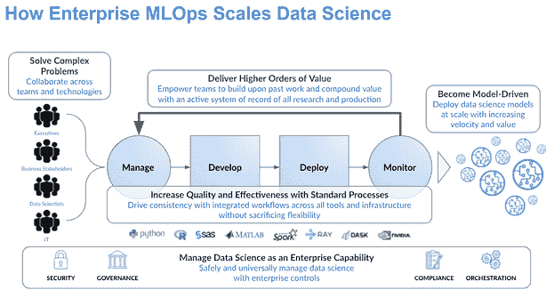

# 企业 MLOps 如何加速数据科学:4 个真实使用案例

> 原文：<https://www.dominodatalab.com/blog/how-enterprise-mlops-turbocharges-data-science-4-real-world-use-cases>

今天的企业正在大力投资数据科学——据 IDC[预测，到 2024 年，软件、硬件和服务的支出将突破 5000 亿美元大关。具有机器学习(ML)和人工智能(AI)技术的数据科学模型已经证明了它们在打造新的收入流和颠覆整个行业方面的价值。对于一个模型驱动的企业来说，来自这种用例的新收入可以从几亿到几十亿美元不等。在成功的公司，领导者已经建立了一个润滑良好的分析飞轮，以创造稳定的模型流，可以利用这一新的淘金热。](https://www.idc.com/getdoc.jsp?containerId=prUS48127321)

在激烈的竞争压力下，从业务领导者的角度来看，推动扩展数据科学用例是有意义的。但是，如果您感到压力，值得探索企业 MLOps 原则如何通过加快数据科学生命周期的每个阶段来实现更好的模型以满足您公司的需求。

## 借助企业 MLOps 加速数据科学生命周期:4 个使用案例

在我们与企业 MLOps 项目的广泛合作中，我们注意到四种用例构成了企业需要加速的最常见功能。本博客定义了企业 MLOps，并描述了这四个企业 MLOps 使用案例，这些案例阐释了对数据科学生命周期的四个阶段至关重要的关键原则:

1.  管理数据科学项目
2.  为业务用例开发模型
3.  为生产部署模型
4.  监控模型组合的持续性能

让我们看一些真实的 MLOps 示例，这些示例说明了企业 MLOps 在数据科学生命周期的每个阶段可能带来的收益。

## 什么是企业 MLOps？它如何帮助扩展数据科学？

Domino Data Lab 与许多公司合作——跨越许多行业，包括金融和保险——建立了大规模创收的数据科学机器。它们的一个共同点是采用整体方法，在数据科学生命周期的所有阶段(包括研发的前端阶段)寻找规模效率。我们将这种方法称为 [企业 MLOps](https://www.dominodatalab.com/resources/a-guide-to-enterprise-mlops/) :一套技术和最佳实践，可在多元化企业中大规模简化数据科学模型的管理、开发、部署和监控。企业 MLOps 是旧术语 MLOps 的扩展，它指的是对模型的后端部署和维护的更狭隘的关注。

## 企业 MLOps 的 4 个使用案例

在 [数据科学生命周期](https://blog.dominodatalab.com/adopting-the-4-step-data-science-lifecycle-for-data-science-projects) 的每个阶段都可以找到企业 MLOps 的原则。总共有 19 条原则——对于这个博客来说太多了！你可以[阅读我们关于这个主题的白皮书](/resources/guide-to-enterprise-ml-ops-principles)了解详情。现在，让我们在白皮书中的四个 MLOps 用例中说明使用这些原则的结果，每个用例代表数据科学生命周期的一个阶段。

### 用例 1:SCOR 如何通过协作更好地管理模型

世界第四大再保险公司 SCOR 帮助客户控制和管理风险——自然风险、气候风险、健康风险、地缘政治风险、网络风险等等。他们帮助人们在逆境中重建家园。

为了提高**管理**阶段的效率，SCOR 专注于可以从一个项目重用到另一个项目的协作最佳实践，并在创建应用程序或 API 的早期阶段引入了系统方法。SCOR 利用新技术来确保企业实现他们设想的那种知识共享。

SCOR 数据科学主管 Antoine Ly 描述了这一努力及其结果。

“为了共享知识、实践和代码，我们必须共享工具。为此，我们实施了一个多云计算战略和平台，”Ly 说。

“例如，我们发起了一项仪表板倡议，”他说。“我们正在扩展一些现有的仪表板，以监控数据和控制一些不同的模型，以便其他市场可以利用它们。我们已经向欧洲和美国市场推出了一款在澳大利亚开发的产品。我们还利用该平台扩展了在欧洲开发的 API 的使用，使其在全球范围内可用。”

### 用例 MLOps 如何帮助一家财富 500 强全球金融服务领导者更快地开发模型

建模是数据科学工作的核心职能。开发需要使用工具和基础设施，如强大的计算资源、高价值和敏感的数据，以及最新的开源工具和软件包，以支持各种实验。使用这些资源的障碍正在减缓一家财富 500 强全球金融服务领导者在整个企业中扩展其数据科学实践的努力。

在这个 MLOps 示例中，该公司的卓越分析中心优先考虑减少模型开发的总体时间。该公司采用了企业 MLOps 平台，以简化分布在不同地理位置的团队对模型的协作开发。随着企业 MLOps 的采用，这家金融服务公司在不影响 IT 安全要求的情况下实现了更快的大规模开发。

结果呢？

这家金融服务公司的一名高级 IT 架构师表示:“企业 MLOps 帮助我们以协作的方式将分散的团队聚集在一起，以便我们能够在整个公司范围内大规模实施数据科学。

### 用例 3:企业 MLOps 帮助 Moody's Analytics 部署生产机器基于学习的风险模型

Moody's Analytics 是一家总部位于纽约的公司，它提供专业知识和工具，如数据、模型、软件和专业服务，以帮助客户高效增长和管理金融风险。“改进或更换模型的成本太高，”银行运营部门总经理雅各布·格罗塔(Jacob Grotta)说。在竞争激烈的行业中，该公司需要一种标准化的方式来部署模型。

通过将企业 MLOps 的技术和原则用于模型部署，数据科学家能够开发一个 API，并在几天内与客户共享以进行 beta 测试。在这个 MLOps 示例中，他们使用反馈来进行调整，并几乎立即重新部署模型，最终将其嵌入到产品发布中。Grotta 说:“这个过程只需几个月，而不是一年，而且部署成本也低得多。”。这是 6 倍的性能加速。

Moody's Analytics 现在可以高效地提供定制的风险和其他分析模型，帮助运营大规模企业，并根据客户偏好经济高效地部署它们，无论是在本地、在云中还是作为 SaaS。银行的数据科学家现在可以自行部署新模型，从而节省时间并增加业务价值。

### 用例 4:大型欧洲保险公司 Topdanmark 使用 MLOps 来监控和检测数据和模型漂移

提高其模型监控能力是 Topdanmark 转向企业 MLOps 的一个动机。Topdanmark 是一家总部位于丹麦的大型欧洲保险公司。它将数据科学融入其运营中，为消费者提供更好、更快的保险体验。

该公司采用了企业 MLOps 技术和实践，以实时了解模型的表现，并在模型投入生产后检测数据和模型漂移。

“数据漂移会对预测产生关键影响，最终影响我们的业务，”该公司机器学习负责人斯蒂格·彼得森(Stig Pedersen)说。他指出，他们的新方法“节省了我们以前花费在维护和调查上的大量时间；使我们能够实时监控模型性能，并将其与我们的预期进行比较。”在一个案例中，该团队能够自动检测漂移，而以前需要三个月才能手动识别。

## 在您的组织中开始使用企业 MLOps:“分析飞轮”的使用案例

在这些 MLOps 示例中，我们看到了企业 MLOps 如何让模型驱动的业务为分析飞轮提供动力，从而让领导者能够积极果断地采取行动，利用宝贵的见解并收获不断增长的集体智慧流。如果您的组织渴望获得大规模数据科学研究的回报，我们邀请您阅读我们的白皮书或查看我们的 [MLOps 最佳实践指南](https://blog.dominodatalab.com/mlops-best-practices-for-large-organizations)。

  它详细介绍了构成数据科学生命周期四个阶段的 19 项原则。它还载有上述四个案例研究的更多背景资料。