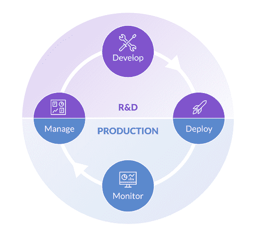

# 企业 MLOps 在数据科学生命周期中的工作方式

> 原文：<https://www.dominodatalab.com/blog/how-enterprise-mlops-works-throughout-the-data-science-lifecycle>

数据科学生命周期(DLSC)被定义为一个[迭代过程](https://www.math.ucdavis.edu/~saito/ucd4ids/BinYu021320.pdf)，从问题的提出到探索、算法分析和数据清理，再到获得可用于决策的可验证解决方案。对于创建规模模型的公司来说，[企业机器学习操作(MLOps)](https://www.dominodatalab.com/resources/a-guide-to-enterprise-mlops/) 平台不仅需要支持企业级开发和生产，还需要遵循数据科学家使用的相同标准流程。

## 企业 MLOps 如何融入数据科学生命周期

数据科学生命周期可分为四个步骤或阶段:管理、开发、部署和监控。像任何生命周期一样，这些阶段都是相互依赖的。它们不仅可以在每个项目的生命周期中重复，这些阶段也可以在创建它们的组织的生命周期中从一个 ML 项目重复到另一个 ML 项目。

每个阶段完成得越有效，组织就能越快、越有效地扩展其运营。例如，有效的管理会导致更快、更有效的开发。有效的监测导致更好的管理。高效的开发会带来更成功的部署。

虽然每个新项目通常从管理阶段开始，但它通常也会在该阶段结束。

从项目中获得的信息集将被带到后续的项目中。这包括资产，如新的算法和新的数据源，以及从事这些工作的团队所吸取的经验教训。正如项目、数据和 ML 模型本身会发生变化一样，在任何企业环境中从事这些项目的个人也会发生变化。

数据科学家、分析师和 ML 工程师可能会从一个项目转到另一个项目，或者在新团队成员加入时离开组织。然而，尽管有这些变化，整个 DSLC 产生的信息需要保留，以避免重复劳动..

## 1.管理阶段

业务环境中的数据科学流程始于管理阶段。这是建立项目需求的地方，以便参与的每个人都清楚地了解项目需求和目标。在开始任何研究和开发之前，已经分配了角色并确定了工作优先级。

在 ML 模型被部署和监控之后，基于企业的团队应该重新访问管理阶段，以评估项目的成功或失败。成功孕育成功，从一个项目中吸取的经验教训可以应用到未来的项目中，减少未来的错误，从而提高效率。

Domino 的知识中心是企业组织所有这些关键知识的中央存储库，推动复合知识的发展。它是跟踪和管理工作的地方，以便以后可以很容易地找到它，然后根据需要重用或复制，每个阶段都有相关的注释。验证人员和审计人员可以使用知识中心来确保模型是安全和可信的，从而减少潜在的风险。

## 2.发展阶段

开发阶段是数据科学家基于各种不同的建模技术构建和评估模型的阶段。快速自由创新的能力是关键，因为这是研究、讨论、测试、提炼和再研究想法的地方。

工作台是 Domino 基于笔记本的环境，数据科学家可以在这里进行 R&D 和实验。耐用的工作空间使数据科学家能够自助访问他们运行、跟踪和比较实验所需的所有工具和基础设施。

由于数据科学家知道他们需要什么，Workbench 为他们提供了一个选择所需工具和资源的地方，当他们需要时，只需点击几下鼠标，而无需开发运维。这意味着他们可以独立完成以下任务:

*   同时运行并比较数百个实验的进度
*   按需扩展 CPU、GPU 和其他资源
*   访问多个工具和工作区，如 Jupyter、 [RStudio](https://www.rstudio.com/products/rstudio/) 、Zeppelin、 [SAS Studio](https://www.sas.com/en_us/software/studio.html)
*   根据需要添加库、工具和算法
*   链接到基于 Git 的存储库，快速集成现有代码
*   轻松跟踪代码、数据、工具、包和计算环境，找到并重现过去的结果

由于 Workbench 从一个集中管理的环境中提供了所有这些特性，数据科学家可以在其组织的治理框架内灵活地使用他们需要的工具和基础设施。

## 3.部署阶段

当一个开发的模型被认为是成功的，它就准备好从开发阶段进入部署阶段，在那里它可以被用于生产——通常在一个业务流程中，它被用于决策制定。高效的部署需要一个健壮的平台，该平台可以使用开发中的相同工具和资源轻松发布模型。

在 Domino 的 Enterprise MLOps Enterprise platform 中，处于部署阶段的模型能够创建它们设计的业务价值。业务用户可以通过嵌入到同一基础设施中的 API 来利用该模型，该基础设施允许从现有程序、web 浏览器或作为应用程序进行访问。

Domino 平台用于模型部署的另一个重要组件是容器的使用，它允许根据需要轻松地移动和复制模型，因此相同的模型可以根据需要进行多次缩放。容器化模型的关键是 Kubernetes，这是一个开源系统，被证明是管理多个容器化模型的自动化部署的复杂需求的理想选择。

## 4.监控阶段

监控阶段紧跟在部署之后，因为这是组织需要确保模型按照预期执行，并且提供预期的业务价值的时候。由于企业组织往往在不同的基础设施上拥有数百个生产模型，如果没有合适的平台，同时监控所有这些模型将是一项挑战。

Domino 的模型监控提供了一个单一的平台，可以用来监控整个组织中生产的所有模型，同时自动检测任何问题，并在模型需要更新、暂停或替换时主动提醒适当的团队成员。

由于监控还需要来自业务部门的非技术用户的分析，因此 Model Ops 还允许您根据模板创建交互式应用，用于在不同的用例场景中运行推测性分析。同时，数据科学家和工程师可以使用 Model Ops 来安排性能漂移的自动检查，以及从单个用户界面快速分析和诊断漂移。

## 数据科学生命周期中的 MLOps

对于任何开发和部署 ML 模型的受利润驱动的组织来说，接受 DSLC 被证明是减少低效和成功扩展 ML 模型的重要组成部分。将运营与围绕 DSLC 构建的企业级 MLOps 平台相集成，可确保您组织的所有资源在多个项目中得到高效利用——从自有数据集和算法到繁忙的数据科学家和开发人员的日程安排。

如果您的公司计划成为 ML/AI 未来的一部分，并打算将一个成功的项目堆叠在另一个之上，请花几分钟时间查看我们的 [MLOps 最佳实践文章](/mlops-best-practices-for-large-organizations)或[观看 Domino Enterprise MLOps 平台的演示](https://www.dominodatalab.com/demo/)。

