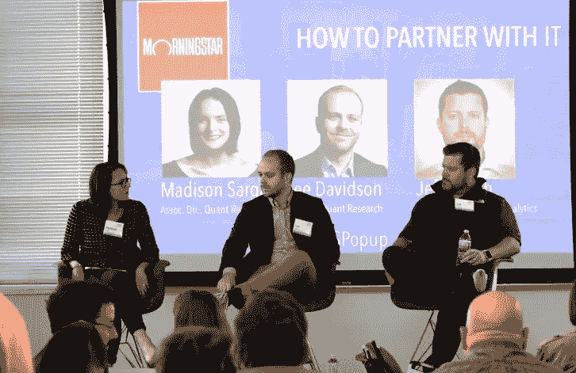

# 晨星的数据科学和 IT 团队正在为规模化做准备

> 原文：<https://www.dominodatalab.com/blog/how-morningstar-s-data-science-and-it-teams-are-setting-the-stage-for-scale>

编者按:这是一系列文章的一部分，分享公司在成为模型驱动的道路上的最佳实践。一些文章将包含关于他们使用 Domino 的信息。

就在五年前，晨星的 Quant 研究团队(该公司的集中式数据科学职能部门)由少数数据科学家组成，他们每年推出几个模型。当时，领导晨星定量研究团队的李·戴维森(Lee Davidson)表示，最大的挑战之一是确定数据科学可以解决的问题，并获得解决该问题的预算。

现在不再是这样了。该业务在各个方面都变得越来越受模型驱动。戴维森的团队目前由近 70 名定量研究人员、数据科学家和研究工程师组成，去年他们将 50 多个新模型投入生产。他们现在最大的挑战之一？如何大规模部署和维护这些模型。

晨星公司的量化研究副总监 Madison Sargis 在最近于芝加哥举行的 Domino Data Science Pop-up 会议上与 T2 戴维森和 T4 的技术、数据和分析主管杰夫赫希坐在一起，讨论他们如何更有效地开发、部署和管理大规模模型。

以下是该会议期间讨论的几个要点的摘要。

## 保持一致

**Jeff Hirsch:** 从工作关系来看，对我来说，关键是我们的接触点，以及我们如何尽早、经常地融合。我认为，为如何构建模型和数据将驻留在哪里设置约定，并在移交时保持一致，将会带来好处。例如，我们已经开发了一个清单，用于模型投入生产时的交接。作为我们 2020 年路线图的一部分，我们正在考虑如何创建一种基于惯例的编码方法，以更有效地分离或扩展事物。

Lee Davidson: 我们也开始定义项目阶段。我们开发了一个内部术语，包含五个项目阶段:

1.  探索和积极研究
2.  模型开发
3.  走向市场
4.  生产化
5.  启动和维护

我们试图将每个项目归入这五个类别中的一个，并且我们管理这些项目的方式根据阶段而变化。我们也采用了敏捷。当我们处于第一阶段(探索和研究)时，我们正在做敏捷术语中所说的“尖峰”:数据科学家可以用一两个月的时间研究某样东西，如果它看起来很有前景，我们想继续下去，我们可以这样做。一旦我们确定了我们想要开发的解决方案，那就是我们开始以敏捷的方式前进，并使用大量软件工程原则和最佳实践的时候了。我们试图在流程的早期让更多具有工程背景的人加入进来，在项目的前四个阶段，我们有一名数据工程师、一名数据科学家和一名软件工程师一起解决一个问题。

## 移交给它

**Lee Davidson:** 任何在过去几年中从事数据科学的人都知道，如果他们有一个成功的项目，你的模型很有可能会走出实验室，现在你必须维护它。几年前，我们凭感觉飞行，这给研究人员保持他们的成果带来了很大的压力。今天，我们试图预先澄清研究人员应该做什么，移交看起来像什么，是交给不同的人还是不同的团队。例如，研究人员是负责交付产品级的、经过全面测试的代码，还是只需要提供一个别人将要实现的原型？我们还分解了劳动分工，确定了谁维护什么，模型运行的频率，以及他们是如何被训练的。

**Jeff Hirsch:** 如果从 IT 组织的角度来看支持工作，通常会有三个层次。

*   第 1 层是技术运营中心；
*   第二层是某种开发人员，具有更多特定于应用程序的专业知识；和
*   在这种情况下，第三层属于模型的开发人员或定量人员。

我们越是能推进到第 1 层和第 2 层，这就是我们一直采取的方法。我们一直在做的事情之一是建立关系，分享 Jupyter 笔记本，并确保我们的 QA 了解笔记本的结果。总体精神是，it 组织需要向量化组织靠拢，学习他们的一些技能，量化组织需要向开发和工程靠拢，学习其中的一些技能。

## 优先考虑新项目

**Lee Davidson:** 我们以典型的方式与 IT 合作，你会看到各部门在一起工作。一起做路线图计划，我们坐在作战室里，在图表上画东西，看资源之类的，我们提前几个月就把这些都讨论清楚了。此外，每月杰夫[美国好施集团]、我自己和 P&L 的领导都会谈论我们正在做的事情和优先事项，并讨论任何变化。

**Jeff Hirsch:** 各种产品套件的商业主管，如我们的风险模型，也在月度会议上提供反馈。例如，他们可能希望风险模型包含固定收入数据。那么接下来的问题是，我们如何优先将数据放入数据湖并更新模型以利用它？我们以敏捷的方式回应这种反馈，并尝试调整我们的路线图。绝对是合作。

## 再现性和可审计性

**Lee Davidson:** 当我们重新训练模型或运行健康检查时，我们的 QA 实践之一是保存结果以供以后查询。我们的许多客户希望独立地验证模型，因此我们经常需要结合洞察力和分析来提供那些模型统计数据。预先有一个好的特定于您的用例的 QA 计划是至关重要的。另一个方面是跟踪所有的数据转换。我们试图不让研究人员维护他们建立的模型。这意味着没有构建它们的人正在维护他们不太熟悉的东西，所以我们在不同的转换步骤中构建过程来保存输出。

**Jeff Hirsch:** 对于我们的数据湖，我们想知道湖中的哪些文件被哪些模型所利用。我们坚持某些原则；不变性就是其中之一。一旦某样东西进入数据湖，它就永远不会改变；我们只是不断添加新的文件或增量，因此跟踪这是一件大事。从模型的角度来看，我心目中的审计线索对于调试是必不可少的。你正在采取措施确保一个模型按照它应该的方式工作，并且把信息写到磁盘上并保存下来，这是你在做的时候可以增加价值的事情，然后作为副作用，它成为它的一部分。

#### **了解更多信息**

[在芝加哥 Domino Data Science 弹出窗口聆听晨星的完整小组讨论](https://www.youtube.com/watch?v=axuvlCPXs-Q),了解数据科学和 IT 团队有效合作的更多方式。