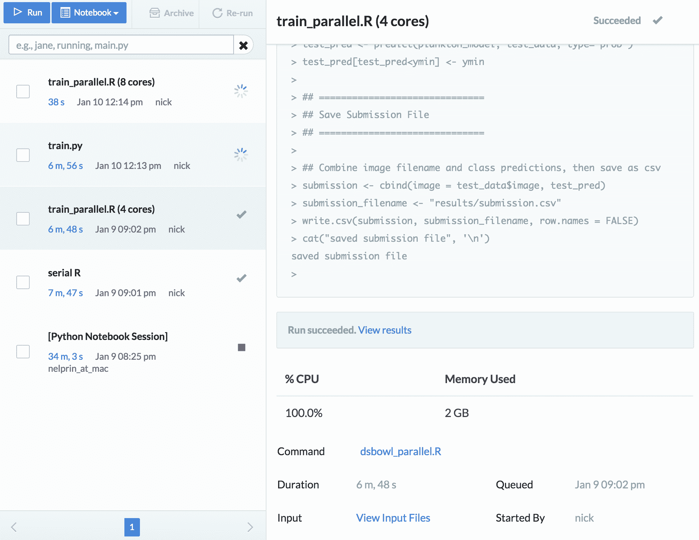
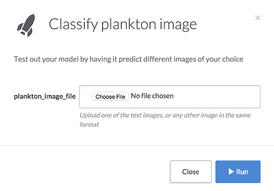
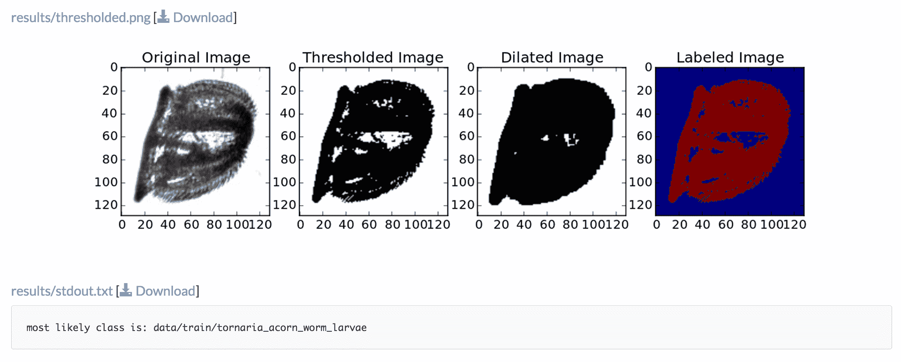
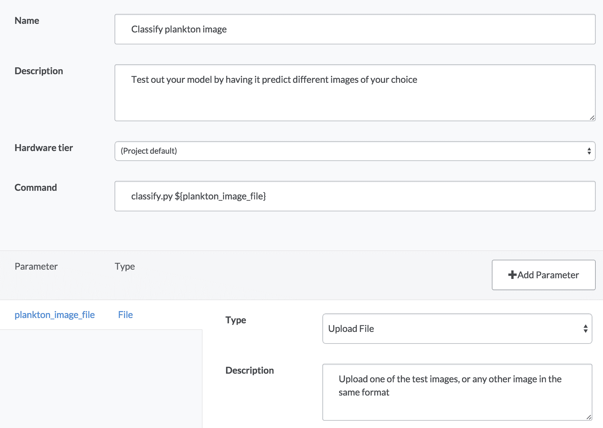
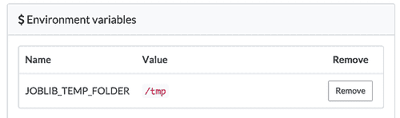

# 如何开始使用数据科学碗

> 原文：<https://www.dominodatalab.com/blog/how-to-get-started-with-the-data-science-bowl>

我很高兴分享我们用 R 和 Python 的起始代码创建的 Domino 项目，用于参加[数据科学碗](https://www.kaggle.com/c/datasciencebowl)。

## 介绍

数据科学碗是一场 Kaggle 比赛，奖金为 175，000 美元，有机会帮助改善我们海洋的健康状况，对浮游生物的图像进行分类。

Domino 是一个[数据科学平台](https://www.dominodatalab.com?utm_source=blog&utm_medium=post&utm_campaign=how-to-get-started-with-the-data-science-bowl),可以让您使用 R、Python 和其他语言更快地构建和部署模型。为了帮助 Data Science Bowl 的竞争者，我们将一些示例代码打包到一个 Domino 项目中，您可以轻松地在自己的工作中使用这些代码。

这篇文章描述了我们的示例项目如何帮助你在碗中竞争，或者做其他开放式机器学习项目。首先，我们概述一下我们打包的代码。然后我们描述 Domino 提供的三种能力:易于扩展的基础设施；强大的实验工作流程；以及将您的模型转化为自助式 web 表单的方法。

### 内容

1.  **[三个入门脚本](#part1)** 你可以用:一个 IPython 笔记本用于交互工作，一个 Python 脚本用于长时间运行训练，一个 R 脚本用于长时间运行训练。
2.  **[可扩展的基础设施](#part2)** 和并行性更快地培养模型。
3.  **[并行试验，同时跟踪你的工作](#part3)** 这样你可以更快地迭代你的模型。
4.  **[构建自助式 Web 诊断工具](#part4)** 测试训练好的模型。
5.  **[如何分叉我们的项目](#part5)** 并自己使用它来启动自己的工作。

* * *

R & Python starter scripts

### IPython 笔记本

我们把 Aaron Sander 的[神奇教程](https://www.kaggle.com/c/datasciencebowl/details/tutorial)变成了一个真正的 IPython 笔记本。

### Python 批处理脚本

接下来，我们提取了 Aaron 教程中的关键训练部分，并将其转换为批处理脚本。大部分代码与 IPython 笔记本中的代码相同，但是我们排除了用于可视化样本图像的诊断代码。

### r 批处理脚本

举个例子，我们使用了杰夫·赫伯特的[浮游生物分类项目](https://github.com/JeffHebert/Plankton_Classification)。

* * *

## 训练更快

只需点击一下鼠标，Domino 就可以通过扩展硬件来更快地训练模型。例如，您可以使用 8 核、16 核甚至 32 核机器。为了利用这一点，我们需要对一些代码进行归纳，以更好地利用多核。

基于我们运行的不同实验，我们获得了一些显著的速度提升。例如:

*   Python 代码在单核机器上耗时 50 分钟。对于我们的并行版本，在 32 核机器上需要 6.5 分钟
*   R 代码在单核机器上耗时 14 分钟。对于我们的并行版本，在 32 核机器上只需 4 分钟

## 计算机编程语言

在 IPython 笔记本和 train.py 批处理脚本中，我们修改了实际训练`RF`分类器的调用。最初的代码使用了三个内核的`n_jobs=3`。我们将其改为`n_jobs=-1`，它将使用机器上的所有内核。

### 原始的非并行代码

```py
kf = KFold(y, n_folds=5)

y_pred = y * 0

for train, test in kf:

    X_train, X_test, y_train, y_test = X[train,:], X[test,:], y[train], y[test]

    clf = RF(n_estimators=100, n_jobs=3)

    clf.fit(X_train, y_train)

    y_pred[test] = clf.predict(X_test)

print(classification_report(y, y_pred, target_names=namesClasses))
```

### 我们的平行版本

```py
kf = KFold(y, n_folds=5)

y_pred = y * 0

for train, test in kf:

    X_train, X_test, y_train, y_test = X[train,:], X[test,:], y[train], y[test]

    clf = RF(n_estimators=100, n_jobs=-1)

    clf.fit(X_train, y_train)

    y_pred[test] = clf.predict(X_test)

print(classification_report(y, y_pred, target_names=namesClasses))
```

## 稀有

R 代码中有两个地方受益于并行性。

首先，训练随机森林分类器。我们使用带有`doParallel`后端的`foreach`包来并行训练森林的各个部分，并将它们组合在一起。它看起来像是更多的代码，但是大部分都是加载和初始化并行库的昙花一现。

### 原始的非并行代码

```py
plankton_model <- randomForest(y = y_dat, x = x_dat)
```

### 我们的平行版本

```py
library(foreach)
library(doParallel)
library(parallel)

numCores <- detectCores()
registerDoParallel(cores = numCores)

trees_per_core = floor(num_trees / numCores)
plankton_model <- foreach(num_trees=rep(trees_per_core, numCores), .combine=combine, .multicombine=TRUE, .packages='randomForest') %dopar% {
randomForest(y = y_dat, x = x_dat, ntree = num_trees)
}
```

R 代码的第二部分也很耗时，并且很容易并行化:在生成测试统计数据之前，处理测试图像以提取它们的特征。我们使用并行 for 循环来处理所有内核上的图像。

### 原始的非并行代码

```py
test_data <- data.frame(image = rep("a",test_cnt), length=0,width=0,density=0,ratio=0, stringsAsFactors = FALSE)

    idx <- 1

    #Read and process each image

for(fileID in test_file_list){

	working_file <- paste(test_data_dir,"/",fileID,sep="")

	working_image <- readJPEG(working_file)
```

```py
# Calculate model statistics
working_stats <- extract_stats(working_image)
working_summary <- array(c(fileID,working_stats))
test_data[idx,] <- working_summary
idx <- idx + 1
if(idx %% 10000 == 0) cat('Finished processing', idx, 'of', test_cnt, 'test images', 'n')
}
```

### 我们的平行版本

```py
[code lang="R"]

# assumes cluster is already set up from use above

names_placeholder <- data.frame(image = rep("a",test_cnt), length=0,width=0,density=0,ratio=0, stringsAsFactors = FALSE)

    #Read and process each image

working_summaries <- foreach(fileID = test_file_list, .packages='jpeg') %dopar% {

	working_file <- paste(test_data_dir,"/",fileID,sep="")

	working_image <- readJPEG(working_file)
```

```py
# Calculate model statistics

working_stats <- extract_stats(working_image)
working_summary <- array(c(fileID,working_stats))
}
library(plyr)
test_data = ldply(working_summaries, .fun = function(x) x, .parallel = TRUE)
# a bit of a hack -- use the column names from the earlier dummy frame we defined
colnames(test_data) = colnames(names_placeholder)
```

* * *

## 实验和跟踪结果

Domino 通过让您并行实验，同时保持结果被自动跟踪，来帮助您更快地开发模型。无论何时运行代码，Domino 都会保留一份代码记录，并保留一份您生成的结果记录，因此您可以随时跟踪您的过程并重现过去的工作。

例如，因为我们的 R 代码在运行时会保存一个`submission.csv`文件，所以每当我们运行代码时，都会自动记录我们生成的每个提交。如果我们需要回到一个旧的，我们可以找到相应的运行，并查看其结果，其中将有提交的副本。

您在 Domino 上开始的每次运行都有自己的机器(无论您选择什么硬件类型)，因此您可以并行尝试多种不同的技术或参数。



* * *

## 构建自助服务工具

你有没有被非技术人员打断过，他们要求你为他们运行程序，因为他们自己不能使用你的脚本？我们使用 Domino 的[启动器](https://support.dominodatalab.com/hc/en-us/articles/204139569-Launchers)特性来构建一个自助式 web 表单，对不同的浮游生物图像进行分类。它是这样工作的:

1.  “浮游生物图像分类”启动程序会弹出一个表格，让你从电脑上传文件。
    
2.  当您选择一个文件并单击“Run”时，Domino 会将您的图像传递给一个分类脚本(它使用 Python 代码训练的 RF 模型)来预测图像中浮游生物的类别。分类只需一秒钟，完成后您将看到结果，包括诊断图像和预测类的打印输出。例如:

## 履行

为了实现这一点，我们对 Python 训练脚本做了一些额外的修改。具体来说，当训练任务完成时，我们将模型(和类名)打包，以便以后可以加载它们。

```py
joblib.dump(clf, 'dump/classifier.pkl')

joblib.dump(namesClasses, 'dump/namesClasses.pkl')
```

然后，我们创建了一个单独的`classify.py`脚本，它加载 pickled 文件并使用它们进行预测。该脚本还会生成诊断图像，但其本质是这样的:

```py
file_name = sys.argv[1]

clf = joblib.load('dump/classifier.pkl')

namesClasses = joblib.load('dump/namesClasses.pkl')
```

```py
predictedClassIndex = clf.predict(image_to_features(file_name)).astype(int)
predictedClassName = namesClasses[predictedClassIndex[0]]

print("most likely class is: " + predictedClassName)
```

注意，我们的 classify 脚本希望在命令行中传递一个图像文件名。这让我们可以轻松地构建一个启动器，围绕这个脚本公开一个 UI web 表单:



* * *

## 实施说明

*   我们的项目包含压缩的数据集，但是它明确地忽略了解压缩的内容(您可以在。dominoignore 文件)。因为每当运行代码时 Domino 都会跟踪更改，所以拥有大量的文件(本例中有 160，000 个图像)会降低速度。为了加快速度，我们存储 zip 文件，并让代码在运行前解压缩它们。解压缩需要很少的时间，所以这不会影响整体性能。
*   在 Python 代码中，scikitlearn 在幕后使用 joblib 来并行化其随机森林训练任务。反过来，joblib 默认使用`/dev/shm`来存储选取的数据。在 Domino 的机器上，`/dev/shm`可能没有足够的空间来存放这些训练集，所以我们在项目设置中设置了一个环境变量，告诉 joblib 使用`/tmp`，这将有足够的空间
    