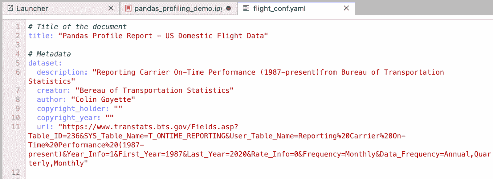

# 如何通过熊猫概况来增强数据探索

> 原文：<https://www.dominodatalab.com/blog/how-to-supercharge-data-exploration-with-pandas-profiling>

从原始数据中获得洞察力是一个耗时的过程。预测建模工作依赖于数据集*概况*，无论是由汇总统计数据还是描述性图表组成。熊猫概况，，一个利用熊猫数据框架的开源工具，是一个可以简化和加速此类任务的工具。

这篇博客探讨了与手动完成此类工作相关的挑战，讨论了使用 Pandas Profiling 软件来自动化和标准化该过程的好处，并触及了此类工具在完全包含数据科学专业人员和统计研究人员所需的核心任务的能力方面的局限性。

## 探索性分析在数据科学生命周期中的重要性

探索性分析是数据科学生命周期的重要组成部分。结果成为理解给定建模任务的解决方案空间(或“可能的领域”)的基础。这种特定于数据的领域知识为后续的方法提供了信息，以生成有差异且有价值的预测模型。

例如:

*   **通过观察数据集特征中缺失数据**的频率，通常可以知道哪些特征*可以*用于开箱即用的建模目的(例如，对于 MVP)，或者可以表明业务利益相关者建议作为预测指标的关键指标的特征需要进一步处理才能发挥作用(例如，缺失值的插补)。
*   **在成对的基础上计算所有特征**的相互作用可以用于选择或取消选择，用于进一步的研究。减少候选数据集中的特征数量可以减少训练和调整过程中的处理时间和/或所需的计算资源。这两个考虑因素都会影响数据科学项目的整体回报，因为它们会加快“实现价值”的时间，或者降低与培训相关的成本。

```py
tot = len(data['CANCELLATION_CODE'])

missing = len(data[~data['CANCELLATION_CODE'].notnull()])

print('% records missing, cancellation code: ' + str(round(100*missing/tot, 2)))
```

```py
% records missing, cancellation code: 97.29
```

取消代码可能是航班延误的一个很好的指标，但如果它只出现在 2-3%的数据中，它有用吗？

回报是显而易见的- **正确分析的数据集会更快地产生更好的模型。**

但是“适当地”这样做所涉及的成本呢？

有三个关键的考虑因素:

1.  手动完成这项工作非常耗时。每个数据集都具有保证生成特定统计数据或图表的属性。
2.  **没有明确的结束状态**。人们通常不知道哪些信息将是最重要的，直到他们沿着他们的分析之路走下去，并且被认为合适的粒度级别经常是由那些做工作的人突发奇想决定的。
3.  **存在注射偏倚的风险。**在有限的时间和无数可用的分析途径下，如何确定他们没有关注他们知道的，而不是他们不知道的？

因此，探索性分析*本质上是迭代的，并且难以确定*的范围。工作被重复或扩充，直到一组清晰的见解对项目涉众可用，并被认为是充分的。

出于这篇博客的目的，我们将重点关注如何使用名为 **Pandas Profiling** 的开源 Python 包来减少生成数据集概要所需的时间，并增加结果可传播的可能性。

## 熊猫简介:名字里有什么？

我们为什么关注这个特定的工具？

首先，Python 仍然是数据科学研究的主导语言。许多数据科学专业人士对熊猫的使用颇有心得，熊猫的数据帧数据结构是熊猫档案使用的基础。

此外，面对数据科学领域的新技术，Python 生态系统充满了保持该语言相关性的开源开发项目。


*ref: [https://pypl.github.io/PYPL.html](https://pypl.github.io/PYPL.html)*

值得注意的是，以商业智能的名义致力于产生描述性分析的专有工具有很多。虽然这些工具对于创建精致的、可重用的、*可视化的*仪表板来呈现数据驱动的见解非常有用，但它们在生成形成*预测建模*任务的基础所需的信息的能力方面远没有那么灵活。

换句话说，数据科学管道有特定的需求，开源社区在支持这些需求方面最为敏捷。

另一方面，一些研究人员可能会说强调*可视化*这样的结果是不必要的，比如，“如果你知道你在找什么，pandas.describe()就是你所需要的”。


*pandas.describe() example on the canonical BTS domestic flights dataset*

最终，专家们对什么是重要的有他们自己的想法，这些意见影响他们探索性分析的方法:当在研究中低头时，有效地向他人传达他们的见解的可视化可能不是首要任务。

同样真实的是，可视化统计数据是一项非常重要的工作:需要时间来格式化、标记和组织图表，使之对普通观众来说是一致的。如果你不相信我，看看市场上的工具就知道了:从 matplotlib 到 ggplot2，再到 bokeh、seaborn 和 [Lux](https://blog.dominodatalab.com/faster-data-exploration-in-jupyter-through-the-lux-widget) 等更现代的解决方案，选择很多。


*Data visualization blog posts are a dime a dozen.*
*ref: [https://mode.com/blog/python-data-visualization-libraries/](https://mode.com/blog/python-data-visualization-libraries/)*

在研究组织中，这种工具标准的缺乏通常会导致在*交流*数据洞察力方面的挑战:研究人员对以非专家可以理解的方式格式化他们的结果的重要性存在误解；另一方面，非专家可能不理解这样做所需要的努力！

*输入 Pandas Profiling* -一种为位于 Pandas 数据框架中的任何数据集生成综合统计数据*和可视化数据*的简单方式。

在我自己的一系列项目中使用了 pandas profiling 之后，我很高兴地说，这个软件包从一开始就是为了易用性和灵活性而设计的:

1.  它有使用的最低先决条件:Python 3、Pandas 和一个网络浏览器是访问基于 HTML 的报告所需要的。
2.  **专为 Jupyter** 设计:输出报告可以直接以内联方式呈现为交互式小部件，或者保存为 HTML 文件。值得注意的是，HTML 文件可以是“内联的”(即独立的)，或者以一种更传统的方式生成一组支持文件，这是人们对 HTML 资源的期望。
3.  ..但是**也可以在批处理模式**下工作。csv 或原始文本文件转换成“熊猫友好”格式，终端中的一行代码就可以用来生成基于文件的报告。
4.  让我重申一遍，以防你没有明白:**一行代码**生成一个数据配置文件！
5.  最后但同样重要的是:它是**可定制的**。无论是通过配置短手添加或删除内容(或考虑大型或敏感数据集)，精细调整控制的粒度变量设置，还是全面的配置文件，pandas 配置文件的定制消除了许多 ds 自动化工具所具有的“玩具”感觉，并真正使其成为各种数据和领域的专业级选项。

## 在 Domino 中演示熊猫概况

为了展示这些关键特性，我在 try.dominodatalab.com[的](https://try.dominodatalab.com)建立了一个[公共演示项目](https://try.dominodatalab.com/u/colin_goyette/pandas-profiling/overview)。

我已经将 Pandas Profiling 包添加到我们的 Domino Analytics 发行版中，该发行版预装了 Python 3.7 以供使用。


*Domino Workspace Details*

我们将使用来自运输统计局的 canonical airlines 数据集。

首先，我加载数据集，并快速检查我们正在处理的数据的大小:

```py
data = pd.read_csv('../../domino/datasets/flight_data/airlines_2016_2017_2018.csv')

data.shape
```

```py
(300000, 29)
```

注:从 1987 年开始收集数据的完整数据集远远大于 300，000 个样本。出于演示目的，对其进行了取样。

在不使用 Pandas Profiling 的情况下，常见的下一步是使用 Pandas 的 dataFrame.describe()。让我们来看看这里的输出示例:


*pd.describe() will default to displaying summaries of numerical features only. If you’d like to include categorical features, add the argument “include=’all’”. *

好的，所以我们用原生熊猫工具很快地得到一些基本的特征汇总统计。但内容和格式都不利于分享或讨论。

让我们试着创建一个熊猫档案:

```py
from pandas_profiling import ProfileReport

ProfileReport(data).to_notebook_iframe()
```

```py
HBox(children=(HTML(value='Summarize dataset'), FloatProgress(value=0.0, max=43.0), HTML(value='')))
```

大约 1 分 30 秒后，我们的笔记本中出现了个人资料报告:


*Pointing out the key elements of a Pandas Profile Report*

很快，我们看到概要文件以一种清晰而有逻辑的方式组织结果:

*   主要报告部分:概述；变量；互动；相关性；缺少值；样本。
*   警告:关于数据集中变量的快速信息
*   再现:创建日期、执行时间和配置文件配置。

因此，我们能够立即收集一些见解。例如:

1.  有两个变量是先前处理的伪像，可以被去除。
2.  我们的数据集中有大量缺失数据
3.  变量 Origin & Destination 具有很高的基数:我们应该花时间考虑这些特性在我们最终模型中扮演的角色，因为它们可能会影响模型训练的成本和复杂性。

更仔细地看报告，我们还看到了进一步分析的机会，以及为向其他角色传达这些结果添加上下文的机会。

例如:

*   数据集中基于时间的要素具有奇数分布，在特定于变量的直方图中可见。也许我们可以调整直方图中的箱数来解释它们。
*   变量缺乏描述。作为一名领域专家，我熟悉大多数变量代表什么，但这可能会给与我的同事交流这些结果带来问题。

让我们试着根据这些见解定制报告。

首先，我们将从数据框架中删除那些不受支持的功能:

```py
data = data.drop(columns=['Unnamed: 27', 'UNNAMED___27'])
```

然后，我们将获取一份默认配置文件的副本，并用一些关于我们报告的描述性信息对其进行编辑:



*A Pandas Profiling Configuration File*

在此期间，我对报告的内容做了一些实质性的修改:

*   **提高可读性:**将变量顺序设置为升序
*   **简化缺失数据部分**:显示条形&矩阵风格的缺失数据图，移除热图&树状图(对该数据集没有用)
*   **减少相关量&交互结果**:
    *   包括 spearman 相关图，排除其余部分(五个其他选项)
    *   简化交互图部分:将交互图限制为模拟航班延误的两个感兴趣的特征:起飞延误和到达延误
*   **微调可视化效果**:
    *   将包含饼图的分类变量的不同级别的最大数量调整为 18(包含航空公司/承运商变量)
    *   我已经将直方图的最大箱数设置为 24——这将清除我们观察到的时间相关分布中的噪声。

为了简洁起见，这些配置设置没有相关的截图，但是如果您想自己查看的话，可以在公共项目中找到 YAML 文件。

然后，我们将概要文件加载到我们的 ProfileReport 的新实例中:

```py
profile = ProfileReport(sample, config_file="flight_conf.yaml")
```

最后但同样重要的是，我已经将从 BTS 网站获取的变量描述放入字典中，并将它们注入到配置文件配置中:

```py
data_dict = {

  'FL_DATE' : 'Flight Date',
  'OP_CARRIER' : 'IATA_CODE_Reporting_Airline', 
  'OP_CARRIER_FL_NUM' : 'Tail number of aircraft',
  'ORIGIN' : 'Origin Airport (Three letter acronym)',
  'DEST' : 'Destination Airport',
  'CRS_DEP_TIME' : 'Scheduled .. departure time',
  'DEP_TIME' : 'DepTime (Actual Departure Time (local time: hhmm))',
  'DEP_DELAY' : 'Difference in minutes between scheduled and actual departure time. Early departures show negative numbers.',
  'TAXI_OUT'  : 'Time spent taxiing out (minutes)',
  'WHEELS_OFF' : 'Wheels Off Time (local time: hhmm)',
  'WHEELS_ON' : 'Wheels On Time (local time: hhmm)',
  'TAXI_IN' : 'Taxi In Time, in Minutes',
  'CRS_ARR_TIME' : 'CRS Arrival Time (local time: hhmm)',
  'ARR_TIME' : 'Actual Arrival Time (local time: hhmm)',
  'ARR_DELAY' : 'Difference in minutes between scheduled and actual arrival time. Early arrivals show negative numbers,',
  'CANCELLED' : 'Cancelled Flight Indicator, 1=Yes, 0=No',
  'CANCELLATION_CODE' : 'IF CANCELLED == "1"; Specifies The Reason For Cancellation: "A","Carrier", "B","Weather", "C","National Air System", "D","Security"',
  'DIVERTED' :   'Diverted Flight Indicator, 1=Yes, 0=No',
  'CRS_ELAPSED_TIME' : 'CRS Elapsed Time of Flight, in Minutes',
  'ACTUAL_ELAPSED_TIME' : 'Elapsed Time of Flight, in Minutes',
  'AIR_TIME' : 'Flight Time, in Minutes',
  'DISTANCE' : 'Distance between airports (miles)',
  'CARRIER_DELAY' : 'Carrier Delay, in Minutes',
  'WEATHER_DELAY' : 'Weather Delay, in Minutes',
  'NAS_DELAY' : 'National Air System Delay, in Minutes',
  'SECURITY_DELAY' : 'Security Delay, in Minutes',
  'LATE_AIRCRAFT_DELAY' : 'Late Aircraft Delay, in Minutes'}

profile.set_variable('variables.descriptions', data_dict)
```

这里有两点需要注意:

1.  如果愿意，这些变量描述可以嵌入到配置文件中
2.  变量描述自动呈现在它们自己的摘要部分中，但是有一个设置使它们能够包含在每个变量的结果中。我已经打开了。

结果呢？我们定制的配置文件，包括关键元数据和变量描述。

*   通过减少指定的相关性和相互作用图，我们将 30 万个样本(每个样本包含 27 个变量)的处理时间减少到了 40 秒。
*   数据集部分提供了有助于与内部利益相关者共享和交流的报表属性。
*   变量描述与结果一致
*   依赖于时间的分布更容易解释(每小时 1 个面元)


*Customized Pandas Profile with improved histogram binning and embedded variable descriptions*

## 处理非结构化数据和未来发展机会

Pandas Profiling 最初是一个仅为表格数据设计的工具。从表面上看，最新版本包括对描述非结构化文本和图像数据的支持，这是一个好消息。

公开评估这些，图像分析的说法有点牵强。从上面的例子可以看出，Pandas Profiling 处理图像数据的能力仅限于文件属性本身。

此外，处理文本数据要求数据已经格式化为结构化(基于文本的)要素。如今，人们无法从原始文本中获取有意义的信息。

也许有一天，自然语言处理的预处理将变得足够一般化，以至于可以快速地分析原始文本数据集的语言特征(例如，词性或词频等)。).对于图像分析，支持基于图像和文件的异常值识别(例如，彩色数据集中的灰度图像，反之亦然；或者文件大小出乎意料的大)将是有价值的。

最终，Pandas 对非结构化数据的分析能力的现状并不令人惊讶——它们公开依赖(结构化)数据帧作为分析数据的底层结构。

更一般地说，对非结构化数据进行机器学习的核心[挑战之一是，预处理通常直接从原始的非结构化状态(例如文件)转换为非人类可读的表示形式，如 word2vec 或“扁平化”RGB 图像矩阵。这些表述完全不符合熊猫概况所采用的标准统计解释方法。](https://www.dominodatalab.com/blog/machine-learning-projects-challenges-best-practices)

关于改进的机会，有两项工作值得一提:

1.  通过实现可扩展的后端来支持大数据分析:正在考虑开发 Spark、modin 和 dask。
2.  通过 [Visions](https://github.com/dylan-profiler/visions) 库进一步增强数据类型分析/标准化。这里的目标是为数据分析提供一套[调优 Python 数据类型的工具。](https://dylan-profiler.github.io/visions/)

## 你的分析工具中的一个有价值的工具

Pandas Profiles 有助于在开始建模之前加速访问数据集的描述性细节:

1.  **拓宽网络:**通过简化和标准化数据档案，Pandas Profiling 让更多的人参与早期 DS 管道工作。这个过程是可重复的，而且结果很容易分享&沟通。
2.  **提高模型质量:**在开发过程中，对数据集的特征了解得越多，建模工作就越有可能成功和与众不同。随后，高性能模型推动更好的业务决策并创造更多价值。
3.  **达成共识:**简化数据集关键方面的沟通将自然地导致对最终产品的更多信任，通知关键的[模型验证](https://www.dominodatalab.com/blog/what-is-model-validation)流程，该流程将您的模型部署到生产环境中。

如果你喜欢你在这里看到的，你可以去 try.dominodatalab.com。注册并搜索“熊猫剖析”项目，你可以亲自尝试一下！