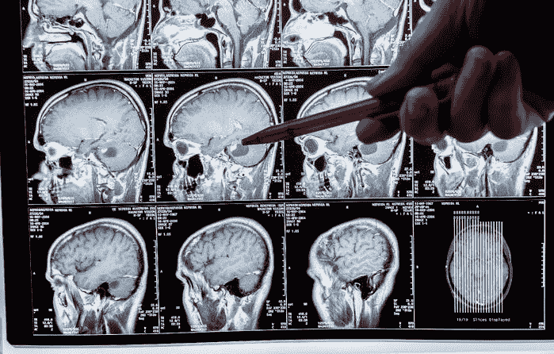

# 如何使用 GPU 和 Domino 5.3 实现深度学习推理

> 原文：<https://www.dominodatalab.com/blog/how-to-use-gpus-in-domino-to-operationalize-deep-learning-inference>

深度学习是机器学习和人工智能(AI)的一种类型，通过例子模仿人类如何学习。虽然这听起来很复杂，但深度学习背后的基本思想很简单。深度学习模型被教会对来自图像(如“猫对狗”)、声音(喵对吠)、或文本(斑猫对雪纳瑞)的数据进行分类。这些模型构建了一个层次结构，其中每一层都基于从前一层获得的知识，并且迭代继续，直到达到其准确性目标。深度学习模型通常可以在很短的时间内达到人类可以确定的精确度。

我们的客户在他们的工作中应用了这些相同的概念，但他们没有使用深度学习来区分猫和狗，而是使用先进的技术来分析病理图像，以识别恶性肿瘤和良性肿瘤，或者分析无人机镜头，以发现冰雹后屋顶的损坏。如果你曾经接到信用卡公司的电话，要求核实最近的交易，那就是深度学习在工作，实时分析数百万笔交易，寻找可能表明欺诈的模式。

Domino 已经为训练高级深度学习模型提供了最好的环境，并且有无数的例子，例如来自和 [Topdanmark](https://www.dominodatalab.com/customers/topdanmark) 的这些用例。借助 Domino 5.3，我们正在扩展我们在训练深度学习模型方面的优势，以支持模型驱动的企业生产实现大规模深度学习，无需开发运维技能。

## Domino 5.3 实现了更快的基于 GPU 的模型推理

使用 Domino 5.3，您可以部署最先进的深度学习模型，并利用[GPU](/blog/gpu-computing-and-deep-learning)的计算能力，而不是必须依赖较慢的 CPU。采用这种方法的人实现了深度学习和其他大规模并行计算应用程序的显著性能提升。 [研究](https://azure.microsoft.com/en-us/blog/gpus-vs-cpus-for-deployment-of-deep-learning-models/) 表明，在类似的成本下，GPU 对深度学习应用的推理速度是 CPU 的五到十五倍。

通过整合 GPU 进行模型推理，公司可以部署依赖于先进框架(如[【tensor flow】](https://blog.tensorflow.org/2018/04/speed-up-tensorflow-inference-on-gpus-tensorRT.html))和高性能 GPU 加速平台(如英伟达 V100 和英伟达 T4)的模型。通常，为深度学习模型设置 REST 端点需要相当多的 DevOps 技能来配置计算资源(如 GPU)以处理预期的负载和处理需求。Domino 5.3 将这种复杂性抽象化，因此数据科学家只需几个步骤就可以将他们的深度学习模型部署到 Domino 模型 API。正如您将在下面看到的，他们可以选择计算实例的数量以及要分配的资源，只需点击几下鼠标。

## 如何用 GPU 在 Domino 中部署模型

Domino 为管理员提供了一个简单的界面来定义资源层，数据科学家可以用它来调整部署。从配置了 GPU 的节点池开始，管理员可以定义多个层，每个层指定模型 API 实例的内存和计算配置。

Domino 提供了一个简单的两步过程来将模型部署为 REST 端点(模型 API)。当用户想要部署模型 API 时，他们需要做的只是选择要执行的计算环境和文件，然后选择包含 GPU 的硬件层。就是这样！您无需学习复杂的 DevOps 技能或让 IT 人员参与配置 Kubernetes 节点和 pods 以使 GPU 可用于托管模型，只需单击一下即可完成所有这一切。

如果用户想要扩展他们的部署，他们可以选择多个实例。Domino 确保每个扩展实例都部署了自己的 GPU 资源，正如管理员设置的资源配额中所定义的那样。

一旦用户发布了模型 API，他们就可以从 Domino 中的一个集中仪表板上查看和管理它，该仪表板提供了一个单一面板来观察和管理他们部署的所有模型。

## 从模型 API 生成预测

一旦运行，模型 API 就准备好接受请求并让 GPU 工作。模型 API 已经设置为执行用户定义的代码，这些代码利用优化的硬件(如 GPU)来加速复杂的工作负载，如深度学习的推理(预测)。

## 利用 GPU+Domino 5.3 进行深度学习创新

Domino 5.3 通过将 GPU 与部署的模型相关联来加速复杂的推理处理，从而帮助企业组织实施深度学习。通过抽象出 DevOps 的复杂性，并提供一种利用开源社区最新创新的途径，Domino 为数据科学家提供了一个简单的工作流，以实现他们深度学习项目的商业价值。

围绕深度学习的开源社区正在发生惊人的创新，包括关于 [拥抱脸](https://huggingface.co/) 的 [BERT](https://huggingface.co/docs/transformers/model_doc/bert) 项目和预训练的图像检测框架，如 [OpenMMLab 检测工具箱](https://github.com/open-mmlab/mmdetection) 。我的 Domino 同事已经发表了许多关于这些主题的详细博客；我最喜欢的一些博客是今年早些时候关于 Tensorflow、PyTorch 和 Keras 的博客，以及关于金融服务公司如何使用深度学习的博客。无论你是刚刚开始深度学习的初学者，还是寻找前沿应用和想法的高级用户，我都鼓励你访问 [Domino 数据科学博客](https://www.dominodatalab.com/blog) 了解更多信息。