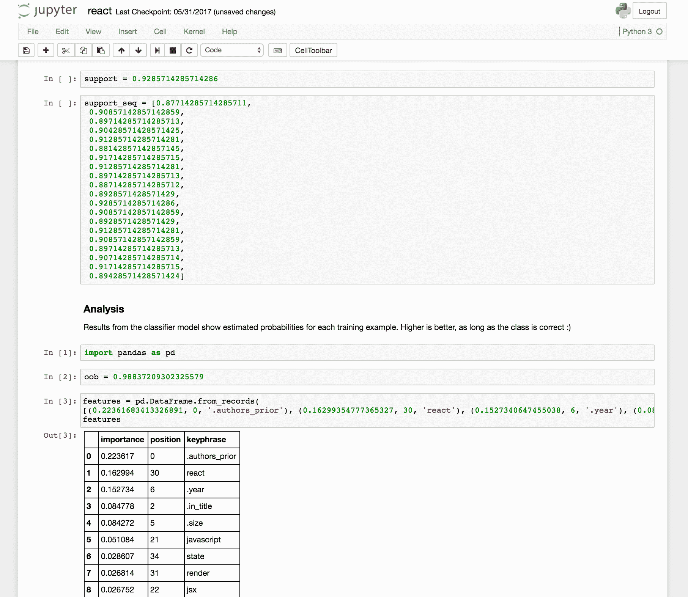
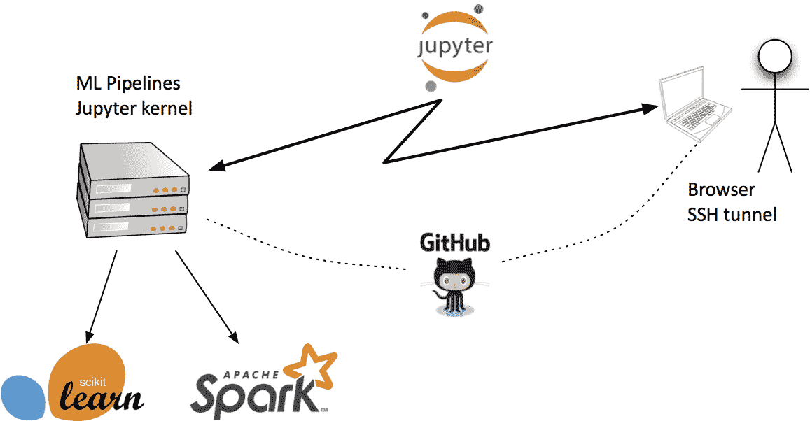

# 循环中的人类

> 原文：<https://www.dominodatalab.com/blog/humans-in-the-loop>

## 人类和机器:科幻还是已经司空见惯？

想象一下，你有一个几乎自动化的系统，在这个系统中，人和机器一起合作完成一些工作。这听起来可能有点科幻……某种电子人，某种未来的 T2。假设几年后你正处于繁忙的通勤交通中，高速公路上挤满了自动驾驶汽车和开车的人。人工智能专家，如加州大学伯克利分校的 [Anca Dragan](http://people.eecs.berkeley.edu/~anca/) 正朝着这个方向努力:看看她最近的 [*“与人协调的汽车”*](https://www.oreilly.com/ideas/cars-that-coordinate-with-people) 。

人和机器合作的场景已经司空见惯:几乎任何电子商务网站，在客户服务团队的支持下大规模运行——合格。然而，一个迫在眉睫的挑战是，我们能否超越死记硬背的任务。除了简单地运行代码库，机器还能在复杂的情况下做出困难的决定和判断吗？我们能否建立这样的系统，让不是人工智能专家的人*“教”机器处理需要更多智慧的工作？最好是基于真实世界的例子，而不是抽象的编程？*

 *另一方面，*我们必须建立制度，让相关人员也发挥重要作用*。或者，正如大卫·拜尔所说的那样，需要[极端的认知拥抱](http://www.oreilly.com/data/free/future-of-machine-intelligence.csp)才能让人工智能在工作场所得到有效采用。阅读:管理人工智能的影响，使其不那么突然，更有用。

## 作为合作者的机器学习:半监督学习之旅

[机器学习](https://en.wikipedia.org/wiki/Machine_learning)的两种变体已经变得普遍。一个叫做 [*监督学习* :](https://en.wikipedia.org/wiki/Supervised_learning) 有一个数据集，数据中的每个例子都有一个*标签*。例如，猫和鸟的数字图像可以是数据，而注释*【猫】*或*【鸟】*将是它们的标签。通常，机器学习专家使用数据集的一部分来训练 ML 模型——因此它们基于输入来预测标签——然后调整参数，以便模型在剩余数据中准确预测。现在流行的[深度学习](https://www.safaribooksonline.com/library/view/fundamentals-of-deep/9781491925607/)方法就是一个很好的例子。深度学习需要*大量*仔细标注的训练数据才是有用的。

另一种常见的变体是 [*无监督学习*](/supervised-vs-unsupervised-learning) :通过算法运行大量数据，弹出*【结构】*。例如，在线营销中的客户细分经常使用聚类算法，如 [K-means](https://en.wikipedia.org/wiki/K-means_clustering) 这种无人监管的算法。利用人工智能的无监督方法是一个热门的研究领域，尽管这是一个悬而未决的问题。

一个不太常见的变体叫做 [*【半监督】*](https://ai.googleblog.com/2021/07/from-vision-to-language-semi-supervised.html) ，一个重要的特例叫做 [*【主动学习】*](https://en.wikipedia.org/wiki/Active_learning_(machine_learning)) 。想法很简单:假设你有一个 ML 模型的[集合](https://en.wikipedia.org/wiki/Ensemble_learning)。模型*“投票”*决定如何标记每种情况的输入数据，当他们达成一致时，他们的共识就会被使用——在大多数情况下，这是一种自动化的方法。当模型不同意或缺乏信心时，把决定权踢给人类专家。让人们处理棘手的边缘案件。无论专家选择什么，反馈那个判断来迭代训练 ML 模型。

## 主动学习:方法和用例

当你有大量廉价的、未标记的数据时，主动学习方法非常有效——大量的数据，其中标记本身的成本是一项主要支出。假设你是底特律一家汽车制造商的高管。谷歌比你的团队有多年的优势，将标记的数据集组装成规模，这对训练无人驾驶汽车所需的 ML 模型至关重要。底特律？没有那么多。随着行业开始拥抱人工智能应用，大规模标签数据的缺乏构成了一个主要障碍。在某些垂直领域，如安全领域，当权者不鼓励收集带有标签的开放数据。现在，随着人工智能应用的承诺，这些优先事项发生了转变。汽车制造商目前正在争相标记重要的数据集，以便能够在自动驾驶市场上竞争。

扩展主动学习的实践，*人在回路*是现在出现的一种如何管理人工智能项目的设计模式。一个很好的案例是 [*“建立一个结合人类专家和数据科学*](https://oreilly.com/ideas/building-a-business-that-combines-human-experts-and-data-science-2) 的企业”，作者是 [Eric Colson](https://twitter.com/ericcolson) 在 [Stitch Fix](http://multithreaded.stitchfix.com/) 。除了数据集的标签，我们如何最好地利用这两个词——人做得更好，辅之以机器做得更好？这是埃里克的一句名言:

*“机器不能做的是认知周围的事情，与周围信息有关的事情，或者审美，甚至与另一个人相关的能力”*

在我看来，Stitch Fix 是旧金山最有趣的人工智能增强初创公司之一。作为一个*“个人风格的伙伴”*，他们融合了人类时尚专家和机器学习的建议，来选择和运送男女服装。这些服务适应个人偏好，是人机有效合作的一个令人惊叹的例子。

如果你想更多地了解人类和机器之间的互补性，请查看这些额外的案例研究:如何创建一个双边市场，让机器和人在一系列相关专业知识和能力上展开竞争；[众包专业知识的 Flash 团队](http://stanfordhci.github.io/flash-teams/)；以及[B12](https://www.safaribooksonline.com/library/view/oreilly-artificial-intelligence/9781491976289/video311839.html)的人工辅助 AI。当然，你也可以顺便看看我在 JupyterCon 的演讲。

## 带 Jupyter 的人在回路人工智能

奥赖利媒体公司使用人工智能应用，这些应用利用了*人在回路*的设计模式。我们与各种学习体验中的大量内容和媒体合作:电子书、教学视频、会议讨论、在线直播培训、播客采访、案例研究等。媒体主动学习的一个几乎理想的用例是重叠上下文的*消歧*。假设有人出版了一本使用术语`IOS`的书:他们是在谈论苹果 iPhone 的操作系统，还是在谈论思科路由器的操作系统？我们处理大量关于这两者的内容。消除这些上下文的歧义对于个性化学习中良好的 UX 很重要。在我们能够利用深度学习之前，我们还需要为我们的数据(来自 200 多家出版商的学习内容)提供良好的标签。

我们的消歧 NLP 管道利用 [Project Jupyter](https://jupyter.org/) 来实现我们的人在回路方法。总体而言，流程很简单:

*   人类专家提供书籍章节、视频片段等示例。，用于一组重叠的上下文:例如， [Go 编程语言](https://golang.org/)中的`go`的例子，一些`go`的例子，如 [AlphaGo](https://www.deepmind.com/research/highlighted-research/alphago) 的例子，其他的`go`的例子都是空的——以上都不是
*   机器基于这些例子建立集合 ML 模型
*   机器试图注释数百万条内容，例如，作为`AlphaGo`、`Golang`，或者不太有趣的*“go*”用法
*   通过与 Apache Spark 的集成，该流程大部分是自动、大规模并行运行的
*   在群体意见不一致的情况下，NLP 管道会遵从做出判断的人类专家，提供进一步的例子
*   这些例子用于训练 NLP 管道以构建更好的模型
*   冲洗、涂肥皂、重复*自然语言理解*上下文

有趣的是，在我们的消歧过程中，NLP 管道是基于 Jupyter 笔记本的。每个歧义术语(如`go`、`ios`、`r`等)。)有不同的笔记本。专家调整笔记本中的参数，以及内容示例的链接。机器创建和评估 ML 模型，更新笔记本中的结果。笔记本还允许人类专家在 ML 模型没有达成共识时进行访问，因此人们可以快速加入。Jupyter 笔记本作为一部分配置文件，一部分数据样本，一部分结构化日志，一部分数据可视化工具。

O'Reilly Media 使用 Juypter 启动了一个小型的机器和人类合作开源项目，即*人在回路*。它叫做`nbtransom`——在 [GitHub](https://github.com/ceteri/nbtransom) 和 [PyPi](https://pypi.python.org/pypi/nbtransom) 上都有。换句话说，机器和人都成为共享文档的合作者。想想“谷歌文档”。这项工作预测了 JupyterLab 中即将出现的协作文档功能-参见加州大学伯克利分校 Ian Rose 的“ [*使用 Google Drive 为 JupyterLab 进行实时协作”*](https://github.com/jupyterlab/jupyterlab-google-drive) 。

我们将在即将于 8 月 24 日在纽约举行的 JupyterCon 上举行的演讲中介绍更多相关内容。

希望在那里见到你！

*^(Domino 注:一键启动 [Domino 的数据科学平台](https://www.dominodatalab.com/product/?utm_source=blog&utm_medium=post&utm_campaign=)中的 Jupyter。)**