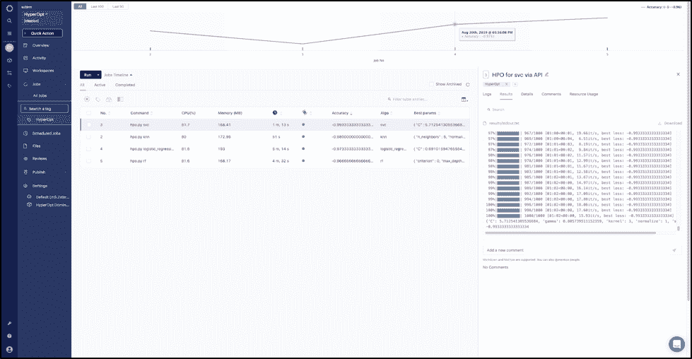

# 超视:贝叶斯超参数优化

> 原文：<https://www.dominodatalab.com/blog/hyperopt-bayesian-hyperparameter-optimization>

*本文介绍了如何使用 HyperOpt Python 包中实现的基于顺序模型的优化(SMBO)技术来执行超参数优化。有一个补充的[多米诺项目可用](https://invite.try.dominodatalab.com/inds?utm_id=385&projectid=62acf36aad57e10050e2b7ed&utm_source=DS_Blog)。*

## 介绍

特征工程和超参数优化是两个重要的建模步骤。多年来，我和许多同事争论过哪一步对模型的准确性影响更大。虽然这一争论尚未解决，但很明显，超参数优化在机器学习生命周期的模型构建阶段占用了相当多的计算资源和时间。超参数优化有六种主要方法，包括手动搜索、网格搜索、随机搜索、进化算法、贝叶斯优化和基于[梯度的方法](https://arxiv.org/abs/1502.03492)。

虽然经验和理论表明，像随机搜索这样的流行方法比[网格搜索](http://www.jmlr.org/papers/volume13/bergstra12a/bergstra12a.pdf)更有效，但这些方法在如何探索超参数的搜索空间方面并不智能。训练人工智能需要变得更加[节能](https://www.technologyreview.com/s/613630/training-a-single-ai-model-can-emit-as-much-carbon-as-five-cars-in-their-lifetimes/)，超参数优化是一个适合关注的领域，因为它是[计算密集型](https://arxiv.org/abs/1906.02243)。与手动、网格和随机搜索相比，贝叶斯优化不是一种强力算法，因此它是以高效方式执行超参数优化的良好选择，同时不会影响结果的质量。

在领先的政府、学术和私人机构的支持下开发的[hyperpt](https://github.com/hyperopt/hyperopt)包提供了一种有前途且易于使用的贝叶斯超参数优化算法的实现。在本文的剩余部分，我们将介绍如何使用 HyperOpt Python 包中实现的基于顺序模型的优化(SMBO)技术来执行超参数优化。

## 基于贝叶斯序列模型的优化(SMBO)

基于序列模型的优化是一种贝叶斯优化技术，它使用来自过去试验的信息来通知下一组要探索的超参数，并且在实践中使用这种算法的两种变体:一种基于高斯过程，另一种基于树 Parzen 估计器。HyperOpt 包实现了 Tree Parzen 估计算法来执行优化，这将在下一节中描述。

### 了解树 Parzen 估计量

树形 Parzen 估计器用一组非参数分布代替了以树形方式从搜索空间选择参数的生成过程。它将参数分布的选择替换为截断高斯混合、指数截断高斯混合或重新加权分类，以形成两个密度-一个密度用于损失函数，其中损失低于特定阈值，另一个密度用于损失函数，其中损失函数高于超参数空间中值的特定阈值。对于评估的密度中的每个采样配置，密度被更新以使它们更精确地代表真实的损失表面。

## 如何优化超参数

在这里，我们演示了如何从 Domino 的 Jobs dashboard 中优化逻辑回归、随机森林、支持向量机和 k-最近邻分类器的超参数。除了启动超参数作业之外，还可以在作业控制面板中查看作业日志和最佳超参数的结果。

为了运行超参数优化作业，我们创建一个 Python 文件( *hpo.py* )，该文件将模型名称作为参数，并使用 Domino 中作业仪表板中的 run 选项启动作业。

下面的步骤显示了相关的代码片段。完整的项目是可用的，可以从 try.dominodatalab.com[的](https://try.dominodatalab.com/u/subirm/HyperOpt/overview)[远视项目](https://try.dominodatalab.com/jobs/subirm/HyperOpt)分叉。

### 步骤 1:通过将以下内容添加到 docker 文件中来安装项目所需的依赖项

```py
RUN pip install numpy==1.13.1
RUN pip install hyperopt
RUN pip install scipy==0.19.1
```

您还可以在 try.dominodatalab.com 的[使用 *HyperOpt Domino Analytics 发行版 Py3.6 R3.5* 环境。它拥有所需的所有依赖项，还包括库，以防您希望使用 HyperOpt 来优化使用 Keras/Tensorflow 的深网的超参数。](https://try.dominodatalab.com/workspaces/subirm/HyperOpt)

 Installing the required dependencies to the environment in a Domino environment

### 步骤 2:创建一个 Python 文件(在[try.dominodatalab.com](https://try.dominodatalab.com/projects)的 HyperOpt 项目中作为 hpo.py 存在)并加载所需的库

```py
from hyperopt import hp, tpe, fmin, Trials, STATUS_OK

from sklearn import datasets

from sklearn.neighbors import KNeighborsClassifier

from sklearn.svm import SVC

from sklearn.linear_model import LogisticRegression

from sklearn.ensemble.forest import RandomForestClassifier

from sklearn.preprocessing import scale, normalize

from sklearn.model_selection import cross_val_score

import numpy as np

import pandas as pd

import matplotlib.pyplot as plt
```

### 步骤 3:指定要优化超参数的算法

```py
models = {

'logistic_regression' : LogisticRegression,

'rf' : RandomForestClassifier,

'knn' : KNeighborsClassifier,

'svc' : SVC
}
```

### 步骤 4:为每个算法设置超参数空间

```py
def search_space(model):

    model = model.lower()

    space = {}

    if model == 'knn':

        space = {
            'n_neighbors': hp.choice('n_neighbors', range(1,100)),

            'scale': hp.choice('scale', [0, 1]),

            'normalize': hp.choice('normalize', [0, 1]),

            }

    elif model == 'svc':

        space = {

            'C': hp.uniform('C', 0, 20),

            'kernel': hp.choice('kernel', ['linear', 'sigmoid', 'poly', 'rbf']),

            'gamma': hp.uniform('gamma', 0, 20),

            'scale': hp.choice('scale', [0, 1]),

            'normalize': hp.choice('normalize', [0, 1]),

            }

    elif model == 'logistic_regression':

        space = {

            'warm_start' : hp.choice('warm_start', [True, False]),

            'fit_intercept' : hp.choice('fit_intercept', [True, False]),

            'tol' : hp.uniform('tol', 0.00001, 0.0001),

            'C' : hp.uniform('C', 0.05, 3),

            'solver' : hp.choice('solver', ['newton-cg', 'lbfgs', 'liblinear']),

            'max_iter' : hp.choice('max_iter', range(100,1000)),

            'scale': hp.choice('scale', [0, 1]),

            'normalize': hp.choice('normalize', [0, 1]),

            'multi_class' : 'auto',

            'class_weight' : 'balanced'

                }

    elif model == 'rf':

    space = {'max_depth': hp.choice('max_depth', range(1,20)),

    'max_features': hp.choice('max_features', range(1,3)),

    'n_estimators': hp.choice('n_estimators', range(10,50)),

    'criterion': hp.choice('criterion', ["gini", "entropy"]),

        }

    space['model'] = model

    return space
```

### 步骤 5:定义模型的损失度量

在这一步中，我们定义了一个 5 倍交叉验证分数作为损失，由于 HyperOpt 的优化器执行最小化，我们给交叉验证分数添加了一个负号。

```py
def get_acc_status(clf,X_,y):

    acc = cross_val_score(clf, X_, y, cv=5).mean()

    return {'loss': -acc, 'status': STATUS_OK}
```

### 步骤 6:为 HyperOpt 优化器构建目标函数

在这一步中，我们传入超参数并返回由一组超参数的损失函数计算的值。

```py
def obj_fnc(params):

    model = params.get('model').lower()

    X_ = scale_normalize(params,X[:])

    del params['model']

    clf = models[model](**params)

    return(get_acc_status(clf,X_,y))
```

### 步骤 7:创建一个试用对象来存储每次评估的结果，并打印找到的最佳结果

```py
hypopt_trials = Trials()

best_params = fmin(obj_fnc, search_space(model), algo=tpe.suggest,

max_evals=1000, trials= hypopt_trials)

print(best_params)

print(hypopt_trials.best_trial['result']['loss'])
```

### 步骤 8:将找到的模型名称、精确度和最佳超参数写入 dominostats.json

一旦数据被写入`dominostats.json,`,结果将在 Domino 的 Jobs dashboard 中可见。

```py
with open('dominostats.json', 'w') as f:

    f.write(json.dumps({"Algo": model, "Accuracy":

    hypopt_trials.best_trial['result']['loss'],"Best params" : best_params}))
```

### 步骤 9:从作业仪表板启动超参数优化作业

使用左侧的导航面板导航到 Jobs dashboard，然后单击 Run 选项，以型号名称作为参数执行 hpo.py。

 Execute the hyperparameter optimization jobs

### 步骤 10:在作业仪表板上查看结果

结果显示，支持向量分类器具有最好的准确度(0.993，并且能够相当快地找到好的分离超平面)，而随机森林具有最低的准确度(0.966)。

 Jobs dashboard with results of the different hyperparameter optimization runs

## 结论

贝叶斯超参数优化是执行超参数优化的智能方式。它有助于节省计算资源和时间，并且通常显示与随机搜索相同或更好的结果。HyperOpt 库使运行贝叶斯超参数优化变得容易，而不必处理通常伴随贝叶斯方法的数学复杂性。HyperOpt 还有一个充满活力的开源社区，为使用 Keras 构建的 [sci-kit 模型](https://github.com/hyperopt/hyperopt-sklearn)和[深度神经网络](https://github.com/maxpumperla/hyperas)贡献助手包。

此外，当使用 Jobs dashboard 在 Domino 中执行时，超参数优化运行的日志和结果是可用的，这使得可视化、排序和比较结果变得容易。