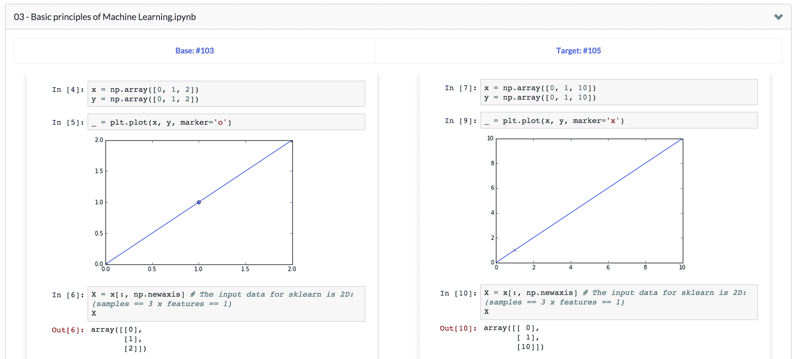
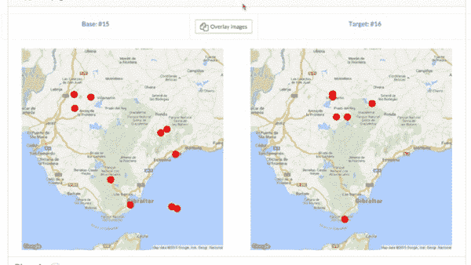

# 图像差分与 CSS 技巧

> 原文：<https://www.dominodatalab.com/blog/image-diffing-with-css-tricks>

我们一直在努力在 Domino 中提供令人兴奋的新特性。我们的[最新版本](https://support.dominodatalab.com/hc/en-us/articles/204850695-Release-notes)包含了很多内容，包括跨项目[导入/共享数据集](https://support.dominodatalab.com/hc/en-us/articles/205703615)的能力，更简单的[管理用户组织](https://support.dominodatalab.com/hc/en-us/articles/204857715-Organizations)的方法，以及对我们托管 Jupyter 笔记本电脑方式的改进，以及使管理 Domino 内部部署更容易的变化。

在这篇文章中，我想分享一个仍在开发中的测试功能的预览:更直观地比较图像的能力。

## 背景和使用案例

Domino 提供了对您运行的不同分析实验进行比较的能力，因此您可以并排看到您的实际结果，而不仅仅是源代码中的变化。如果您要生成图表或其他诊断图像，并改变实验的技术或参数，这将非常有用。



如果您的图像有明显的差异，这种方法效果很好。但是，如果差异更细微，目测可能还不够。

## 基于 CSS 的图像差分

我们借用了我们在[中读到的一项技术，在这里](https://franklinta.com/2014/11/30/image-diffing-using-css/)中为我们的图像比较视图添加了一个新功能。您可以将一个图像叠加在另一个图像上查看，而不是并排查看两个不同版本的图像，这样更容易发现差异。看看这个:



新版本的图像覆盖在旧版本上，我们提供了一些旋钮和转盘进行比较:

*   滑块控制顶部图像的不透明度。来回移动它可以让您轻松地以交互方式探索变化。
*   最初，选择“反转颜色”选项。这将反转顶部图像的颜色。当顶部图像的不透明度约为 50%时，顶部图像的反转颜色会与底部图像的颜色“抵消”。结果是，任何图像相同的地方都变成灰色，只有差异突出。

## 履行

这里的 CSS 非常简单。我们用`-webkit-filter: invert(...) opacity(...)`做我们需要做的一切。滑块和按钮被连接以在改变时调用该功能:

```py
function changeTopImage() {
var opacity = $("#opacity-slider").val();
var invert = $("#invert-checkbox").is(":checked") ? 100 : 0;
$("#top-image").css("-webkit-filter", "invert(" + invert + "%) opacity(" + opacity + "%)")
}
```