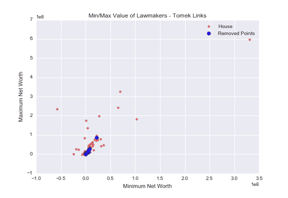

# 基于采样的数据集类别不平衡处理方法

> 原文：<https://www.dominodatalab.com/blog/imbalanced-datasets>

假设你是一名医学专业人员，正在训练一个分类器来检测一个人是否患有极其罕见的疾病。你训练你的分类器，它在你的测试集上产生 99.9%的准确率。您对这些结果欣喜若狂，但是当您检查分类器输出的标签时，您会看到它总是输出“无疾病”，而不管患者数据如何。这是怎么回事？！

因为这种疾病非常罕见，与数千名未患病的患者相比，在您的数据集中只有少数患者患有这种疾病。因为在你的数据集中超过 99.9%的患者没有疾病，任何分类器都可以通过简单地向每个新患者返回“没有疾病”来实现令人印象深刻的高准确性。

这是**类不平衡问题**的一个例子，其中属于少数类(在我们的例子中为“疾病”)的数据点的数量远小于属于多数类(“无疾病”)的数据点的数量。除了医学诊断，这个问题也出现在其他领域，如欺诈检测和异常检测。

在这篇博文中，我将向您展示基于采样的方法来解决数据中的类不平衡问题。

## 取样技术概述

数据重采样通常用于数据科学中，以验证机器学习模型。如果你在建立模型的时候曾经进行过[交叉验证](/blog/guide-to-building-models-with-cross-validation)，那么你就进行过数据重采样(虽然人们很少称之为数据重采样法)。例如，如果您正在运行 5 重交叉验证，那么您正在重新采样您的训练数据，这样每个数据点现在都属于五重之一。

现在，让我们讨论一种最流行的数据重采样方法: [Bootstrapping](https://en.wikipedia.org/wiki/Bootstrapping_(statistics)) 。

我有一个关于 2011 年各州家庭互联网使用情况的数据集。该数据集有 52 行(每个州、哥伦比亚特区和整个美国各一行)，具有与互联网使用相关的特征。下面是该州/地区拥有家庭互联网的家庭百分比直方图。


我们可以看看这个直方图，问自己一个基本问题:这些百分比的平均值是多少？我们可以很容易地计算出美国家庭拥有家庭互联网的平均比例为 76.7%。

现在让我们问一个更难的问题:均值的分布是什么样的？这似乎是一个奇怪的问题，但是当我们计算数据的平均值时，我们实际上创建了一个平均值的单样本数据集。


如果我们旅行到一个平行宇宙，收集 2011 年各州的互联网使用数据，我们会看到完全相同的平均值 76.7%吗？大概不会！我们会看到不同含义。如果我们去几个更平行的宇宙，在每个宇宙中收集这些数据，我们可能会得到不同的家庭互联网平均百分比值。

实际上，我们无法前往平行宇宙(...然而)并重新收集这些数据，但是我们可以使用自举方法来模拟这种情况。bootstrap 背后的想法很简单:如果我们用替换数据中的重新采样点**，我们可以将重新采样的数据集视为我们在平行宇宙中收集的新数据集。**

下面是我用 Python 实现的 bootstrap。

```py
def bootstrap(X, n = None, iterations = 1):

    if n == None:

        n = len(X)

        X_resampled = np.random.choice(X, size = (iterations, n), replace = True)

    return X_resampled
```

使用 bootstrap 方法，我可以从原始数据中创建 2000 个重新采样的数据集，并计算每个数据集的平均值。现在，我们有一个 2000 个样本的数据集，用于计算拥有家庭互联网的家庭的平均百分比。


你可能会注意到上面的直方图类似于高斯分布。如果我将重新采样的数量从 2，000 增加到 100，000，得到的直方图将与高斯分布更加相似。

在传统的统计分析中，我们有一些感兴趣的人群，我们收集样本数据来执行以下形式的统计推断:*样本- >人群*。通过 bootstrap，我们将原始样本数据视为我们感兴趣的总体，并收集重采样数据以执行以下形式的统计推断:*重采样数据- >原始样本*。

## 不平衡学习

[不平衡学习](https://github.com/scikit-learn-contrib/imbalanced-learn)是一个 Python 库，包含各种处理不平衡数据集以及产生不平衡数据集的算法。该库可以轻松安装 *pip* :

```py
pip install -u imbalanced-learn
```

让我们来探索第二组数据，它们与 2004 年至 2012 年美国立法者的净资产有关。对于这个例子，我们看看 2012 年参议员和众议员的最低净值和最高净值。2012 年，我们有 516 名众议员和 113 名参议员的净资产数据。


尽管数据中的众议员人数几乎是参议员人数的五倍，但这种不平衡程度还不足以严重影响我们的预测模型。幸运的是，*不平衡学习*库包含了一个*make _ unbalance*方法来加剧给定数据集中的类不平衡程度。

让我们使用这种方法将数据中参议员的数量从大约 20%减少到 5%。

```py
from imblearn.datasets import make_imbalance

X_resampled, y_resampled = make_imbalance(X,y, ratio = 0.05, min_c_ = "Senate", random_state = 249)
```

现在，数据中的参议员人数已经从 113 人减少到 25 人，因此新的数据集严重偏向众议院议员。


当使用基于抽样的方法来调整类别不平衡时，我们可以采取两种不同的方法:

1.  增加来自少数类的采样点的数量。
2.  从多数类中减少采样点的数量。

让我们检查这两种方法...

## 过采样:SMOTE

对于第一种方法，我们将增加少数类的采样点数量，以匹配多数类的数据点数量。对于我们的问题，这将意味着重新采样以将数据中的参议员数量从 25 个增加到 516 个。

因为 bootstrap 方法将抽样与替换结合在一起，所以我们可以对 25 个参议员重新抽样，直到我们有一个包含 516 个参议员的新数据集。您可能会注意到这种方法的一个潜在问题:如果我们从 25 个参议员中替换取样，直到我们有 516 个数据点，我们将在结果数据集中多次看到一些相同的参议员！

我们希望使用 bootstrap 的一般原理从我们的少数类中进行替换采样，但是我们希望调整每个重新采样的值，以避免与原始数据完全相同。这就是 [合成少数过采样技术(SMOTE)](/blog/smote-oversampling-technique) 算法的用武之地。

SMOTE 算法可以分为四个步骤:

1.  从少数民族类中随机选取一个点。
2.  计算该点的*k*-最近邻(对于一些预先指定的 *k* )。
3.  在选择的点和它的每个邻居之间的某个地方添加 k 个新点。

比如让 *k* = 5。然后我们从少数民族类中随机选择一个点。接下来，我们从也属于少数类的点计算它的 5 个最近邻。最后，对于每个邻居，我们计算连接所选点到其邻居的线段，并沿着该线的某个位置添加一个新点。

每个新的合成子点都基于其父点(选定的点和它的一个邻居)，但子点永远不会是其父点的精确副本。启发性地，SMOTE 通过在少数类倾向所在的一般子空间中创建新的数据点来工作。

因为*不平衡学习*库是建立在 Scikit-Learn 之上的，使用 SMOTE 算法只有几行代码。

```py
from imblearn.over_sampling import SMOTE
smote = SMOTE(kind = "regular")

X_sm, y_sm = smote.fit_sample(X_resampled, y_resampled)
```

上面的代码产生 491 个合成参议员，所以 *X_sm* 和 *y_sm* 中的参议员总数是 516；与众议员人数相同。


正如你所看到的，我们现在有了更多的参议员数据点，它们似乎都落在原始参议员数据的总趋势线上。

## 欠采样:Tomek 链接

在解决类别不平衡的第二种方法中，我们将做与第一种方法相反的事情:不是为少数类别创建新的数据点，而是从多数类别中移除数据点。

我们可以从多数类中随机删除点，但我们应该专注于删除那些给我们带来更多麻烦的数据点。这些点被称为*到*的链接。

*Tomek 链接*是成对的点( *A* 、 *B* )，使得 *A* 和 *B* 是彼此最近的邻居，并且它们具有相反的标签。


*来源:[智能家居自动化提示的机器学习挑战](https://www.slideshare.net/barnandas/machine-learning-challenges-for-automated-prompting-in-smart-homes)*

正如你在上面的图像中看到的， *Tomek 链接*(用绿色圈出)是最近邻的红色和蓝色数据点对。直觉上，这些是会给大多数分类算法带来最大麻烦的点。通过移除这些点，我们扩大了两个类之间的分离，因此我们的算法对其输出更“有信心”。

同样，*不平衡学习*使得实例化 Tomek 链接模型并使其适合我们的数据变得简单。

```py
from imblearn.under_sampling import TomekLinks

tLinks = TomekLinks(return_indices = True)

X_tl, y_tl, id_tl = tLinks.fit_sample(X_resampled, y_resampled)
```

*return _ indexes*允许我们获取被移除的数据点的索引，因此我们可以分别绘制这些索引。在下图中，我绘制了房屋数据以及移除的数据点。



总共有 14 个被移除的数据点(蓝色)，它们大多位于红色点的簇中。因为参议员和众议员的数据在这个聚类中有很大的重叠，所以从这里移除点是有意义的，以便增加两个类之间的分离级别。

## 结论

类别不平衡是许多应用数据科学和机器学习问题中的常见问题。虽然我只讨论了减轻不平衡问题的基于采样的方法，但是还有其他类型的方法来处理不平衡，比如特殊的代价函数，它以不同的方式处理正面和负面的例子。

需要记住的一点是，这些方法并不是解决阶级不平衡问题的灵丹妙药。这些方法的工作原理是在数据中引入一种特殊的偏差；这使得预测模型更容易学习可推广的模式。如果您确实使用这些方法，了解这种特殊偏差如何影响您的模型的结果是很重要的。

关于这个主题的进一步阅读，我推荐 2009 年的[从不平衡数据中学习(PDF)](http://www.ele.uri.edu/faculty/he/PDFfiles/ImbalancedLearning.pdf) 论文。虽然它最先进的部分已经过时，但它仍然是一篇关于阶级不平衡的伟大调查论文。