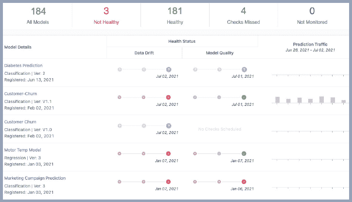

# Domino 5.0:快速更新生产模型以获得最佳性能

> 原文：<https://www.dominodatalab.com/blog/integrated-model-monitoring>

## 在 [Domino 5.0](/blog/whats-new-in-domino-5.0) 中引入集成模型监控

作者 Patrick Nussbaumer，Domino 产品营销总监，2022 年 1 月 31 日， [产品更新](/blog/tag/product-updates)

持续的漂移和精度监控对于 [维持推动您业务发展的有效模型](https://www.dominodatalab.com/blog/4-ways-to-maintain-model-accuracy-with-model-monitoring) 至关重要。事实上，行业估计显示，不进行监控会导致大约 30%的业务价值损失。然而，DataIQ 进行的一项调查显示，只有 [10.5%](https://www.dominodatalab.com/resources/dataiq-survey-how-to-scale-data-science/) 的组织拥有针对漂移和质量的自动化模型监控。

事实证明，开发企业模型监控解决方案以确保所有模型都以最佳性能运行对于许多组织来说都是一项挑战。为什么？常见的挑战包括:

*   构建数据管道进行比较的复杂性
    *   带有训练数据的预测数据，以及
    *   基于真实数据的模型推理
*   创建仪表板以查看监控性能
*   分析大量特征以识别模型退化的来源
*   在修复开发中复制生产模型非常耗时

一些公司已经解决了这些问题中的一个或多个，但是当他们不得不一遍又一遍地重复这个过程时，他们面临着挑战，特别是当更多的模型进入生产时。这种从部署到监控到补救再到重新部署过程中的摩擦严重限制了 [模型速度](https://www.dominodatalab.com/blog/model-velocity) 。如果您有兴趣了解您的组织如何达到标准，请查看 [模型速度评估](https://www.dominodatalab.com/resources/data-science-process-lifecycle-assessment) ，这是一种免费且简单的方法，可以确定您可能存在问题的地方。

Domino 是 [企业 MLOps](https://www.dominodatalab.com/resources/a-guide-to-enterprise-mlops/) 平台，它无缝集成了代码驱动的模型开发、部署和监控，以支持快速迭代和最佳模型性能，因此公司可以确保从其数据科学模型中实现最大价值。

### 它是如何工作的

#### 唯一的闭环开发-部署-监控-补救-部署流程

集成监控使构建监控管道变得简单。Domino 自动为部署的模型设置预测数据捕获管道和模型监控，以确保模型性能达到峰值。

##### 开发-部署-监控

只需两行代码，数据科学家就可以保存特征、训练数据和预测，以便进行分析和监控。在训练期间需要一行代码来捕获训练数据，在 API 调用中需要另一行代码来捕获预测数据。

一旦部署了模型，监控的配置就很简单了。

只需选择培训数据，即可启用适当的版本和监控。

接下来，为数据和模型漂移配置检查和自动警报。

Domino 随后将连接到实时预测数据，并自动化一个连续的监控管道。一旦做出预测，Domino 将显示监控统计数据。

该模型在一个集中的仪表板中可见，该仪表板为模型、概要和漂移细节提供了一个单一的控制台。用户能够深入了解细节，并针对漂移特征和模型质量问题配置警报。

##### 补救-部署

当一个模型的性能下降时，可以轻松地深入模型性能以了解更多详细信息。

当模型准确性出现问题时，Domino 会生成一个模型质量报告，其中包含可操作的见解，突出模型和数据中的问题。该报告包括大量分析，以帮助数据科学家了解和诊断漂移。

当您准备好修复您的模型时，可以使用您的模型的原始重构状态轻松地启动开发环境。

一旦您的工作空间启动，它将包含用于构建模型的原始代码、笔记本、培训数据和 docker 映像。还将加载调试、分析和与原始培训数据进行比较所需的生产数据。

一旦模型经过重新培训和性能补救，只需点击几下鼠标，即可重新部署和监控新的模型版本。

### 结论

Domino 专注于帮助组织提高模型速度，发布了第一个集成的闭环体验功能，以推动模型速度并保持数据科学模型的最高性能。具有帮助自动建立监控和预测数据管道的功能，与仪表板无缝集成；警报，以及生成可操作的洞察报告；以及快速设置开发环境以修复模型并使其重新投入生产的能力，组织能够专注于开发新模型，同时确保部署的模型能够提供业务价值。

安装或升级到 Domino 5.0 的新客户和现有客户将自动访问特定容量的监控数据，这样他们就可以开始使用闭环监控系统。客户可以与其销售团队合作，根据需要预测和购买更多容量。

### 关于作者

|  | Pa**tri****CK Nuss baumer 是多米诺数据实验室的产品营销总监。**他拥有伊利诺伊大学香槟分校的电气工程学士学位和加州大学欧文分校的 MBA 学位。Patrick 在数据和分析行业拥有近 30 年的经验。 |