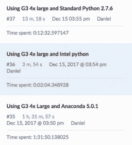
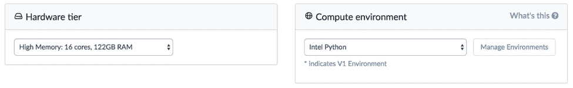
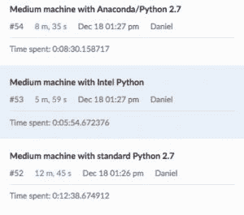

# 英特尔的 Python 发行版正在飞速发展，现在它已经进入了 Domino

> 原文：<https://www.dominodatalab.com/blog/intels-python-distribution-is-smoking-fast-and-now-its-in-domino>

*多米诺刚刚完成基准测试[英特尔的 Python 发行](https://software.intel.com/en-us/distribution-for-python)，而且速度很快，非常快。Intel 的 Python 发行版可以在 Domino 中使用。*

## 英特尔的 Python 发行版

人们可能不知道英特尔有一个 [Python 发行版](https://software.intel.com/en-us/distribution-for-python/get-started)。基于 Anaconda 发行版，英特尔的工程师使用英特尔数学内核库和英特尔数据分析加速库优化了流行的数学和统计软件包，如 [NumPy](http://www.numpy.org/) 、 [SciPy](https://www.scipy.org/) 和 [scikit-learn](http://scikit-learn.org/stable/) 。英特尔继续与包括 Anaconda 在内的所有主要 Python 发行版合作，让所有 Python 用户都能广泛使用这些 IA 优化和性能加速。

[英特尔性能指标评测结果](https://software.intel.com/en-us/distribution-for-python/features)表明，以前可能需要一个多小时才能完成的批量运行，现在仅需两分钟即可完成。当在 Jupyter 笔记本上工作时，由此产生的加速意味着过去需要几分钟才能计算的单元现在只需几秒钟。

## Domino 基准测试英特尔的 Python 发行版

在 Domino，我们想在几个不同的场景中运行基准测试，看看加速会如何影响真实世界的数据科学程序。对于每个基准测试，我们运行了相同的实验，其中唯一改变的变量是所使用的 Python 发行版。

在 Domino 中很容易改变环境和硬件，所以改变环境来运行基准只需要几秒钟。

一旦我们有了一个采用英特尔 Python 的环境，我们就可以同时启动所有的基准测试，并且知道我们正在将环境作为变量进行隔离。此外，我们可以在越来越小的机器上运行复杂的作业，看看这是如何改变结果的。

我们运行的第一个基准测试使用 scikit-learn 从向量数组计算距离矩阵中的距离。每个基准测试在一个 16 核/120GB RAM 的机器上运行三次。

| 分配 | 平均完成时间 |
| --- | --- |
| 标准 Python 2.7 | 12 米 17 秒 |
| --- | --- |
| 英特尔 Python 3.6 | 2 米 17 秒 |
| --- | --- |

英特尔 Python 始终以不到标准 Python 发行版 20%的时间完成运行。

我们运行的第二个测试在一个更小的共享盒子上使用了 Black Scholes 基准。该服务器有四个 CPU 和 16 GB 的内存。

| 分配 | 平均完成时间 |
| --- | --- |
| 标准 Python 2.7 | 9m 21s |
| --- | --- |
| 英特尔 Python 3.6 | 2m 50s 秒 |
| --- | --- |

同样，使用英特尔的 Python 发行版节省了大量时间。即使每个实验节省七八分钟，也会导致研究结果的实质性改进。更快的结果允许更多的迭代，也确保研究人员不会在工作中分心和分心。当跑步时间从几小时缩短到几分钟时，这种差异就更有价值了。

## Domino 中可用的英特尔 Python 环境

Domino 客户可以立即从英特尔的 Python 发行版中受益。我们已经在试用环境和云生产环境中创建了英特尔 Python 环境。