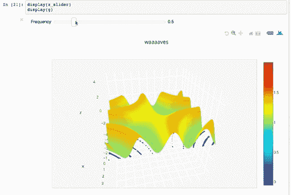
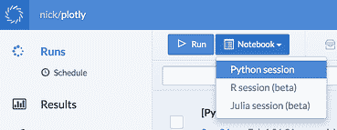
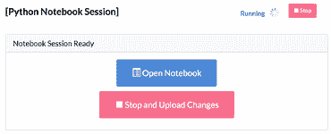
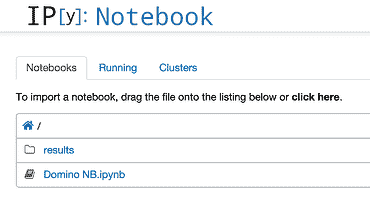

# Plotly 和 Domino 的交互式图表

> 原文：<https://www.dominodatalab.com/blog/interactive-charts-with-plotly-and-domino>

我们使用了一台 IPython 笔记本，它使用 Plotly 的小部件来创建漂亮的交互式图表。请继续阅读，了解如何通过将 Domino 作为中央笔记本引擎，在您自己的笔记本中使用交互式图表——在防火墙后或云中。

## 我们做了什么

Domino 允许您在强大的云硬件上运行 IPython 笔记本会话，无需任何设置。我们在 [Plotly](https://www.dominodatalab.com/data-science-dictionary/plotly) 的朋友给了我们一个很棒的笔记本示例，展示了他们的笔记本小部件，我们把它上传到 Domino，这样你就可以玩了。

亲自尝试一下:

1.  开始新的 IPython 笔记本会话
    

2.  打开会话
    

3.  打开笔记本
    

4.  评估细胞和周围玩耍！

## 反光

我们的核心工程原则之一是尽可能利用现有技术，而不是重新发明轮子。这对我们有好处，因为它节省了我们做大量的工作！但这对我们的用户也有好处，因为这意味着他们可以获得现有工具的所有灵活性，并从整个生态系统的改进中受益。

在这种情况下:我们选择使用 IPython 笔记本，而不是构建我们自己的笔记本功能。因此，我们的用户可以利用 Plotly 交互式小部件，而无需我们进行任何额外的工程设计。现在我们有一个关于如何使用 [Domino](https://www.dominodatalab.com?utm_source=blog&utm_medium=post&utm_campaign=interactive-charts-with-plotly-and-domino) 创建交互式笔记本的好故事！