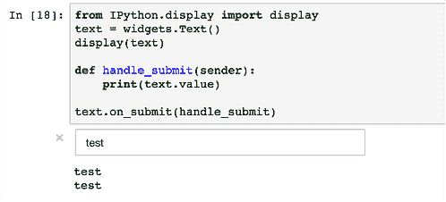
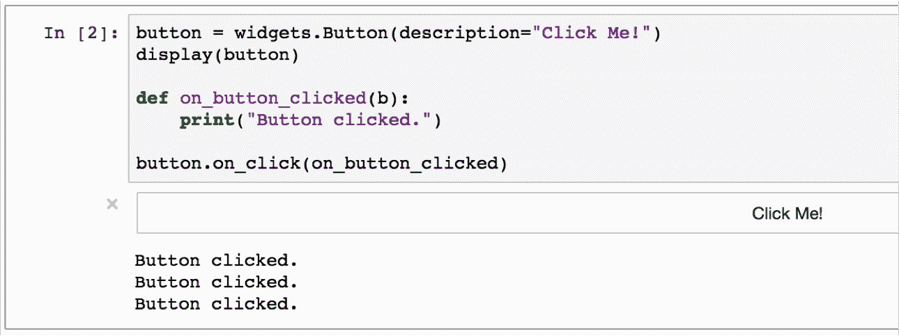
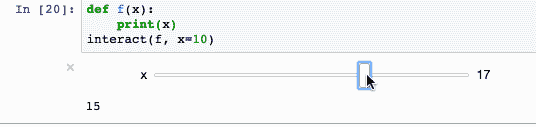
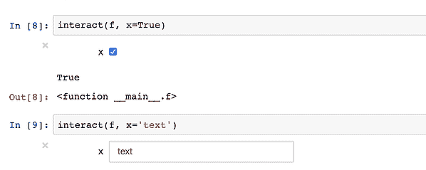
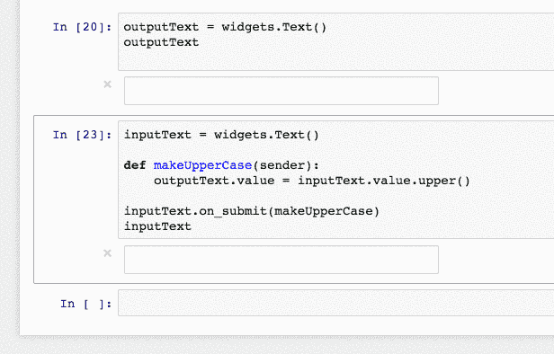
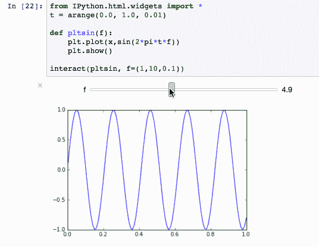
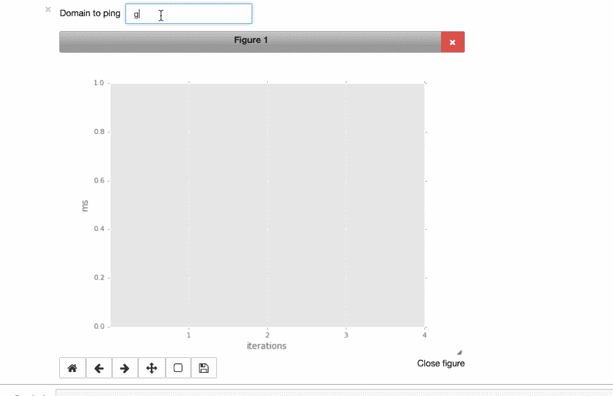

# 使用 jupiter 构建交互式仪表盘

> 原文：<https://www.dominodatalab.com/blog/interactive-dashboards-in-jupyter>

欢迎来到**的第二部分“高级 Jupyter 笔记本技巧”**在[第一部分](https://blog.dominodatalab.com/lesser-known-ways-of-using-notebooks)中，我描述了 magics，以及如何在“批处理”模式下计算笔记本以将其用作报告或仪表板。在这篇文章中，我描述了 Jupyter 笔记本的另一个强大特性:使用交互式小部件构建交互式仪表盘的能力。包含的示例托管在 [Domino 数据科学平台](https://try.dominodatalab.com/u/joshpoduska/interactive_notebooks/overview)上。

## 类固醇上的商业智能

为什么我们要给笔记本增加交互性？一个原因是使用更强大的工具来处理传统的商业智能用例。如果您在 SQL 之上构建仪表板，传统的 BI 工具非常有用，但是如果您想要可视化由一些更复杂的逻辑生成的信息，它们通常会有所欠缺。

通过笔记本中的交互式小部件，您可以使用 Python 的全部功能来表达计算和生成可视化——同时向最终用户展示“旋钮和转盘”,以便他们可以控制可视化的各个方面。从这个意义上说，你可以把笔记本作为任何人的轻量级“应用”。

## ipywidgets 简介

添加小部件的功能驻留在 [ipywidgets](https://github.com/ipython/ipywidgets) 包中，所以我们想从导入开始:

```py
from ipywidgets import widgets
```

导入之后，您可以添加各种类型的 UI 元素。您可以将一个小部件想象成由两部分组成:

1.  在输出单元格(例如，文本框)中呈现的 **UI/HTML 元素**
2.  一个**事件处理程序**，让您指定当值改变时应该发生什么。在大多数情况下，您会希望定义一个 Python 函数，当用户更改输入时调用该函数，这样您就可以相应地更新笔记本的其他元素(例如，可视化)。

### 小部件的基本类型

*   文本输入:您可以使用`widgets.Text()`创建一个文本输入字段。`.on_submit()`监听活动并调用一个函数来处理活动。



*   按钮:按钮部件的工作方式类似于文本输入部件。
    
*   Interact:除了默认的小部件，还有“interact ”,它会根据您使用的参数自动生成一个小部件。


第一个参数是处理第二个参数的选定值的函数。第二个参数的类型将决定交互的形式。正如你所看到的:一个整数导致一个滑块。给出一个布尔值(`interact(f, x=True)`)创建一个复选框。



您可以将小部件存储在笔记本的变量中，就像任何其他类型的值一样。这允许您将一个小部件的输入绑定到另一个小部件的值——中间可能有某种计算/操作。举个简单的例子:



我们创建了两个小部件，一个输入和一个输出。当输入小部件的值改变时，我们采用新值并更新输入小部件的值。通过这种方式，您可以创建更加复杂的交互。

## 交互式可视化

小部件的强大之处在于，当用户更改输入值时，您可以连接自己的 Python 函数来运行。除此之外，它还能让你对用户输入的变化做出动态响应。例如，



这种核心灵活性释放了将笔记本电脑用作仪表板的巨大潜力。例如，您可以公开小部件来过滤、分组或排序数据；然后，您的 Python 代码可以查询数据源、计算派生数据、使用 pandas 和其他优秀的包进行内存操作，然后使用任意数量的优秀 Python 可视化包呈现结果。

*这里有一个[教程](http://nbviewer.ipython.org/github/quantopian/ipython/blob/master/examples/Interactive%20Widgets/Index.ipynb)，让你开始使用交互式小工具。你也可以通过访问我在 [Domino 平台](https://www.dominodatalab.com?utm_source=blog&utm_medium=post&utm_campaign=interactive-dashboards-in-jupyter)上的[项目](https://try.dominodatalab.com/u/joshpoduska/interactive_notebooks/overview)，旋转一个 Jupyter 笔记本会话(在“笔记本”按钮下)，并打开`widgets`笔记本来玩我上面的例子。

## 把它放在一起

最后，我想将我上一篇文章中的概念(魔法、数据管道)与上面描述的交互式小部件结合起来。结果是笔记本中的一个迷你“应用程序”:用户可以提供一个域名，笔记本将 ping 该域名，并在图表上绘制响应时间。



下面是创建它的代码。你也可以通过访问我的[多米诺项目](https://try.dominodatalab.com/u/joshpoduska/interactive_notebooks/overview)，旋转 Jupyter 笔记本会话(在“笔记本”按钮下)，并打开`jupyter_demo`笔记本来自己运行它。

```py
%matplotlib notebook
import pandas as pd
import matplotlib.pyplot as plt
from ipywidgets import *
from IPython.display import display
from IPython.html import widgets
plt.style.use("ggplot")

NUMBER_OF_PINGS = 4

# displaying the text widget
text = widgets.Text(description="Domain to ping", width=200)
display(text)

# preparing the plot 
data = pd.DataFrame()
x = range(1,NUMBER_OF_PINGS+1)
plots = dict()
fig, ax = plt.subplots()
plt.xlabel("iterations")
plt.ylabel("ms")
plt.xticks(x)
plt.show()

# preparing a container to put in created checkbox per domain
checkboxes = []
cb_container = widgets.HBox()
display(cb_container)

# add button that updates the graph based on the checkboxes
button = widgets.Button(description="Update the graph")

# function to deal with the added domain name
def handle_submit(sender):
    # a part of the magic inside python : pinging
    res = !ping -c {NUMBER_OF_PINGS} {text.value}
    hits = res.grep("64 bytes").fields(-2).s.replace("time=","").split()
    if len(hits) == 0:
       print("Domain gave error on pinging")
    else:
         # rebuild plot based on ping result
        data = hits
        data = data.astype(float)
        plots, = ax.plot(x, data, label=text.value)
        plt.legend()
        plt.draw()
        # add a new checkbox for the new domain
        checkboxes.append(widgets.Checkbox(description = text.value, value=True, width=90))
        cb_container.children=[i for i in checkboxes]
        if len(checkboxes) == 1:
            display(button)

# function to deal with the checkbox update button       
def on_button_clicked(b):
    for c in cb_container.children:
        if not c.value:
            plots.set_visible(False)
        else:
            plots.set_visible(True)
    plt.legend()
    plt.draw()

button.on_click(on_button_clicked)
text.on_submit(handle_submit)
plt.show()
```

所以我结束了这篇博客，但并不是因为这就是我要讲述和展示的全部内容。我可以继续，但我更希望你能试一试。请在评论中分享你在自己的项目中[工作时发现了什么新奇的笔记本选项。](https://www.dominodatalab.com/?utm_source=blog&utm_medium=post&utm_campaign=interactive-dashboards-in-jupyter)