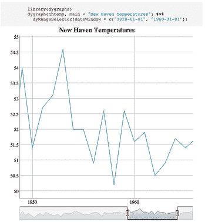
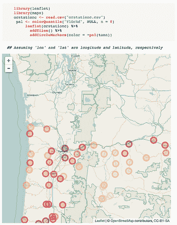

# 带有 knitr 和 htmlwidgets 的交互式仪表盘

> 原文：<https://www.dominodatalab.com/blog/interactive-dashboards-with-knitr-and-html-widgets>

## 介绍

R 的 htmlwidgets 是一个漂亮的 R 包，可以让你轻松地生成交互式可视化。已经有了用于交互式时间序列图、3D 图、地图和网络图的小部件。

对于那些不知道的人来说，Domino 是一个运行、共享和部署分析模型的平台(用 R、Python 或其他语言)。除此之外，Domino 允许您在功能强大的机器上运行代码，并将存储您的结果，以便您可以与其他人共享。

因为 Domino 将存储代码运行时生成的任何结果(图像、HTML 文件等)，并且 htmlwidgets 可以嵌入到 HTML 文件中，所以我们可以在 Domino 上运行 R 代码来生成完全托管的交互式仪表板，比如网络图或时序图。

这意味着您的仪表板现在可以直接由您的代码驱动，并且*计算和可视化在同一个地方发生。*

## 可视化计算结果而不是原始数据

随着公司将更复杂的数据科学用于内部分析，他们发现传统的商业智能工具不足以满足他们的可视化需求。这些传统工具是基于这样一个假设而设计的，即您希望可视化数据库中的*现有数据，而不是可视化来自模型*的*计算结果。Domino 通过将代码执行与结果可视化结合起来解决了这个问题。*

Domino 的可视化方法只是呈现代码生成的任何文件，无论是 png、pdf 还是整个 HTML 文件。这种灵活性使得从代码中生成丰富的可视化非常容易。对于下面的例子，我们简单地使用了`knitr`来编织一些利用了`htmlwidget`示例代码的 R 代码。Domino 中每次不同运行的结果都是不同的 HTML 文件，Domino 知道如何将其显示为交互式仪表板。

 

### 实施细节

我们只遇到了一个小问题。当您从交互式 R 会话中使用 htmlwidget 时，它将生成一个自包含的 HTML 页面，该页面包含呈现该 widget 所需的所有 JS 文件。但是当您编织一个呈现 htmlwidget 的 HTML 文件时，您必须在 HTML 中显式地包含支持的 JS/CSS 文件。例如，对于 dygraph 小部件“prettyprint lang-html ”,只需将`lib`目录及其内容包含在 Domino 项目文件夹中，一切都将完美运行。

## 结论

htmlwidgets 将是数据科学家武器库中的强大武器，尤其是在与非技术利益相关者共享工作时。将 htmlwidgets 与 knitr 和 [Domino](https://www.dominodatalab.com) 等工具相结合，您可以轻松地将您的 R 代码转换为托管的交互式仪表盘，并解决复杂的分析用例，这在使用简单的商业智能工具和技术时是不可能的。