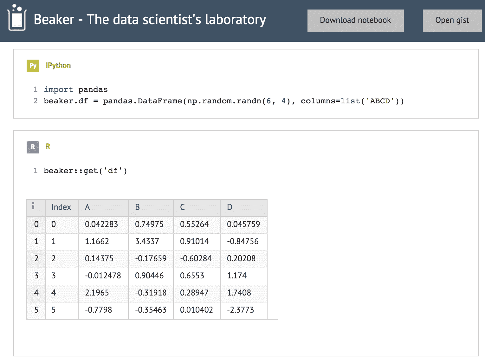
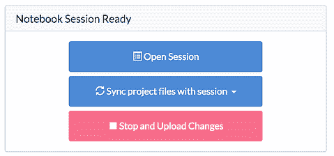
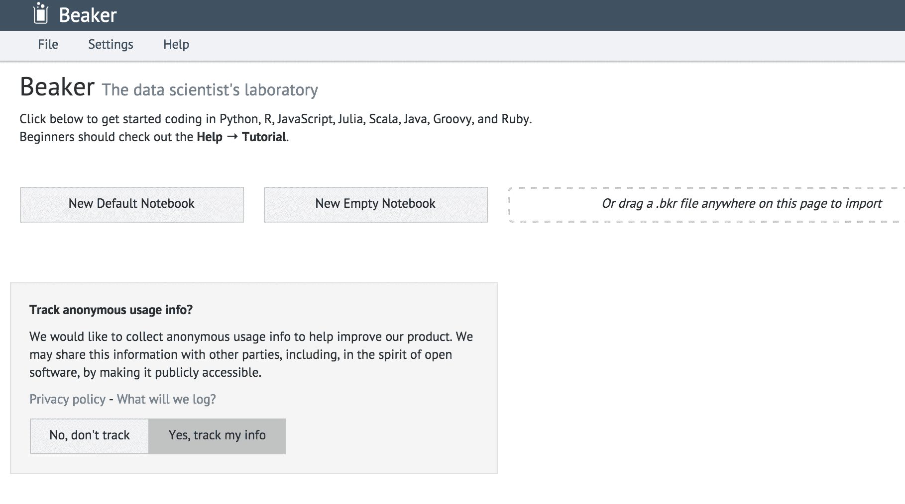
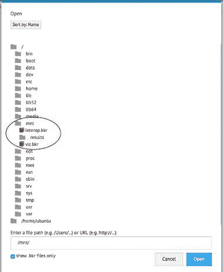
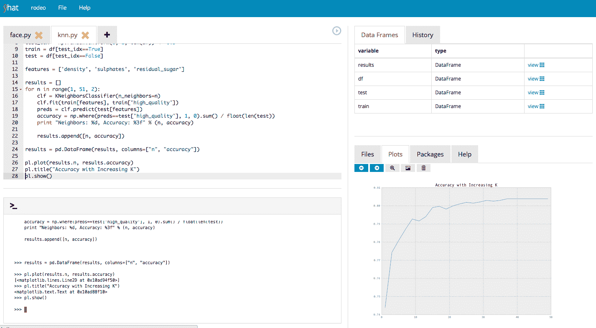

# 烧杯和竞技表演带来更好的交互式数据科学

> 原文：<https://www.dominodatalab.com/blog/interactive-data-science>

Domino 提供对 IPython/Jupyter 的支持已经有一段时间了，但是我们最近增加了对两个更新的、新兴的交互式数据科学工具的支持: [Beaker Notebooks](https://beakernotebook.com/) 和 [Rodeo](https://github.com/yhat/rodeo) 。这篇文章简要概述了每个工具，并描述了如何在 Domino 上使用它们。

## 触手可及的电动工具

Domino 背后的动机是让数据科学家专注于他们的分析，而不用担心基础设施和配置，从而提高他们的工作效率；通过在一个中心位置组织和跟踪工作，促进团队之间的协作和共享。

为此，Domino 现在允许您在大型机器上进行竞技或烧杯会话，并集中存储您的文件和笔记本，以便更容易跟踪、共享和评论它们。

## 烧杯

[Beaker Notebook](https://beakernotebook.com/) 是来自 [Two 适马开源](https://www.twosigma.com/)团队的笔记本应用，在某些方面类似于 Jupyter/IPython 笔记本。但是除了支持许多不同语言的内联代码、文档和可视化之外，Beaker 还允许你混合语言。没错:一个笔记本可以混合他们支持的任何语言的代码，Beaker 的灵活互操作功能可以无缝地在语言之间翻译数据。这甚至适用于数据帧和更复杂的类型。

在引擎盖下有很多东西在起作用——这是相当神奇的。

这使得 Beaker 成为那些相信“使用最佳工具完成工作”的人的终极武器:一个单一的分析工作流可以使用 Python 进行数据准备，使用 R 进行复杂的统计分析，使用 HTML 和 D3，或者使用 Latex 进行漂亮的可视化和演示。

Beaker 支持 R、Python、Julia、Scala、HTML、Javascript、NodeJS Latex、Java、Groovy、Clojure、Ruby 和 Kdb——尽管目前 Domino 对 Beaker 的支持只包括其中的一些。[想看别人就告诉我们](mailto:support@dominodatalab.com?utm_source=blog&utm_medium=post&utm_campaign=interactive-data-science)！

你可以在 SciPy 2015 上观看 Beaker 的一位创造者的视频。您还可以在 Domino 上自己使用 Beaker，而无需任何安装或设置。为此，您可以创建自己的项目。

1.  点击“运行”仪表板上的“笔记本”菜单，开始烧杯会话。

2\. When the server is ready, click the "Open session" button in the right pane.

3\. Create a new notebook, or import one of Beaker's examples, or use the file menu to browse to "/mnt" and choose one of the files in our project ( `viz.bkr` or `interop.bkr`)

 

项目中的`viz.bkr`笔记本展示了一个使用 Python 计算一个图形，然后用 HTML/D3/Javascript 在笔记本中可视化的例子。

`interop.viz`笔记本展示了 Beaker 在语言间翻译数据的灵活性的一些很好的例子。

## 竞技

Rodeo 是来自 [yHat](https://www.yhathq.com/) 的人们的开源 Python IDE。它回答了这样一个问题，“Python 有没有类似 RStudio 的东西？”

Rodeo 就是这样:它是一个用于编辑 Python 文件的基于 web 的 IDE，在一个界面中为您提供了代码编辑器、绘图查看器和文件浏览器。与为构建大型软件系统而设计的 Python 编辑器不同，Rodeo 是为用 Python 进行数据科学而定制的——尤其是通过其内置的绘图查看器。

你可以在我们的帮助网站上阅读更多关于我们对竞技表演的支持。