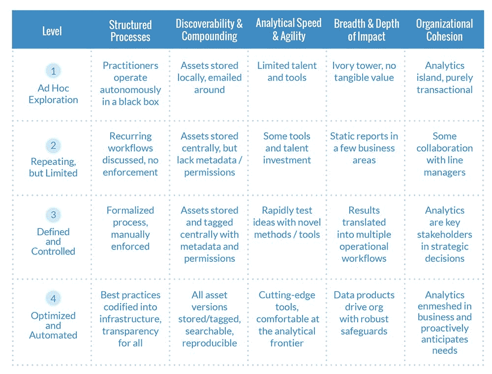

# 数据科学成熟度模型简介

> 原文：<https://www.dominodatalab.com/blog/introducing-the-data-science-maturity-model>

许多组织对他们在数据科学上的投资回报不感兴趣。这是由于狭隘地关注工具，而不是更广泛地考虑数据科学团队如何工作以及他们如何适应更大的组织。为了帮助数据科学从业者和领导者确定他们现有的差距并指导未来的投资，Domino 开发了一个名为[数据科学成熟度模型(DSMM)](https://www.dominodatalab.com/resources/data-science-maturity-model?utm_source=blog&utm_campaign=dsmm&utm_medium=referral&utm_content=dsmm-announcement-post) 的框架。

DSMM 评估数据科学团队为其组织创造价值的可靠性和可持续性。该模型包括四个成熟度级别，并分为适用于所有分析组织的五个维度。根据设计，该模型并不特定于任何给定的行业——它既适用于制造业中的数据科学，也适用于保险业中的数据科学。下面的矩阵显示了我们如何绘制 DSMM。

除了描述成熟度框架之外，本文还展示了这四个成熟度级别的团队案例研究，并为改进数据科学团队的功能提供了可行的建议。

重要的是要记住，成为一个成熟的数据科学组织没有现成的解决方案。任何提出这种解决方案的人都是幼稚或误导的。我们所观察到的在最高水平上运作的团队拥有远见卓识的拥护者，并在人员、流程和技术方面进行了多年的严格投资。此外，随着该领域的发展，满足于现有的成就是不够的。

技术降低了进入数据科学的成本和壁垒，消除了有远见的公司所依赖的护城河。未来，我们相信数据科学的竞争优势将来自过程和结构，而不仅仅是工具。从业者和管理者都应该考虑他们当前的策略是否正在朝着一个成熟的组织发展。

如果您对我们如何改进框架有任何反馈或建议，请不要犹豫[联系我们](https://www.dominodatalab.com/contact-us/?utm_source=blog&utm_medium=post&utm_campaign=introducing-the-data-science-maturity-model)。我们希望在第一稿的基础上进行迭代，并融入数据科学界的见解。

