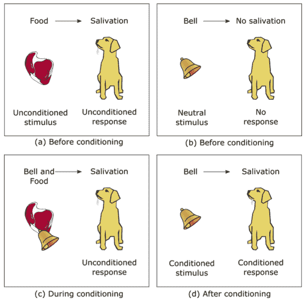
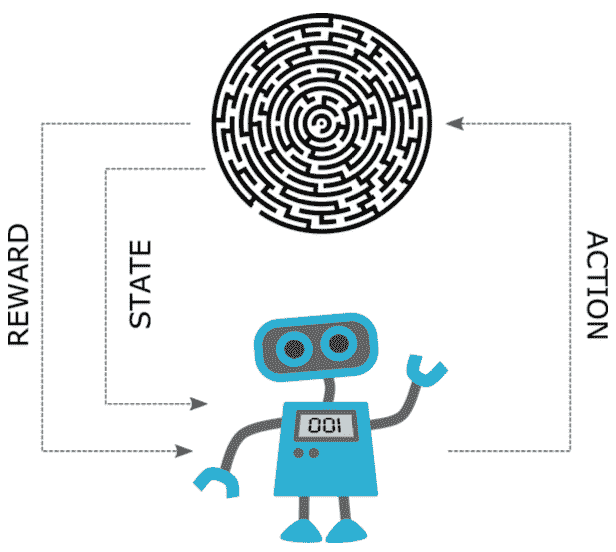

# 强化学习导论:基础与应用

> 原文：<https://www.dominodatalab.com/blog/introduction-to-reinforcement-learning-foundations>

## 介绍

当我们想到学习的时候，我们经常倾向于关注发生在童年和青春期的正规教育。我们通常认为课本、讲座、作业和考试是获取新知识、技能和理解过程的组成部分。然而，学习能力并不是人类独有的能力，当然也不局限于严格的学术环境或一个人生命中的某个时期。事实上，学习能力普遍存在于人类、动物甚至植物中(Karban，2015)，并且是一个持续发生的过程。另一方面，学习是一种假设的建构。正如 Gross (2010)指出的那样，“学习无法直接观察到，只能从可观察到的行为中推断出来。”

多年来，心理学家提出了几种不同的理论来解释学习过程是如何发生的。最早的学习理论之一是由俄罗斯生理学家伊凡·巴甫洛夫(1849-1936)在研究狗的消化系统时提出的。巴甫洛夫注意到，当狗看到负责喂养它们的技术人员时，它们会分泌唾液，但在它们看到任何真正的食物之前。在进行了一系列实验后，巴甫洛夫发现了一种被称为经典条件反射的基本行为机制。本质上，当受试者学会将先前的中性刺激(如铃声)与生物学上强有力的刺激(如食物)联系起来时，经典条件反射就发生了。图 1 概述了巴甫洛夫开发的方法，以证明一个强大的条件刺激可以用来产生一个自动的，生物内置的反应。

## 经典和操作条件反射——强化学习的基础

行为主义者 B. F .斯金纳的书《有机体的行为:实验分析》(斯金纳，1938)提出了一种不同类型的联想学习过程，称为操作性条件作用。在他的书中，斯金纳认为，由特定刺激引发的行为不能单独解释一切。相反，他研究了动物和人类如何与他们的环境互动，以及他们执行某些操作的后果如何驱动重复行为的可能性。斯金纳使用他创造的一种实验室设备进行了一系列实验，这种设备现在被称为操作性条件反射室。这个小室的设置使实验者能够研究动物对某些刺激的反应，如光或声音。它还为动物提供了采取特定行动的机制，例如通过按压杠杆，并且可以分发奖励(例如食物)或进行惩罚(例如电击)。这个房间通常用于老鼠或鸽子。重要的是要强调，使用操作性条件反射室进行实验与巴甫洛夫的经典条件反射实验有本质的不同。与自动和反射性发生的应答行为不同，操作性行为受主体的意识控制。操作性条件反射理论表明，某些类型的行为可以通过强化和惩罚来改变。强化可以是积极的，也可以是消极的，但它们总是以强化或增加未来行为的方式起作用。

图 1: 经典条件反射:(a)条件反射前，食物的存在自然会让狗狗流涎；(b)选择正常情况下不会产生唾液分泌反应的刺激(如铃声);(c)在调理过程中，看到食物的同时会发出铃声。重复这一过程，直到调节发生；(d)在条件反射之后，仅铃声就引发了流涎反应，现在称之为条件反射。

*   **积极强化**涉及愉快刺激的调用。例如，当老鼠按下控制杆时，它会得到一份奖励。这种奖励起到了积极强化的作用，促使老鼠更频繁地按压杠杆。
*   **消极强化**包括在表现出想要的行为后，消除不利的事件。例如，如果学生在课堂上达到了某个目标，老师可以取消那天晚上的作业。在这里，家庭作业起到了消极强化课堂作业行为的作用，因为学生们想消除晚上必须做家庭作业的不良刺激。

上面的例子表明，强化总是导致期望行为的增加(或强化)。在第一个例子中，老鼠被训练得更频繁地按下控制杆，在第二个例子中，学生被训练得在课堂上更加努力。另一方面，惩罚是为了削弱一种行为。它们也可以分为消极和积极两种，消极惩罚涉及取消一个有利的事件(如拿走孩子的玩具)，积极惩罚涉及引入一个不愉快的因素(如给没有按时交作业的学生分配额外的工作)。

## 什么是强化学习？

强化学习(RL)是机器学习的一个领域，涉及各种技术，使智能代理能够通过与其环境的交互来学习。这个过程很大程度上是基于试错法，代理人学习采取特定的行动，最大化与一些期望的行为相关的回报。

我们可以很容易地看到这种定义与在操作性条件反射室中进行实验的相似之处。房间里的动物(代理人)检查它的周围环境(感知它的环境)，激活离开者(采取行动)，并接受食物颗粒(奖励)。尽管与动物互动可能很有趣，或者很有挑战性，但当我们在机器学习的背景下谈论强化学习时，我们将把自己局限于程序形式的智能代理。这种程序的简单实现可以遵循如图 2 所示的基本交互循环。然而，我们需要小心，不要只从机器人或执行具有长期目标的复杂任务的系统的角度来考虑智能代理。一个智能的、自我学习的恒温器可以从它的环境中获得温度读数，采取行动调节加热，并根据实际温度和期望温度之间的差值获得奖励，这是智能代理的一个完美可行的例子。

图 2 :简单强化学习循环——代理读取环境的状态；代理基于当前状态采取行动；代理人收到报酬；环境现在进入了一个新的状态，并且该过程重复进行。

## 强化学习和机器学习

说到机器学习，我们还需要指定强化学习和其他已建立的训练方法(如监督和非监督学习)之间的差异。

*   在监督学习中，目标是学习从输入 x 到输出 y 的映射，给定一组标记的输入-输出对\(D = \{(x_i，y_i)\}_{i=1}^N\)(墨菲，2013)。使用监督学习学习的模型通常被称为预测模型，因为它们输出某些输入 x 的目标变量 y。这里的关键点是，标记数据的可用性是必要的-监督学习无法在没有标记数据的情况下学习输入-输出映射，标记数据通常是从人类专家或传感器收集的测量值中收集的。这种要求在强化学习中是不存在的；报酬足以让代理人了解自己的表现。从某种意义上说，代理通过与环境交互来生成自己的训练数据，因此它不需要专家训练器。
*   无监督学习的目标是在数据中找到“有趣的模式”(Murphy，2013)。在这种情况下，我们没有被提供预先分配的输出，也没有被告知什么是有趣的模式。因为这种模型不输出目标变量，所以它们通常被称为描述性模型。严格地说，这不是强化学习的目的——代理人的目标是最大化奖励信号，而不是明确地暴露其经验中的模式或描述现有的数据。

考虑到以上情况，我们可以清楚地看到为什么强化学习通常被认为是机器学习领域中的一个独立领域。是的，很像无监督学习，强化学习在训练期间不需要监督，但这是相似之处的终点。代理的最终目标是做出一系列决策，这些决策将导致在复杂且经常动态变化的环境中在不确定性下操作时实现某个目标。此外，代理使用一种“尝试结束错误”的方法，与监督学习相反，次优动作不会被显式纠正。

此外，强化学习具有更广泛的范围，并且不仅仅局限于机器学习领域。神经经济学跨学科领域的研究表明，大脑依赖无模型生物算法进行操作性学习(Montague et al .，2004)。无模型强化学习已被用于计算精神病学领域，用于诊断神经疾病(Maia & Frank，2011；Yechiam 等人，2005 年)。也有人提出，基于分层模型的机制可能在人类决策中发挥关键作用(Botvinick & Weinstein，2014)。强化学习在行为博弈论中被用作行为预测的建模框架(阿尔巴巴巴和伊尔迪兹，2021)。运筹学的目标是对信息随时间的不确定性进行建模，运筹学的问题可以利用强化学习技术，如马尔可夫决策过程。有专门的强化学习软件库解决运筹学问题(Hubbs 等人，2020)。此外，马尔可夫决策过程在最优控制理论中被大量使用，甚至来自强化学习的一些术语也在最优控制任务中被互换使用。强化学习还与动态规划、随机规划、模拟优化、随机搜索和最优停止密切相关(Powell，2012)。

## 强化学习的用例

来自不同领域的许多基本元素构成了强化学习理论的基础，这一事实导致了强化学习技术在现实世界中的广泛应用。以下是一些常见用例的非详尽列表。

*   强化学习可用于各种各样的物理系统和机器人控制任务(Kober 等人，2013 年)。
*   许多工业过程以自动化子系统为特征，这些子系统通常是基于强化学习的控制和优化的良好候选对象。有专门的强化学习算法用于产品制造优化，如 SMART (Mahadevan & Theocharous，1998 年)，并且已经表明，在化学反应优化等任务中，强化学习优于最先进的黑盒模型(Zhou 等人，2017 年)。
*   内容推荐是另一个具有挑战性的问题。已建立的模型倾向于主要关注对当前回报(即点击率)的建模，它们针对非常狭窄的目标(即点击/不点击)进行训练，最重要的是，它们的推荐受相似类型内容的吸引。另一方面，像(Zheng et al .，2018)这样的强化学习模型明确地对未来的回报进行建模，并且由于强化学习与生俱来的探索能力，可以发现新的和有吸引力的内容来保持用户的参与。
*   强化学习可以成功解决自然语言处理(NLP)中的问题，如文本摘要(Paulus 等人，2017)、机器翻译(Grissom II 等人，2014)和对话生成(Li 等人，2016)
*   强化学习在[时间序列分析](/blog/time-series-with-r)和建模交易游戏方面具有优势，因为在这样的背景下，采取高价值的行动通常取决于未来的行动和状态。对于使用传统监督学习方法的建模来说，这样的设置可能非常具有挑战性(高，2018)。
*   视频游戏是强化学习引起相当大关注的一个领域，主要是因为强化学习模型在大量游戏中一直取得了超人的表现(Shao et al .，2019)。

上面的列表绝不是详尽的，但它证明了使用强化学习可以解决的任务的广度。事实上，有无数的框架实现了不同数量的强化学习算法。值得一提的一些框架有[RL lib](https://docs.ray.io/en/latest/rllib/index.html)[多巴胺](https://github.com/google/dopamine)[tensor force](https://github.com/tensorforce/tensorforce)[Keras-RL](https://github.com/keras-rl/keras-rl)[稳定基线](https://github.com/hill-a/stable-baselines) 。

Domino Enterprise MLOps 平台的一个关键价值主张是，它通过自助式可伸缩计算和工具加速了研究。由于该平台提供了一种添加和更新库、工具和算法包的直接方式，所有前述框架，包括[【RLlib】](https://docs.ray.io/en/latest/rllib/index.html)，都可以轻松访问并用于解决强化学习任务，这有助于在多节点集群上进行 GPU 加速的模型训练。

### 进一步阅读和资源

*   阅读我们之前关于 [深度强化学习](/blog/deep-reinforcement-learning) 的帖子
*   [强化学习:萨顿和巴尔托的《T2》](http://incompleteideas.net/book/the-book.html)介绍被认为是强化学习的“圣经”，网上免费提供。

[RLlib](https://docs.ray.io/en/latest/rllib/index.html) 是一个用于强化学习的开源库，它原生支持 [TensorFlow](https://www.dominodatalab.com/data-science-dictionary/tensorflow) 、TensorFlow Eager 和 [PyTorch](https://www.dominodatalab.com/data-science-dictionary/pytorch) ，并被认为是可伸缩性最强的库之一，因为它由 [Ray](https://blog.dominodatalab.com/ray-tutorial-for-accessing-clusters) 支持。

### 参考文献

格罗斯河(2010 年)。心理学:精神和行为科学第 6 版(第 6 版。).泰勒和弗朗西斯。

卡尔班河(2015 年)。植物传感和通信。芝加哥大学出版社

斯金纳 B. F. (1938)。生物的行为:实验分析。阿普尔顿世纪克罗夫特。

墨菲，K. P. (2013 年)。机器学习:概率观点。麻省理工出版社。

Maia，T. V .，& Frank，M. J. (2011 年)。从强化学习模型到精神和神经疾病。自然神经科学，14(2)，154–162 页。

Montague，p .，Hyman，s .，和 Cohen，J. (2004 年)。多巴胺在行为控制中的计算角色。自然，431(7010)，760–767。[https://doi.org/10.1038/nature03015](https://doi.org/10.1038/nature03015)

Yechiam，e .，Busemeyer，J. R .，Stout，J. C .，& Bechara，A. (2005 年)。使用认知模型绘制神经心理障碍和人类决策缺陷之间的关系。心理科学，16(12)，973–978。

Botvinick 和 a . w Einstein(2014 年)。基于模型的分层强化学习和人体动作控制。英国皇家学会哲学汇刊 B:生物科学，369(1655)，20130480。[https://doi.org/10.1098/rstb.2013.0480](https://doi.org/10.1098/rstb.2013.0480)

阿尔巴巴，文学学士，纽约州伊尔迪兹市(2021 年)。通过深度强化学习和行为博弈理论的驾驶员建模。ArXiv，abs/2003.11071。

哈布斯、C. D .、佩雷斯、H. D .、萨瓦尔、o .、萨希尼迪斯、N. V .、格罗斯曼、即和瓦西克、J. M. (2020)。Or-gym:运筹学问题的强化学习库。

鲍威尔(2012 年)。技术报告:人工智能或控制理论:随机优化的罗塞塔石碑。技术报告(技术。代表)。普林斯顿大学。