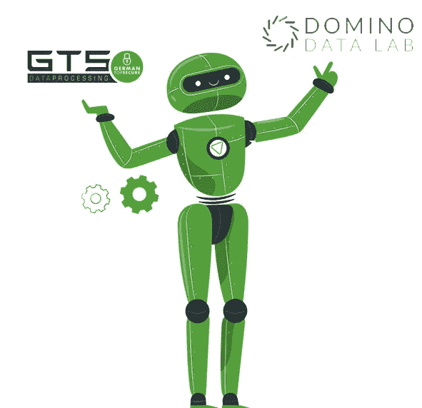

# 德国多云，有机会进行快速、高效和安全的数据科学

> 原文：<https://www.dominodatalab.com/blog/it-s-cloudy-in-germany-with-an-opportunity-for-fast-efficient-and-safe-data-science>

几年前，一位高管和我们分享了一个故事。他谈到他是如何通过装甲卡车将公司的数据从一个公司站点运输到另一个站点，以确保没有数据泄露。没有一种电子数据传输方式被认为是足够安全的。但或许更有趣的一点是，这种安全措施在德国是多么普遍。

作为德国数据云公司 [GTS](https://dsready.cloud/) 的创始人和产品管理负责人，我们不能不把安全性放在首位。随着人工智能的日益普及，我们听到了许多关于 MLOps 生命周期中数据保护和基础设施安全的担忧，特别是当云数据中心位于其他国家和大陆时。

这也是我们推出位于德国数据中心的[GTS d ready 云](https://dsready.cloud/)的原因之一。通过在国内达到严格的标准，我们可以满足德国尚未满足的对安全云服务的需求，并在欧洲内外建立信任。

我们的 DSready 云平台汇集了云中的工具、技术、计算和协作功能，以解决组织在大规模部署数据科学功能时必须跨越的许多障碍。我们已经捆绑了 Domino Data Lab 的企业 MLOps 平台作为 DSready 云的核心组件，帮助客户加快[模型速度](/blog/model-velocity)，并将创新的人工智能驱动的产品和应用更快地推向市场。

## 为什么是多米诺？

在选择 Domino 作为 DSready 的基础之前，我们考察了许多数据科学平台——kube flow、H20.ai、Anaconda 和 Dataiku。其他工具都无法与 Domino 的企业功能、易用性以及更重要的安全性相媲美。

除了仅使用德国数据中心作为我们的硬件，DSready 还解决了企业难以应对的云安全的三个关键领域:**数据所有权**、**服务器安全性**和**加密**。借助 DSready 云和 Domino:

*   公司保留对其数据的完全控制权。许多云解决方案需要客户将数据存储在云中的本地驱动器上，这实质上是将数据控制权交给了云提供商。但像德国或瑞士这样的国家对他们的数据非常保护，不能使用这样的服务。使用 Domino 中的 S3 连接特性，我们能够在不拥有数据所有权的情况下将他们的 S3 存储桶与我们的系统连接起来。他们可以使用我们的基础设施。他们可以使用我们的机器。他们可以使用 Domino 环境。数据从他们的数据中心传输到我们的数据中心，然后再传输回来，但它从未真正存储在我们的计算节点中。这是 Domino 带来的巨大优势。
*   **公司获得最高级别的访问保护。** Domino 的认证服务提供了两个至关重要的功能。首先，其 Keycloak 集成使公司能够建立一系列安全标准，必须满足这些标准才能访问平台。此功能允许组织对其身份验证和授权进行精细控制，以满足最严格的密码、多因素身份验证等要求。如果没有这种级别的安全性，许多组织将不会放心使用基于云的平台。第二个是 SSL/TLS 连接，这当然很常见，但是在这个例子中，Domino 将它带到了一个更深的层次。有了 Domino，公司可以通过 mutual TLS 保护 Kubernetes 集群内的互连，这样，即使是我们这些在 GTS 对 Kubernetes 集群拥有管理权限的人也无法在我们的系统内查看数据流量或他们的 Domino 平台而不被检测到。这是我们从其他数据科学平台提供商那里没有看到的功能，从我们的角度来看，它有助于使平台更加完整。最重要的是，我们将 Domino 的日志记录和监控功能集成到我们的内部云监控系统中，并向客户提供报告来验证这些安全机制是否有效。
*   **公司获得超强加密。**在 Domino 中，数据在“静态”时、在用户机器之间传输时以及在 Domino 平台的所有部分之间都使用行业标准加密技术进行加密。我们还通过几层加密来保护我们的服务器，其中一些加密层使用 4000 位密钥。许多人可能认为 4000 位的密钥有点过分。但是任何了解我们的人都知道我们对加密有点着迷，我们认为向我们的客户表明我们认真对待他们数据的安全性是很重要的。

Domino 的企业级安全性是我们喜欢 Domino 平台的众多原因之一(在这里我们不会轻易使用“爱”这个词)。Domino 不仅像我们一样痴迷于安全性，他们也像我们一样痴迷于帮助公司解决他们的数据科学挑战。Domino 在平台的前端和后端都投入了大量的精力，前者让团队使用起来更容易、更直观，后者提供了数据科学家、it 和业务用户加速模型开发和部署所需的全套功能。不管我们在 DSready 生态系统中添加了什么工具和功能，我们都知道我们有一个安全、健壮的 Domino 平台供团队工作，这样他们就可以将时间花在解决业务挑战上，而不是克服技术挑战上。

#### 了解更多信息

*   收听网络研讨会:[安全云中的下一代数据科学](https://dsready.cloud/webinar-next-generation-datascience-in-a-secure-cloud/)。
*   要了解更多关于 Domino 企业级安全性的信息，请阅读博客" [Domino 4.3 反映了我们对企业级安全性的专注。](https://www.dominodatalab.com/blog/domino-4-3-reflects-our-dedication-to-enterprise-grade-security/)
*   要了解更多关于 GTS DSready 云的信息，请访问: [dsready.cloud](https://dsready.cloud/)