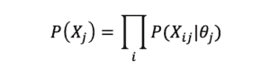
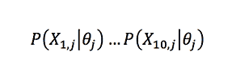
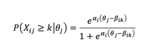
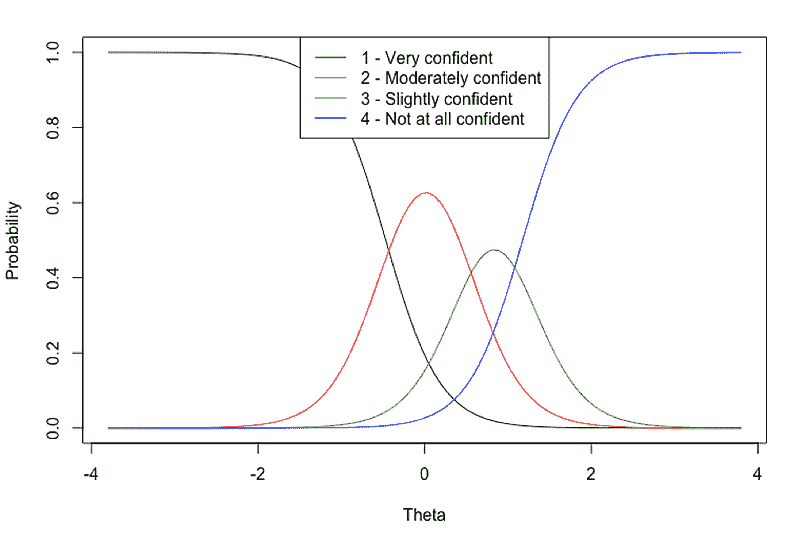
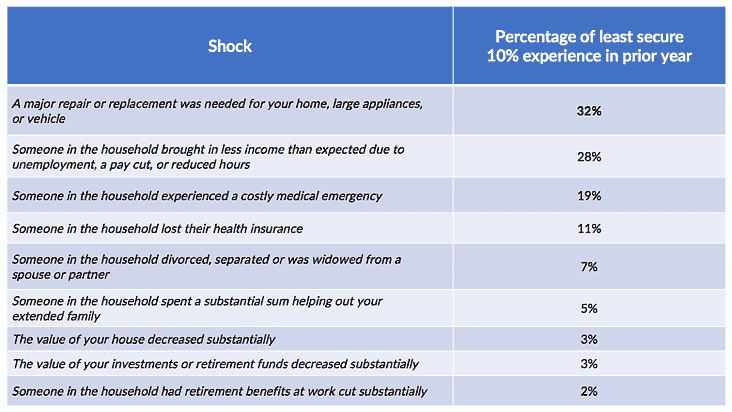
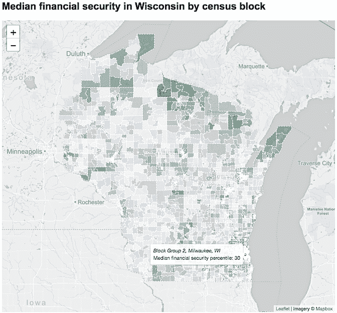

# 用于调查分析 R 中的项目反应理论

> 原文：<https://www.dominodatalab.com/blog/item-response-theory-r-survey-analysis>

在这篇客座博文中，Derrick Higgins 介绍了项目反应理论(IRT)以及数据科学家如何在项目中应用该理论(T2)。作为对客座博文的补充，Domino 中还有一个演示。

## 介绍

我在美国家庭保险公司(American Family Insurance)领导一个数据科学团队，最近有机会在一个有点新奇的环境中使用心理测量学的工具——项目反应理论(IRT)。许多数据科学家听说过 IRT 工具，但没有太多实际经验，所以我认为分享我在这个项目上的经验是值得的。

## 美国家庭对威斯康星州金融不安全感的调查

美国家庭保险，总部设在威斯康星州麦迪逊，是负债和参与我们的当地社区。我们渴望通过慈善捐赠和针对贫困地区的特殊项目成为社区的积极力量。最近，我被要求领导一个项目，应用我们的数据科学能力来促进对我们家乡金融不安全的驱动因素的理解。

我的团队与主题专家合作开发了一项调查，包括 72 个问题，涉及财务健康、人口统计、就业、住房、交通、心理健康、社会支持和其他主题。我们在 2017 年秋季对整个州的威斯康星州居民进行了调查。我想在这里把重点放在方法论上，但是你可以在下面提供的链接中阅读更多关于整个项目和我们的发现。

## 项目反应理论

在我们的调查中，我们想看的一件事是相对舒适的参与者和高度财务不安全的参与者之间的反应有什么不同。这意味着我们需要一个单一的措施来衡量所有受访者的不安全感。虽然我们的调查包括许多财务指标，如收入、房屋所有权和收入波动性，但根据单一的不安全感综合指标对参与者进行排名，或将他们分组进行分析，这并不是一件小事。

项目反应理论为这类问题提供了一个完美的解决方案，在这种情况下，我们需要将大量关于个人的离散观察(在这种情况下，是调查反应)整合到一个单一的整体量表中。IRT 是心理测量学(许多成就测试背后的应用心理学)中常用的一系列潜在变量模型，因此使用它来汇总与财务不安全相关的调查回答是一种有点新颖的应用。

IRT 模型是生成模型，其中每个调查或测试响应χ *[ij]* 的概率有条件地基于相关个体 *j* 的*θ[j]的潜在特征分数建模，并且每个响应的概率有条件地独立于给定潜在特征*θ[j]的其他响应:**



。所以在一个十项测试中，一个给定的候选人 *j* 产生一个给定的反应向量χ *[j]* 的概率简单地通过乘以十个单独的反应概率得到

对于那个能力等级的候选者来说*θ[j]。*

许多 IRT 模型类型限于二分项目类型，其中 X 只能取二进制值(例如，*正确*或*不正确*)。因为我们为财务不安全感量表选择的调查项目是有序的类别(如*非常有信心/中度有信心/稍微有信心/完全没有信心*)，所以我们使用了更一般的分级响应模型，其中属于类别 k 或以上的响应的累积概率被建模为

。拟合模型包括将模型参数(特质分数 *θ* ，辨别参数 *α* 和难度参数 *β* )设置为它们的最大似然估计，并且对新个体的调查响应进行推断包括在给定其他参数和χ *[j]* 的情况下找到 *θ[j]* 的 MLE。

为了创建我们的财务不安全感量表，我们选择了 17 个(原始的或改造过的)我们认为符合这一概念的调查问题。这些问题涉及收入、债务、失业、房屋所有权、银行准入和实际金融挑战等领域。(一些项目进行了反向编码，以便与比例尺正确对齐。比如，收入与财务不安全感负相关，而收入可变性与之正相关。)

## 估计 IRT 参数

一旦我们收集了调查数据，使用 R:

```py
library(ltm)
library(feather)

# We use the feather format to store survey data for cross-language
# compatibility.  It preserves ordered factors, which we need for our IRT model.
RawSurvey <- read_feather("financial_insecurity_wi_irt.feather")

# Remove ID column before scale construction
Survey <- subset(RawSurvey, select=-c(id))

# Fit graded response model
GrmModel = grm(Survey)

# Test goodness of fit (following standard cutoff of 3.5 for residuals)
margins(GrmModel, rule=3.5)

# Output model details
GrmModel$coefficients
print(paste("Model log likelihood:", GrmModel$log.Lik))

# Plot item characteristic curves
plot(GrmModel, xlab="Theta", cex.main=0.85)

# Get theta (IRT estimate of financial insecurity)
# for every possible response pattern
GrmScores <- factor.scores(GrmModel)
print(GrmScores)

# Get thetas for each actual survey respondent
ThetaTable <- factor.scores(GrmModel, resp.patterns = data.frame(lapply(Survey, as.numeric)))[["score.dat"]]
ThetaTable[["id"]] <- RawSurvey[["id"]]
```

实际上，这一过程更具迭代性，因为如果存在不匹配的问题，表明这些项目可能无法衡量感兴趣的概念，我们可能必须从我们的量表中删除这些项目。一旦我们对规模感到满意，我们就可以为整个调查对象群体保存财务安全级别(theta 估计值)。这段代码还创建了一些工件，让我们能够深入了解单个项目是如何对规模产生影响的。例如，下面的项目特征曲线显示了与问题*的不同回答相关联的概率，“您有多大信心认为您的家庭正在采取必要的措施来确保您将有足够的钱来实现您的长期财务目标？”。*表示“非常自信”的受访者很可能具有较低的θ得分(因此具有较高的财务不安全感)，而那些表示“稍微自信”的受访者的θ分布处于中上范围(高于平均不安全感)。



## 金融不安全感量表

鉴于这种程度的金融不安全，我的团队不仅能够总结威斯康星州居民的特定人口统计群体对我们的调查的反应(例如，城市男性与农村男性)，还能够观察在整个安全等级的范围内反应如何变化。特别是，我们选择了总体财务安全最差的 10%威斯康星州居民进行深入分析。(这个 10%的数字大致与整个州的联邦成人贫困率一致。)

例如，我们能够深入调查数据，以确定最脆弱的威斯康星州居民在过去一年中遭遇特定类型金融冲击的频率:

也许令人惊讶的是，最常见的财务中断不是医疗或就业相关问题，而是受访者财产的意外必要维修。这种洞察力可以帮助组织定制支持计划，以应对经济不安全家庭最常见和最关键的需求。

我们还能够建立一个预测模型，将在调查人群中构建的财务不安全等级转化为整个威斯康星州。([详见我们的白皮书](http://insecurity-survey-wi.amfamlabs.com/Financial_Insecurity_WI.pdf)。)这种衍生量表使我们能够对威斯康辛州金融不安全的地理和人口轮廓进行更精细的分析，而使用其他高水平的数据集是不可能的。例如，下面的互动地图截图显示了该州 2268 个人口普查区块组中每个区块组的中值金融不安全水平，每个区块组约有 600-3000 名居民。财务安全性较低的区域显示为紫色，而财务安全性较高的区域显示为绿色。



## 结论

我希望你喜欢这个关于美国家庭在分析威斯康辛州金融不安全方面所做工作的简要概述，我也希望你能考虑在你自己的一些数据科学项目中使用项目反应理论。当您的数据包含许多噪声变量，并且您事先知道它们都与一个单一的潜在特征相关(以及它们是正相关还是负相关)时，这是一个强大的工具。虽然测试是最常见的用例，但我希望我已经展示了它也可以应用于调查数据，也许您在自己的工作中有一些更有创造性的应用！

如需了解有关威斯康辛州金融不安全项目的更多信息，我建议您访问我们的网站，在那里您可以访问白皮书、一些交互式可视化内容，甚至原始调查数据本身。该项目的登陆页面是[这里](http://insecurity-survey-wi.amfamlabs.com/)。