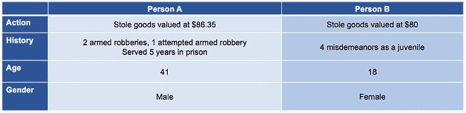

# 合理的算法宽恕？

> 原文：<https://www.dominodatalab.com/blog/justified-algorithmic-forgiveness>

*上周，[帕科·内森引用了](https://blog.dominodatalab.com/themes-and-conferences-per-pacoid-episode-2/) [朱莉娅·安格温最近的 Strata 主题演讲](https://www.oreilly.com/ideas/quantifying-forgiveness)，其中涵盖了算法偏差。这篇 Domino 数据科学领域的笔记更深入地研究了一些关于算法问责和宽恕的公开研究，特别是围绕一个专有的黑盒模型，该模型用于预测[累犯](https://www.merriam-webster.com/dictionary/recidivism)的风险，或者某人是否会“重新陷入犯罪行为”。*

## 介绍

[模型是数据科学](https://blog.dominodatalab.com/model-management-era-model-driven-business/)和成功的模型驱动型企业的核心。作为模型的构建者和管理者，数据科学家经常处于关于适当的度量、准确性和潜在偏差的公共辩论的前沿，因为这些方面直接影响模型的开发、部署和评估方式。这种对彼此工作的公开辩论和重复继续推动数据科学领域的所有人进行严格的分析并不断改进。这篇文章提供了关于围绕算法问责、宽恕和偏见的现有辩论和研究的额外背景，上周 [Paco Nathan 报道了这些。](https://blog.dominodatalab.com/themes-and-conferences-per-pacoid-episode-2/)

## 识别算法宽恕

在过去的几年里，Julia Angwin 放大了 ProPublica 关于 COMPAS(矫正罪犯管理和描述替代制裁)中的偏见的调查结果，COMPAS 是一种预测累犯风险的专有商业算法。虽然 [Paco Nathan 在 9 月](https://blog.dominodatalab.com/themes-and-conferences-per-pacoid-episode-2/)引用了 Angwin 的以算法偏差为导向的 Strata 主题演讲，但在本文发表时，整个主题演讲尚未公开。

然而，类似的发现出现在麻省理工学院媒体实验室 2018 年 3 月公开发表的“[量化宽恕:与朱莉娅·安格温和伊藤的对话”以及本文引用的其他研究中。在研究和谈话中，安格温提出了一些问题，以揭示黑盒模型中的机器学习(ML)偏差，“谁可能被归类为累犯风险较低？”、“谁更容易被原谅？”，以及审查 ML 结果。安格温和](https://www.youtube.com/watch?v=qjmkTGfu9Lk) [ProPublica 在 2016 年的几项重要发现](https://www.propublica.org/article/how-we-analyzed-the-compas-recidivism-algorithm)包括

*   “黑人被告经常被预测比他们实际上有更高的再犯风险。我们的分析发现，与白人被告相比，两年内没有再犯的黑人被告被误判为高风险的可能性几乎是白人被告的两倍(45%比 23%)。
*   “白人被告通常被认为没有他们那么危险。我们的分析发现，在接下来的两年内再次犯罪的白人被告被错误地标记为低风险的几率几乎是黑人再次犯罪的两倍(48%对 28%)。

这些发现表明，白人被告更有可能成为算法宽恕的接受者。然而，这些发现也引发了关于 T2 在分析数据时应该考虑哪些指标的讨论。需要比迄今为止提供的更深入的关于识别算法宽恕的见解的数据科学家可能会考虑观看[麻省理工学院媒体实验室 MLTalk](https://www.youtube.com/watch?v=qjmkTGfu9Lk) 的视频剪辑(根据[知识共享署名许可](https://creativecommons.org/licenses/by-nc/4.0/)进行了改编和重用)，

https://dominodatalab.wistia.com/medias/hswxg6kalp?embedType=async&videoFoam=true&videoWidth=640

阅读“[我们如何分析 COMPAS 累犯算法](https://www.propublica.org/article/how-we-analyzed-the-compas-recidivism-algorithm)”以及[下载数据](https://github.com/propublica/compas-analysis)。安格温被列为这项研究的合著者。

## 算法问责:需要考虑哪些措施？

2016 年，ProPublica 的 Angwin 等人主张关注假阳性和假阴性的错误率。COMPAS 的所有者 north pointe[反驳了](https://www.documentcloud.org/documents/2998391-ProPublica-Commentary-Final-070616.html),因为它关注的是该程序是否准确地预测了累犯。然后，[的一群学者在华盛顿邮报](https://www.washingtonpost.com/news/monkey-cage/wp/2016/10/17/can-an-algorithm-be-racist-our-analysis-is-more-cautious-than-propublicas)上争辩说，正在考虑的措施真的是“公平”的

Northpointe 拒绝披露其专有算法的细节，因此无法全面评估这种不公平的程度，不管这种不公平是多么的无意。这是可以理解的:Northpointe 需要保护自己的底线。但这引发了依赖盈利性公司开发风险评估工具的问题。”

然而，讨论、辩论和分析并没有在 2016 年结束。2018 年， [Ed Yong 报道了来自达特茅斯学院的朱莉娅·德雷塞尔和哈尼·法里德关于“COMPAS 在预测个人再犯风险方面并不比从互联网上招募的随机志愿者更好”的研究 Yong 指出，Dressel 还确定了另一项需要考虑的措施:](https://www.theatlantic.com/technology/archive/2018/01/equivant-compas-algorithm/550646/)

她意识到这掩盖了一个不同的问题。她说，对话中有一个潜在的假设，即算法的预测天生就比人类的预测好，但我找不到任何证明这一点的研究。所以她和法里德做了他们自己的。"

在研究和论文中，Dressel 和 Farid 指出

当关于算法公平性的争论还在继续的时候，我们考虑一个更基本的问题，即这些算法是否比未经训练的人类更好地以公平和准确的方式预测累犯。我们描述了一项研究的结果，该研究表明，来自一个受欢迎的在线众包市场的人——可以合理地假设，他们在刑事司法方面几乎没有专业知识——在预测累犯方面与 COMPAS 一样准确和公平。….我们还表明，尽管 COMPAS 可以使用多达 137 个特征来进行预测，但仅使用两个特征就可以达到相同的预测精度，并且更复杂的分类器不会提高预测精度或公平性。总的来说，这些结果对算法累犯预测的整体努力提出了重大质疑。”

## 真实世界中的机器学习模型含义

虽然关于选择合适的方法来评估模型的争论是重要的，但是一旦“模型在野外”了，评估现实世界的影响也是重要的。数据科学家熟悉“在野外”表现不同的模型，以及他们的模型被用于特定的用例，而这些用例不是他们最初开发的。例如，COMPAS 的创始人之一 Tim Brennan，[最初并没有设计 COMPAS 用于判决](https://www.propublica.org/article/machine-bias-risk-assessments-in-criminal-sentencing)。然而，COMPAS 已经被[援引用于判决](http://www.scotusblog.com/wp-content/uploads/2017/02/16-6387-op-bel-wis.pdf)。

## 判决

2013 年，斯科特·霍恩法官在考虑对埃里克·卢米斯进行适当量刑和缓刑时引用了孔波司。卢米斯提出上诉，理由是使用专有算法违反了正当程序。威斯康辛州最高法院驳回了上诉，以下摘录摘自威斯康辛州诉埃里克·卢米斯

*"18 在判决时，州认为巡回法院在确定适当的刑期时应使用 COMPAS 的报告:*

此外，本案中完成的 COMPAS 报告确实显示了被告的高风险和高需求。暴力风险高，再犯风险高，审前风险高；所以所有这些都是决定量刑的因素。

*19 最终，巡回法院参考了 COMPAS 风险评分和其他判决因素，排除了缓刑:*

通过 COMPAS 评估，您被认定为对社区具有高风险的个人。

在权衡各种因素的基础上，我排除了缓刑，因为罪行的严重性，因为你的历史，你的监管历史，以及已经使用的风险评估工具，表明你再次犯罪的风险极高。"

## 谁更容易被原谅？

ProPublica [强调了一个对比例子](https://www.propublica.org/article/machine-bias-risk-assessments-in-criminal-sentencing)，两个人因小偷小摸被捕，作为偏见的证据。虽然以下是有限的细节，你认为哪个人会有更高的累犯分数？

**

如果加上年龄和性别属性，你会改变你的评估吗？

下表包括种族属性和分配的风险评估分数。

根据 COMPAS 预测风险评估模型，B 人再犯的可能性较高。作为 ProPublica 研究的一部分，研究人员在分类两年后审查了数据，以评估结果是否与预测相符。分类两年后， [ProPublica 指出](https://www.propublica.org/article/machine-bias-risk-assessments-in-criminal-sentencing)

“我们知道计算机算法得到了完全相反的结果。博登[B 人]没有被指控任何新的罪行。prater(A 人)因随后闯入一个仓库并窃取了价值数千美元的电子产品，正在服刑八年。"

人 B 是假阳性。人 A 是假阴性。或者，人 A 比人 b 更有可能被算法原谅。在[麻省理工学院媒体实验室 MLTalk](https://www.youtube.com/watch?v=qjmkTGfu9Lk) 的剪辑中提供了额外的细微差别，并根据[知识共享署名许可](https://creativecommons.org/licenses/by-nc/4.0/)进行了重用，

https://dominodatalab.wistia.com/medias/mi5p4pboae?embedType=async&videoFoam=true&videoWidth=640

当被问及在麻省理工学院媒体实验室 ML Talk 上分析[数据集](https://github.com/propublica/compas-analysis)时要考虑的各种措施时，[安格温指出](https://www.youtube.com/watch?v=qjmkTGfu9Lk)

这是一个语义上的争论。我们指出，他们选择了一个对错误率有不同影响的公平定义，他们说，“嗯，这不是一件公平的事情，因为如果你改变错误率，你会改变预测准确性的公平优化。“，但我觉得在刑事司法的背景下，当正当程序的整个要点实际上是默认无罪时，你完全可以接受假阳性。”

## 结论

模型是最成功企业的核心。当数据科学家制作模型时，他们解决了许多涉及多个学科的技术和非技术挑战。应对涉及多个方面的挑战，包括人员、流程和技术，需要深入数据杂草并摆脱数据杂草的能力，以实现更广泛的影响。现代数据科学家在开发、部署和评估模型时面临的一些挑战包括[识别算法偏差](https://www.youtube.com/watch?v=qjmkTGfu9Lk)、[决定是否信任他们的模型](https://blog.dominodatalab.com/trust-in-lime-local-interpretable-model-agnostic-explanations/)，考虑模型准确性与模型可解释性之间的[权衡](https://blog.dominodatalab.com/make-machine-learning-interpretability-rigorous/)、[再现性](https://blog.dominodatalab.com/machine-learning-reproducibility-crisis/)，以及[偏差的真实世界影响](https://blog.dominodatalab.com/ingesting-kate-crawfords-trouble-with-bias/)。这篇博文关注的是研究、见解以及在开发预测性风险评估模型时需要考虑的影响。如果您对其他资源感兴趣，以下是这篇文章的参考资料:

### 公共研究

*   [数据](https://github.com/propublica/compas-analysis)
*   安格温，朱莉娅。"[让算法变得可靠](https://www.propublica.org/article/making-algorithms-accountable)"。ProPublica，2016 年 8 月。
*   安格温，朱莉娅和拉森，杰夫。研究人员称，犯罪风险分数的偏差在数学上是不可避免的。ProPublica，2016 年 12 月。
*   Angwin，Julia 等.[机器偏差](https://www.propublica.org/article/machine-bias-risk-assessments-in-criminal-sentencing)。ProPublica，2016 年 5 月。
*   Larson，Jeff 等人，“[我们如何分析 COMPAS 累犯算法](https://www.propublica.org/article/how-we-analyzed-the-compas-recidivism-algorithm)”。ProPublica，2016 年 5 月。

### 会谈

*   安格温，朱莉娅。[量化原谅](https://www.youtube.com/watch?v=SQ2ku_7dulo)。奥莱利媒体，2018 年 9 月。注意:整个视频都在一个付费的门后面。
*   安格温，朱莉娅。“[什么算法教会了我宽恕](http://opentranscripts.org/transcript/what-algorithms-taught-me-about-forgiveness/)”。MozFest 2017。公开成绩单，2017 年 10 月。
*   安格温，朱莉娅和伊藤，约伊。量化宽恕:曼梯·里与朱莉娅·安格温和伊藤约伊的谈话。麻省理工学院媒体实验室，2018 年 3 月。

### 文章、论文和案例

*   一个用于保释和判决的计算机程序被贴上了歧视黑人的标签。其实也没那么清楚。《华盛顿邮报》，2016 年 10 月。
*   Dieterich，William 等人。 [COMPAS 风险等级:证明准确性、公平性和预测性的均等性](https://www.documentcloud.org/documents/2998391-ProPublica-Commentary-Final-070616.html)。NorthPointe Inc 研究部，2016 年 7 月。
*   假阳性、假阴性和假分析:对“机器偏见:全国各地都有用来预测未来罪犯的软件”的回应。而且对黑人有偏见。“2017。
*   监督学习中的机会均等。2016.
*   斯皮尔卡姆，马提亚斯。“检查算法的偏差”。麻省理工科技评论，2017 年 6 月。
*   威斯康星州诉埃里克·卢米斯案。美国威斯康星州最高法院。2016.案件编号:2015AP157-CR。
*   永，编辑。一个流行的算法在预测犯罪方面并不比随机选择的人更好。《大西洋》，2018 年 1 月。

*^(Domino 数据科学领域笔记提供数据科学研究、趋势、技术等亮点，支持数据科学家和数据科学领导者加快工作或职业发展。如果你对本博客系列中涉及的数据科学工作感兴趣，请给我们发电子邮件至 writeforus@dominodatalab.com。)*