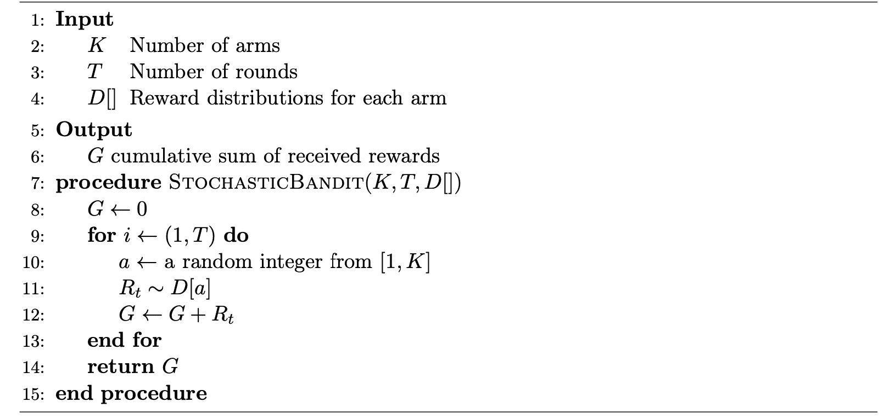
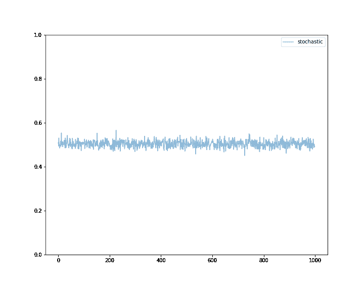

# 强化学习:K 臂强盗问题

> 原文：<https://www.dominodatalab.com/blog/k-armed-bandit-problem>

在之前的 [博文](https://blog.dominodatalab.com/introduction-to-reinforcement-learning-foundations) 中，我们谈到了强化学习的基础。我们讨论了经典和操作性条件反射、奖励、状态和动作，并回顾了一些常见的强化学习用例。这篇文章是这个系列的续篇。在这篇文章中，我们提出了 k 臂强盗问题——一个非常简单的设置，它使我们能够介绍强化学习的一些关键组件之间的相互作用。

## K 臂土匪问题是什么？

K 臂土匪(也称为多臂土匪问题)是一个简单的，但强大的例子，随着时间的推移，在不确定的情况下分配有限的资源。Thompson (1933)首先对其进行了研究，他提出了一种解决勘探开发困境的启发式方法。这个问题在计算机科学、运筹学、概率论和经济学领域也有研究，并且非常适合用强化学习的工具来探索。

在其基本形式中，该问题考虑一个赌徒站在一排 K 吃角子老虎机(也称为独臂土匪)前，试图构思一个策略，玩哪台机器，玩多少次，以及何时换机，以增加获利的机会。这个前提的有趣之处在于，每一个强盗都根据概率分布来分配奖励，这个概率分布对于强盗来说是特定的，而对于赌徒来说是未知的。因此，最优策略将包括在学习更多关于个体概率分布的知识(探索)和基于目前获得的信息最大化利润(利用)之间取得平衡。

## 形式化 K 臂强盗问题

现在让我们将 k 臂土匪问题形式化，这样我们就可以用它来介绍一些强化学习中使用的工具和技术。假设我们在玩\(K \in \mathbb{N}\)强盗游戏，每场游戏由\(T \in \mathbb{N}\)回合组成。设\(\mathcal{A}\)是游戏中所有可能动作的集合。由于有\(K\)个臂可供选择，显然\(|\mathcal{A}| = K\)。我们还将使用\(A_{t}\)来表示在时间\(t \in [1，T]\)采取的来自\(\mathcal{A}\)的动作。请注意，我们使用的时间这个术语是离散的，可以和话轮互换。

每个土匪按照一个对应的未知分布分配奖励，这个未知分布叫做奖励分布，每个行动的奖励是独立同分布的(IID)。这个设定的正式目标是在
游戏过程中最大化总奖励。现在让我们来看一个例子，它将帮助我们发展一种直觉，了解强化学习如何处理 k 臂土匪问题。
我们首先探索问题的一个变体，其中每个强盗根据从\(\mathcal{D} = \{\mathcal{D}_1，\mathcal{D}_2，\dots，\mathcal{D}_K\})分配的伯努利分布分配奖励。换句话说，每个臂的回报是 in \(\{0，1\}\)，并且由下面的概率质量函数给出

$ $ \ begin { equation * } f(n；p _ K)= \ left \ { \ begin { array } { cc } p _ K & \ text { } \ mathrm { if \ } n = 1 \ \ 1-p _ K & \ text { } \ mathrm { if \ } n = 0 \ \ \ end { array }，k \in \{1，2，\dots，K\} \right。\end{equation*} $$

其中每个 bandit 都有一个固定的初始未知参数\(p_k\)。这种类型的强盗通常被称为伯努利强盗。请记住，我们选择发行版类型是为了方便起见，除非另有说明，否则我们将涉及的分析和策略并不局限于特定的发行版。
注意，每个奖励分配是固定的，因为参数在\(T\)轮游戏中保持不变。每回合(t \in [1，T]\)玩家通过选择并拉动第(k\)只手来执行一个动作(A_t\ ),产生一个奖励

$ $ \ begin { equation } R _ t \ sim \ mathcal { D } _ k \ end { equation } $ $

arm \(k\)的平均报酬则由\(\mathcal{D}_k\)的期望值给出

$ $ \ begin { equation } \ mu(k)= \ mathbb { E }[\ mathcal { D } _ k]\ end { equation } $ $

很明显，选择期望值较高的分布的操作应该是首选的。为了能够量化可能行动的价值，我们可以定义一个行动价值函数\(q(\cdot)\，它返回关于任意行动的预期回报\(a\):

$ $ \ begin { equation } q(A)= \ mathbb { E }[R _ t | A _ t = A]，a \in A \end{equation} $$

不幸的是，奖励分布的参数及其期望值在游戏开始时是未知的。否则，玩家将能够应用贪婪的方法，并且总是选择提供最高期望奖励的手臂。然而，我们可以想出一个演伯努利强盗的算法，并把它作为基线。一个这样的策略采取随机行动，并在算法 1 中给出。



**Algorithm 1:** Standard stochastic bandit

我们看到随机算法相当 naïve——它一直随机地拉臂，直到它到达终端状态。这是可以理解的，因为算法不知道单个动作的值。但是，它会将累积奖励\(G\)计算为

$ $ \ begin { equation } g = r _ 1+r _ 2+\ dots+r _ t = \sum_{t=1}^t r _ t \ end { equation } $ $

最大化累积奖励是强化学习的核心目标之一，因为它得到奖励假设的支持，奖励假设认为“最大化奖励的一般目标足以驱动表现出自然和人工智能中研究的大多数(如果不是所有)能力的行为”(Silver 等人，2021)。这句话的意思是，追求一个单一的目标可能会导致复杂的行为和多种能力，从而促进目标的实现。

## 用 Python 实现 K 臂强盗问题

回到我们的随机强盗。我们可以编写一个简单的 Python 实现，使用指定的参数(p)从 Bernoulli bandit 生成合成数据

```py
class BernoulliBandit:

    def __init__(self, p, verbose=True):
        self.p = p
        if verbose:
            print("Creating BernoulliBandit with p = {:.2f}".format(p))

    def pull(self):
        return np.random.binomial(1, self.p) 

```

。接下来，我们定义一个 BanditsGame 类，该类使用具有随机初始化的\(p\)值和超过\(T\)回合的\(K\)强盗来运行模拟。在每一轮，我们拉一个随机臂\(k\)并按照算法 1 存储结果奖励。

```py
class BanditsGame:

    def __init__(self, K, T, verbose=True):

        self.T = T
        self.K = K
        self.bandits = [BernoulliBandit(np.random.uniform(), verbose) for i in range(K)]
        self.verbose = verbose

    def run_stochastic(self):

        results = np.zeros((self.T))

        for t in range(self.T):
            k = random.randrange(self.K)
            results[t] = self.bandits[k].pull()
            if self.verbose:
                print("T={} \t Playing bandit {} \t Reward is {:.2f}".format(t, k, results[t]))

        return results

```

让我们运行一个简单的游戏，在 20 个时间步骤中有 3 个强盗。

```py
game = BanditsGame(K=3, T=20)
game.run_stochastic()

```

```py
Creating BernoulliBandit with p = 0.21
Creating BernoulliBandit with p = 0.35
Creating BernoulliBandit with p = 0.21
T=0 	 Playing bandit 1 	 Reward is 0.00
T=1 	 Playing bandit 0 	 Reward is 0.00
T=2 	 Playing bandit 1 	 Reward is 1.00
T=3 	 Playing bandit 2 	 Reward is 0.00
T=4 	 Playing bandit 0 	 Reward is 0.00
T=5 	 Playing bandit 2 	 Reward is 0.00
T=6 	 Playing bandit 0 	 Reward is 0.00
T=7 	 Playing bandit 1 	 Reward is 0.00
T=8 	 Playing bandit 1 	 Reward is 0.00
T=9 	 Playing bandit 1 	 Reward is 0.00
T=10 	 Playing bandit 0 	 Reward is 1.00
T=11 	 Playing bandit 1 	 Reward is 1.00
T=12 	 Playing bandit 1 	 Reward is 0.00
T=13 	 Playing bandit 1 	 Reward is 0.00
T=14 	 Playing bandit 1 	 Reward is 0.00
T=15 	 Playing bandit 2 	 Reward is 0.00
T=16 	 Playing bandit 0 	 Reward is 0.00
T=17 	 Playing bandit 1 	 Reward is 1.00
T=18 	 Playing bandit 2 	 Reward is 1.00
T=19 	 Playing bandit 0 	 Reward is 0.00

```

我们观察随机方法如何在每个时间步玩随机土匪，我们也看到相应的奖励。现在让我们创建一个函数，玩\(N\)个游戏，运行每个游戏给定的次数，并平均每个游戏的累积奖励\(n \in N\)。这里的目标是对每个\(n\)使用一组不同的伯努利分布，但是通过平均\(n\)内的累积回报来了解每次运行的总体性能。这应该给我们一个关于随机 bandit 方法的一般性能的好主意。

```py
def run_simulation(n_runs, runs_per_game, K, T):

    results = np.zeros((K,T))

    for run in range(n_runs):

        run_results = np.zeros((K,T))

        for run in range(runs_per_game):
            game = BanditsGame(K=K, T=T, verbose=False)
            run_results += game.run_stochastic()

        results += run_results / runs_per_game

    results = results / n_runs

    return results

```

现在让我们运行十个不同的\(\mathcal{D}\)的模拟，每组运行 100 次，使用 3 个土匪和 1000 个回合的持续时间。

```py
stochastic_results = run_simulation(n_runs=10, runs_per_game=100, K=3, T=1000)
stochastic_results = stochastic_results.mean(axis=0)
print("Mean reward: {:.2f}".format(stochastic_results.mean()))
print("G: {:.2f}".format(stochastic_results.sum()))

```

```py
Mean reward: 0.49
G: 492.48

```

我们看到平均回报非常接近 0.5，这在我们的预期之内。毕竟我们知道对于一个伯努利随机变量\(X\) \(\mathbb{E} [X] = p\)。如果查看 BanditsGame 的构造函数，您会注意到\(p\)是从\([0，1)\)中的均匀分布中采样的，因此\(\ mathbb { E }[P]= \ frac { 0+1 } { 2 } = 0.5 \)。

为了更好地了解算法的性能，我们还可以绘制算法 1 实现的平均回报。我们再次观察到，平均回报在 0.5 左右波动。



另一方面，累积奖励值的合理性无助于我们的算法类似于掷硬币的事实。这并不是特别伟大。然而，我们将使用这个结果作为基线，在本系列的下一篇博文中，我们将探索几个性能明显优于基线的半统一策略。

## 参考

汤普森，W. R. (1933)。根据两个样本的证据，一个未知概率超过另一个未知概率的可能性。生物计量学，25(3-4)，285–294。[https://doi.org/10.1093/biomet/25.3-4.285](https://doi.org/10.1093/biomet/25.3-4.285)

西尔弗博士、辛格博士、普雷科普博士和萨顿博士(2021 年)。奖励就够了。人工智能，299，103535。[https://doi . org/https://doi . org/10.1016/j . artint . 2021.103535](https://doi.org/https://doi.org/10.1016/j.artint.2021.103535)

## 额外资源

您可以获得对[企业 Domino MLOps 平台](https://www.dominodatalab.com/product/domino-enterprise-mlops-platform/)的 14 天免费试用，运行 JupyterLab、RStudio 和 VScode 等 ide，并了解如何快速轻松地部署 ML 模型和应用程序。