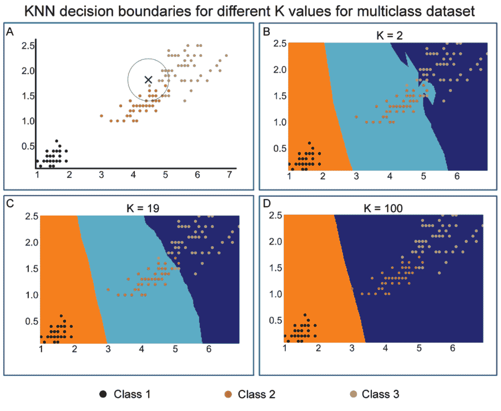
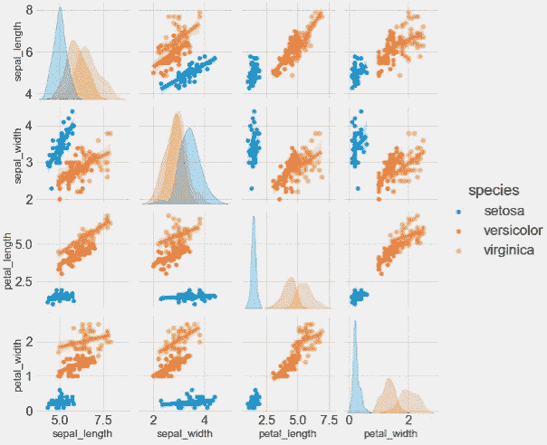
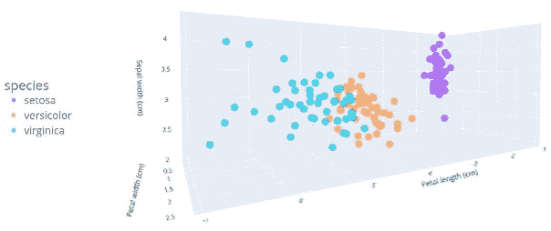
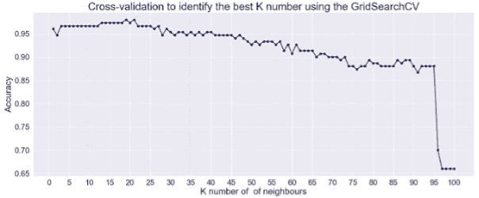
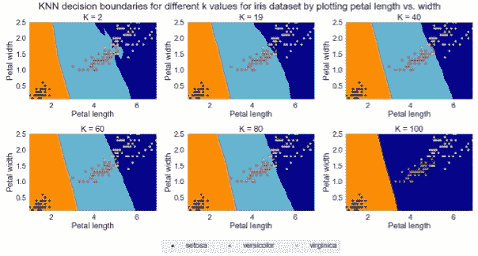
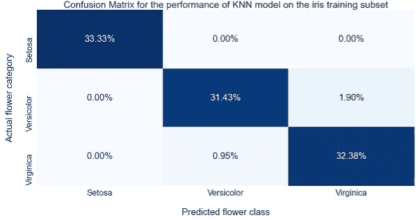
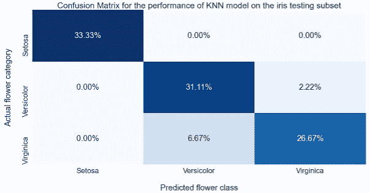

# KNN 用 Python 写的例子

> 原文：<https://www.dominodatalab.com/blog/knn-with-examples-in-python>

在本文中，我们将介绍并实现 k 近邻(KNN)作为一种有监督的机器学习算法。KNN 用于解决分类和回归问题。 *我们将提供足够的背景知识，并使用免费提供的数据集演示 KNN 在解决 Python 中的分类问题中的效用。*

## 什么是 K-最近邻？(KNN)

各种机器学习算法(ML)被用来解决不同领域的问题，以识别可操作的见解。这些问题大多属于两类之一:有人监督的或无人监督的。前者是任务驱动的，训练数据伴随着监督输出标签，用于包括分类和回归在内的许多任务，而后者是数据驱动的，不伴随着监督标签，通常用于从这些数据中学习关系和识别聚类。
监督学习问题可以用来解决回归和分类问题。这两个问题之间的差异是由于回归和分类的输出变量分别是数字或分类的事实[1]。

KNN 于 1951 年由 Fix 和 Hodges [2]提出，并由 Cover 和 Hart [3]进一步完善，是最常用的[监督学习方法](/supervised-vs-unsupervised-learning)之一。它主要用于解决分类问题。KNN 的主要概念是基于计算测试和训练数据样本之间的距离，使用距离函数来识别它们最近的邻居。测试样本随后被分配到其最近邻的类别。因此，KNN 是一种基于距离的 ML 算法[4]。

最初开发基于距离的方法是为了使用单一数据类型来度量数据点之间的相似性。真实世界的数据是不同数据类型的混合，因此对这些方法的后续修改允许使用异构数据集。使用各种距离函数测量数据点之间的距离，包括欧几里德距离、曼哈顿距离、闵可夫斯基距离、城市街区距离和切比雪夫距离；KNN 算法最常用的函数是欧几里德函数[5]。

KNN 经常被认为是一种“懒惰”的算法，因为它将大量的计算推迟到测试时间。因此，这表明 KNN 模型训练涉及存储训练子集，而测试未知数据点涉及搜索 K 个最近邻的训练数据集。

对于 KNN，给定一个正整数\(K\)和一个测试观察值\(x_0\ ), KNN 分类器首先确定训练数据中最接近\(x _ 0 \)的点的数量\(K\ ),并将它们存储在\(N_0\)中。随后，使用如上所述的距离函数之一来计算测试样本和训练数据点之间的距离。

对这些距离进行排序，并确定基于第(k)个最小距离的最近邻居。本质上，KNN 将根据下面的等式，将类别 j 的条件概率估计为\(n0 \)中响应值等于\(j\)的点的分数:

$ $ \ begin { equation } Pr(Y = j | X = X _ 0)= \ frac { 1 } { K } \ sum _ { I \ in N _ 0 } I(Y _ I = j)\ end { equation } $ $

随后，KNN 将测试观察值\(x_0\)分配给使用上述等式[1]计算出的概率最大的类别。

## 如何选择最优的 K 值？

在 KNN，\(K\)值代表最近邻的数量。该值是该分类器的核心决定因素，因为\(k \)-值决定有多少邻居影响分类。当\(K=1\)时，新的数据对象被简单地分配给它最近的邻居的类。邻居取自一组训练数据对象，其中正确的分类是已知的。KNN 天生会处理数字数据[5]。

图 1 直观地展示了 KNN 以及(K)的值如何影响决策界限。在图 1A 中，绘制了来自包括三个类的多类数据集的两个特征。用黑色、橙色和黄色描绘的类别在黑色和其他两个类别之间有明显的分隔。红色和黄色类别之间的边界区域有一些重叠。

由绿色十字表示的数据点被示出，目的是识别该数据点属于哪一类。围绕这个感兴趣的点画一个圆，并计算圆内的点数。这个十字周围总共有 19 个点，其中 11 个红色，8 个黄色。因此，如果选择\(k=19\ ),则该点属于红色类别，因为属于红色和蓝色类别的概率分别为 11/19 和 8/19。

**Figure 1**: The KNN implementation uses different values for K. A) Simple manual decision boundary with immediate adjacent observations for the datapoint of interest as depicted by a green cross. B-D) Decision boundaries determined by the K values as illustrated for K values of 2, 19 and 100\. As evident, the highest K value completely distorts decision boundaries for a class assignment.

在随后的图(图 1B-D)中，进行了系统的搜索，以确定产生最高预测精度的最优值(K)。通过使用 GridSearchCV，使用[交叉验证](/blog/building-robust-models-with-cross-validation)，在\(X1\)和\(X2\)(所用特征)的所有可能值下，在\(K\)s (1-30)的范围内对最佳\(K\)进行系统搜索。这些面板中描绘了 2、19 和 100 的\(K\)的代表性图像。结果表明\(K=19\)产生最高的准确度和最低的标准偏差。

如图 1 所示，选择\(K\)会显著改变预测的结果。例如，使用\(K=2\)(图 1B)感兴趣点属于深蓝色类，这是一个错误分类，噪声对结果的依赖性会更高。模型的过拟合是小\(K\)的一个可能结果。此外，使用\(K=19\)，兴趣点将属于绿松石类。此外，如较低的 K 所示，可以观察到决策边界中的一些灵活性，而当 K=19 时，这种灵活性会降低。相反，使用\(K=100\)时，决策边界变成一条直线，导致预测精度显著降低。

综上所述，这些观察表明，选择由\(K\)的值选择产生的决策边界的灵活度是显著影响预测结果的关键步骤。因此，有必要系统地进行这种选择，例如，使用交叉验证方法。

## 用 Python 实现 KNN 解决分类问题

在这里，我们将实现 KNN 使用常用的和免费提供的虹膜数据集[6]。鸢尾属是一种开艳丽花朵的开花植物。该数据集中包括 3 种鸢尾属植物；Setosa，Versicolor 和 Virginica 拥有相似的颜色:深紫色/蓝色。视觉上区分它们的一种方法是通过测量花瓣和萼片的尺寸(长度和宽度)。提供的特征是萼片和花瓣的长度和宽度，单位为厘米。

在这个过程中有两个主要步骤:1)数据预处理和探索性数据分析，以允许检查数据集和探索性可视化，以及 2)建立 KNN 模型并评估训练和测试子集的预测性能。

### 3.1 数据预处理和探索性数据分析

这里的目标是理解和可视化数据集，并为下一步做准备。Iris 数据集作为数据帧从 Seaborn 库中加载。没有观察到缺失值或数据不平衡。

图 2 显示了使用 Seaborn 的 pairplot 函数对所有可能的特征组合的直方图分布和散点图。

这将使我们能够看到每个子情节中绘制的两个不同变量之间的关系。例如，图 2 显示了花瓣的长度允许将 Setosa 与其他两种花分开。此外，在花瓣长度对宽度的图中，花被充分分开。

**Figure 2**: Pair plots and histograms to identify relationships between features and data distribution.

随后，绘制花瓣长度和宽度以及萼片宽度的 3D 散点图，以更好地显示基于这些特征的类别分离(图 3)。

**Figure 3**: 3D scatter plot of petal length/width and sepal width.

### 在训练和测试子集上建立 KNN 模型并评估预测性能

在本节中，我们将训练 KNN 模型，评估训练子集的性能，并测试测试子集的泛化性能。采取了以下步骤:

*   定义了特征和输出变量。要素被缩放。
*   数据集被分成训练和测试子集，其中 70%用于训练，其余部分用于测试。前者用于训练模型，后者用于测试未知数据的泛化性能。
*   最佳\(K\)值的选择至关重要，因此我们进行交叉验证，以确定产生最高准确度的\(K\)值
*   为了可视化的目的，我们绘制了由不同的\(K\)值产生的决策边界
*   然后，我们用上一步中确定的最佳值\\( K \\)启动 KNN 算法
*   执行 KNN 模型的训练
*   接下来，我们计算训练子集的预测，并评估
    模型的性能
*   最后，我们使用测试子集测试泛化并评估结果

建立 KNN 模型的最关键的方面是确定和使用最佳的 K 值。为此，进行了 30 倍交叉验证。结果如图 4 所示。\(K\)的最佳值是 19，它允许 98%的准确度。在这个值之后，精确度继续降低，在最高的\(K\)值处达到最低。

**Figure 4**: Cross-validation to identify the best \(K\) value

为了说明\(K\)选择的重要性，我们绘制了由 2、19、40、60、80 和 100 这 6 个不同 K 值产生的决策边界。当 K=100 时，随着 K 的增加，决策边界的灵活性显著降低，几乎是线性的。

**Figure 5**: The effect of \(K\) selection on decision boundary and class prediction.

我们随后评估了 KNN 模型在训练子集上的性能，发现它产生了 98%的总准确性，对 Setosa 的预测是 100%正确的，对 Versicolor 和 Virginica 的预测几乎是完美的。

**Figure 6**: Confusion matrix illustrating the performance of the KNN model on the training subset.

最后，对测试子集的泛化性能的评估揭示了与训练子集相比，Setosa 类具有相同的高性能，而 Versicolor 和 Virginica 的性能有所下降。

**Figure 7**: Confusion matrix illustrating the generalisation performance of the KNN model on the testing subset

## 摘要

在本文中，我们研究了 k-最近邻——一种具有广泛应用的非参数分类方法。我们讨论了算法的内部原理和选择最佳 K 值的问题。在文章的最后，我们还通过混淆矩阵看了结果解释。

本文有一个附带的项目，包含数据、Python 代码和绘图。你可以通过注册一个[免费多米诺试用](https://www.dominodatalab.com/trial/)来获得它。

  

## 参考

[1] G. James、D. Witten、T. Hastie 和 R. Tibshirani,《统计学习导论》。斯普林格，2013。

[2] E. Fix 和 J. Hodges，“非参数判别分析和密度估计的重要贡献”，《国际统计评论》，第 3 卷，第 57 期，第 233-238 页，1951 年。

[3] T. Cover 和 P. Hart，“最近邻模式分类”，IEEE 信息论汇刊，第 13 卷，第 1 期，第 21-27 页，1967 年。

[4] D. T .拉罗斯，数据挖掘和预测分析。约翰·威利父子公司，2015 年。

[5] D. T. Larose 和 C. D. Larose,《发现数据中的知识:数据挖掘导论》。约翰·威利父子公司，2014 年。

[6] B. V. Dasarathy，“邻近区域的探测:部分暴露环境中识别的新系统结构和分类规则”，IEEE 模式分析和机器智能汇刊，第 1 期，第 67-71 页，1980 年。