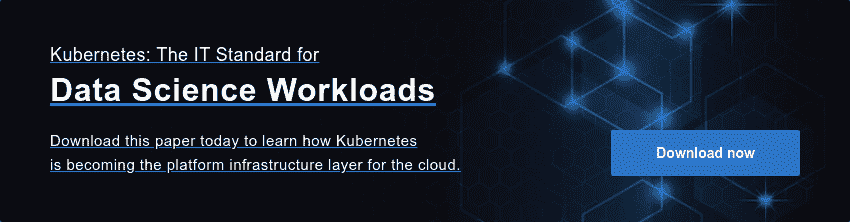

# kubernetes-原生 Domino 为未来奠定基础

> 原文：<https://www.dominodatalab.com/blog/kubernetes-native-domino-sets-the-foundation-for-the-future>

拥抱未来，Domino 现在是 Kubernetes-native，并准备好流畅地支持即将到来的创新。Kubernetes 的好处和 Domino 的核心价值是一致的——灵活性、可靠性、成本降低以及避免供应商和工具锁定。了解到 Kubernetes 在未来五年及以后将在企业 IT 架构中扮演的重要角色，我们的工程团队承担了全面移植 Domino 的任务。

我们认识到，数据科学的支持和 IT 战略的协调绝非易事。好消息是，Kubernetes 的容器编排的灵活性可以支持数据科学家和未来 IT 战略的需求。如果您与许多 IT 团队交谈，您会听到对云原生的关注，以及实施多云或混合云战略的未来目标。Kubernetes 将在这些战略中发挥巨大作用，并将日益成为支持数据科学家需求的关键。

有了 Kubernetes-native Domino，我们在开放性和对所有企业基础设施的支持方面加倍努力- **AWS、GCP、Azure 以及内部部署。此外，Domino 可以帮助企业 IT 提供商避免云锁定并实现多云策略，同时利用他们现有的监控和操作基础设施。**

正如 National Oilwell Varco 的数据科学运营经理 Joshua Cluff 所说:“Kubernetes 上的 Domino 为我们的数据科学团队提供了所需的灵活性，同时让我们的 IT 合作伙伴高枕无忧。我们现在可以跨不同的基础设施运行 Domino，包括内部和基于云的环境，同时还可以插入我们的 IT 团队了解和信任的现有监控、日志记录和企业安全工具。在让数据科学成为与企业 It 一致的一等公民的道路上，这是向前迈出的一大步。”

Kubernetes 上的 Domino 允许为您和您的团队带来许多好处:

*   **启用多云数据科学:** Kubernetes 支持 Domino 的多云策略，允许 Domino 在任何云或本地环境中本机运行，并具有异构数据科学工作负载弹性扩展的全部优势；
*   **降低数据科学工作负载的成本:**通过弹性地扩展工作负载，并跨底层硬件资源智能地打包它们，Domino 更高效地运行数据科学工作负载，降低计算成本；和
*   **运营效率:** Domino 现在可以安装到公司现有的 Kubernetes 集群中，通过与现有的 devops 堆栈集成，减少管理表面积并简化管理。

我们很高兴地宣布，Domino 使 it 比以往任何时候都更容易成功地支持他们的数据科学家。借助 Kubernetes 上的 Domino，高瞻远瞩的 IT 组织可以在行业领先的 orchestrator Kubernetes 上提供可扩展的多云支持，从而简化和增强他们的数据科学基础架构。

展望未来，Kubernetes-native Domino 将“让世界在模型上运行”,无论这些模型在哪里运行。

 

## 有关更多信息:

*   阅读新闻稿: [Domino Data Lab 推出全面的 Kubernetes-Native 数据科学平台，为 IT 提供支持，并实现多云数据科学](https://www.dominodatalab.com/news/domino-data-lab-launches-fully-kubernetes-native-data-science-platform-to-empower-it-and-enable-multi-cloud-data-science/)
*   阅读 VentureBeat 的故事: [Kubernetes:加速当今数据科学所需的关键要素](https://venturebeat.com/2019/11/21/kubernetes-the-key-ingredient-it-needs-to-accelerate-todays-data-science/)
*   查看 Domino 4.0 管理员指南中的技术文档

* * *

[Twitter](/#twitter) [Facebook](/#facebook) [Gmail](/#google_gmail) [Share](https://www.addtoany.com/share#url=https%3A%2F%2Fwww.dominodatalab.com%2Fblog%2Fkubernetes-native-domino-sets-the-foundation-for-the-future%2F&title=Kubernetes-native%20Domino%20Sets%20the%20Foundation%20for%20the%20Future)