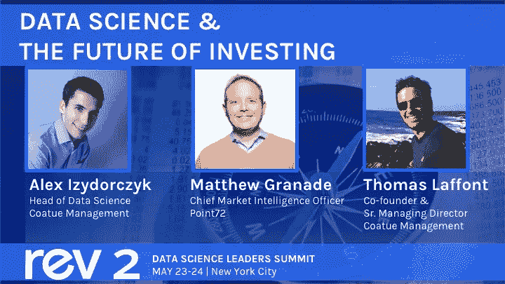

# 在 Rev 2 从对冲基金领导者那里了解投资的未来

> 原文：<https://www.dominodatalab.com/blog/learn-about-the-future-of-investing-from-hedge-fund-leaders-at-rev-2>

By Karina Babcock, Director Corporate Marketing, Domino on April 25, 2019 in

Coatue Management 联合创始人兼高级董事总经理 Thomas Laffont 将与他的数据科学主管[Alex Izydorczyk](https://www.linkedin.com/in/alexander-izydorczyk-86390759/)一起登上 [Rev 2](https://rev.dominodatalab.com) 的舞台，这肯定是一场由 Point72 首席市场情报官兼董事总经理 [Matthew Granade](https://www.linkedin.com/in/matthew-granade-837188/) 主持的精彩讨论。*(充分披露:马修·格拉纳达也是达美乐的联合创始人和董事会成员，Coatue Management 同时也是达美乐的投资者和客户。)*

根据福布斯的说法，Coatue 一直“走在人工智能革命的前面”，大量持有英伟达、谷歌和 Equinix 等创新公司的股票。他们最近也在私人市场引起了轰动，被机构投资者称为[“最激进的对冲基金投资者之一”，在 Instacart、Lyft、Box.com、jet.com、优步和 Snapchat 都有值得关注的投资。他们在 2018 年推出了两只风险投资基金，今年 2 月，创始人兼首席投资官 Philippe Laffont 宣布](https://www.institutionalinvestor.com/article/b1c2lcwx8z6wwz/Tiger-Cub-Coatue-Rolls-Out-New-Venture-Capital-Fund) [Coatue 将推出其首只量化对冲基金](https://www.bloomberg.com/news/articles/2019-02-28/laffont-s-coatue-seeks-250-million-for-first-quant-hedge-fund)，该基金将完全系统化，保持市场中立。

Point72 还将投资重点放在由模式驱动的创新推动的行业，其中超过 22%投资于医疗保健，21%投资于技术，16%投资于能源。该公司去年扩大了其地理足迹，最近[在悉尼](https://www.stamfordadvocate.com/business/article/Stamford-based-Point72-continues-international-13384803.php)开展业务，专注于宏观投资。该对冲基金在 2018 年筹集了超过 40 亿美元的外部资本，使管理的总资产达到约 130 亿美元(截至 2018 年 11 月)。

Coatue 和 Point72 都认识到数据科学作为一种组织能力的力量；根据彭博的说法，他们成功地将量化投资和自主投资结合起来。

但是金融公司依赖模型已经有几十年了。只是被称为“定量研究”而不是“数据科学”，对吗？那么，在数据科学行业中，新的建模方法和发展带来了什么变化呢？

在 Rev 的讨论中，三位对冲基金领袖将交换观点并解决以下问题:

*   对冲基金如何利用模型来推动整个行业的创新和新战略？
*   随着数据科学和建模实践的发展，公共和私人市场的投资策略如何变化？
*   金融公司量化研究经验中的哪些教训和概念对融入新的数据科学体系很有价值？反过来，对冲基金必须从过去的操作方式中“忘却”什么？
*   将数据科学整合到您的基金中的一些具体策略和技术是什么？其中哪些可以应用于金融部门以外的业务？
*   如何整合数据科学家与传统分析师和投资组合经理？

全体会议讨论将于 5 月 24 日星期五在纽约万豪酒店举行。要了解更多关于 Rev 2 或查看完整议程，请访问[rev.dominodatalab.com](https://rev.dominodatalab.com)。请注意，4 人以上的团队一起注册可以获得门票费用的 50%折扣。

1。https://www . Nasdaq . com/quotes/institutional-portfolio/point 72-asset-management-LP-931797？sort name = shares held&sort type = 1<a href = " https://www . Nasdaq . com/quotes/institutional-portfolio/point 72-asset-management-LP-931797？sort name = shares held&sort type = 1 "

[Twitter](/#twitter) [Facebook](/#facebook) [Gmail](/#google_gmail) [Share](https://www.addtoany.com/share#url=https%3A%2F%2Fwww.dominodatalab.com%2Fblog%2Flearn-about-the-future-of-investing-from-hedge-fund-leaders-at-rev-2%2F&title=Learn%20About%20the%20Future%20of%20Investing%20from%20Hedge%20Fund%20Leaders%20at%20Rev%202)