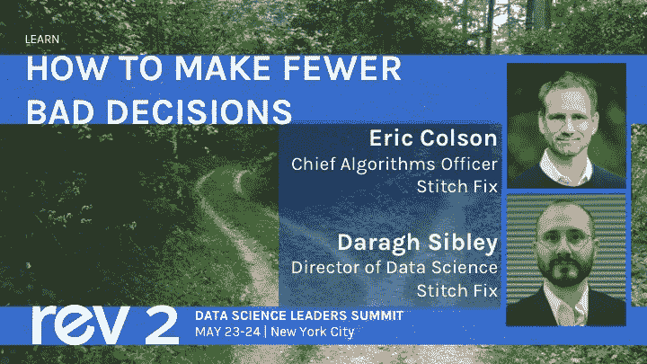

# 学习如何在 Rev 2 中做出更少的错误决策

> 原文：<https://www.dominodatalab.com/blog/learn-how-to-make-fewer-bad-decisions-at-rev-2>

By Karina Babcock, Director, Corporate Marketing, Domino on March 21, 2019 in

第二届数据科学领袖年度峰会 Rev 2 即将召开。今年的会议将于 5 月 23 日至 24 日在纽约市举行。

> 早鸟定价本月底到期！

数据科学领导者将参加今年的活动，与观众分享他们的经验、知识和建议，这让我们感到无比荣幸和激动。本着这种精神，我们将每周花几分钟时间介绍我们的演讲者[在这里](https://www.dominodatalab.com/blog/)——没有特定的顺序——让你了解他们是谁，他们来自哪里，以及为什么你可能有兴趣在 Rev。

让我们首先强调一位今年将重返舞台的 Rev 校友:Eric Colson，他以 Stitch Fix 首席算法官的身份管理着一个由 100 多名数据科学家组成的团队。在 Stitch Fix 之前，Eric 在网飞担任数据科学和工程副总裁。Eric 富有洞察力的演示反映了他在颠覆行业的真正模型驱动型公司中管理数据科学组织的经历。如果你还没有，你应该看看他最近在 HBR 发表的文章《为什么数据科学团队需要通才而不是专家》，或者看看他和数据科学经理 Hoda Eydgahi 写的关于如何“成为一家全栈数据科学公司”的博客。

在 Rev，Eric 将与 Stitch Fix 的数据科学总监 Daragh Sibley 同台。他们将一起讨论领导者如何通过深入了解我们大脑的连接方式和我们直觉中的谬误来做出更好的商业决策，这些谬误通常是通过实证 A/B 测试发现的。这个演讲将是丹尼尔·卡内曼当天早些时候关于直觉判断和选择心理学的主题演讲的引人注目的后续。

下面您可以查看 Eric 和 Daragh 在 Rev .的会议的完整详细信息。

## 如何减少错误决策

**5 月 23 日星期四 2:40-3:10**

越来越流行的 A/B 测试揭示了一个强大的，但很少讨论的洞察力:我们的直觉是非常糟糕的！然而，我们大多数人要么不知道，要么选择不相信这一点。一次又一次，随机对照试验表明，我们对商业决策结果的预测是非常容易出错的:实验表明，我们对新功能的乐观往往是被误导的；我们以为会有帮助的东西实际上是有害的；我们认为的下一件大事彻底失败了。我们的直觉甚至会导致比我们单独从随机机会中预期的更糟糕的结果。

这不是关于 A/B 测试的讨论，而是经验主义揭示了我们的直觉。我们描述了领域专家犯的一些错误。我们讨论这些系统性错误是如何从启发式推理过程中产生的，这种推理过程在进化的时间尺度上对我们很有用，但现在却损害了我们的判断。通过互动的观众演示，我们展示了认知启发法是如何影响决策及其评估的。

虽然我们不能改变我们大脑的构造，但了解它们的工作方式可以给我们带来优势。有几种机制可以减轻这些人类的局限性，并改善我们的决策。我们相信，较少做出错误决策的企业将拥有明显的竞争优势。

[Twitter](/#twitter) [Facebook](/#facebook) [Gmail](/#google_gmail) [Share](https://www.addtoany.com/share#url=https%3A%2F%2Fwww.dominodatalab.com%2Fblog%2Flearn-how-to-make-fewer-bad-decisions-at-rev-2%2F&title=Learn%20How%20to%20Make%20Fewer%20Bad%20Decisions%20at%20Rev%202)