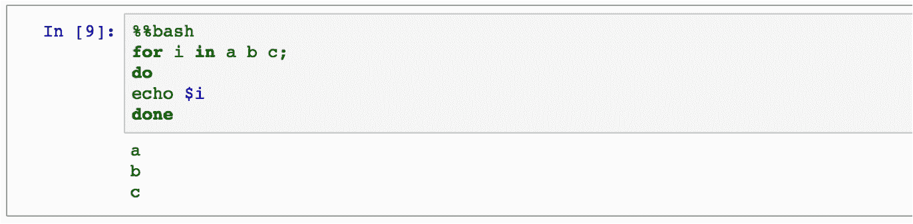
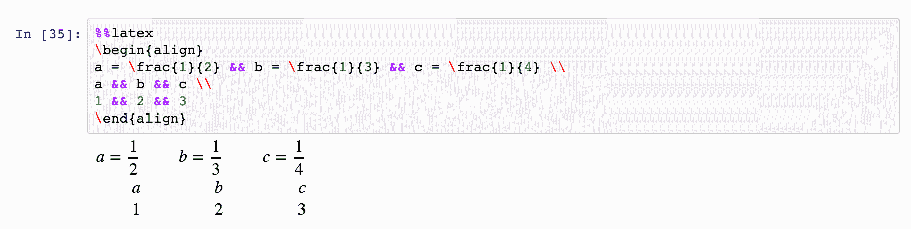
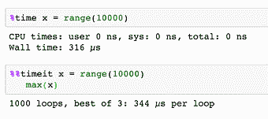
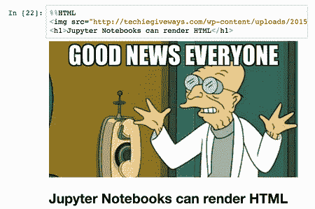
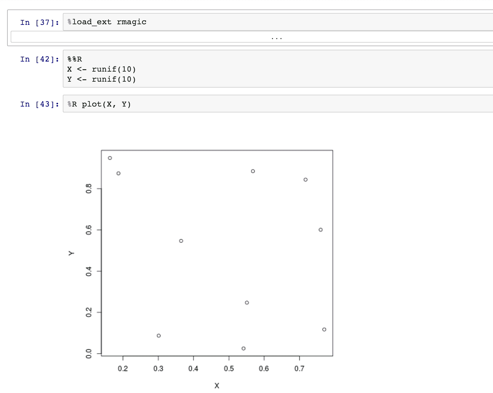
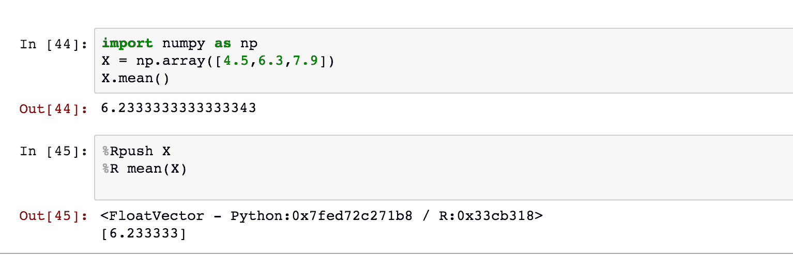
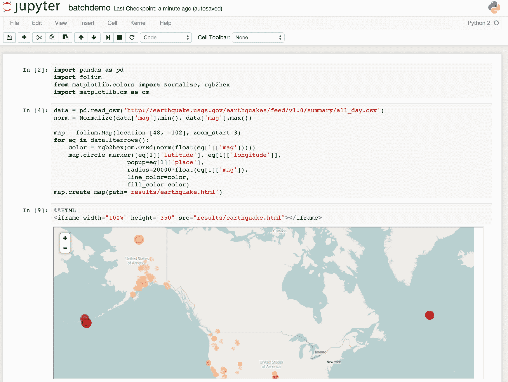
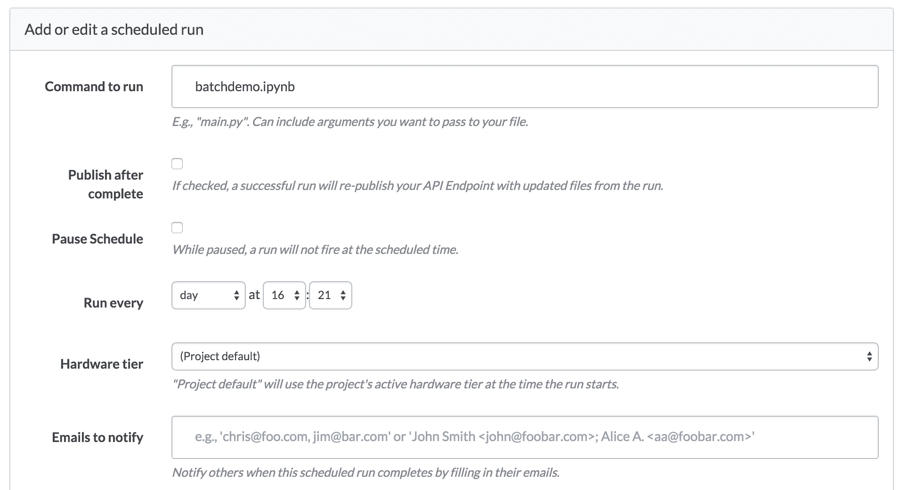
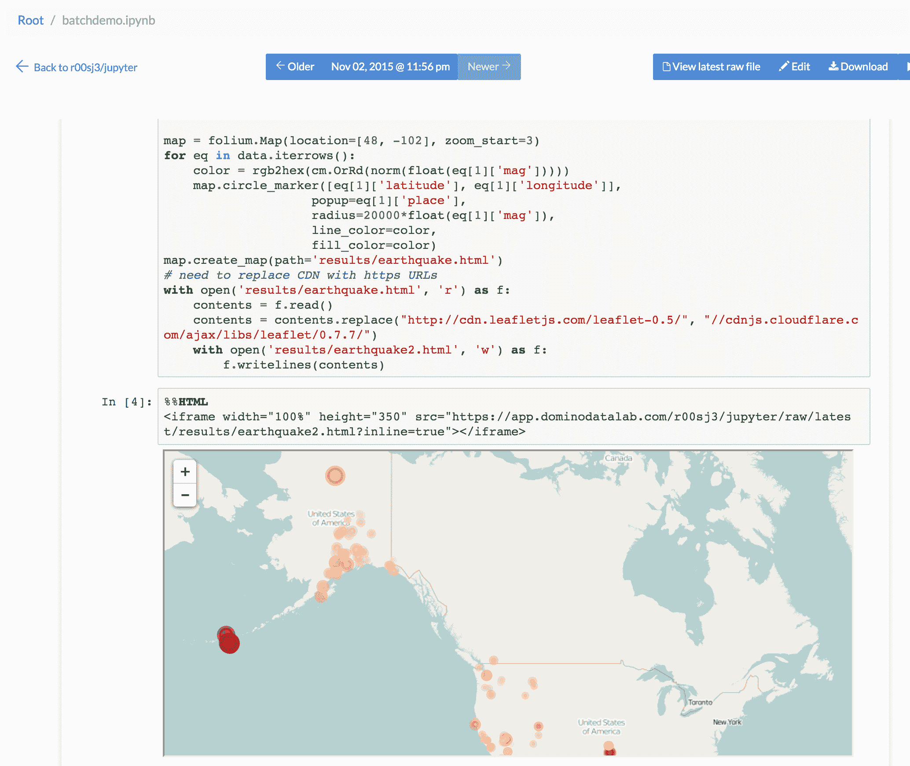

# 高级 Jupyter 笔记本技巧

> 原文：<https://www.dominodatalab.com/blog/lesser-known-ways-of-using-notebooks>

我喜欢 Jupyter 笔记本！它们非常适合试验新的想法或数据集，虽然我的笔记本“操场”开始时一片混乱，但我用它们来为我的最终项目建立一个清晰的想法。

Jupyter 非常适合交互式探索性分析，因此很容易忽略它的一些其他强大功能和用例。我想写一篇博文，介绍一些鲜为人知的使用 Jupyter 的方法——但是太多了，所以我把这篇博文分成了两部分。

在今天的第 1 部分中，我将描述如何使用 Jupyter 创建管道和报告。在下一篇文章中，我将描述如何使用 Jupyter 创建交互式仪表盘。

本博客的配套项目可以在 [多米诺数据科学平台](https://try.dominodatalab.com/u/joshpoduska/advanced_jupyter_tricks/overview) *上找到。*

## 魔法

你可能知道你可以用不同的内核启动笔记本(比如 R，Julia)——不仅仅是 Python。您可能不知道的是，即使在笔记本中，您也可以在不同的单元中运行不同类型的代码。有了“魔法”，就有可能使用不同的语言。然而，不同的笔记本内核有不同的魔法。

通过在单元格中运行`% lsmagic`,你会得到所有可用魔法的列表。您可以使用`%`启动一个单行表达式来运行 magics 命令。或者你可以使用一个双`%%`来运行一个多行表达式。

我最喜欢的一些是:

*   `% env`列出你的环境变量。
*   `!`:运行 shell 命令。例如`! pip freeze | grep pandas`看熊猫装的是什么版本。
*   `% matplotlib inline`在笔记本内显示 matplotlib 图。
*   将代码上传到 pastebin 并获取返回的 url。
*   `% bash`在子进程中用 bash 运行 cell。
    
*   `%time`无论你评价什么，时间都会
*   `%%latex`将单元格内容渲染为乳胶
    
*   `%timeit`将你评价的任何东西多次计时，给你最好的和平均的次数



*   `%prun`、`%lprun`、`%mprun`可以给你一个函数或者脚本中时间和内存使用的逐行细分。Pynash 提供了一个很好的教程来教你如何使用它们。
*   `%% HTML`:将单元格渲染为 HTML。因此，您甚至可以在笔记本中嵌入图像或其他媒体:



你甚至可以使用魔法在一个笔记本中混合不同的语言。例如， [rmagics](https://ipython.org/ipython-doc/2/config/extensions/rmagic.html) 让你在 Python 笔记本中运行 R 代码——包括绘图。注意，首先需要加载`rmagics`扩展。



正如在 [rmagics 文档](https://ipython.org/ipython-doc/2/config/extensions/rmagic.html)中所描述的，您可以使用`%Rpush`和`%Rpull`在 R 和 Python 之间来回移动值:



你可以在网上找到其他语言魔法的例子，包括 [SQL 魔法](https://github.com/catherinedevlin/ipython-sql)和 [cython 魔法](https://acsgsoc15.wordpress.com/2015/04/07/using-cython-in-ipython/)。你可以在这里阅读更多常见的魔法。说真的，你可以花一整天来学习这些！

### 管道

魔法本身是很方便的，但是当你把它们结合在一起时，它们真的会发光。这些函数可以通过组合不同语言的步骤，帮助您在一个可视化流程中创建管道。熟悉 magics 可以让你在每个子任务中使用最有效的解决方案，并为你的项目将它们结合在一起。

当以这种方式使用时，Jupyter 笔记本变成了为数据科学工作量身定制的“可视外壳脚本”。每个单元可以是管道中的一个步骤，可以直接使用高级语言(例如 R、Python)或低级 shell 命令。同时，您的“脚本”还可以包含格式良好的文档和流程中各个步骤的可视化输出。它甚至可以记录自己的性能，在其输出中自动记录 CPU 和内存的使用情况。

## 批处理、调度和报告

像任何其他 Python 脚本一样，也可以在批处理模式下运行您的笔记本。通过使用 [nbconvert](https://ipython.org/ipython-doc/1/interactive/nbconvert.html) ，你可以非交互地计算整个笔记本，将其保存在适当的位置或保存为各种其他格式。

这种能力使笔记本成为 ETL 和报告的强大工具。对于报告，只需安排您的笔记本自动重复运行，并更新其内容或通过电子邮件将其结果发送给同事。或者使用上述 magics 技术，笔记本也可以实现数据管道或 ETL 任务，以便按自动计划运行。

### 预定仪表板

假设你要定期给同事的邮箱发一张[叶子](https://www.dominodatalab.com/blog/creating-interactive-crime-maps-with-folium)图，上面有过去一天的所有地震。

要做到这一点，你首先需要一个定期更新(至少每天)的地震数据集。有一个每 5 分钟更新一次的[数据馈送](https://earthquake.usgs.gov/earthquakes/feed/v1.0/csv.php)。然后，您可以使用 Jupyter 编写[代码](https://try.dominodatalab.com/u/joshpoduska/advanced_jupyter_tricks/view/pipelinedashboard.ipynb)来加载这些数据并创建地图。



[Domino](https://www.dominodatalab.com?utm_source=blog&utm_medium=post&utm_campaign=lesser-known-ways-of-using-notebooks) 让你[安排](https://support.dominodatalab.com/hc/en-us/articles/204843165-Scheduling-Runs)任何脚本定期运行，这对于 ipynb 文件和其他文件一样有效。当它运行预定的执行`batchdemo.ipynb`时，Domino 将计算笔记本并用最新的结果更新它的单元格。



合作者可以访问该页面，在浏览器中查看[更新的笔记本](https://try.dominodatalab.com/u/joshpoduska/advanced_jupyter_tricks/view/batchdemo.ipynb)——无需运行 Jupyter 服务器。因此，您的笔记本已经成为一个随时更新的仪表板。



### 带有 magics 和 HTML 导出的预定仪表板

更进一步的是结合 magics 的流水线技术，将整个笔记本变成一个 HTML 报告。下一个[示例](https://try.dominodatalab.com/u/joshpoduska/advanced_jupyter_tricks/view/pipelinedashboard.ipynb)展示了如何首先使用一个 shell 脚本来检索一个网页(https://www.sfgate.com ),这个网页是用 Python 在 wordcloud 中可视化的。然后，作为计划运行的一部分，它被转换为包含运行结果的 HTML 页面。您可以设置您的计划运行，以自动通过电子邮件将任何结果(例如，您的笔记本呈现为 HTML)发送给您的同事。

当您用内联可视化完成笔记本时，创建一个类似于以下内容的 [shell 脚本](https://try.dominodatalab.com/u/joshpoduska/advanced_jupyter_tricks/view/dashboard.sh):

```py
ipython nbconvert --to html pipelinedashboard.ipynb
```

在调度这个 shell 脚本之后，结果将是您的笔记本上一次运行的常规 HTML 版本。

* * *

为您的 Jupyter 笔记本寻找更多技巧？请参阅我们的指南，了解如何在 Jupyter 笔记本中创建[交互式仪表盘](https://www.dominodatalab.com/blog/interactive-dashboards-in-jupyter)。