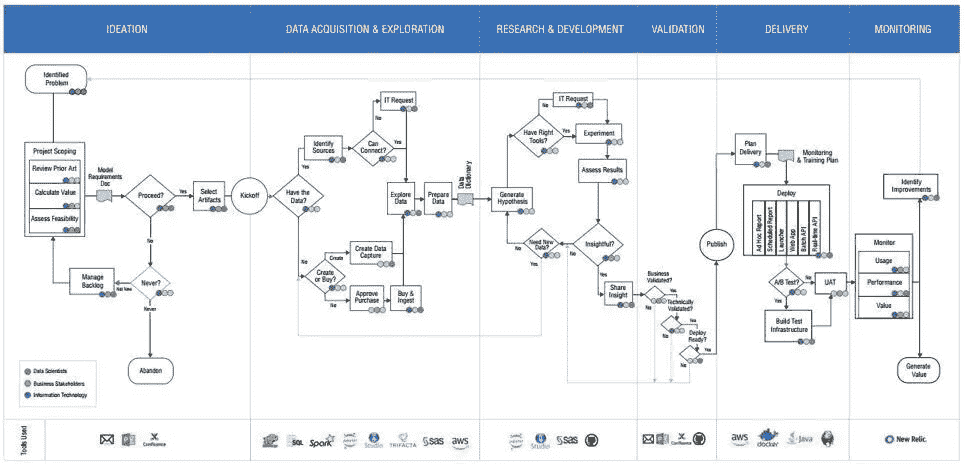

# 20 个数据科学团队的经验教训

> 原文：<https://www.dominodatalab.com/blog/lessons-from-20-data-science-teams>

## 如果你观察 20 家大公司的数据科学团队，你能学到什么？

我向多米诺数据实验室的产品总监 Mac Steele 寻求答案。Mac 将他从观察数据科学团队中学到的经验与来自 [CRISP-DM](http://www.datascience-pm.com/crisp-dm-and-kdd/) 和敏捷的概念相结合，创建了 Domino 数据科学生命周期。这是在一份 25 页的白皮书《大规模管理数据科学实用指南》中定义的。

## 创造不同方法的动机

在他职业生涯的早期，Mac 意识到像 [Scrum](http://www.datascience-pm.com/scrum/) 这样的[软件方法论](http://www.datascience-pm.com/managing-ds-as-software-engineering/)在应用于数据科学时“并不那么有效，因为事情不会以同样的方式在两周内神奇地发生……你没有可以交付的、可以被用户每两周观察到的增量功能。”他发现“一个非常传统的强制 Scrum 过程在数据科学工作流程的评分中似乎更多的是无益的，而不是有益的。”

最近在 Domino 工作时，他同样发现一些客户在努力成功地执行数据科学项目。项目的“书立”，即开始时的初始阶段和结束时的监测阶段，特别具有挑战性，部分原因是现有的方法没有适当地定义这些阶段。此外，缺乏团队角色定义。总的来说，这导致了无效的场景，其中“数据科学做了一些事情，然后有一堵硬墙，他们将他们的工作交给 IT 部门，后者最终重写了它”，但不了解如何监控和维护产品化的模型。为了取得成功，“你应该从一开始就让 IT、数据科学和业务参与进来”，每个团队从构思到产品退役都承担明确的角色。

Mac 承认，Domino 的方法、CRISP-DM、微软的团队数据科学过程(T1)和其他方法“并没有什么不同，因为数据科学中有几个不可协商的方面。区别在于人们在哪里添加了重点，以及他们带来的不同维度。我们试图引入的维度是人员、流程和技术维度。”

Domino 数据实验室的生命周期方法。查看他们的白皮书的最后一页，获取完整版本。

## 未来趋势

我问 Mac，如果他重新写一份更新版本的方法论和白皮书，他会有什么不同的做法。他回应说，“去年，我看到和听到了更多关于更好地检查偏见和公平的内容，如良好的数据科学道德检查，这将成为标准的操作实践，不管它们是否受到监管，因为消费者将越来越多地要求这样做。”

此外，当被问及数据科学项目管理的未来时，他回答说，“人们将从学术界和研究机构学到更多东西，因为他们将开始意识到他们所做的事情从根本上来说是研究[…和…]你正在进行的项目可能不会成功，这没关系。像制药公司和其他医学研究公司这样的公司已经做了很长时间，我敢打赌人们会从他们那里学到更多。”

同样，他认为产品管理的概念作为数据科学功能的一个独特的子学科正在成熟，就像它在软件工程中一样。“软件领域的产品管理在很大程度上负责将问题概念化，提出解决方案的形式，然后在后端处理用户采用和用户参与，并推动您希望的价值。现在，我们有数据科学家扮演开发者和产品经理的角色，我认为这种情况不会持续下去。”

时间会证明一切，但我认为他是对的。

