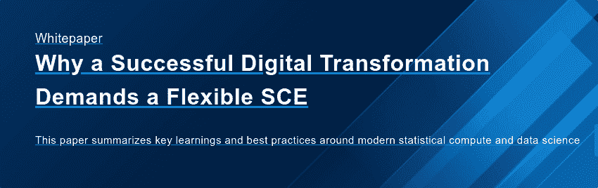

# 生命科学团队:在通往云计算的道路上避免这些常见的陷阱

> 原文：<https://www.dominodatalab.com/blog/life-sciences-teams-beware-avoid-these-common-pitfalls-on-your-path-to-the-cloud>

许多生命科学组织正在进行数字化转型。其中的一个关键部分是将现有的内部 IT 平台、[统计计算环境(SCEs)](/solutions/life-sciences-sce) 以及相关的编程语言和工具迁移到云中。研究和数据科学职能代表着这些云迁移的唾手可得的成果，因为它们的工作流需要动态访问计算基础架构和集中访问不同的工具集。

集中数据科学功能及其相关工具的流程提供了两个重要机会:解决传统数据中心和基于桌面的分析环境随着时间推移而增长的挑战，以及通过自动化和底层技术将最佳实践“硬编码”到流程中。

在云中运行数据科学的好处是巨大的:

*   **如果您的组织能够在需要时访问高性能计算资源，但只需为所用资源付费，那么就有可能节省大量成本**。
*   工具访问的标准化和集中化意味着 IT 可以有效地管理和治理跨团队的技术环境，从而提高安全性和合规性。
*   **将最佳实践融入底层技术带来的巨大生产力提升**可以在三个层面上实现:研究和相关工件的自动再现加速了员工入职，减少了手动文档记录，并促进了跨团队协作和对过去工作的可访问性。

但是，迁移到云仍然在许多生命科学组织的“待办事项”列表中是有原因的。这是一个复杂的过程，需要时间。SCE 通常由许多不同技术的许多不同部署组成，所有这些部署都必须满足有关安全性和法规遵从性的内部和外部要求，例如 HIPAA。

如果你的团队开始踏上云之路，这里有一些我们在这个领域看到的**常见陷阱**。通过让人们意识到这些挑战，我们希望您能够提前制定缓解策略，并更快地实现云计算。我们还鼓励您[阅读我们的白皮书](/resources/why-a-successful-digital-transformation-demands-a-flexible-sce/)，该白皮书根据我们与成功实现数字化转型的企业的合作经验，提供了生命科学数字化转型的最佳实践。

## 1.研究人员无法访问他们需要的计算资源。

由于在获取大型服务器环境的访问权限方面存在开发运维难题，研究人员最终只能在笔记本电脑上完成大部分工作，难以跟上呈指数级增长的数据量。

研究人员感到沮丧，浪费了宝贵的时间来跨越基础架构的重重障碍，组织的研究环境变成了一个由“影子 IT”和分散的孤岛组成的复杂网络。

## 2.数据科学工具的技术前景在不断变化，在新技术可用和研究人员可以使用它们之间产生了一个延迟。

研究人员希望——也完全有权利——使用最新、最好的工具来完成手头的任务。这个领域正在发生大量的创新。几乎每天都有新的和改进的工具推出，其中许多是开源的。与此同时，有许多用户希望使用更传统的专有技术，如 SAS 和 T2 MATLAB。

每种工具都推动商业价值，但每种工具都有其局限性，特别是如果它没有集成到企业范围的数据科学战略中。SAS 和 MATLAB 功能强大，在受监管的环境中受到大型企业的信任，但是它们与开源技术合作的能力有限。他们还经常复制数据，这可能需要昂贵的数据存储基础架构。

另一方面，R 和 Python 等开源工具通过利用容器和编排工具来简化部署和管理，从而降低存储成本。他们也可以接触到更广泛的人才基础。但开源工具面临着相对较慢的数据访问、重新编码和版本控制方面的挑战，并且无法提供与专有工具相同的数据、模型和流程治理能力。

数据科学家不能浪费时间等待第三方或系统管理员做出更改或获得新技术，但 IT 需要确保新技术安全地引入组织，并进行必要的治理。

IT 部门如何提供对各种技术的访问，同时确保这些技术符合公司指令和法规要求？他们如何提供一个环境，让研究人员可以在不引起问题的情况下，跨不同工具组合一系列作业执行？团队如何维护跨越 SAS、Python、R 和其他库的可重复的工作流链，以支持各种涉众和业务案例？

积压不可避免地累积起来，导致研究人员和 IT 之间的挫折感，并导致“影子 IT”情况，即研究人员不仅局限于他们笔记本电脑上的计算资源，而且他们还运行多个 SAS、R、Python 和 MATLAB 孤岛。

## 3.它无法跟上基于云的软件发布的现代交付模式。

尤其是在处理敏感数据的生命科学环境中，IT 部门通常需要花费四至八个月的时间来验证内部部署系统的每个新版本的软件升级。他们习惯了这种可预测的升级周期；他们可以为此做计划。但是，基于云的软件供应商并不局限于旧的运营方式，现在每年部署几次新的软件版本已经司空见惯。

IT 团队还没有想出如何适应新的节奏，并且每次升级都要消耗多名支持人员、管理资源或能力，否则这些资源或能力将被花费在宝贵的研究工作流程上。

更糟糕的是，IT 部门无法很好地控制在许多孤立的系统中使用的每个工具的版本。试图跟上并为分布式团队提供支持会导致巨大的支持开销。我们经常听到 IT 领导评论说，他们有一个团队专门支持整个组织中所有商业工具安装的滚动升级。

## 4.不必要的摩擦和重复的工作来自于活动的竖井和不一致的版本控制。

特别是对于地理上分散的团队，人们在没有意识到的情况下在每个组织的口袋里重新创建相同的工作。由于无法看到过去已经创造了什么，研究人员从零开始每个项目，或者在一次性设置中向他人询问过去的工作。

当研究人员要求其他人参与同行评审时，几乎不可能知道给定的分析使用了什么版本的 R、Python 和/或 SAS。这也使得重现过去的工作成为一项复杂的任务。

## 5.半手工版本控制浪费大量时间。

花费在手动或半手动流程上的时间转化为花费在进一步分析或转移到下一个项目上的时间更少。即使研究人员实现了手动版本控制方法，它也存在于源代码级别，而不存在于实验级别；软件版本等。，没有被捕获。满足模型起源的需求是痛苦的，需要大量的特别工作来手动审计工作文档和导致特定分析和结果的工具的特定版本。

## 6.数据科学领导者努力将资源高效地分配给可见性有限的项目。

数据科学领导者负责为项目分配合适的数据科学家，但这通常是心血来潮，或者基于来自研究人员和业务线利益相关者的轶事般的临时输入。数据科学领导者很难获得透明度并了解他们团队和/或更广泛组织的工作状态。

此外，如果他们确定需要将资源重新分配给不同的项目，那么让新的贡献者跟上进度的工作很少是值得的。最终需要更长的时间来交付高质量的成果，并且难以衡量数据科学团队的效率。

## 隧道尽头的光。

许多行业领先的组织在向云发展的过程中成功应对了这些挑战。意识到这些挑战并将其作为集中研究和数据科学功能的更大战略的一部分非常重要，利用技术可以让研究人员使用他们喜欢的工具，在需要时访问计算，并自动执行可能导致大规模不一致和低效率的手动工作。

要深入了解在云中实施面向未来的数据科学实践的成功生命科学企业所采用的最佳实践，请阅读白皮书:

