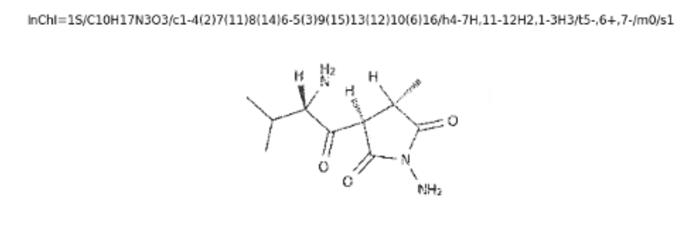
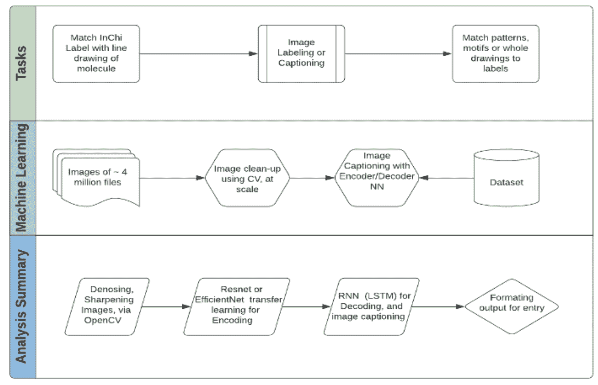
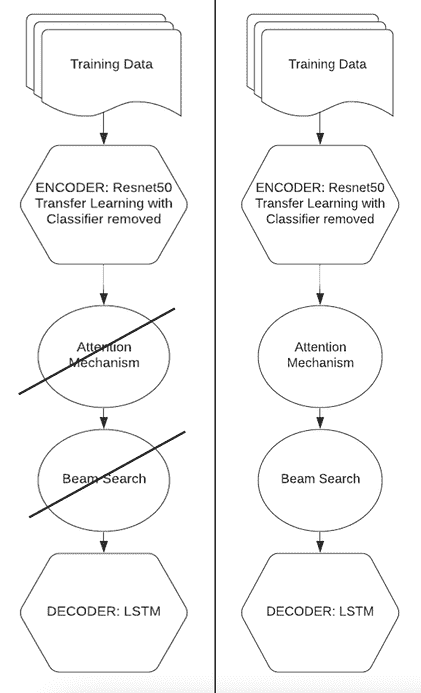

# 闪电般快速的基于 CPU 的图像字幕管道，具有深度学习和光线

> 原文：<https://www.dominodatalab.com/blog/lightning-fast-cpu-based-image-captioning-pipelines-with-deep-learning-and-ray>

骨架公式和 InChI 标签之间的转换是一个具有挑战性的图像字幕问题，尤其是当它涉及大量的噪声数据时。在这篇博文中，我们分享了 BMS 分子翻译挑战赛的经验，并展示了基于 CPU 的分布式学习可以显著缩短模型训练时间。

## 背景

在 2000-2004 年期间，国际纯粹与应用化学联合会(IUPAC)开发了 InChI 标签系统-一种化学物质的文本标识符，旨在提供一种编码分子信息的标准方法。InChI 标签本质上是一长串字母和符号，用于识别化学物质，并便于在数据库和网络上搜索。记住，InChI 标准于 2005 年正式发布，可以理解的是，早于化学文献发布了描述化学物质的其他方法。遗留文档中采用的最常见的方法是结构公式的纯图形表达式(也称为骨架公式)。


图 1 :英制表示(上)对比骨骼公式(下)

百时美施贵宝(BMS)是一家美国跨国制药公司，总部设在纽约市。BMS 拥有 30，000 多名员工，2021 年收入超过 410 亿美元。鉴于该公司 135 年的历史，很容易想象这些年来 BMS 积累了大量包含分子信息的研究文献。处理这种类型的数据具有挑战性，因此毫不奇怪，BMS 发布了一个公开的 [Kaggle challenge](https://www.kaggle.com/c/bms-molecular-translation) ，旨在采用机器学习来实现骨架公式和 InChI 标签之间的自动化翻译。

## 应对 BMS 挑战

Domino 数据实验室的现场数据科学服务团队决定尝试 Bristol-Myers Squibb 挑战，特别是在尝试可以利用按需分布式计算的新工具和框架的背景下。支持大规模数据科学(包括按需分布式计算)是 Domino Enterprise MLOps 平台的关键价值主张之一，因此该团队希望研究该平台提供的 devops 自动化与 Ray 等分布式计算框架的流行之间的协同作用。

这个项目的原始代码，受使用 [COCO(上下文中的公共对象)数据集](https://cocodataset.org/#home) 的图像字幕工作的启发，利用了标记图像的技术。我们使用了几个[计算机视觉算法](https://www.dominodatalab.com/blog/what-is-computer-vision)来消除斑点，锐化和清洁图像，然后将它们输入管道。像在 COCO 数据集上的早期工作一样，我们使用迁移学习和自然语言生成进行图像标记。在完成初级图像处理后，我们注意到训练时间长度的潜在问题。在 Domino Data Lab，我们知道长时间的模型训练是实现 [高模型速度](https://blog.dominodatalab.com/increasing-model-velocity-for-complex-models) 和将组织转变为成功的模型驱动型企业的关键障碍。

我们注意到，由于数据的规模和问题的复杂性，一些 Kaggle 竞争对手花了一周多的时间来训练他们的图像标记系统，尽管使用了 GPU 或加速计算。这种方法在现实世界中并不实用，因为很难访问 GPU 以及相关的基础设施成本。我们想知道使用分布式系统——在这个例子中是 Ray——是否能够在减少训练时间的同时使用 CPU。

图像识别和标记在过去七年中一直是计算机视觉中的规范技术(Voulodimos A 等人， 2018 )。BMS 面临的挑战是，旧文献中创建的许多图像质量较差；斑点和模糊。我们在这个项目中的第一个目标是纠正这个问题。

比赛数据集由超过 250 万张图像组成，每个示例都是带有相应标签的斑点和非锐化图像。大约 250 万张图像的测试数据集也没有标签。因为所提供的数据集只显示了每个标签一次，所以我们在类似于半监督框架的框架内将此作为标签问题来处理。我们训练了所有的数据，并留出了一个从训练数据中随机选择的验证数据集供将来使用。在目前的工作中，我们只专注于加快训练时间。

我们的总体目标是确定仅使用 CPU 在 Ray 上训练一个基本的图像标记算法架构需要多长时间。选择 CPU 比选择 GPU 或者 TPU 有很多优势。首先是 CPU 在云计算平台上更容易获得。已知 GPU 可用性不足。第二是成本。与 GPU 相比，云计算每小时对 CPU 的使用显著减少。我们进行这个实验的第三个也是最重要的原因是确定我们是否可以减少基本图像标记架构的训练时间。

我们的第一步是完成图像处理。为此，我们使用了 [OpenCV](https://www.dominodatalab.com/blog/getting-started-witn-open-cv) ，一个基于 Python 的计算机视觉库，结合 Ray 来加速处理时间。我们发现解压缩和处理 250 万张图像需要大约 6 个小时(相比之下，我们之前的尝试需要几天)。我们的图像处理流程包括利用 OpenCV 进行图像去斑，然后进行图像锐化。我们后来使用干净的存储图像进行深度学习。

## 我们的工具箱

[Ray](https://www.ray.io/) 是一个开放的框架，数据科学家可以使用它进行并行和分布式计算。它使用起来很简单，因为将一个简单的函数转换成一个射线函数所需要的只是一个修饰符“@ray.remote”。然后，数据科学家可以使用远程功能将数据放入内存，并行处理数据，或将数据处理分配给工作人员并获得结果。下面的代码是一个我们转换成 Ray 的函数及其运行时间的例子。

```py
%%time

@ray.remote

def build_captions(data):

    captions = Field(sequential=False, init_token='', eos_token='')

    all_captions = data['InChI'].tolist()

    all_tokens = [[w for w in c.split()] for c in all_captions]

    all_tokens = [w for sublist in all_tokens for w in sublist]

    captions.build_vocab(all_tokens)

    return captions

captions = ray.get(build_captions.remote(data))

@ray.remote

def build_vocab(captions):

    class Vocab:

        pass

    vocab = Vocab()

    captions.vocab.itos.insert(0, '')

    vocab.itos = captions.vocab.itos

    vocab.stoi = defaultdict(lambda: captions.vocab.itos.index(''))

    vocab.stoi[''] = 0

    for s,i in captions.vocab.stoi.items():

        vocab.stoi[s] = i+1

    return vocab

vocab = ray.get(build_vocab.remote(captions))

```

```py
CPU times: user 10.6 ms, sys: 4.12 ms, total: 14.7 ms

Wall time: 1.73 s
```

**清单 1:** 一个使用 Ray decorator 将没有并行化或分布式的函数转换成可以以并行或分布式方式运行的函数的例子。Ray decorator 将函数更改为远程函数，简单的 put 和 get 命令将对象放入存储并检索处理后的结果。我们看到，处理 250 万个样本标识符的挂钟时间不到 5 秒。

关于 Ray 的全面“入门”指南，请看一下博客上的 [Ray 教程](https://blog.dominodatalab.com/ray-tutorial-for-accessing-clusters) 。如果你想知道 Ray 与 Spark 和 Dask 等其他分布式框架相比如何，请查看我们的帖子 [Spark、Dask 和 Ray:选择正确的框架](https://blog.dominodatalab.com/spark-dask-ray-choosing-the-right-framework) 。

除了利用 OpenCV 满足我们的计算机视觉需求，我们还广泛使用了另外两个库。其中包括用于图像识别和标记的 [PyTorch](https://blog.dominodatalab.com/tensorflow-pytorch-or-keras-for-deep-learning) 和用于算法堆栈训练的 Ray 的 SGD 库。

## 实验

一旦我们处理了图像的训练集，我们的第一个任务是执行[](https://blog.dominodatalab.com/a-guide-to-natural-language-processsing)，即在图像标签上进行标记化。对于这个过程，我们选择了 PyTorch 库之一 TorchText。我们创建了一个通用的标记器来处理图像标签，然后创建了 PyTorch 文本库来嵌入标签。一旦标签被嵌入以匹配它们的图像，我们就创建了图像训练管道。这条流水线由一个编码器和一个解码器组成。编码器利用 [转移学习](https://blog.dominodatalab.com/guide-to-transfer-learning-for-deep-learning) 对带有各自标签的图像进行编码。我们针对预训练的模型 Resnet50 执行迁移学习。为了获得模型的输出以提供给解码器，我们移除了 Resnet50 模型的最后一层，并将特征提供给我们的解码器。

LSTM 包括我们的图像和标签解码器。解码器获取编码器(一个使用转移学习训练的卷积神经网络)的输出，并为每个图像创建一组标签。通过 Levenshtein 评分，可以对结果进行评估。我们使用 Levenshtein 分数来确定两个字符串的相似程度(即，实际图像标签和预测图像标签)。从 Levenshtein 分数计算的相似性分数的一个小子集，我们发现相似性的范围在 43%和 84%之间。我们没有计算所有 250 万样本的总体相似性得分，但这是未来目标的计划。我们当前的目标是模拟主要的图像标记管道，并确定是否可以使用 Ray 和一组 CPU 来改进训练。我们选择的工作流程如下所示。



图 2 :创建图像标注系统的流程。注意:在 200 万个训练样本中，每个图像都是唯一的 InChi，并且只表示一次。然而，同一分子的图像可以旋转，事实上，在测试数据集中是随机旋转的。为此，训练集中的每个图像只表示一次。IC 包括一个编码器(经过迁移学习训练——基本完成/编码完成)和一个解码器(RNN 或 LSTM ),用于根据图像的成分创建“字幕”。

我们的实验计划在过程的早期就改变了。最初，我们计划在培训过程中利用两种先进的技术。这些包括注意机制和光束搜索。我们发现，当我们优化基本标记实验时，优化这两种技术是不实际的。因为我们的总体目标是确定我们是否可以对训练时间进行基准测试，所以我们决定在第一个实验中省略激活函数和光束搜索。



**图 3:** 我们原本打算使用一种注意力机制和光束搜索(高级计算机视觉技术)。然而，我们的第一个目标是对一个规范的图像标记管道进行基准测试，所以我们决定省去注意力机制和光束搜索，只关注 Ray 的基准测试。左边是我们决定使用的算法堆栈，右边是原始的算法堆栈。

## 结果

我们的模型是图像标记管道的基本版本，就像在(Kishore，V，2020)中使用的那样。它非常接近(只缺少一个注意力机制)Kaggle 比赛的第二名冠军。这个团队的工作花了七天多的时间在单个 GPU 上进行训练。我们发现我们的培训需要大约一天半的时间，大大减少了时间。虽然我们没有使用注意机制，但我们对 Resnet50 使用了相同的数据传输学习机制，并使用 LSTM 作为我们的解码器。

总之，我们的训练管道包括标记化、使用 Resnet50 的编码器和利用 LSTM 的解码器，并显著减少了训练时间。在 Domino Enterprise MLOps 平台上运行这样的实验非常简单，因为系统抽象了基础设施的复杂性，从而使我们能够利用各种 CPU 后端计算实例。此外，Domino 提供的自助服务功能使得动态安装包变得很容易，开箱即用的 Ray 支持使得只需单击一个按钮就可以启动多节点 Ray 集群。

## 未来的实验

未来，我们计划复制第二名 Kaggle 获胜者使用的流程，在我们的管道中添加一个关注机制。然后，我们将再次测试 Ray workers 的使用，这次同时使用 CPU 和 GPU。我们也可以用波束搜索来研究技术的优化。现在，我们关注的是加快训练时间的优势。

## 参考

1.  第二名获奖者的参赛作品:https://www . ka ggle . com/yasufuminakama/inchi-resnet-lstm-with-attention-starter
2.  来自 Kaggle 分子翻译黑客马拉松的获奖解决方案，2021 年 6 月 17 日，URL:https://analyticsindiamag . com/winning-Solutions-from-ka ggles-Molecular-Translation-Hackathon/
3.  现代计算机视觉与 Pytorch:探索深度学习概念并实现超过 50 个真实世界的图像应用。
4.  计算机视觉的深度学习:简要综述。Voulodimos A，Doulamis N，Doulamis A，Protopadakis，e .计算智能与神经科学，2018。