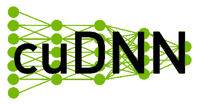

# 用 GPU 启动机器学习

> 原文：<https://www.dominodatalab.com/blog/machine-learning-gpu>

无论您是机器学习爱好者，还是为各种应用程序训练模型的忍者数据科学家，您都可能听说过需要使用[图形处理单元(GPU)](https://www.dominodatalab.com/data-science-dictionary/gpu)，以便在训练和扩展模型时获得最佳性能。这可以概括为，如果不使用 GPU，当移动到更大的数据集时，在 CPU 上需要几分钟才能完成的基于小数据集的训练任务可能需要几个小时、几天甚至几周。GPU 加速是我们之前讨论过的一个话题；参见“ [用 GPU 和 Theano](https://blog.dominodatalab.com/gpu-computing-and-deep-learning) 更快的深度学习”。

在这篇文章中，我们将探索为什么 GPU 是机器学习和深度学习的最好朋友的一些原因，以及这种友谊是如何产生的。一个很好的起点是查看中央处理器，或 CPU，并建立我们对 GPU 加速如何发生的理解。然后我们将讨论一些使用库的开发，比如 NVIDIA 的 CUDA 和 RAPIDS。

## 中央处理器(CPU)，或计算机的大脑

你可能已经看过一些描述计算机的照片，它们占据了一两个房间，而不是放在你的手中。以电子数字积分器和计算机([【ENIAC】](https://en.wikipedia.org/wiki/ENIAC))为例，它在 20 世纪 40 年代中期是最早的可编程通用计算机之一。像这样的计算机实际上是专门建造的:ENIAC 是一台十进制计算机(不是二进制的！)，用 20 个电子累加器作为存储中间运算结果的寄存器，占地 167 平方米。从那时起，计算机的中央处理器发生了很大的变化，公平地说，我们许多人都不会再考虑处理器的容量，这些处理器不仅为我们的计算机供电，也为电话、电视、汽车和自动售货机供电。如果我们停下来考虑一下，我们可以看到 CPU 实际上是这些设备的大脑，告诉其他组件做什么和什么时候做，并遵循软件提供的指令。如果没有 CPU，你可能无法像现在这样轻松地阅读这篇帖子。

20 世纪 70 年代初微处理器的出现标志着计算机使用的大脑发生了变化。几乎就在 50 年前的今天，随着英特尔 4004 芯片的发布，我们开始了一段延续至今的旅程。英特尔 4004 实际上是[世界上第一个通用可编程处理器](https://www.edn.com/intel-4004-is-announced-november-15-1971/)，这一成就之后，英特尔发布了 8 位 8080 微处理器，使我们能够表示 128 到+127 范围内的有符号数字。这听起来可能不是很多，但它足以执行算术计算，而不需要一个自己的房间。除了英特尔，其他著名的 8 位竞争对手包括 Zilog Z80 和摩托罗拉的 6800 微处理器。16 位设计出现后，32 位版本很快出现，如英特尔 i386 芯片能够表示+/-2x10^9.范围内的有符号数 32 位芯片的另一个著名例子是摩托罗拉的 MC68000，用于 [苹果丽莎](https://en.wikipedia.org/wiki/Apple_Lisa) 以及 [雅达利 ST](https://en.wikipedia.org/wiki/Atari_ST) 和[Commodore Amiga](https://en.wikipedia.org/wiki/Amiga)。从 20 世纪 90 年代开始，标准就是使用 64 位处理器。值得一提的是 AMD64 以及英特尔的 x86-64 芯片。两者都能够向后兼容 32 位遗留应用程序和 64 位本机应用程序。

故事还在继续，例如最近宣布的 2020 年苹果 M1 的，接着是 2021 年的[【M1 Pro】和](https://www.apple.com/newsroom/2021/10/introducing-m1-pro-and-m1-max-the-most-powerful-chips-apple-has-ever-built/) 。让我们以 M1 为例:它被设计为用于苹果平板电脑、手机和笔记本电脑的 CPU 和 GPU 组合，它被宣传为“低功耗硅中最快的 CPU 核心，世界上最好的 CPU 性能功耗比，世界上最快的个人电脑集成显卡，以及苹果神经引擎的突破性机器学习性能。”现在你知道了，多亏了芯片，机器学习加速了。

众所周知的“摩尔定律”概括了思考微处理器及其功能演变的一种方式，该定律表明，与成本相比，集成电路的复杂性大约每两年翻一番。自 20 世纪 70 年代以来，这一经验观察一直很有效。因此，摩尔定律的自我实现预言不仅影响了电子行业，还影响了任何其他需要跟上增长的行业。尽管如此，保持这种指数曲线变得越来越难，甚至戈登·摩尔 [在 2015 年公开表示](https://youtu.be/ylgk3HEyZ_g) 同名法律可能在未来几年内不再流行。

无论如何，CPU 不是计算机中唯一的动力。虽然您可以使用 CPU 做很多事情，包括内核数量、时钟速度和线程，但其他组件可能更适合一些任务。带来强大的图形处理单元。

## 图形处理器是计算机的灵魂

如果说 CPU 是我们电脑的大脑，有人说 GPU 就是它的灵魂。在这里，我认为 GPU 是机器学习任务的核心。GPU 是电子组件，它让我们加速在计算机随机存取存储器(RAM)中用于驱动视频显示器的部分创建图像。RAM 的这一部分被称为帧缓冲区，典型的显卡包含帧缓冲电路，可以让我们在显示器上显示内容。可以想象，在相当长的一段时间里，视频游戏中 GPU 的使用一直是一个重要的应用。在早期的 arcades 中，用于帧缓冲的 RAM 并不是最便宜的东西，并且不是添加更多的内存，而是使用专门的电路来帮助 CPU 完成这项任务。这些早期灵魂的一个很好的例子是雅达利使用的 [电视接口适配器](https://en.wikipedia.org/wiki/Television_Interface_Adaptor) 。

你可能熟悉甚至用过一些 20 世纪 80 年代早期的单色显示器。如果是这样，你可能已经使用了日立的 ARTC HD63484 处理器，支持令人印象深刻的 4K 分辨率。我们在谈论 CPU 时提到了 Amiga 准将。嗯，你不会惊讶地听到，它还附带了自定义图形硬件，加速位图操作。如果你不是那个年代的人，你肯定听说过视频图形阵列(VGA ),它是由 IBM 在 80 年代末推出的，多年来一直被用作显示标准。你可以使用这样的硬件以加速的方式渲染二维图形，但计算机和主机游戏对 3D 渲染的需求提供了创建电路板的途径，如 [世嘉 1 型和 2 型](https://en.wikipedia.org/wiki/List_of_Sega_arcade_system_boards) 或 [Namco System 22](https://en.wikipedia.org/wiki/Namco_System_22) 。

这些例子实际上都不叫 GPU。 [这个术语据说是索尼](https://www.pcgamer.com/celebrating-50-years-of-the-hardware-that-makes-our-pcs-tick/) 首先使用的，指的是 1994 年 12 月发布的 PlayStation One 中使用的 32 位东芝图形芯片。其他人认为这个术语应该归功于英伟达的 [GeForce 256](https://www.techpowerup.com/gpu-specs/geforce-256-ddr.c734) 的营销。GeForce 256 的一个重要方面是从 CPU 卸载几何计算等任务。GeForce 256 能够在 220 纳米光刻工艺中实现 50 千兆浮点运算性能，而 GeForce RTX 2080 Ti GPU 等更现代的同类产品支持 14.2 万亿次浮点运算，并基于 12 纳米工艺构建。换句话说，游戏玩家是一群快乐的人，他们拥有 GPU，可以让他们充分体验旗舰游戏，使用阴影体积，高程映射和其他许多东西的精确折射。然而，这种加速并没有被拥有同样引人注目的应用程序的其他用户所忽视。

以重新利用一些旧的游戏机 来建造一台研究黑洞的超级计算机为例。据报道，在游戏控制台 [中使用 cell 处理器和 Tesla CUDA GPU](https://www.actapress.com/Abstract.aspx?paperId=35723)有助于将传统计算机的计算速度提高近 10 倍，以模拟引力波。从游戏和计算机图形向其他应用的转移并非偶然。当你比较 CPU 和 GPU 时，原因就很明显了。例如，CPU 的内存需求高于 GPU，GPU 具有更高的处理速度，并且可以并行处理指令，这与 CPU 的串行特性相反。相当长一段时间以来，英伟达等公司一直在从战略上思考这些应用，包括机器学习。

## 深度学习的核心 GPU

可以用机器学习和深度学习算法解决的各种问题一直在增长，随着对更大和更多样化数据集的访问，这些模型的复杂性也在增加。因此，GPU 提供的加速是一个受欢迎的功能，许多机器学习实践者和数据科学家都热衷于利用这一功能。例如，考虑典型的简单神经网络的训练，该神经网络具有包括一个输入层和一个输出层的结构。如果输入层有 4 个单元，输出层有 2 个单元，则需要计算 8 个连接或参数。这应该是一个即使用手也很容易解决的问题。随着层和单元数量的增加，我们有越来越多的参数需要计算和跟踪，特别是当我们将反向传播应用于我们的神经网络时。对于成千上万的参数，一个强大的 CPU 可能会有所帮助，但随着我们继续深入深度学习中使用的[神经网络的隐藏层](/deep-learning-introduction)，参数的数量增长到 [数百亿](https://www.popsci.com/science/article/2013-06/stanfords-artificial-neural-network-biggest-ever/) 。

来源:[英伟达](https://blogs.nvidia.com/blog/2012/09/10/what-is-cuda-2/)

如果我们不使用 CPU，而是使用 GPU，那么我们的计算速度会加快，这要归功于更多的内核和它们支持的并行化。NVIDIA 通过创建一个名为 Compute Unified Device Architecture(简称 CUDA)的并行计算平台和编程模型，让程序员能够直接、自由地访问 GPU 的并行计算元素，从而使驾驭 GPU 的能力成为可能。CUDA 旨在与 Fortran 和 C/C++等强大的编程语言一起工作，让“开发人员表达大量的并行性，并将编译器引导到应用程序中映射到 GPU 的部分”，正如 NVIDIA 自己所说的。因此，并行化在许多应用中都可以实现，不仅是机器学习，还包括使用高性能计算的领域，如物理、科学建模、医学，甚至创意艺术。

特定应用程序的专门化甚至可能运行到 GPU 的核心，这绝对是故意的。就拿泰坦 RTX 来说吧，用来“驱动人工智能、机器学习和创造性工作流”，相比之下，GTX 1080Ti 就是 [#GameReady](https://www.nvidia.com/en-sg/geforce/products/10series/geforce-gtx-1080-ti/) 。类似地，支持这些设备的库也是专门化的。例如，CUDA-X AI 的库带来了 [RAPIDS](https://rapids.ai/) 等实现，让数据科学和数据工程师合作构建完全在 GPU 上运行的端到端管道:从数据准备任务到 cuML 中流行的机器学习算法的实现，包括一个名为 cuDF 的类似熊猫的数据报库，甚至还有一个名为 cuGraph 的网络分析库。RAPIDS 能够与其他深度学习库集成，甚至支持基于 Python 的可视化库，使数据科学家更容易专注于他们最了解的东西。Domino MLOps 平台全面集成了上述技术，并且由于 Domino/NVIDIA 的合作关系，可以利用 GPU 加速计算，无缝使用 RAPIDS，并利用开箱即用的 [NVIDIA 容器](https://catalog.ngc.nvidia.com/containers) 。你可以通过观看 Domino/NVIDIA 联合举办的名为 [如何使用 Domino & NVIDIA](https://www.youtube.com/watch?v=6oE9-sBNf6A&ab_channel=DominoDataLab) 简单运行复杂的 AI 训练&推理工作负载的网络研讨会的录像来了解更多信息。

## 摘要

在这篇文章中，我们讨论了为什么 GPU 加速是增加模型复杂性时要考虑的事情。CPU 是计算机的重要组成部分，而 GPU 执行更专业的任务。CPU 适用于延迟或每核心性能非常重要的任务，以便快速执行任务。GPU 是一种通用并行处理器，它可能已经开始为适用于游戏的图形和 3D 渲染任务提供动力，但今天我们能够利用它来使机器学习任务更加高效和快速。

借助 NVIDIA 的 CUDA、CUDA-X AI 等专用库，我们能够更好地利用我们的 GPU。此外，专门的高级库和 API(如 RAPIDS)使我们比以往任何时候都更容易入门。NVIDIA 有许多资源，包括一些关于深度学习、加速计算和数据科学的在线课程。

