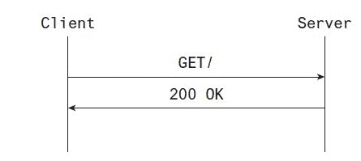
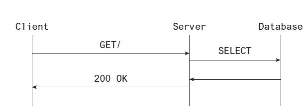
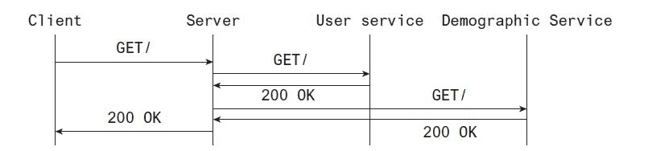
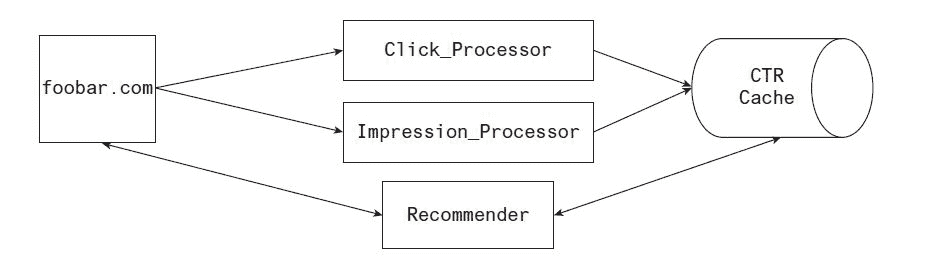
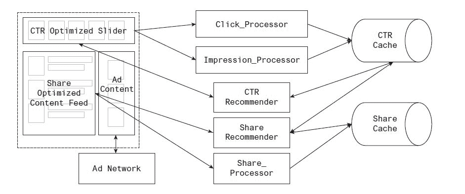

# 生产中的机器学习:软件架构

> 原文：<https://www.dominodatalab.com/blog/machine-learning-in-production-software-architecture>

*特别感谢[Addison-Wesley Professional](http://www.informit.com/store/machine-learning-in-production-developing-and-optimizing-9780134116549?utm_source=Referral&utm_medium=DominoLabs&utm_campaign=Kelleher)允许从书中摘录以下“软件架构”章节，[生产中的机器学习](http://www.informit.com/store/machine-learning-in-production-developing-and-optimizing-9780134116549?utm_source=Referral&utm_medium=DominoLabs&utm_campaign=Kelleher)。本章节选为数据科学家提供了在将机器学习模型应用于生产时需要考虑的见解和权衡。另外，如果您有兴趣了解 Domino 如何为您的模型提供 API 端点，请查看 Domino 支持站点上的视频教程[。](https://support.dominodatalab.com/hc/en-us/articles/360021394232)*

## 介绍

在 Domino T1，我们与各行各业的数据科学家合作，从保险和金融到超市和航空航天。我们收到的最常见的问题之一是，“*我如何将我的模型投入生产？*“这是一个很难回答的问题，没有软件是如何架构的背景。作为数据科学家，我们需要知道我们的代码，或者代表我们代码的 API，如何适应现有的软件栈。只有到那时，我们才能开始与我们的工程师就将模型整合到产品中进行严肃的讨论。

为了给与工程师的对话打下基础，我与 Domino 的内容负责人合作，请求[Addison-Wesley Professional(AWP)](https://www.pearson.com/us/higher-education/series/Addison-Wesley-Professional-Computing-Series/334583.html)允许从书中摘录以下“软件架构”章节， *[生产中的机器学习](http://www.informit.com/store/machine-learning-in-production-developing-and-optimizing-9780134116549?utm_source=Referral&utm_medium=DominoLabs&utm_campaign=Kelleher)* 。非常感谢 AWP 的适当许可。

## 17.1 软件架构:章节介绍

如果您考虑构建和运行给定应用程序或数据管道的总成本，您会发现有两个主要因素。首先是研发成本。构建应用程序本身本质上是人的力量。第二个是托管应用程序的成本，即基础设施成本。存储数据要花多少钱？运行响应查询或构建模型的服务器需要多少成本？

你从第 15 章[[中对硬件瓶颈的理解有助于预测基础设施成本，因为避免不同的瓶颈会产生不同的影响。开发的成本呢？除了行政、管理和程序实践之外，软件架构还可以帮助减轻一些生产成本，并平衡代码的可读性和组织与硬件瓶颈。](http://www.informit.com/store/machine-learning-in-production-developing-and-optimizing-9780134116549?utm_source=Referral&utm_medium=DominoLabs&utm_campaign=Kelleher)

有许多软件体系结构可供选择，这些体系结构导致应用程序的不同粒度或模块化级别。每种方法都有所取舍，平衡认知开销的节省和基础设施成本的节省。下面几节将讨论其中的几个。

## 17.2 客户端-服务器架构

在最基本的客户机-服务器应用程序中，有两个组件:客户机和服务器。客户端向服务器发送请求，服务器监听并响应这些请求。

在绝大多数应用程序中，客户机和服务器之间的通信是在套接字上进行的。套接字有很多种，但您最常使用的是 UNIX 域套接字和 Internet 套接字。

UNIX 套接字通过在单个节点上的操作系统缓冲区中写入和读取信息来进行通信。互联网套接字从网络接口读取和写入信息。套接字是底层操作系统功能上的 API，而底层操作系统功能本身是硬件功能的 API。

使用 Internet 套接字的客户机的一些例子有:您最喜欢的 web 浏览器、像 Napster 这样的点对点下载工具、您用来登录远程机器的 OpenSSL 客户机，或者您用来从 API 主机与远程数据库交互的数据库客户机。

您可能熟悉的几个 web 服务器是 nginx、apache 和 lighttpd。一些数据库服务器是 mysqld、postgresql 和 mongod。还有许多其他的服务器，例如 OpenVPN、openssh-server 和 nsqd 等等。

您可能会注意到许多服务器以 d 结尾，这是*守护进程*的缩写，它是一个长期运行的进程，只要应用程序运行，它就(几乎)不会停止。例外情况与维护有关，例如更新服务器软件、更新主机硬件或在更改后重新加载配置。一般来说，大多数(如果不是全部的话)服务器都是守护进程。

另一方面，客户端通常是短命的进程。它们打开与套接字服务器的连接，监听并在连接结束时关闭这些连接。以你的浏览器为例。当您从 web 服务器请求网页时，浏览器会在端口 80 (HTTP)上建立连接，或者在端口 443 (HTTPS)上建立加密连接。它向服务器发送请求，请求组成网页的数据并显示给你。当您关闭浏览器时，客户端会关闭，但服务器会继续运行。

要完成一个请求，客户端必须首先将它发送到服务器。一旦服务器收到请求，它必须处理请求，然后发送响应。这如图 17.1 所示。请求到达服务器并被发回所需的时间称为*延迟*。

 Figure 17.1 A simple client-server interaction

由于客户端和服务器倾向于使用套接字，它们会受到影响延迟的硬件和/或网络瓶颈的影响，正如我们在本书的前一章[中所讨论的。](http://www.informit.com/store/machine-learning-in-production-developing-and-optimizing-9780134116549?utm_source=Referral&utm_medium=DominoLabs&utm_campaign=Kelleher)

## 17.3 多层/面向服务的架构

基本服务器-客户机体系结构的一个更复杂的版本是 n 层或面向服务的体系结构。该层旨在表明存在许多级别的服务器和客户端，每一级都可能提供服务并发送请求。层可以是第三方服务，也可以是在本地网络中运行的服务。

典型的 web 应用程序就是一个例子，其中浏览器向 web 服务器发送请求，底层数据库客户端向数据库服务器发送请求以实现该请求。这增加了一层必须连续完成的交互，从而使基本的服务器-客户端交互变得复杂。现在，您不只是拥有从客户端到服务器的往返行程(以及由此产生的延迟)。您需要在客户端和服务器之间往返。

由于数据库结果是满足客户机请求所必需的，所以它通常必须在服务器开始响应请求之前发生。这如图 17.2 所示。

 Figure 17.2 A client-server interaction backed by a database

如您所见，每一层的客户机和服务器之间的延迟给应用程序增加了一层延迟，因为请求是连续发生的。这可能是面向服务的体系结构的一个主要缺点，尤其是当有许多相互依赖的请求连续发生时。

通常，服务是由一些关注点划分的。例如，您可能有一个服务负责与用户记录(姓名、地址、电子邮件等)的基本交互，而另一个第三方服务可能负责提供这些用户的人口统计信息。

如果您想用该用户及其人口统计信息填充网页，您的 web 应用程序必须查询用户服务和人口统计信息服务。因为人口统计服务是第三方服务，所以它使用与应用程序商店不同的查找关键字。为此，您必须在查询第三方之前查找用户记录。

因为您的应用程序可能使用许多第三方服务，所以更新您的应用程序以使用第三方用户 ID 通常不是一个合理的解决方案。仍然有一些方法可以让这个过程更快。

意识到应用程序中的大部分延迟都花在了等待读取套接字上，您可以实现对用户和人口统计数据的异步请求。现在，总延迟大约是两者中较大的一个，而不是两者之和。

加快速度的第二种方法是将两个服务分解成一个。您可以为所有用户发出一次请求，并随数据库中的用户记录一起查询，而不是向第三方查询人口统计数据。这使得两个请求合并为一个，增加了额外的存储开销(图 17.3)。

Figure 17.3 A client-server interaction backed by multiple services

## 17.4 微服务

微服务类似于 n 层架构，只是它们没有严格的分层。服务可以与它们需要的任何服务进行交互，具有任何需要的相互依赖性。图 17.4 描述了一个示例网络图。

Figure 17.4 An example microservice architecture

微服务软件架构通常被组织为一大组独立的应用程序，每个应用程序尽可能独立运行。对于所有的应用程序(当代码库不太大时)或产品关注点，代码被放置在根目录下。

对于数百甚至数千个小型应用程序，微服务软件架构最常见的抱怨是可维护性和可读性。这种代码组织方法与整体架构形成对比。

## 整体式

如果微服务是尽可能最小的应用程序，被分解以将它们的业务关注点彼此分离，那么整体架构在组织方面接近于相反。

当可以避免样板文件或重复的代码，以利于在现有代码库中实现新功能时，开发就变得容易了。这是单片架构如此受欢迎的原因之一，也是它们被采用的自然原因。

当一个深度嵌套的依赖项需要改变它的函数签名时，整体架构的一个问题就来了。要么必须更新实现该特性的所有代码以匹配签名，要么必须构建一个桥以使遗留代码兼容。这两种结果都不可取。

一方面，整体架构中的代码可以根据对象和功能效用(例如，用户对象、认证、数据库路由)来组织，从而易于查找和扩展。另一方面，将您可能需要的所有工具放在您面前可能会导致溜溜球问题，您必须在调用堆栈中爬上爬下来找出错误或添加新功能，这增加了许多认知开销。

## 17.6 实际案例(混搭架构)

根据您正在构建的应用程序，这种或那种架构可能最适合您。

如果您的代码库有明确的产品分离，微服务架构可能是最好的。

如果您的应用程序被期望为一个共同的、复杂的产品目的重用许多共同的数据访问组件，那么您可以选择一个整体架构。

如果这两件事都是真的，你可以选择一个架构的组合，如图 17.5 所示。在左边，您可以看到 web 页面的组件，在右边是服务于这些组件的服务的图表。

Figure 17.5 An example polyglot architecture

## 17.7 结论

在这一章中，我们讨论了几种软件架构，它们可以帮助你随着应用程序的增长来组织你的代码。每一种都有一些优点和缺点。不管你选择什么架构，都应该是一种选择。默认情况下通常是一个整体，这并不适合每一个场合。

了解 n 层、微服务、monoliths 和基本客户机-服务器应用程序之间的区别，您对架构的选择肯定是明智的。