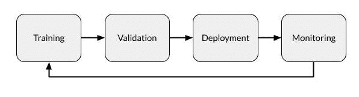

# 机器学习模型部署指南

> 原文：<https://www.dominodatalab.com/blog/machine-learning-model-deployment>

机器学习(ML)部署包括将一个工作 ML 模型放入一个环境中，在这个环境中它可以完成它被设计要做的工作。模型部署和监控的过程需要大量的计划、文档和监督，以及各种不同的工具。

## 什么是机器学习模型部署？

机器学习模型部署是将完成的机器学习模型放置到真实环境中的过程，在真实环境中，机器学习模型可以用于其预期目的。模型可以部署在广泛的环境中，并且它们通常通过 API 与应用程序集成，以便最终用户可以访问它们。

虽然部署是数据科学生命周期(管理、开发、部署和监控)的第三阶段，但模型创建的每个方面都是在考虑部署的情况下进行的。

模型通常是在精心准备的数据集环境中开发的，在那里它们被[训练和测试](https://www.dominodatalab.com/blog/what-is-machine-learning-model-training)。在开发阶段创建的大多数模型都没有达到预期的目标。很少有模型通过他们的测试，那些确实代表了相当大的资源投入。因此，为了项目的成功，将一个模型移动到一个动态环境中可能需要大量的计划和准备工作。

## 如何将机器学习模型部署到生产中

机器学习模型部署需要各种技能和才能一起工作。一个数据科学团队开发模型，另一个[团队验证模型](https://www.dominodatalab.com/blog/what-is-model-validation)，工程师负责将其部署到生产环境中。

### 准备部署 ML 模型

在部署模型之前，需要对其进行培训。这包括选择一种算法，设置其参数，并根据准备好的、干净的数据对其进行训练。所有这些工作都是在培训环境中完成的，培训环境通常是一个专门为研究设计的平台，拥有实验所需的工具和资源。当一个模型被部署时，它被转移到一个生产环境中，在这个环境中，为了安全和高效的性能，资源被简化和控制。

在完成开发工作的同时，部署团队可以分析部署环境，以确定完成后什么类型的应用程序将访问模型、它将需要什么资源(包括 GPU/CPU 资源和内存)以及它将如何获得数据。

### 验证 ML 模型

一旦模型被训练并且其结果被认为是成功的，它需要被验证以确保它的一次性成功不是异常的。验证包括 [在新数据集上测试模型](https://www.datavedas.com/model-validation-techniques/) ，并将结果与其初始训练进行比较。在大多数情况下，几个不同的模型被训练，但只有少数是足够成功的验证。在经过验证的模型中，通常只部署最成功的模型。

验证还包括审查培训文档，以确保该方法符合组织的要求，并且所使用的数据符合最终用户的要求。大部分验证通常是为了满足法规遵从性或组织治理要求，例如，这些要求可能规定可以使用哪些数据以及必须如何处理、存储和记录这些数据。

### 部署 ML 模型

实际部署模型的过程需要几个不同的步骤或操作，其中一些将同时进行。

首先，模型需要移动到它的部署环境中，在那里它可以访问它需要的硬件资源以及它可以从中提取数据的数据源。

第二，模型需要集成到流程中。例如，这可以包括使用 API 从最终用户的笔记本电脑访问它，或者将它集成到最终用户当前使用的软件中。

第三，将使用该模型的人需要接受如何激活它、访问它的数据和解释它的输出的培训。

### 监控 ML 模型

[数据科学生命周期](https://www.dominodatalab.com/blog/how-enterprise-mlops-works-throughout-the-data-science-lifecycle)的监控阶段在模型成功部署后开始。

[模型监控](https://www.dominodatalab.com/resources/model-monitoring-best-practices/) 确保模型工作正常，预测有效。当然，不仅仅是模型需要被监控，尤其是在早期的运行中。部署团队需要确保支持软件和资源按要求运行，并且最终用户已经过充分的培训。部署后可能会出现许多问题:资源可能不足，数据馈送可能没有正确连接，或者用户可能没有正确使用他们的应用程序。

一旦您的团队确定模型及其支持资源运行正常，仍然需要继续监控，但是大部分监控可以自动进行，直到出现问题。

监控模型的最佳方式是定期评估其在部署环境中的性能。这应该是一个自动化的过程，使用工具来跟踪指标，以自动提醒您其准确性、精确度或 F 分数是否有变化。

由于以下问题，每个部署的模型都有可能随着时间的推移而降级:

*   **部署数据的差异。**通常，在部署中给予模型的数据不会像训练和测试数据那样被清理，从而导致模型部署中的变化。
*   **数据完整性的变化。**在数周、数月或数年内，输入模型的数据变化会对模型性能产生负面影响，如格式变化、重命名字段或新类别。
*   **数据漂移。**人口统计、市场变化等的变化会导致时间漂移，使得训练数据与当前情况的相关性降低，因此模型的结果也不精确。
*   **观念漂移。**最终用户对正确预测的预期会随着时间的推移而改变，从而降低模型预测的相关性。

使用企业数据科学平台，您可以使用各种监控工具自动监控中的每一个问题，并且一旦在模型中检测到差异，就向您的数据科学团队发出警报。

## 模型部署和监控

成功部署和监控一个[机器学习模型](https://www.dominodatalab.com/blog/a-guide-to-machine-learning-models)需要多种多样的技能以及不同团队中许多不同人员之间的协作。它还需要经验和工具的使用，以帮助这些团队有效地合作。成功部署模型的模型驱动的组织依赖于工具和资源，所有这些都在一个单一的 ML 操作平台中。

David Weedmark 是一位出版作家，曾担任过项目经理、软件开发人员和网络安全顾问。

