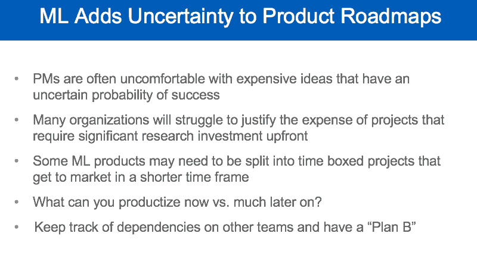

# 机器学习产品管理:经验教训

> 原文：<https://www.dominodatalab.com/blog/machine-learning-product-management-lessons-learned>

*这份多米诺数据科学领域笔记涵盖了[皮特·斯科莫洛赫](https://twitter.com/peteskomoroch)最近的[地层伦敦谈话](https://www.slideshare.net/pskomoroch/executive-briefing-why-managing-machines-is-harder-than-you-think-145716964)。它侧重于他的 ML 产品管理的见解和经验教训。如果你有兴趣听到更多关于 ML 或 AI 产品管理的实际见解，那么考虑参加 Pete 即将在 Rev.* 举行的会议

## 机器学习项目很难:从确定性过程转变为概率性过程

多年来，我听数据科学家和机器学习(ML)研究人员[讲述了阻碍他们工作的各种痛点](https://blog.dominodatalab.com/data-science-vs-engineering-tension-points/)和挑战。不幸的是，许多行业人士面临的一个共同挑战包括对抗“[模型神话](https://blog.dominodatalab.com/model-management-era-model-driven-business/)”，或者认为因为他们的工作包括代码和数据，他们的工作“应该”被像软件工程一样对待。我很幸运地在 2018 年 11 月的奥莱利雷达会议上看到了[皮特·斯科莫洛赫](https://twitter.com/peteskomoroch)的 ML 产品管理演示的早期版本。Pete 指出，ML 项目困难的原因之一是因为“机器学习将工程从确定性过程转变为概率性过程。”不出所料，这次演讲充满了针对许多痛点的实用见解。

 Pete Skomoroch, O’Reilly Radar Conference, San Francisco, November 2018

当皮特发布他的 ML 产品管理演讲的最新版本时，来自[伦敦地层](https://conferences.oreilly.com/strata/strata-eu/public/schedule/speaker/76203)的“[为什么管理机器比你想象的](https://www.slideshare.net/pskomoroch/executive-briefing-why-managing-machines-is-harder-than-you-think-145716964)更难”，我联系他请求允许报道和摘录他的作品。虽然这次演讲既提供了机器学习的组织基础，也提供了在发布 ML 项目时要考虑的产品管理见解，但在这篇博客文章中，我将重点关注后者。然而，如果你想回顾前者，那么完整的甲板是可用的[在这里](https://www.slideshare.net/pskomoroch/executive-briefing-why-managing-machines-is-harder-than-you-think-145716964)。非常感谢 Pete 的许可和在这篇文章上与我的合作。如果你有兴趣现场观看 Pete 的下一次演讲，那么考虑参加他在 Rev。

## 面向机器学习的产品管理

Pete 在他的 2018 年 11 月和 Strata London 会谈中指出，ML 需要比传统软件工程更具实验性的方法。它更具实验性，因为它是“一种涉及从数据中学习的方法，而不是以编程方式遵循一套人类规则。”因为 ML 项目的性质和方法更具实验性，行业人士和他们的公司在尝试之前不会知道会发生什么(即，更多的概率性而不是确定性)。这可能会给产品管理带来挑战，因为许多产品经理(PM)都接受过关于运输项目的确定性方法的培训。

为了帮助解决这些挑战，Pete 建议项目经理获得一些额外的技能，包括发展对 ML 如何工作的直觉，从 ML 的角度理解什么是可行的，以及“知道简单、困难和不可能的机器学习问题之间的区别。”

PMs 可以利用这种直觉，根据他们公司的数据“以及如何使用这些数据来解决客户问题”来校准各种方法的权衡。Pete 建议在流程的早期引入 ML 专家和数据科学家，并且在迭代优先考虑哪些功能或项目时“创建一个影响和易用性的图表，然后根据 ROI 对项目进行排序”。对公司数据的深刻理解、数据如何解决客户问题、ML 直觉和领域专业知识的结合，有助于项目经理确保他们致力于对业务至关重要的正确问题。Pete 概述了运送大多数 ML 项目的 5 个步骤，并指出步骤 2-4 占用了大部分时间。这些步骤也反映了 ML 产品管理的实验性质。

Pete 认为，提高模型准确性的最重要的价值之一是特征工程，即发现你在原始数据中发现的创造性信号，从原始数据中提取它们，然后将其转换为适合你的机器学习模型的格式(或更好的输入)。他建议尽快将算法的第一个版本发布给用户，这样可以进行迭代改进以支持业务影响。Pete 建议 PMs 记住，大约 80%的工作发生在第一个版本发布之后。这项工作包括模型的改进以及向模型中添加新的信号和特征。他还建议项目经理在将产品展示给用户之前，不要对 ML 项目进行“无休止的 UI 更改”，因为“看似很小的 UI 更改可能会导致大量的后端 ML 工程工作”，这可能会将整个项目置于风险之中。PM 的最后一步是“使用来自系统的派生数据来构建新产品”，因为这提供了另一种方法来确保整个业务的 ROI。

## 解决 ML 给产品路线图带来的不确定性

由于 ML 项目本质上更具实验性和概率性，它们有可能“增加产品路线图的不确定性”在这里，Pete 概述了项目经理需要考虑的常见挑战和关键问题。

然后，他建议项目经理使用适当的用户输入表格收集数据，这些表格将收集他们需要的正确数据，“对你想要预测的潜在现象进行建模，并且项目经理需要仔细平衡详尽数据收集的愿望和用户体验。”

Pete 还建议项目经理重新考虑他们的测试方法，因为 ML 系统运行在基础输入数据上，这些数据经常以不可预测的方式随时间变化。他主张由真正的使用者使用，因为“阳光是最好的消毒剂”。这也强化了他早先提出的尽快发布 1.0 版本的建议。

Pete 还强调了他之前提到的“看似很小”的变化会产生“意想不到的后果”虽然早些时候，他警告 PMs，看似很小的 UI 更改可能会导致重大的后端工程，看似很小的产品更改，如“改变问题的措辞”，可能会导致用户给出的数据发生变化，并可能在历史数据中添加时间依赖性。这导致在训练 ML 模型中使用历史数据的潜在复杂性。

## 结论

Pete Skomoroch 在他的 [Strata London talk](https://www.slideshare.net/pskomoroch/executive-briefing-why-managing-machines-is-harder-than-you-think-145716964) 中提出了务实的建议和见解，重点是如何制造和运输成功的 ML 产品。再次非常感谢 Pete 允许摘录他的 Strata London 演讲，并抽出时间合作撰写这份 Domino 数据科学领域笔记，重点关注他的 ML 产品管理见解和经验教训。如果你有兴趣听到更多关于 ML 或 AI 产品管理的实际见解，那么考虑参加 Pete 即将在 Rev。

*^([多米诺数据科学领域笔记](https://blog.dominodatalab.com/tag/domino-data-science-field-note/)提供数据科学研究、趋势、技术等亮点，支持数据科学家和数据科学领导者加快工作或职业发展。如果您对本博客系列中涉及的数据科学工作感兴趣，请发送电子邮件至 content(at)dominodatalab(dot)com。)*