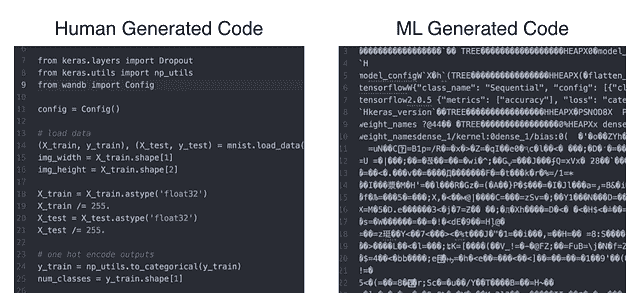
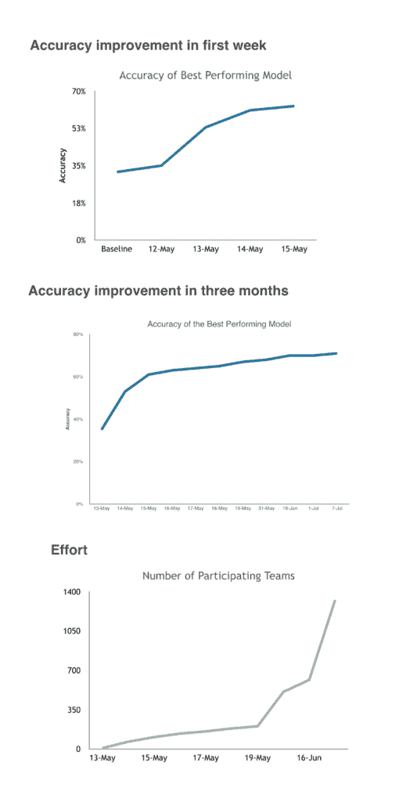
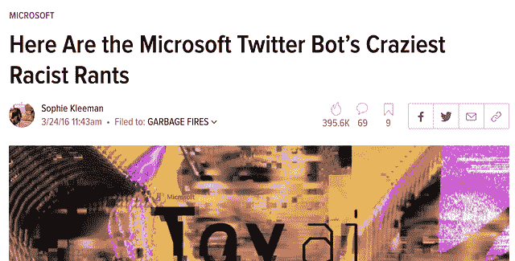

# 机器学习项目:挑战和最佳实践

> 原文：<https://www.dominodatalab.com/blog/machine-learning-projects-challenges-best-practices>

*这篇博客文章提供了关于为什么机器学习团队在管理机器学习项目方面面临挑战的见解。他还提供了如何应对这些挑战的最佳实践。本文由[卢卡斯](https://twitter.com/l2k)提供，最初出现在[媒体](https://medium.com/@l2k/why-are-machine-learning-projects-so-hard-to-manage-8e9b9cf49641)上。*

## 为什么机器学习项目这么难管理？

我看到许多公司试图部署机器学习——有些大获成功，有些惨败。一个不变的是，机器学习团队很难设定目标和设定预期。这是为什么呢？

### 事先真的很难分辨什么是难，什么是容易。

下棋赢卡斯帕罗夫难还是拿起棋子物理移动难？二十多年前，计算机打败了国际象棋世界冠军，但可靠地抓取和举起物体仍然是一个未解决的研究问题。人类不擅长评估什么对 AI 来说会很难，什么会很容易。即使在一个域中，性能也会有很大差异。预测情绪有什么好的准确性？在电影评论上，有很多文字，作者往往对他们的想法相当清楚，现在 90-95%的准确性是预期的。在 Twitter 上，两个人可能 80%的时候都同意一条推文的观点。通过总是预测情绪将是负面的，对关于某些航空公司的推特情绪可能有 95%的准确性。

度量也可能在项目早期增加很多，然后突然碰壁。我曾经举办过一次 Kaggle 比赛，世界各地成千上万的人参加比赛，为我的数据建模。在第一周，准确率从 35%到 65%,但在接下来的几个月里，准确率从未超过 68%。68%的准确率显然是最好的最新机器学习技术对数据的限制。那些参加 Kaggle 比赛的人非常努力地工作，以达到 68%的准确率，我确信这是一个巨大的成就。但是对于大多数用例来说，65% vs 68%是完全无法区分的。如果这是一个内部项目，我肯定会对结果感到失望。

我的朋友 Pete Skomoroch 最近告诉我，作为一名从事机器学习的数据科学家，单口相声是多么令人沮丧。工程项目一般会向前推进，但是机器学习项目可能会完全停滞。花一周的时间对数据建模却没有任何改进，这是可能的，甚至是常见的。

### 机器学习容易以意想不到的方式失败

只要你有大量的训练数据*和*你在生产中运行的数据看起来很像你的训练数据，机器学习通常就能很好地工作。人类如此擅长从训练数据中归纳，以至于我们对此有可怕的直觉。我建造了一个小机器人，它有一个摄像头和一个视觉模型，这个模型是根据 ImageNet 网站上的数百万张图片训练出来的。我对我的机器人相机上的图像进行了预处理，使其看起来像来自网络的图像，但准确性比我预期的要差得多。为什么？网络上的图片倾向于框定所讨论的对象。我的机器人不一定会像人类摄影师那样正确地看待一个物体。人类可能甚至没有注意到这种差异，但现代深度学习网络遭受了很多痛苦。有很多方法可以处理这种现象，但是我注意到这一点是因为性能的下降太不和谐了，所以我花了很多时间来调试它。

更致命的是导致性能下降的细微差别，这一点很难发现。在《纽约时报》上训练的语言模型不能很好地推广到社交媒体文本。我们可能预料到了。但显然，在 2017 年的文本上训练的模型在 2018 年写的文本上表现下降。上游分布随时间以多种方式转移。随着对手适应欺诈模型的作用，欺诈模型会完全崩溃。

### 机器学习需要大量的相关训练数据

每个人都知道这一点，但这是一个巨大的障碍。计算机视觉可以做令人惊讶的事情，只要你能够收集和标记大量的训练数据。对于某些用例，数据是某些业务流程的免费副产品。这是机器学习非常有效的地方。对于许多其他用例来说，训练数据非常昂贵，收集起来非常困难。许多医疗用例似乎非常适合机器学习——具有大量微弱信号和明确结果的关键决策——但这些数据由于重要的隐私问题而被锁定，或者最初没有一致地收集。

许多公司不知道从哪里开始投资收集培训数据。这是一项重大努力，很难事先预测该模型的效果如何。

## 处理这些问题的最佳实践是什么？

### 非常注意你的训练数据。

看看算法对其接受训练的数据进行错误分类的情况。这些几乎总是错误的标签或奇怪的边缘情况。不管怎样，你真的想了解他们。让每个参与构建模型的人查看训练数据，并自己标记一些训练数据。对于许多用例来说，一个模型不太可能比两个独立的人达成一致的速度更好。

### 立即让一些东西端到端地工作，然后一次改进一件事情。

从可能有效的最简单的东西开始，并部署它。你会从这件事中学到很多。过程中任何阶段的额外复杂性都会改进研究论文中的模型，但很少改进现实世界中的模型。证明每一个额外的复杂性。将某些东西交到最终用户手中，有助于你提前了解模型的工作情况，还会带来一些关键问题，比如模型优化的内容和最终用户想要的内容之间的分歧。这也可能让你重新评估你正在收集的训练数据。快速发现那些问题要好得多。

### 寻找优雅的方式来处理算法失败的不可避免的情况。

几乎所有的机器学习模型在相当长的时间内都会失败，如何处理这一点是绝对关键的。模型通常有一个可靠的置信度，您可以使用它。通过批处理，您可以构建人在回路系统，向操作员发送低置信度预测，使系统端到端可靠地工作，并收集高质量的训练数据。对于其他用例，您可能能够以标记潜在错误或减少最终用户烦恼的方式来呈现低置信度预测。

这里有一个失败的例子，它没有被很好的处理。微软没有预测到他们的 [Tay 机器人](https://gizmodo.com/here-are-the-microsoft-twitter-bot-s-craziest-racist-ra-1766820160)会多快从 Twitter 上的巨魔那里学会不良行为。

 *Image captured from [Sophie Kleeman's article on Gizmodo](https://gizmodo.com/here-are-the-microsoft-twitter-bot-s-craziest-racist-ra-1766820160)*

## 下一步是什么？‍

机器学习的最初目标主要是围绕智能决策，但我们越来越多地试图将机器学习应用到我们使用的产品中。随着我们开始越来越依赖机器学习算法，机器学习不仅成为一个研究课题，也成为一门工程学科。我对有机会构建全新类型的产品感到非常兴奋，但也担心缺乏工具和最佳实践。以至于我开了一家名为“重量与偏见”的公司来帮助解决这个问题。如果您有兴趣了解更多信息，请查看我们正在进行的活动。

*感谢 [Yan-David Erlich](https://medium.com/@yanda) 、 [James Cham](https://medium.com/@jamescham) 、 [Noga Leviner](https://medium.com/@nogaleviner) 和 [Carey Phelps](https://medium.com/@careyphelps) 阅读本书的早期版本，感谢 [Peter Skomoroch](https://medium.com/@peteskomoroch) 让我思考这个话题。*