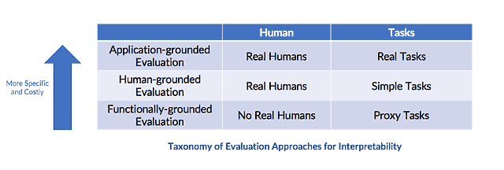

# 让机器学习的可解释性更加严谨

> 原文：<https://www.dominodatalab.com/blog/make-machine-learning-interpretability-rigorous>

*这份 Domino 数据科学领域笔记涵盖了机器学习可解释性的拟议定义，可解释性为何重要，以及考虑对可解释性进行严格评估的理由。见解来自于[的压轴多希-维勒兹](https://finale.seas.harvard.edu/)的演讲，“[可解释性严谨科学的路线图](https://www.youtube.com/watch?v=MMxZlr_L6YE)”以及论文“[迈向可解释机器学习的严谨科学](https://arxiv.org/abs/1702.08608)”。这篇论文是由[压轴 Doshi-维勒兹](https://finale.seas.harvard.edu/)和 [Been Kim](https://beenkim.github.io/) 共同撰写的。finale Doshi-维勒兹是哈佛大学鲍尔森工程学院计算机科学助理教授，Been Kim 是谷歌大脑的研究科学家。*

## 介绍

[数据科学家做模型](https://blog.dominodatalab.com/model-management-era-model-driven-business/)。模型，特别是基于概率评估提出建议或规定行动的算法，有能力改变，并被“重新训练”(有时会产生意想不到的后果)。这导致数据科学家考虑评估超出预期任务性能的模型的方法。数据科学家能够使用可解释性(以及对其不断增长的研究)来满足辅助标准，包括被信任(人类用户的信心)、避免不可量化的[偏见](https://blog.dominodatalab.com/ingesting-kate-crawfords-trouble-with-bias/)、隐私、[提供解释权](https://arxiv.org/abs/1606.08813)等等。然而，对于“可解释性”的定义是否有共识？还是“评估可解释性”？这篇博客文章涵盖了机器学习可解释性的拟议定义以及对可解释性的严格评估。这篇博客文章中涉及的见解来自终曲 Doshi-维勒兹的演讲，“[可解释性的严格科学的路线图](https://arxiv.org/abs/1702.08608)”以及论文“[迈向可解释机器学习的严格科学](https://arxiv.org/abs/1702.08608)”。论文[由压轴多希-维勒兹和 Been Kim 共同撰写。](https://arxiv.org/abs/1702.08608)

## 定义:机器学习环境中的可解释性

金和多希-维勒兹认为，“对于机器学习中的可解释性是什么以及如何评估它以进行基准测试，人们几乎没有共识”，并提出“在 ML 系统的背景下，我们将可解释性定义为以人类可理解的术语解释或呈现的能力。”多希-维勒兹在演讲中指出，“解释”是可解释性的词根，字典对“解释”的定义是解释或提供意义。多希-维勒兹还指出，“解释”这个词是一个“比可解释性更能让人感觉到的词”，并允许人们思考“什么是好的解释？我向你解释过什么吗？”并要求观众思考“这个解释的质量如何”作为一种手段来引入评估可解释性的严谨性概念。

## 为什么是可解释性

不是所有的 ML 系统都需要可解释性。当“不可接受的结果没有重大后果”或当 ML“在实际应用中经过充分研究和验证，我们相信系统的决定，即使系统并不完美”时，不需要可解释性。当不满足辅助标准，并且出现关于偏见、信任、安全、道德和不匹配目标的问题时，需要可解释性。金和多希-维勒兹“认为，对可解释性的需求源于问题形式化的不完全性，这为优化和评估制造了一个根本性的障碍”，例如，“不完全性会产生某种无法量化的偏差”。

## 当前对可解释性的评估:两类

金和多希-维勒兹指出，目前对可解释性的评估通常分为两类，这两类都基于“当你看到它时你就会知道”的观点。第一类“评估应用环境中的可解释性:如果系统在实际应用或其简化版本中有用”，那么它是可解释的。第二类

> *“通过可量化的代理评估可解释性:研究人员可能首先声称某些模型或类(例如，稀疏线性模型、规则列表、梯度提升树)是可解释的，然后在该类中提出算法进行优化。”*

虽然多希-维勒兹和金都指出这些分类是合理的，但他们质疑“是否所有定义为可解释的模型类中的所有模型都是同样可解释的？”虽然“稀疏性等可量化的代理允许进行比较”，但这也适用于“将特征稀疏的模型与原型稀疏的模型进行比较”吗并非所有的应用程序都有相同的可解释性需求。两人都主张对可解释性的评估要更加严格。他们引用 GDPR 和越来越多的关于可解释性的研究作为提出额外严格性的理由。他们还建议“研究的主张应该与评估的类型相匹配”。

## 提议的可解释性评估

多希-维勒兹和金提出了一个可解释评估方法的分类法:基于应用的评估、基于人的度量和基于功能的评估。

## 基于应用的评估

多希-维勒兹在演讲中指出，当研究人员心中有一个明确的目标，可解释性在实际应用中得到评估，可解释性提供了确凿的证据，并使研究人员能够执行更高层次的任务时，这种度量就会出现。然而，“执行这些评估可能会很昂贵，因为你必须在真实的应用程序环境中进行，你可能会好奇它是否具有普遍性。”在论文中，金和多希-维勒兹引用了一个基于应用的评估的例子，即“与医生一起诊断患有特定疾病的患者——展示模型工作的最佳方式是根据任务评估它:医生执行诊断”…。并确定“它是否导致更好地识别错误、新的事实或更少的歧视”。

## 以人为基础的度量

金和多希-维勒兹将这一指标详细描述为“进行更简单的人体实验，保持目标应用的本质”。当领域专家的实验非常昂贵或者访问目标社区很困难时，这可能是有用的。一个更简单的人类受试者实验的例子包括二元强制选择，或者当“人类面对成对的解释，必须选择他们认为质量更高的一个(量化的基本面部有效性测试)”。

## 基于功能的评估

多希-维勒兹和金指出，这一指标不包括人类实验，而是使用“可解释性的正式定义作为解释质量的代理”。这个评估是“一旦我们有了一类已经被验证的模型或规则，例如基于人类的实验，这是最合适的”。“或者人体实验不道德的时候”。

## 结论

虽然这篇博客文章涵盖了关于金和多希-维勒兹提出的机器学习可解释性定义和对可解释性进行更严格评估的分类法的精华，但更多见解和深度可在[论文](https://arxiv.org/abs/1702.08608)中获得。多希-维勒兹谈话的完整视频也可供[观看](https://www.youtube.com/watch?v=MMxZlr_L6YE)。

*^(Domino 数据科学领域笔记提供数据科学研究、趋势、技术等亮点，支持数据科学家和数据科学领导者加快工作或职业发展。如果您对本博客系列中涉及的数据科学工作感兴趣，请发送电子邮件至 writeforus(at)dominodatalab(dot)com。)*