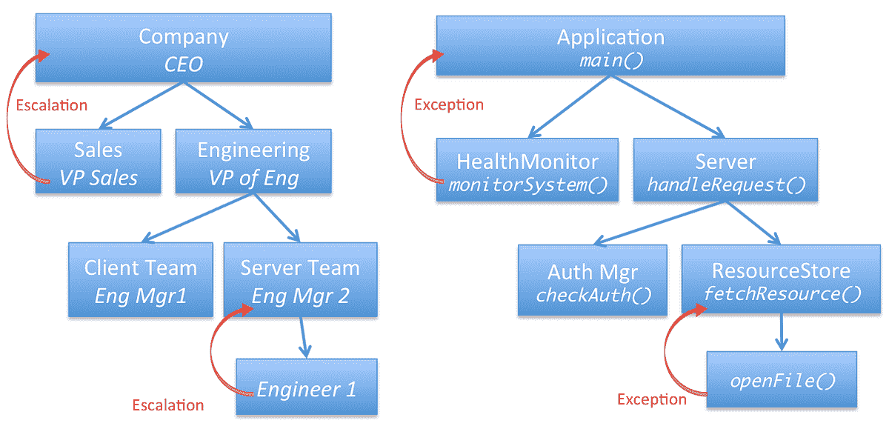

# 来自软件工程的管理经验

> 原文：<https://www.dominodatalab.com/blog/management-lessons-from-engineering>

随着我从一名个人软件开发人员发展到管理团队和创办公司— [一个数据科学平台](https://www.dominodatalab.com?utm_source=blog&utm_medium=post&utm_campaign=management-lessons-from-engineering)—我不断注意到优秀工程原则和优秀管理原则之间的相似之处。我对这里的新奇事物不抱幻想，但这是一个有趣的话题，涉及面很广，所以我计划在接下来的几个月里写更多这方面的内容。现在，我想把重点放在一个特殊的相似性上:“某人”不能做要求他们做的事情的情况。

首先，让我简单地承认软件和公司之间的基本相似性:好的组织设计“看起来”像好的软件设计。也就是说，“单元”应该有明确的职责，以及它们如何与其他单元连接的明确的“契约”(或接口)。就其本身而言，这并不是特别有见地，但考虑到这一点，让我们再深入一点...

## 例外和升级

一个更微妙的相似之处是软件开发中的异常概念，以及在管理环境中的类似概念。

我的前雇主对**升级**有一个正式的概念(记录在公司公开的[管理手册](http://www.bwater.com/Uploads/FileManager/Principles/Bridgewater-Associates-Ray-Dalio-Principles.pdf)中)。有几个不同的场景，其中一个可能“升级”的东西，但最常见的是当你“无法实现你的责任。”

乍一看，这听起来很明显，但这是一个微妙而强大的概念。这个想法适用于组织中的每一个人——无论是初级还是高级——它要求他们有自我意识和无我意识，以认识到他们是否/何时无法履行自己的职责，不管是什么原因。这可能包括因为丢了钥匙而不能打扫办公室的看门人；一个工程经理不能按时交付一个版本，因为她的业务涉众没有对早期版本提供足够的反馈；或者是一位高级经理，他无法让一个部门走上正轨，因为他认识到自己没有经验或概念能力来解决他所面临的大规模问题。所有这些情况都需要升级。

在软件工程中，异常本质上是同一件事:**一个代码单元在无法完成其职责**时应该引发异常。(微软的[。NET 框架指南](http://msdn.microsoft.com/en-us/library/vstudio/ms229030.aspx)实际上使用了非常相似的语言:“当一个成员不能成功地做它被设计去做的事情时，异常被抛出”。)

## 完成类比

我们可以将例外和升级之间的这种相似性集成到我们首先观察到的更明显的相似性中:

*   组织单位
*   设计良好的公司都有职责明确的部门和团队。

*   设计良好的软件有明确职责的模块和类

*   做事的人

*   在一个公司中，部门和团队只有一个经理，他向一个“更高”的经理报告，并负责利用自己的报告来实现部门或团队的责任。

*   在软件中，一个函数被其他函数调用，并且有其他可用的函数可以调用，以实现其签名的承诺。

*   例外和升级

*   在一家公司，如果一个人不能做要求她做的事情，她应该向上级汇报，让她的经理恰当地处理这一事实。

*   在软件中，如果一个函数不能做它被要求做的事情，它应该抛出一个异常，让调用函数适当地处理这个因素。

请注意，就像函数负责处理它调用的任何其他函数的异常一样，经理负责处理来自其报告的升级。“处理”异常或升级可能需要解决根本问题并“重试”；这可能需要通过一些不同的方式来实现相同的责任(例如，调用不同的功能，将任务交给不同的人或组)；或者它可能涉及将异常/升级向上传递到下一层(即，堆栈上的上一个功能，或者链上的下一个管理器)。

这是一个简化的组织结构和简化的软件架构的例子，展示了一些可能的例外和升级的例子。红色箭头代表“某人”(一个人或一个功能)说，“我不能做要求我做的事情。”

## 反光

就像学习一门外语可以加深对你的母语的理解一样，我发现在两个不同的领域看到同样的概念帮助我更好地理解它们。

在软件开发环境中，这种思考清楚地表明了什么时候抛出异常是合适的:当且仅当函数不能支持其签名的承诺时。

在管理环境中，我越来越清楚地认识到，要使升级方案发挥作用，组织中的每个人都必须理解它，并根据协议进行操作。如果出现问题升级，但经理不知道如何“处理”，系统就会失败。或者，如果人们不知道在无法履行职责时应该上报，那么这个系统就失败了。(写好代码的类比应该是不言而喻的，这里。)