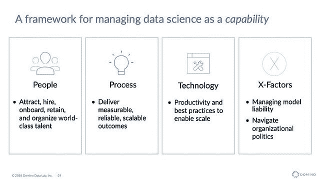
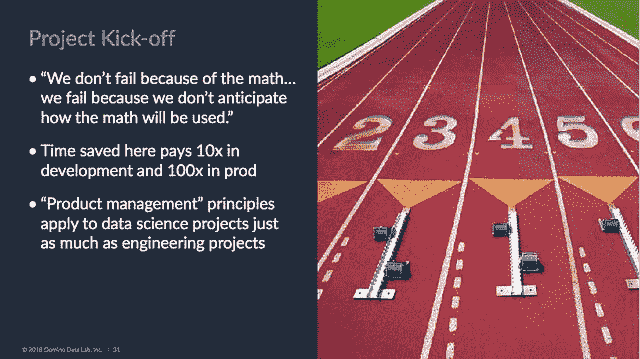
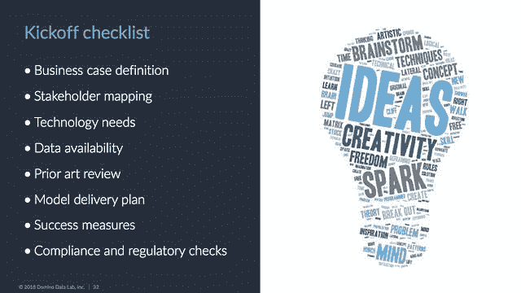
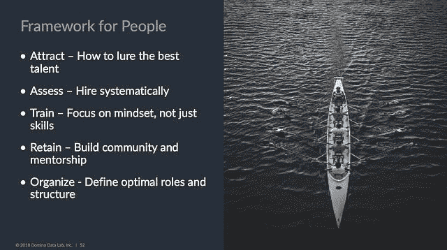

# 将数据科学作为一种能力来管理

> 原文：<https://www.dominodatalab.com/blog/managing-data-science-as-a-capability>

*Domino 首席执行官 Nick Elprin 举办了一个 3 小时的培训研讨会，名为“[在企业中管理数据科学](https://conferences.oreilly.com/strata/strata-ca/public/schedule/detail/64333)”，提供了实用的见解和互动的突破。研讨会上分享的知识、趣闻和最佳实践基于多年来与客户就管理和加速数据科学工作进行的坦诚讨论。研讨会还展示了可重复使用的模板，包括飞行前[数据科学项目清单](https://www.dominodatalab.com/resources/pre-flight-project-checklist)以及用于招聘和入职数据科学家的[规划模板](https://www.dominodatalab.com/resources/hiring-and-onboarding-plan)。我们根据与会者的反馈分享分组讨论材料。如果你错过了 Strata，并有兴趣加入类似的讨论，那么考虑参加 [Rev](https://rev.dominodatalab.com/) 。*

## 管理数据科学的已知挑战

与招聘、[建立](http://firstround.com/review/doing-data-science-right-your-most-common-questions-answered/)、[管理](https://sloanreview.mit.edu/article/why-managing-data-scientists-is-different/)和[领导](https://medium.com/@dtunkelang/what-does-it-take-to-lead-data-scientists-958c8a766fc8)数据科学团队相关的挑战已经讨论了多年。一个例子包括早期数据科学团队在从集中式团队结构切换到嵌入式团队结构时所经历的[痛苦。每个公司都有独特的需求和要求。拥有早期数据科学团队的公司尝试了不同的团队结构，以便将数据科学工作与其整体战略愿景或业务价值要求保持一致。这种已知的斗争今天仍然存在。许多数据科学领导者及其组织仍在讨论如何使](https://venturebeat.com/2014/10/31/linkedin-data-science-team/)[数据科学工作符合关键利益相关者的需求](//blog.dominodatalab.com/stakeholder-driven-data-science-warby-parker/)和[整体组织商业价值](//blog.dominodatalab.com/measuring-data-science-business-value/)。然而，如果受产品管理启发的见解和模板可以用来支持人们管理数据科学，那会怎样？这种贡献有帮助吗？这些只是我们在 Domino 问自己的几个问题。

## 分享最佳实践和受产品管理启发的模板

随着数据科学作为一门学科的成熟，我们作为一个整体行业，能够向前人学习。这使我们能够分享关于在企业组织内[构建](https://vimeo.com/148942395)、[管理和发展数据科学](https://www.dominodatalab.com/resources/managing-data-science/)能力的实用最佳实践。在最近的一次行业会议上，Domino 的首席执行官 Nick Elprin 举办了一个 3 小时的培训研讨会，[“管理企业中的数据科学”](https://conferences.oreilly.com/strata/strata-ca/public/schedule/detail/64333)，提供了实用的见解和交互式突破。研讨会上分享的知识、趣闻和最佳实践基于多年来与客户就管理和加速数据科学工作进行的坦诚讨论。研讨会还展示了可重复使用的交互式分组讨论模板，包括[飞行前数据科学项目清单](https://www.dominodatalab.com/resources/pre-flight-project-checklist)以及[招聘和入职数据科学家的规划模板](https://www.dominodatalab.com/resources/hiring-and-onboarding-plan)。

在深入研讨会上分享的一些见解包括

*   考虑使用一个框架来管理数据科学，这是一种基于人员、流程、技术和 x 因素的能力。

*   根据与客户的讨论，我们了解到将产品管理原则应用于数据科学项目将节省开发和生产时间。

*   使用启动或飞行前项目清单等工件，将有助于最大限度地提高数据科学工作与业务价值和整体成功保持一致的可能性。该清单受产品管理中使用的 PRD(产品需求文档)的启发。

*   为您的数据科学团队寻找、培训和留住人才。管理和发展数据科学团队需要多种因素。考虑利用[招聘和入职计划模板](https://www.dominodatalab.com/resources/hiring-and-onboarding-plan)中提供的一系列问题来培养符合贵公司战略愿景的合适团队。

虽然研讨会培训基于 Domino 的“[大规模数据科学管理实用指南”](https://www.dominodatalab.com/resources/managing-data-science/)，但互动研讨会还提供了可重复使用的模板([飞行前清单](https://www.dominodatalab.com/resources/pre-flight-project-checklist)以及[招聘和入职计划模板](https://www.dominodatalab.com/resources/hiring-and-onboarding-plan))。根据与会者要求与他们的团队成员分享更多副本的请求，我们提供了可供下载的模板。这些模板是帮助当前和有抱负的数据科学领导者在其组织内发展数据科学能力的工具。此外，如果您错过了 Strata 的[研讨会，并希望参与类似深度和范围的讨论，您可能有兴趣参加即将举行的](https://conferences.oreilly.com/strata/strata-ca/public/schedule/detail/64333) [Rev](https://rev.dominodatalab.com) 。