# 使用 dplyr 操作数据

> 原文：<https://www.dominodatalab.com/blog/manipulating-data-with-dplyr>

*特别感谢[Addison-Wesley Professional](http://www.informit.com/store/programming-skills-for-data-science-start-writing-code-9780135133101?utm_source=Referral&utm_medium=DominoLabs&utm_campaign=FreemanRoss)允许从本书中摘录以下“用 dplyr 操纵数据”章节，[数据科学编程技巧:开始编写代码，用 R](http://www.informit.com/store/programming-skills-for-data-science-start-writing-code-9780135133101?utm_source=Referral&utm_medium=DominoLabs&utm_campaign=FreemanRoss) 辩论、分析和可视化数据。Domino 创建了一个补充项目。*

## 介绍

数据科学家花费无数时间争论数据。这不是一次愉快的经历。然而，数据科学家可以使用像`dplyr`这样的工具来帮助加速数据科学工作。Domino 的内容负责人联系了[Addison-Wesley Professional](https://www.pearson.com/us/higher-education/series/Addison-Wesley-Data-Analytics-Series/4255387.html)(AWP)，请求允许从书中摘录以下`dplyr`章节， *[数据科学的编程技巧:开始编写代码，用 R](http://www.informit.com/store/programming-skills-for-data-science-start-writing-code-9780135133101?utm_source=Referral&utm_medium=DominoLabs&utm_campaign=FreemanRoss) 、*讨论、分析、可视化数据，以帮助支持数据科学家加速他们的工作。非常感谢 AWP 的适当许可。Domino 还创建了一个互补的用 dplyr 操作数据的项目，与摘录的[书](http://www.informit.com/store/programming-skills-for-data-science-start-writing-code-9780135133101?utm_source=Referral&utm_medium=DominoLabs&utm_campaign=FreemanRoss)章节配对。


## 使用 Dplyr 操作数据:章节简介

[**`dplyr`**](https://dplyr.tidyverse.org/)【dee-ply-er】(“dee-ply-er”)包是 R(也许更一般地说是数据科学)中数据争论的卓越工具。它为程序员提供了执行数据管理和分析任务的直观词汇表。学习和使用该软件包将使您的数据准备和管理过程更快、更容易理解。本章介绍了包背后的原理，并概述了如何使用包通过其富有表现力和高效的语法来处理数据框。

### 11.1 数据操作的语法

这个`dplyr`包的最初创造者 Hadley Wickham 恰如其分地将其称为数据操作的*语法。这是因为该包提供了一组**动词**(函数)来描述和执行常见的数据准备任务。编程中的核心挑战之一是从关于数据集的问题映射到具体的编程操作。数据操作语法的出现使得这个过程更加顺畅，因为它使您能够使用相同的词汇来提问和编写程序。具体来说，`dplyr`语法让您可以轻松地谈论和执行如下任务:*

*   **从数据集中选择**感兴趣的特定特征(列)
*   **过滤掉**不相关的数据，只保留感兴趣的观察值(行)
*   通过添加更多的特征(列)来改变数据集
*   **按特定顺序排列**个观察值(行)
*   **根据平均值、中间值或最大值汇总**数据
*   **将多个数据集连接到一个数据框中**

您可以在描述用于询问数据的*算法*或过程时使用这些词语，然后使用`dplyr`来编写代码，这些代码将严格遵循您的“普通语言”描述，因为它使用共享相同语言的函数和过程。事实上，关于数据集的许多现实问题归结为将数据集的特定行/列隔离为“感兴趣的元素”，然后执行基本的比较或计算(例如，平均值、计数、最大值)。虽然可以用 base R 函数来执行这样的计算(在前面的章节中已经描述过了)，但是`dplyr`包使得编写和读取这样的代码更加容易。

## 11.2 核心 dplyr 功能

`dplyr`包提供了镜像前面提到的动词的函数。使用这个包的功能将允许您快速有效地编写代码来询问数据集的问题。

由于`dplyr`是一个外部包，您将需要安装它(每台机器一次)并在您想要使用函数的每个脚本中加载它。加载软件包后，您可以调用任何函数，就好像它们是您已经熟悉并喜欢的内置函数一样。

为了展示`dplyr`包作为询问真实数据集问题的工具的有用性，本章将这些函数应用于美国总统选举的历史数据。`presidentialElections`数据集包含在`pscl`包中，因此您需要安装并加载该包来访问数据:

```py
# Install the `pscl` package to use the `presidentialElections` data frame
install.packages("pscl") # once per machine
library("pscl") # in each relevant script

# You should now be able to interact with the data set
View(presidentialElections)
```

这个数据集包含了从 1932 年到 2016 年的每次总统选举中，每个州投票给民主党候选人的百分比。每一行都包含`state`、`year`、民主党选票的百分比(demVote)，以及内战期间每个州是否是前南部邦联的成员。更多信息，参见`pscl`包装参考[手册](https://cran.r-project.org/web/packages/pscl/pscl.pdf)，或使用`?presidentialElections`查看 RStudio 中的文档。

### 选择

`**select()**`函数允许您从数据框中选择和提取感兴趣的列，如图 11.1 所示。

```py
# Select `year` and `demVotes` (percentage of vote won by the Democrat)
# from the `presidentialElections` data frame
votes <- select(presidentialElections, year, demVote)
```

`select()`函数将从中选择的数据框作为参数，后跟您希望选择的列的名称(*不带引号*)！

select()的这种用法相当于使用 base R 语法简单地提取列:

```py
# Extract columns by name (i.e., "base R" syntax)
votes <- presidentialElections[, c ("year", "demVote")]
```

虽然这种 base R 语法达到了同样的目的，但是 dplyr 方法提供了一种更具表达性的语法，更易于读写。

***还记得**吗:在* `dplyr` *函数的函数参数列表(括号内)内，你指定的数据框列没有引号——也就是说，你只是给列名作为变量名，而不是字符串。这就是所谓的 [**非标评测** (NSE)](http://dplyr.tidyverse.org/articles/programming.html) 。虽然这种能力使* `dplyr` *代码更容易编写和阅读，但当试图使用存储在变量中的列名时，它有时会带来挑战。如果在这种情况下遇到错误，您可以并且应该使用 base R 语法(例如，美元符号和括号符号)。*

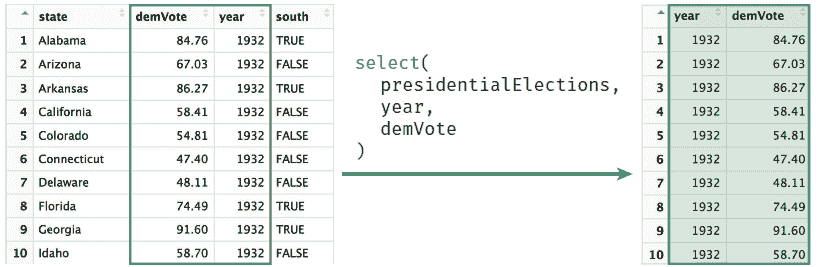 Figure 11.1 Using the `select()` function to select the columns year and `demVote` from the `presidentialElections` data frame.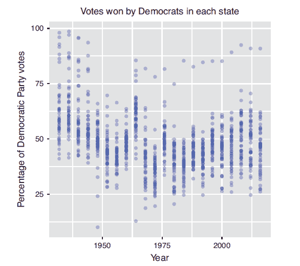 Figure 11.2 Percentage of votes cast for Democratic Party candidates in U.S. presidential elections, built with the `ggplot2` package.

如图 11.2 所示，这些数据可以用来探索各州投票模式的趋势。

请注意，`select()`函数的参数也可以是列名的向量——您可以完全按照您在括号符号中指定的那样来写，只是不需要调用`c()`。因此，您既可以使用:运算符选择一系列列，也可以使用-运算符排除列:

```py
# Select columns `state` through `year` (i.e., `state`, `demVote`, and `year`)
select(presidentialElections, state:year)

# Select all columns except for `south`
select(presidentialElections, -south)
```

***注意:**与使用括号符号不同，使用* `select()` *选择单个列将返回数据帧，而不是向量。如果要从数据框中提取特定的列或值，可以使用* `dplyr` *包中的* `pull()` *函数，或者使用 base R 语法。一般来说，使用* `dplyr` *来操作数据帧，然后使用 base R 来引用该数据中的特定值。*

### 过滤器

`**filter()**`函数允许您从数据框中选择并提取感兴趣的行(与提取*列*的`select()`相反)，如图 11.3 所示。

```py
# Select all rows from the 2008 election
votes_2008 <- filter(presidentialElections, year == 2008)
```

`filter()`函数接收要过滤的数据帧，后面是一个逗号分隔的条件列表，每个返回的行都必须满足这些条件。同样，必须指定不带引号的列名。前面的`filter()`语句相当于使用下面的 base R 语法提取行:

```py
# Select all rows from the 2008 election
votes_2008 <- presidentialElections[presidentialElections$year == 2008, ]
```

`filter()`函数将提取符合所有给定条件的行。因此，您可以指定您想要为满足第一个条件*和第二个条件*的行过滤数据框(以此类推)。例如，你可能很好奇科罗拉多州在 2008 年是如何投票的:

```py
# Extract the row(s) for the state of Colorado in 2008
# Arguments are on separate lines for readability
votes_colorado_2008 &amp;amp;amp;amp;amp;amp;amp;lt;- filter(
presidentialElections,
year == 2008,
state == "Colorado"
)
```

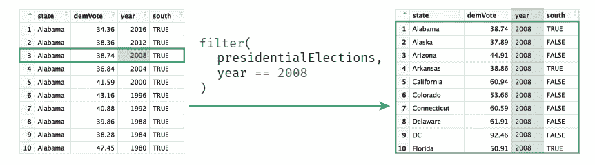 Figure 11.3 Using the `filter()` function to select observations from the `presidentialElections` data frame in which the year column is 2008.

在使用多个条件的情况下——因此可能会编写很长的代码——为了可读性，应该将单个语句分成多行(如前面的示例所示)。因为函数参数的圆括号还没有括起来，R 会把每一个新的行当作当前语句的一部分。详见 [tidyverse 风格指南](https://style.tidyverse.org/)。

***注意:**如果您正在处理一个有行名的数据框(* `presidentialElections` *没有)，则* `dplyr` *函数将移除行名。如果您需要保留这些名称，请考虑将它们作为数据的一列(特征),从而允许您在争论和分析中包含这些名称。您可以使用 mutate 函数(在第 11.2.3 节中描述)将行名添加为一列:*

```py
# Add row names of a dataframe `df` as a new column called `row_names`
df <- mutate(df, row_names = rownames(df))
```

### 变异

**`mutate()`** 功能允许您为数据框创建额外的列，如图 11.4 所示。例如，在`presidentialElections`数据框中添加一列来存储其他候选人的投票百分比可能会很有用:

```py
# Add an `other_parties_vote` column that is the percentage of votes
# for other parties
# Also add an `abs_vote_difference` column of the absolute difference
# between percentages
# Note you can use columns as you create them!
presidentialElections <- mutate(
  presidentialElections,
  other_parties_vote = 100 - demVote, # other parties is 100% - Democrat %
  abs_vote_difference = abs(demVote - other_parties_vote)
)
```

`mutate()`函数接受要变异的数据框，后跟一个逗号分隔的列列表，使用从头开始创建列表或数据框时使用的相同的`name = vector`语法来创建。与往常一样，数据框中的列名称不带引号。同样，为了保持间距和可读性，通常将每个新列声明放在单独的一行上。

***注意:**顾名思义，* `mutate()` *函数实际上并不改变数据帧；相反，它会返回一个添加了额外列的新数据框。您通常希望用这个新值替换旧的数据框变量(如前面的代码所示)。*

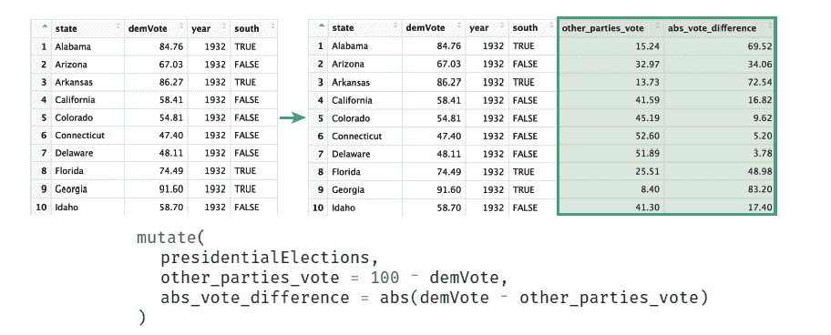 Figure 11.4 Using the `mutate()` function to create new columns on the `presidentialElections` data frame. Note that the `mutate()` function does not actually change a data frame (you need to assign the result to a variable).

***提示:**如果您想重命名一个特定的列而不是添加一个新列，您可以使用* `dplyr` *函数* `rename()` *，这实际上是将一个命名参数传递给* `select()` *函数来选择别名不同的列的一种变体。*

### 安排

**`arrange()`** 函数允许您根据某些特征(列值)对数据框的行进行排序，如图 11.5 所示。例如，您可能希望按年份对`presidentialElections`数据帧进行排序，然后在每一年内，根据民主党候选人获得的选票百分比对行进行排序:

```py
# Arrange rows in decreasing order by `year`, then by `demVote`
# within each `year`
presidentialElections <- arrange(presidentialElections, -year, demVote)
```

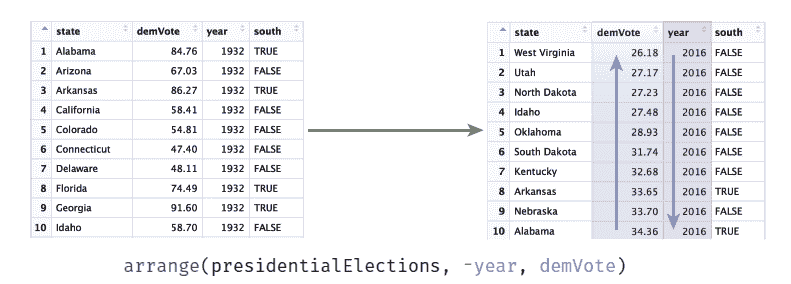 Figure 11.5 Using the `arrange()` function to sort the `presidentialElections` data frame. Data is sorted in *decreasing* order by year (-year), then sorted by the `demVote` column *within* each year.

如前面的代码所示，您可以向`arrange()`函数传递多个参数(除了要排列的数据帧之外)。数据框将按照作为第二个参数提供的列进行排序，然后按照作为第三个参数提供的列进行排序(在“平局”的情况下)，依此类推。和`mutate()`一样，`arrange()`函数实际上并不修改自变量数据帧；相反，它会返回一个新的数据框，您可以将其存储在变量中以供以后使用。

默认情况下，`arrange()`函数将按照*增加*的顺序对行进行排序。要按相反(递减)顺序排序，请在列名前加一个减号(-)(如-year)。也可以使用`desc()`辅助函数；例如，你可以通过`desc(year)`作为参数。

### 总结

`**summarize()**`函数(相当于使用英式拼写的`summarise()`)将生成一个新的数据框，其中包含一列的“摘要”,从该列的多个元素中计算出一个值。这是一个**聚合**操作(也就是说，它会将整个列缩减为一个值——考虑取一个和或平均值)，如图 11.6 所示。例如，您可以计算民主党候选人的平均投票百分比:

```py
# Compute summary statistics for the `presidentialElections` data frame
average_votes <- summarize(
    presidentialElections,
    mean_dem_vote = mean(demVote),
    mean_other_parties = mean(other_parties_vote)
)
```

`summarize()`函数接收要聚合的数据框，然后是将为生成的汇总表计算的值。这些值是使用`name = value`语法指定的，

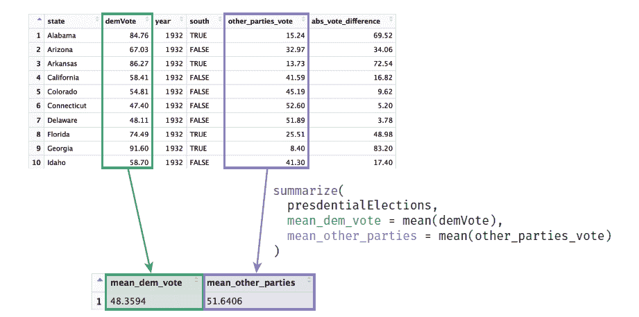 Figure 11.6 Using the `summarize()` function to calculate summary statistics for the `presidentialElections` data frame.

类似于使用`mutate()`或者定义一个列表。您可以使用多个参数在同一个语句中包含多个聚合。这将返回一个数据框，对于该函数计算的每个值，该数据框只有一行和不同的列，如图 11.6 所示。

`summarize()`函数产生汇总值的数据框(表格)。如果您想要引用这些单独的聚合，您将需要使用 base R 语法或`dplyr`函数`pull()`从这个表中提取它们。

您可以使用`summarize()`函数通过任何以向量作为参数并返回单个值的函数来聚合列。这包括许多内置的 R 函数，如`mean()`、`max(),`和`median()`。或者，您可以编写自己的汇总函数。例如，使用`presidentialElections`数据帧，您可能想要找到*最不接近的* *选举*(即`demVote`距离绝对值 50%最远的那个)。下面的代码构造了一个函数来查找距离向量中的 50 最远的*值，然后使用`summarize()`将该函数应用于`presidentialElections`数据帧:*

```py
# A function that returns the value in a vector furthest from 50
furthest_from_50 <- function(vec) {
    # Subtract 50 from each value
    adjusted_values <- vec - 50

    # Return the element with the largest absolute difference from 50
    vec[abs(adjusted_values) == max(abs(adjusted_values))]
}

# Summarize the data frame, generating a column `biggest_landslide`
# that stores the value furthest from 50%
summarize(
    presidentialElections,
    biggest_landslide = furthest_from_50(demVote)
)
```

当您处理已经分组的数据时,`summarize()`函数的真正威力变得显而易见。在这种情况下，每个不同的组将在汇总表中汇总为不同的行(见第 11.4 节)。

## 11.3 执行顺序操作

如果您想要进行更复杂的分析，您可能想要组合这些函数，将一个函数调用的结果传递给另一个函数，这是一个非常常见的工作流。执行这一系列操作的一种方法是创建*中间变量*用于您的分析。例如，在处理`presidentialElections`数据集时，您可能想问一个类似如下的问题:

“2008 年民主党候选人(巴拉克·奥巴马)的得票率最高的是哪个州？”

回答这个看似简单的问题需要几个步骤:

1.  *过滤*将数据集过滤为 2008 年的观测数据。
2.  在 2008 年的百分比中，*将*过滤到一个民主党人得票百分比最高的百分比。
3.  *选择*符合上述标准的州名。

然后，您可以按如下方式实现每个步骤:

```py
# Use a sequence of steps to find the state with the highest 2008
# `demVote` percentage

# 1\. Filter down to only 2008 votes
votes_2008 <- filter(presidentialElections, year == 2008)

# 2\. Filter down to the state with the highest `demVote`
most_dem_votes <- filter(votes_2008, demVote == max(demVote))

# 3\. Select name of the state
most_dem_state <- select(most_dem_votes, state)
```

虽然这种方法可行，但它会使工作环境变得混乱，因为您不需要再次使用这些变量。它*确实*有助于可读性(每一步的结果都是显式的)，但是那些额外的变量使得以后修改和改变算法更加困难(你必须在两个地方改变它们)。

除了将每个步骤保存为不同的命名变量之外，还可以使用**匿名** **变量**和**嵌套**其他函数中所需的语句。虽然这是可能的，但它很快会变得难以读写。例如，您可以按如下方式编写上述算法:

```py
# Use nested functions to find the state with the highest 2008
# `demVote` percentage
most_dem_state <- select( # 3\. Select name of the state
    filter( # 2\. Filter down to the highest `demVote`
        filter( # 1\. Filter down to only 2008 votes
            presidentialElections, # arguments for the Step 1 `filter`
            year == 2008
         ),
         demVote == max(demVote) # second argument for the Step 2 `filter`
     ),
     state # second argument for the Step 3 `select`
    )
```

这个版本使用匿名变量——结果值不赋给变量(因此是匿名的)——而是直接用作其他函数的参数。您已经在`print()`函数和过滤器(那些真值和假值的向量)中频繁使用了这些匿名变量——甚至在步骤 2 过滤器中的`max(demVote)`也是一个匿名变量！

这种嵌套方法与上一个示例在不创建额外变量的情况下获得了相同的结果。但是，即使只有三个步骤，阅读起来也会非常复杂——很大程度上是因为您必须“从里到外”地考虑它，首先评估中间的代码。对于更复杂的操作，这显然将变得不可理解。

### 管道操作员

幸运的是，`dplyr`提供了一种更干净、更有效的方法来执行相同的任务(也就是说，使用一个函数的结果作为下一个函数的参数)。**管道操作符**(写作 **% > %** )从一个函数中获取结果，并将其作为*第一个参数*传递给下一个函数！您可以使用管道运算符更直接地回答前面提出的问题，如下所示:

```py
# Ask the same question of our data using the pipe operator

most_dem_state <- presidentialElections %>% # data frame to start with

  filter(year == 2008) %>% # 1\. Filter down to only 2008 votes

  filter(demVote == max(demVote)) %>% # 2\. Filter down to the highest `demVote`

  select(state) # 3\. Select name of the state
```

这里，`presidentialElections`数据帧作为第一个`filter()`调用的第一个参数被“输送”进来；因为参数已经通过管道传入，`filter()`调用只接受剩余的参数(例如，year == 2008)。然后，该函数的结果作为第一个参数传递给第二个`filter()`调用(只需要指定其余的参数)，依此类推。额外的参数(如过滤条件)继续正常传入，就像不需要数据框参数一样。

因为本章中讨论的所有`dplyr`函数都将要操作的数据帧作为第一个参数，然后返回一个被操作的数据帧，所以可以使用管道将这些函数“链接”在一起！

是的，%>%操作符可能很难输入，需要一些时间来适应(特别是与命令行使用的| to pipe 相比)。但是，您可以使用 RStudio 键盘快捷键 cmd+shift+m 来简化输入。

***提示:**导航到*工具>键盘*快捷键*帮助*菜单就可以看到所有的 RStudio 键盘快捷键，也可以使用键盘快捷键* alt+shift+k *(没错，这就是显示键盘快捷键菜单的键盘快捷键！).*

管道操作符在你加载`dplyr`包时被加载(只有在你加载那个包时才可用)，但是它将与任何函数一起工作，而不仅仅是`dplyr`函数。这种语法虽然有点奇怪，但可以极大地简化您编写代码来询问有关数据的问题的方式。

***趣闻:**很多包加载其他包(称为依赖)。例如，管道操作符实际上是* `[magrittr](https://cran.r-project.org/web/packages/magrittr/vignettes/)` *包的一部分，它作为* `dplyr.`的依赖项被加载

请注意，与前面的示例一样，最佳实践是将管道序列的每个“步骤”放在自己的行上(缩进两个空格)。这允许您轻松地重新安排步骤(简单地通过移动行)，以及“注释掉”特定的步骤来测试和调试您的分析。

## 11.4 按组分析数据帧

函数是强大的，但是当你将它们应用到一个数据集内的*行组*时，它们才是真正令人敬畏的。例如，前面描述的`summarize()`的用法并不是特别有用，因为它只是给出了给定列的一个摘要(使用 base R 函数可以很容易地做到这一点)。然而，**分组操作**将允许您为多组行自动计算相同的汇总度量(例如 `mean, median, sum`)，使您能够对您的数据集提出更细微的问题。

`**group_by()**`函数允许您在数据框中的行的*组之间创建关联，以便您可以轻松地执行此类聚合。它以要进行分组的数据框作为参数，后跟要用于对数据进行分组的列-表中的每一行都将与该列中具有相同值的其他行进行分组。例如，您可以将`presidentialElections`数据集中的所有数据分组到行共享相同状态值的组中:*

```py
# Group observations by state

grouped <- group_by(presidentialElections, state)
```

`group_by()`函数返回一个 **[tibble](https://tibble.tidyverse.org/)** ，这是一个版本的数据帧，由“ [tidyverse](https://www.tidyverse.org/) ”系列的包(包括`dplyr`)使用。您可以将此视为一种“特殊”的数据框，它能够跟踪同一变量中的“子集”(组)。虽然这种分组在视觉上并不明显(即，它不对行进行排序)，但是 tibble 会跟踪每一行的分组以进行计算，如图 11.7 所示。

`group_by()`函数很有用，因为它让您可以对数据组应用操作，而不必显式地将数据分成不同的变量(有时称为*箱*或*块*)。一旦您使用`group_by()`对数据框的行进行分组，您可以将其他动词(例如`summarize(), filter()`)应用于该表，它们将自动应用于每个组的*(就好像它们是单独的数据框)。您不需要将不同的数据集明确提取到单独的数据帧中并对每个数据帧运行相同的操作，而是可以使用`group_by()`函数通过一个命令来完成所有这些操作:*

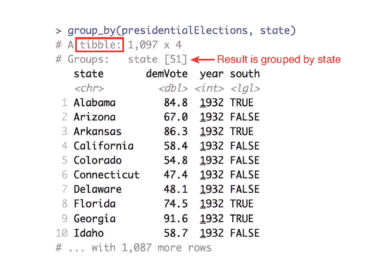 Figure 11.7 A tibble—created by the `group_by()` function—that stores associations by the grouping variable (state). Red notes are added.

```py
# Compute summary statistics by state: average percentages across the years
state_voting_summary <- presidentialElections %>%
    group_by(state) %>%
    summarize(
        mean_dem_vote = mean(demVote),
        mean_other_parties = mean(other_parties_vote)
    )
```

前面的代码将首先按州将行分组，然后计算每个组(即每个州)的汇总信息(`mean()`值)，如图 11.8 所示。组的摘要仍然会返回一个表，其中每一行都是不同组的摘要。您可以使用美元符号或括号符号从表格中提取值，或者使用`as.data.frame()`函数将其转换回普通数据框。

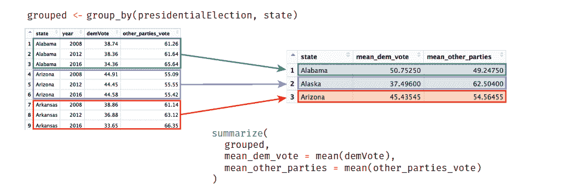 Figure 11.3 Using the `group_by()` and `summarize()` functions to calculate summary statistics in the `presidentialElections` data frame by state.

这种分组形式可以让您快速比较不同的数据子集。这样做，你就重新定义了你的**分析单位**。分组可以让你通过比较*组观察*，而不是单个观察来构建你的分析问题。这种形式的抽象使得询问和回答关于数据的复杂问题变得更加容易。

## 11.5 将数据框连接在一起

当处理真实世界的数据时，您经常会发现数据存储在多个文件或数据框中。这样做有很多原因，比如减少内存使用。例如，如果您有一个包含跟踪捐款的筹款活动信息(例如，金额、日期)的数据框，您可能会将每个捐款人的信息(例如，电子邮件、电话号码)存储在一个单独的数据文件中(因此也是数据框)。参见图 11.9，这是一个关于这种结构的例子。

这种结构有许多好处:

1.  数据存储:你可以一次存储一次信息，而不是每次捐款时都复制每个捐款人的信息。这将减少数据占用的空间。
2.  **数据更新:**如果您需要更新捐赠人的信息(如捐赠人的电话号码变更)，您可以在*单个位置*进行变更。

这种数据的分离和组织是关系数据库设计中的核心问题，这将在本书第 13 章中讨论。

在某些情况下，您会想要访问来自两个数据集的信息(例如，您需要向捐赠者发送电子邮件，告知他们的捐赠情况)，因此需要一种方法来同时引用来自两个数据框架的值——实际上是将数据框架的*合并*。此过程称为连接(因为您将数据框“连接”在一起)。当您执行一个**连接**时，您识别两个表中都存在的列，并使用这些列将相应的行相互“匹配”。这些列值被用作**标识符**来确定每个表中的哪些行相互对应，因此将被组合成结果(连接)表中的一行。

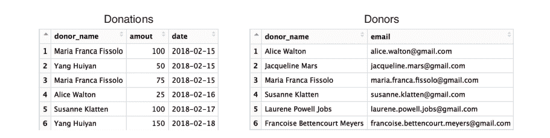 Figure 11.9 An example data frame of donations (left) and donor information (right). Notice that not all donors are present in both data frames.

**left_join()** 函数就是一个连接的例子。此函数查找两个数据框之间的匹配列，然后返回一个新的数据框，该数据框是第一个(“左”)参数，并添加了第二个(“右”)参数中的额外列-实际上是“合并”表。您可以通过指定一个 **by** 参数来指定想要“匹配”的列，该参数采用一个列名向量(作为字符串)。

例如，因为图 11.9 中的两个数据框都有一个`donor_name`列，所以您可以通过该列将捐赠者表中的行与捐赠表进行“匹配”，并将它们合并在一起，从而生成图 11.10 中所示的连接表。

```py
# Combine (join) donations and donors data frames by their shared column

# ("donor_name")

combined_data <- left_join(donations, donors, by = "donor_name")
```

当您像前面的代码那样执行左连接时，该函数将执行以下步骤:

1.  它遍历表中“左边”的每一行(第一个参数；例如，`donations`)，考虑来自共享列的值(例如，`donor_name`)。
2.  对于左侧表中的每个值，该函数在右侧表中查找在指定列中具有与*相同的*值的行(例如`donors`)。
3.  如果找到这样一个匹配行，它会将捐赠者中但不在捐赠中的列中的任何其他数据值添加到结果表中左边的*行。*
4.  它对左侧表格中的每一行重复步骤 1-3，直到所有行都从右侧的匹配项(如果有)中获得了值。

您可以在图 11.10 中看到，左边表格中的元素(`donations`)与右边表格中的行(`donors`)不匹配。这可能是因为一些捐赠的捐赠者没有联系信息(没有匹配的`donor_name`条目):这些行将被赋予 NA ( *不可用*)值，如图 11.10 所示。

***记住:**左连接返回第一个表中的所有行，以及两个表中的所有列。*

对于要匹配的行，它们需要在所有指定的共享列中有相同的数据。但是，如果您的列名不匹配，或者如果您想只匹配特定的列，您可以使用一个名为 vector (带有类似于列表的标签)的*来表示每个数据框的不同名称。如果不指定 by 参数，该连接将在*上匹配所有的*共享列名。*

```py
# An example join in the (hypothetical) case where the tables have

# different identifiers; e.g., if `donations` had a column `donor_name`,

# while `donors` had a column `name`

combined_data <- left_join(donations, donors, by = c("donor_name" = "name"))
```

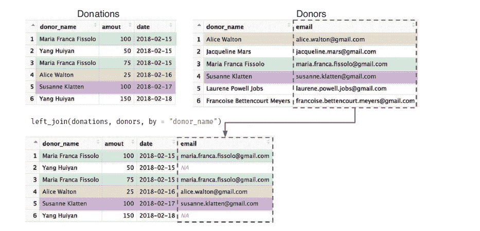 Figure 11.10 In a left join, columns from the right hand table ( `Donors`) are added to the end of the left-hand table ( `Donations`). Rows are on matched on the shared column ( `donor_name`). Note the observations present in the left-hand table that don’t have a corresponding row in the right-hand table ( `Yang Huiyan`).

***注意:**因为连接是如何定义的，所以参数顺序很重要！例如，在一个* `left_join()` *中，得到的表格只有左(第一个)表格中的元素的行；第二个表中任何不匹配的元素都将丢失。*

如果您改变参数的顺序，您将保留捐赠者数据框中的所有信息，并添加捐赠的可用信息(见图 11.11)。

```py
# Combine (join) donations and donors data frames (see Figure 11.11)
combined_data <- left_join(donors, donations, by = "donor_name")
```

由于一些`donor_name`值在右侧(捐赠)表中出现多次，捐赠者的行最终会重复出现，这样信息就可以与捐赠的每组值“合并”。同样，请注意，右侧表中缺少匹配项的行不会获得任何附加信息(代表向组织提供了联系信息但尚未进行捐赠的“捐赠者”)。

因为参数的顺序很重要，`dplyr`(以及一般的关系数据库系统)提供了几种不同的连接，每一种都会影响最终表中包含哪些行。请注意，在所有联接中，两个表中的列都将出现在结果表中，联接类型决定了包括哪些行。参见图 11.12 中这些连接的示意图。

*   **`left_join`** :返回第一个(左)数据帧的所有行。也就是说，您从左边的表中获取所有数据，并从右边的表中添加额外的列值。没有匹配项的左侧行将在右侧列中显示 NA。

 Figure 11.11 Switching the order of the tables in a left-hand join (compared to Figure 11.10) returns a different set of rows. All rows from the left-hand table ( `donors`) are returned with additional columns from the right-hand table ( `donations`).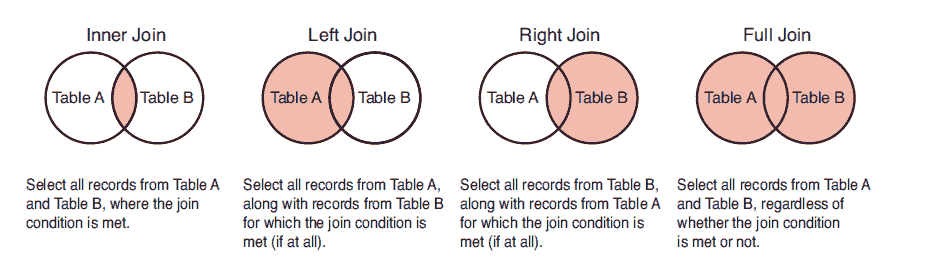 Figure 11.12 A diagram of different join types.

*   **`right_join`** :返回第二个(右)数据帧的所有行。也就是说，您从右边的表中获取所有数据，并从左边的表中添加额外的列值。没有匹配项的右侧行将在左侧列中显示 NA。这是一个`left_join`的“反义词”，相当于交换参数的顺序。
*   **`inner_join:`** 只返回两个数据框中的行。也就是说，您将获得在两个表中具有匹配观察值的任何行，以及两个表中的列值。连接不会产生额外的 NA 值。来自左边的观察结果与右边的不匹配，或者来自右边的观察结果与左边的不匹配，都不会被返回——参数的顺序*无关紧要*。
*   **`full_join`** :返回*两个*数据帧的所有行。也就是说，无论是否匹配，任何观察都会得到一行。如果恰好匹配，两个表中的值将出现在该行中。没有匹配的观察值将在另一个表的列中有 NA——参数的顺序*无关紧要*。

决定这些连接的关键是考虑您想要哪组数据作为您的观察值(行),以及如果记录丢失，您可以接受哪列为 NA。

***提示:** Jenny Bryan 为* `dplyr` *join 函数创建了一个优秀的 [cheatsheet](http://stat545.com/bit001_dplyr-cheatsheet.html) ，可以参考。*

***更进一步:**这里讨论的所有连接都是变异连接，将一个表中的列添加到另一个表中`dplyr`还提供过滤连接，根据它们在另一个表中是否有匹配的观察值来排除行，以及集合操作，将观察值组合起来，就像它们是集合元素一样。参见包[文档](https://cran.r-project.org/web/packages/dplyr/vignettes/two-table.html)中关于这些选项的更多细节——但是开始时，您可以主要关注变异连接。*

## 11.6 `dplyr`行动中:分析飞行数据

在本节中，您将了解如何使用`dplyr`函数来询问更复杂数据集的有趣问题(该分析的完整代码也可以在[书的代码库](https://github.com/programming-for-data-science/in-action/tree/master/dplyr)中在线获得)。您将使用 2013 年从纽约市机场(包括纽瓦克机场、约翰·肯尼迪机场和拉瓜迪亚机场)出发的航班数据集。该数据集也在 *[简介`dplyr`简介](https://dplyr.tidyverse.org/articles/dplyr.html)* 中在线展示，并取自[运输统计局数据库](https://www.transtats.bts.gov/DatabaseInfo.asp?DB_ID=120)。要加载数据集，您需要安装并加载`nycflights13`包。这将把航班数据集加载到您的环境中。

```py
# Load the `nycflights13` package to access the `flights` data frame
install.packages("nycflights13") # once per machine
library("nycflights13") # in each relevant script
```

在开始询问数据集的目标问题之前，您需要更好地理解数据集的结构:

```py
# Getting to know the `flights` data set
?flights # read the available documentation
dim(flights) # check the number of rows/columns
colnames(flights) # inspect the column names
View(flights) # look at the data frame in the RStudio Viewer
```

图 11.13 显示了 RStudio 查看器中的航班数据框的子集。

根据这些信息，您可能会有兴趣询问如下问题:

1.  哪家*航空公司*的*出发*航班延误数量最高？
2.  平均*日*，最早到达*的航班有哪些*机场*？*
3.  哪个*月*的航班最容易出现*最长的延误*？

您在这里的任务是将这些问题映射到特定的过程，以便您可以编写适当的`dplyr`代码。

你可以从问第一个问题开始:

*“哪家**航空公司**的**航班延误**次数最多？”*

此问题涉及到比较具有特定特征(航空公司)的观测值(航班)，因此您需要执行如下分析:

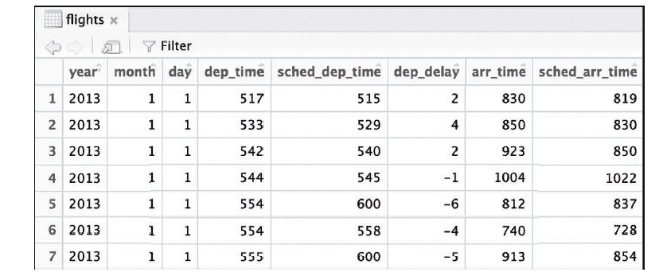 Figure 11.13 A subset of the flights data set, which is included as part of the `nycflights13` package.

***提示:**当你试图找到合适的操作来回答你感兴趣的问题时，短语“找到那个……的条目”通常对应一个`filter()`操作！*

一旦你建立了这个算法，你可以直接把它映射到`dplyr`函数:

```py
# Identify the airline (`carrier`) that has the highest number of
# delayed flights
has_most_delays <- flights %>% . # start with the flights
group_by(carrier) %>% # group by airline (carrier)
filter(dep_delay > 0) %>% # find only the delays
summarize(num_delay = n()) %>% # count the observations
filter(num_delay == max(num_delay)) %>% # find most delayed
select(carrier) # select the airline
```

***记住:**往往很多方法可以用来解决同一个问题。前面的代码显示了一种可能的方法；或者，您可以在分组前过滤延迟出发的航班。重点是考虑如何根据数据操作的语法(手工)解决问题，然后将其转换成`dplyr`！*

遗憾的是，这个问题的最终答案似乎是一个缩写:`UA`。为了减小`flights`数据帧的大小，关于每个`airline`的信息被存储在一个叫做航空公司的*单独的*数据帧中。由于您对组合这两个数据框(您的答案和航空公司信息)感兴趣，您可以使用一个连接:

```py
# Get name of the most delayed carrier

most_delayed_name <- has_most_delays %>%  # start with the previous answer

  left_join(airlines, by = "carrier") %>%  # join on airline ID

  elect(name)                              # select the airline name

print(most_delayed_name$name) # access the value from the tibble
# [1] "United Air Lines Inc."
```

在这一步之后，你将会了解到延误绝对次数最大的航空公司是*联合航空公司*。然而，在过于强烈地批评航空公司之前，请记住，你可能会对航班延误的*比例感兴趣，这需要进行单独的分析。*

接下来，你可以评估第二个问题:

"平均来说，哪个**机场**的航班最早到达**？"**

要回答这个问题，可以遵循类似的方法。因为这个问题与航班提前到达的时间有关，所以感兴趣的结果(特征)是`arr_delay`(注意，负的延迟量表示航班提前到达)。您会希望按照航班到达的*目的地机场* (dest)对这些信息进行分组。然后，由于您对平均到达延迟感兴趣，您会希望*汇总*这些组来汇总它们:

```py
# Calculate the average arrival delay (`arr_delay`) for each destination

# (`dest`)

most_early <- flights %>%

  group_by(dest) %>% # group by destination

  summarize(delay = mean(arr_delay)) # compute mean delay
```

在执行分析的每一步时检查你的工作总是一个好主意——不要写一长串的操作并希望你得到正确的答案！通过在此时打印出 most_early 数据帧，您会注意到它有许多 NA 值，如图 11.14 所示。

在进行数据编程时，这种意想不到的结果经常发生——解决问题的最好方法是逆向工作。通过仔细检查`arr_delay`列，您可能会注意到一些条目具有 NA 值——到达延迟不适用于该记录。因为您无法获得 NA 值的`mean()`，所以您决定从分析中排除这些值。您可以通过向`mean()`函数传递一个`na.rm = TRUE`参数(“NA remove”)来实现这一点:

```py
# Compute the average delay by destination airport, omitting NA results
most_early <- flights %>%
group_by(dest) %>% # group by destination
summarize(delay = mean(arr_delay, na.rm = TRUE)) # compute mean delay
```

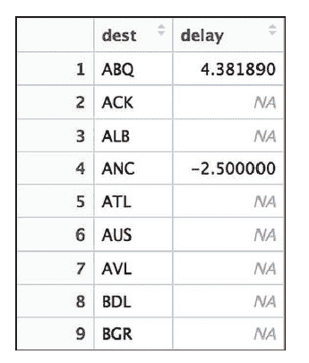 Figure 11.14 Average delay by destination in the `flights` data set. Because NA values are present in the data set, the mean delay for many destinations is calculated as NA. To remove NA values from the `mean()` function, set `na.rm = FALSE` .

移除 NA 值会返回数值结果，您可以继续使用您的算法:

```py
# Identify the destination where flights, on average, arrive most early
most_early <- flights %>%
group_by(dest) %>% # group by destination
summarize(delay = mean(arr_delay, na.rm = TRUE)) %>% # compute mean delay
filter(delay == min(delay, na.rm = TRUE)) %>% # filter for least delayed
select(dest, delay) %>% # select the destination (and delay to store it)
left_join(airports, by = c("dest" = "faa")) %>% # join on `airports` data
select(dest, name, delay) # select output variables of interest

print(most_early)
# A tibble: 1 x 3
# dest name delay
# <chr> <chr> <dbl>
# 1 LEX Blue Grass -22
```

回答这个问题遵循与第一个问题非常相似的结构。前面的代码通过在管道操作序列中包含`left_join()`语句，将步骤减少到一条语句。请注意，包含机场代码的列在`flights and airports`数据帧中有不同的名称(分别是`dest`和`faa`，因此您使用 by 参数的命名向量值来指定匹配。

结果，您了解到肯塔基州列克星敦的蓝草机场是平均到达时间最早的机场(提前 22 分钟！).

最后一个问题是:

*“哪个**月**的航班延误时间最长**？***

这些类型的汇总问题都遵循类似的模式:*按感兴趣的列(特性)对数据进行分组*，为每个组计算感兴趣的(另一个)特性的*汇总*值，*将*过滤为感兴趣的行，然后*选择*回答您的问题的列

```py
# Identify the month in which flights tend to have the longest delays

flights %>%

  group_by(month) %> # group by selected feature

  summarize(delay = mean(arr_delay, na.rm = TRUE)) %>% # summarize delays filter(delay == max(delay)) %&amp;amp;amp;amp;amp;amp;amp;gt;% # filter for the record of interest

  select(month) %>% # select the column that answers the question

  print() # print the tibble out directly

# A tibble: 1 x 1

#  month

#  <int>

#1   7
```

如果您不介意结果是 tibble 而不是 vector 的形式，您甚至可以将结果直接传送到`print()`函数，以便在 R 控制台中查看结果(答案是 *July* )。或者，你可以使用一个包，比如`ggplot2`(见第 16 章)来可视化地传达每月的延迟，如图 11.15 所示。

```py
# Compute delay by month, adding month names for visual display
# Note, `month.name` is a variable built into R
delay_by_month <- flights %>%
    group_by(month) %>%
    summarize(delay = mean(arr_delay, na.rm = TRUE)) %>% select(delay) %
    mutate(month = month.name)

# Create a plot using the ggplot2 package (described in Chapter 17)
ggplot(data = delay_by_month) +
    geom_point(
        mapping = aes(x = delay, y = month),
        color = "blue",
        alpha = .4,
        size = 3
    )+
    geom_vline(xintercept = 0, size = .25) +
    xlim(c(-20, 20)) +
    scale_y_discrete(limits = rev(month.name)) +
    labs(title = "Average Delay by Month", y = "", x = "Delay (minutes)")
```

总的来说，了解如何制定问题，将它们转化为数据操作步骤(遵循数据操作的语法)，然后将它们映射到`dplyr`函数，将使您能够快速有效地了解关于您的数据集的相关信息。用`dplyr`包练习扯皮数据，见[一套随书练习](https://github.com/programming-for-data-science/chapter-11-exercises)。

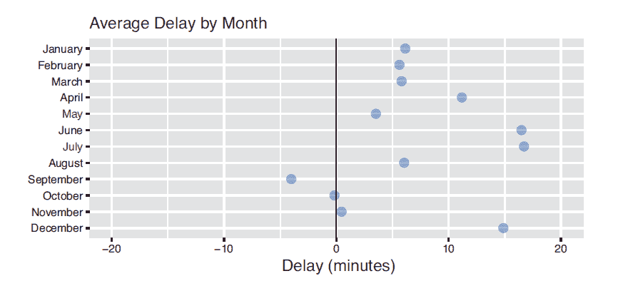 Figure 11.15 Average flight arrival delay in each month, calculated using the `flights` data set. The plot is built using `ggplot2` (discussed in Chapter 16).

Domino 编辑评论:最初印刷版本中的脚注显示为叙述性超链接，以方便阅读。