# 手动特征工程

> 原文：<https://www.dominodatalab.com/blog/manual-feature-engineering>

*非常感谢 AWP·皮尔森允许从马克·e·芬纳的书[中摘录“手动特征工程:操纵数据以获得乐趣和利润](http://www.informit.com/store/machine-learning-with-python-for-everyone-9780134845623?utm_source=Referral&utm_medium=DominoLabs&utm_campaign=Fenner&utm_term=MLPython)。还有一个互补的多米诺项目[可用](https://try.dominodatalab.com/u/domino-andrealowe/Feature-Engineering/overview)。*

## 介绍

许多数据科学家[通过](https://blog.dominodatalab.com/stakeholder-driven-data-science-warby-parker)[映射](https://blog.dominodatalab.com/data-science-use-cases)，开发和部署适当的 ML 解决方案来解决业务问题，从而为他们的组织交付价值。当评估关于他们的 ML 模型的[影响的权衡决策时，特征工程对数据科学家是有用的。它是一个处理最大似然的框架，也提供了从原始数据中提取特征的技术，这些特征可以在模型中使用。当](https://blog.dominodatalab.com/feature-engineering-framework-techniques) [Domino](https://www.dominodatalab.com/?utm_source=blog&utm_campaign=referral&utm_medium=logo&utm_content=) 寻求帮助数据科学家加速他们的工作时，我们联系 AWP·皮尔森，请求允许我们从《用 Python 为每个人进行机器学习[》一书中摘录*“手动特征工程:操纵数据以获得乐趣和利润*，作者是](http://www.informit.com/store/machine-learning-with-python-for-everyone-9780134845623?utm_source=Referral&utm_medium=DominoLabs&utm_campaign=Fenner&utm_term=MLPython)[马克·e·芬纳](https://www.linkedin.com/in/mrdrfenner/)。非常感谢[AWP·皮尔森](http://www.informit.com/imprint/series_detail.aspx?ser=4255387)提供摘录作品的许可，并使我们能够提供一个补充的公开可见的[多米诺骨牌项目](https://try.dominodatalab.com/u/domino-andrealowe/Feature-Engineering/overview)。如果有兴趣运行项目中的例子，那么[登录。](//www.dominodatalab.com/try)


## 章节介绍:手动特征工程

```py
# setup
from mlwpy import *
%matplotlib inline

iris = datasets.load_iris()

(iris_train, iris_test,

    iris_train_tgt, iris_test_tgt) = skms.train_test_split(iris.data,

        iris.target,

        test_size=.25)

        #remove units ' (cm)' from names

        iris.feature_names = [fn[:-5] for fn in iris.feature_names]

# dataframe for convenience

iris_df = pd.DataFrame(iris.data, columns=iris.feature_names)

iris_df['species'] = iris.target_names[iris.target]
```

## 10.1 特征工程术语和动机

我们将把我们的注意力从扩大我们的模型目录上转移开[如之前在本书中[提到的】,取而代之的是仔细查看数据。*特征工程*是指对特征的操作——添加、删除、组合、变异。请记住，特性是属性-值对，因此我们可以从数据表中添加或删除列，并修改列中的值。特征工程有广义和狭义之分。](http://www.informit.com/store/machine-learning-with-python-for-everyone-9780134845623?utm_source=Referral&utm_medium=DominoLabs&utm_campaign=Fenner&utm_term=MLPython)

我将从广泛、包容的意义上使用它，并指出一些问题。以下是一些具体的例子:

*   *缩放*和*归一化*意味着调整数据的范围和中心，以便于学习和改进对结果的解释。您可能还记得`sklearn`中的一书中的糖尿病数据集(第 4.1 节)[是在*标准化*之前提供给我们的，这是一种缩放形式。](http://www.informit.com/store/machine-learning-with-python-for-everyone-9780134845623?utm_source=Referral&utm_medium=DominoLabs&utm_campaign=Fenner&utm_term=MLPython)
*   *填充缺失值*。由于收集*完整*数据集的困难以及数据收集过程中的错误，真实世界的数据集可能会丢失值。缺失值可以基于专家知识、试探法或通过一些机器学习技术来填充。
*   *特征选择*意味着移除特征，因为它们不重要、多余或者对学习完全起反作用。有时候，我们只是拥有太多的功能，而我们需要更少的。适得其反的特征的一个例子是无助于泛化的标识变量。我们在第 8.2 节[ [在本书](http://www.informit.com/store/machine-learning-with-python-for-everyone-9780134845623?utm_source=Referral&utm_medium=DominoLabs&utm_campaign=Fenner&utm_term=MLPython)中看到，对于每个训练示例，唯一标识符可以引导决策树从根一直到唯一叶。问题是一个测试实例*的新的唯一标识符不会出现在树*的任何地方。失败。
*   *特征编码*包括选择一组符号值来代表不同的类别。我们早在[书中]第一章就讨论过这个问题。 *WithPartner* 的概念可以用单列取值 *WithPartner* 或 *Single* 来捕获，也可以用两列 *WithPartner* 和 *Single* 来捕获，其中一列为*真*，另一列为*假*。严格来说，这是一种特征构建的形式。
*   *特征构建*从一个或多个其他特征创建新特征。例如，从花的萼片长度和宽度，我们可以创建花的*萼片面积*。
*   *特征提取*意味着从不适合学习的低级特征——实际上，我们得到的测试结果很差——转移到对学习*有用的高级特征*。通常，当我们有特定的数据格式(如图像或文本)需要转换为表格行列格式(例如要素格式)时，特征提取很有价值。特征提取和特征构造在它们所进行的变换的复杂性方面有所不同，但是在概念上它们做的是相同的事情。

## 10.1.1 为什么是工程特性？

特征工程的两个驱动因素是(1)来自任务领域的背景知识和(2)数据值的检查。第一种情况包括医生对重要血压阈值的了解或会计师对税级水平的了解。另一个例子是医疗提供者和保险公司使用身体质量指数(身体质量指数)。虽然它有局限性，但身体质量指数可以根据体重和身高快速计算出来，并作为一个很难精确测量的特征的替代物:瘦体重的比例。检查某个特性的值意味着查看其分布直方图。对于基于分布的特征工程，我们可能会看到多峰分布——具有多个峰的直方图——并决定将峰分成多个区间。

## 10.1.2 工程何时发生？

我们在特征工程中可以做出的一个主要区别是它何时发生。我们这里的主要问题是特性工程是否在[交叉验证](/blog/building-robust-models-with-cross-validation)循环中执行。在建模过程中完成的特征工程通常在交叉验证循环中完成。交叉验证可以保护我们避免过度拟合。

我们还可以在开始建模过程之前修改特征。通常，这些修改是从存储系统(如数据库)导出数据的一部分。我的使用数据库的读者将熟悉提取-转换-加载(ETL)范式。特征工程也可以是*数据清理*的一部分，作为导出/导入数据和学习之间的中间步骤。如果我们在建立模型之前处理数据，我们需要非常小心，不要偷看预测特征和目标之间的关系。我们还需要小心，这样我们就不会无意中*引入了*一个原始数据中不存在的关系。有很多很多方式我们会犯错和失败。

因此，如果我们*要*执行预建模特征工程，我们应该非常小心，在开始处理数据之前，先存放一个坚持测试集*。测试集将允许我们评估预建模特征工程*和*直接建模步骤的结果。我们可以使用拒绝测试集来保护我们免受交叉验证循环之外的危险特性工程的影响。我们照常进行，看看我们的训练和测试错误会发生什么。如果我们的训练错误是好的，但是我们看到我们的测试错误没有改善——或者甚至变得*更差*—那么我们可以假设我们过度拟合了。在这种情况下，我们可能希望将一些特征工程转移到交叉验证循环中，以便更早地检测过度拟合。*

现在，我们有两个相互竞争的问题。如果你的特性工程*需要*在交叉验证循环中，最简单的编程钩子意味着你可能想要用`sklearn`来执行它。但是如果你的特征工程很复杂并且还没有在`sklearn`中实现，你可能不想使用`sklearn`——你可能想使用`pandas`或者其他定制的 Python 工具。现在真正的难题是:如果你有复杂的特征工程需要在 CV 循环中，我最美好的祝愿与你同在。同时满足这两种需求是困难的。说真的，你可能想把一些最复杂的部分分解出来作为预处理。尽管如此，您还是可以编写可以放在 CV 循环中的助手代码。在本书第 9.3.1 节中，我们定义了一个自定义学习者。您还可以定义一个定制的转换器，我们很快就会看到。

对特征工程的*时间*的实际把握给了我们一个总体时间表:

1.  从外部来源提取数据，可能使用用 Python 编写的帮助器代码，并利用包与数据库等其他系统接口。
2.  分离出一个保留测试集。不要偷看。
3.  使用外部系统和/或 pure Python 执行任何初始数据清理。
4.  将数据放入熊猫`DataFrame`中，并做任何额外的预建模*数据辩论*。数据争论是在学习步骤之前进行的特征工程的常用术语。
5.  用`sklearn`设计学习和 CV 内循环特征工程步骤。
6.  将数据从`pandas`传输到`sklearn`并按下 *Go* 。
7.  评估结果。

## 10.1.3 特征工程是如何发生的？

另一个问题是*特征工程是如何发生的。本章的重点是明确定义和手动应用的特征工程。明确定义的特征工程任务的一个示例是创建身高和体重之间的比率，该比率可创建身体质量指数值。如果我们是*字面上的*负责计算该值并向我们的数据集添加一列，我称之为*手动应用的*特征工程——在这种情况下，是手动特征构造。如果我们建立一个管道(在下一章中),构建所有可能的特征对之间的比率，我称之为自动应用的*。**

有一些学习方法将特征工程作为其操作的一部分。其中一些方法——如支持向量机(第 13.2.4 节)[一书中的[——在幕后使用重新设计的功能，无需我们的干预。其他的——像主成分分析(第 13.3 节)[](http://www.informit.com/store/machine-learning-with-python-for-everyone-9780134845623?utm_source=Referral&utm_medium=DominoLabs&utm_campaign=Fenner&utm_term=MLPython)]一书中的[——要求我们利用它们的输出作为另一个学习步骤的输入。在这两种情况下，我们执行的步骤类似于我们已经看到的学习算法:我们将模型拟合到训练数据，然后我们转换测试数据。](http://www.informit.com/store/machine-learning-with-python-for-everyone-9780134845623?utm_source=Referral&utm_medium=DominoLabs&utm_campaign=Fenner&utm_term=MLPython)

## 10.2 特征选择和数据简化:清除垃圾

我们在特征工程中最笨拙的工具之一是删除数据。我们可能会因为冗余、不相关或过载而删除数据。(快速补充说明:我是从从我们的数据集中移除*特征*的角度来讨论这个问题的。我们同样可以考虑从我们的数据集中删除*示例*——即行而不是列。)

冗余是一个问题，这有实际和技术上的原因。我们将在本章后面看到一些技术原因。从实际的角度来看，如果两列表示相同的概念——或者，更糟的是，相同的文字值——那么我们就要四处移动并存储比我们需要的更多的数字。学习系统可以通过多种形式获得信息。一些学习系统不能有效地处理这一点。

不相关的功能更差。它们不仅占用空间，还会把我们引向在测试时表现不佳的训练路径。想象几列随机数据。我们可以在数据集中放入足够多的随机列来唯一地标识每个例子。然后，我们可以从这些伪标识符中记忆一个查找表来校正目标。但是接下来，我们怎么处理一个新的例子呢？如果我们只是填入几个随机值，目标也会同样随机。在有用的特征——非随机的特征——和目标之间没有任何关系。我们在本书的第 8.2 节[中讨论了决策树的困难。](http://www.informit.com/store/machine-learning-with-python-for-everyone-9780134845623?utm_source=Referral&utm_medium=DominoLabs&utm_campaign=Fenner&utm_term=MLPython)

我所说的过载只是指在非常大的数据集中(包含许多许多要素)，由于处理时间和内存限制，我们可能别无选择，只能减少考虑的要素数量。那么，如果我们需要转储一些数据，我们该怎么做呢？有三种主要策略:基于我们对问题和数据的知识的手动技术，使用抛硬币来保留或丢弃数据的随机采样技术，以及试图保留与我们的学习模型良好交互的特征的基于模型的技术。有时这些方法会结合起来:我们可以使用随机特征选择来建立模型，然后将得到的模型结合起来。我们将在本书第 12 章中讨论这个问题。

手动随机[特征选择](/data-science-dictionary/feature-selection)在概念上很简单。从表中删除一列——要么基于原则论点(我们知道这两列测量的是同一事物),要么基于随机性。完成了。我这里没有*而是*。基于学习模型选择或丢弃数据弥补了其他两个选项的简单性。有大量关于这个主题的书籍和文章。我们只能触及表面。然而，这里有一些例子。

一些特征选择策略是学习技术的内部组成部分。例如，决策树必须在每个节点选择一个特征进行分割。一种类型的决策树使用称为*信息增益*的度量来决定一个好的特征。我们可以将这种想法扩展到对更大数据集的特征进行分级。我们还可以使用建模的结果来评估特性。例如，我们可以查看线性回归系数较低的特征，并声明它们对整个模型相对不重要。这不一定会节省我们在第一个建模过程中的工作，但是它可能会在未来的模型中节省大量的时间。我们还可以建立许多模型，并询问这些模型之间的共性是什么。在许多模型中出现的特征可能对与目标的关系更重要。

我们线性回归的一种正则化形式——*L1*——正则化回归或*拉索*——有将学习到的系数推向零的趋势。结果是使用套索构建的模型可能会遗漏一些特征。因此，我们说套索方法是作为其操作的隐含部分来执行特征选择的。我们可以使用套索作为我们的最终模型，或者我们可以在使用其他模型之前使用它作为特征选择阶段。

## 10.3 特征缩放

我们将讨论两种不考虑与其他要素或目标之间任何关系的要素重缩放和重居中的方法。重新调整意味着我们转换这些值，使极端值不同，中间值以某种一致的方式移动。将数据重新置于中心位置意味着我们要转换这些值，使极端值不同，中间值以某种一致的方式移动。通常，重新缩放也会导致数据重新居中。重新调整的两种主要方式是在*固定*标度上改变，或者改变根据数据计算出的某些统计值。哇，马克是不是太激动了？没关系。我们会把它带回来的。

这里有一个固定重缩放的例子。如果您在华氏温度和摄氏温度之间转换，您会将 220 华氏度转换为 100 摄氏度，将 32 华氏度转换为 0 摄氏度。中间的温度(比如 104 华氏度转换为 40 摄氏度)遵循一个固定的规则。

至少这更具体一点，但是我们用来转换这些的固定值是什么呢？嗯，这来自转换温度的公式: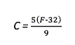

一点代数就把它变成了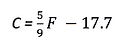

也就是我们友好的老 *y = mx + b* 换个形式。如果你从来没有注意到，用线性公式转换值只是拉伸和移动值； *m* 负责拉伸， *b* 负责移位。

```py
fig, ax = plt.subplots(1,1,figsize=(4,3))

f_temps = np.linspace(0, 212, 100)

c_temps = (5/9) * (f_temps - 32)

plt.plot(f_temps, f_temps, 'r', # F -&amp;gt; F

    f_temps, c_temps, 'b'); # F -&amp;gt; C
```

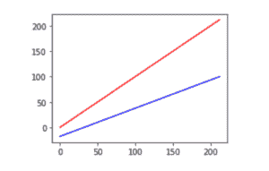

注意上面的红线是如何在下面的蓝线上从 0 到 212 垂直压缩到大约 18 到 100 的。中心值也从 106 移动到 59。除了单位转换(摄氏度到华氏度或米到英尺)之外，最常见的*固定*缩放是将{min，max}值映射到{0，1}或{ 1，1}，并将其他值平均分布在它们之间。

*标准化*，一种统计尺度调整，有点棘手。它不是基于一个固定的先验值(如将华氏温度转换为摄氏温度的 5/9)从源值延伸到目标值，而是基于源值的范围(通过方差或标准差测量)来压缩值。这种差异可能最好用图表来解释。这里我们使用`sklearn`的`StandardScaler`来完成繁重的工作。fit_transform 评估训练数据并一次性修改它。它类似于我们通常的`model.fit().predict()`，除了它在`fit()`步骤中不使用单独的目标。它只是学习——在这种情况下，是均值和标准差——然后应用于它们。经过拟合，还可以转换测试数据。我给数据点的盒子涂了颜色，这样你就可以看到这些点是如何由于变换而移动的。

```py
fig, ax = plt.subplots(1,1,figsize=(4,3))

original = np.random.uniform(-5, 5, 100)

scaled = skpre.StandardScaler().fit_transform(original.reshape(-1,1))[:,0]

bins = np.floor(original).astype(np.uint8) + 5

df = pd.DataFrame({'original':original,

    'scaled':scaled,

    'hue':bins})

df = pd.melt(df, id_vars='hue', var_name='scale')

sns.swarmplot(x='scale', y='value', hue='hue', data=df).legend_.remove()
```

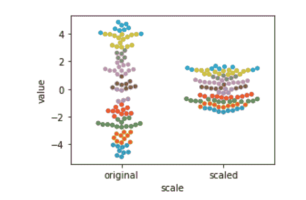

这里，度量单位不是华氏温度或摄氏温度:它是标准差的单位。标准差告诉我们数据的分布。我们的数据越分散，标准差就越大。我们标准化后还是线性规模。这可能会令人惊讶。公式如下:

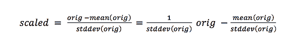

有一个 *y = mx + b* 藏在里面。我们数据的新中心是零。

奇怪的是，标准化并没有改变数据的整体形状——乍一看可能不一样，但这里有另一个例子。在我们的例子中，我们有来自一个均匀或平坦分布的数据。当我们把它标准化的时候，它仍然是统一的。从视觉上看，该形状具有相对平坦的侧面。只是碰巧被压缩的更厉害而已。再举一个例子——你自己试试——如果数据看起来像一只双峰骆驼，我们对它进行标准化，它仍然有两个驼峰。基本上，我们可以均匀地拉伸或挤压数据的图形，但我们不能比这更扭曲它。

让我们看看如何扩展。下面是`MinMaxScaler`和`StandardScaler`的简单例子。为了在示例点移动时跟踪它们，我将按照它们的百分位数给它们着色。我用熊猫切的方法来做这个。我不想纠结于此，只是知道这类似于我们在第 9.3 节【本书中[制作我们的分段常数回归模型时使用的编码技术。这里，我们利用熊猫*的分类*能力来创建一个着色值:](http://www.informit.com/store/machine-learning-with-python-for-everyone-9780134845623?utm_source=Referral&utm_medium=DominoLabs&utm_campaign=Fenner&utm_term=MLPython)

```py
iris_df = pd.DataFrame(iris.data, columns=iris.feature_names)

bins = pd.cut(iris_df['sepal width'],

np.percentile(iris_df['sepal width'],

    [25, 50, 75, 100])).cat.codes

df = pd.DataFrame({'orig':iris_df['sepal width'],

    'hue':bins})

scalers = [('std', skpre.StandardScaler()),

    ('01' , skpre.MinMaxScaler()),

    ('-1,1', skpre.MinMaxScaler((-1,1)))]

for name, scaler in scalers:

    # ugly: [[]] to keep 2D for sklearn

    # reshape(-1) to go back to 1D for seaborn :(

    df[name] = scaler.fit_transform(df[['orig']]).reshape(-1)

df = pd.melt(df, id_vars='hue', var_name='scale')
sns.swarmplot(x='scale', y='value', hue='hue', data=df).legend_.remove()
```

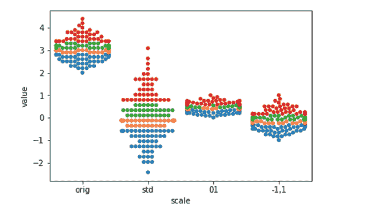

重定尺度最常见的动机是我们不希望任意的测量尺度影响我们的结果。例如，如果我们用米而不是纳米来测量一个人的身高，这个值会小得多——一米是一大堆纳米。但是这不应该真正影响测量中的基本信息。在非常不同的尺度上测量的值之间保持公平的最简单的方法是将它们重新调整到一个大致相同的尺度。另一个例子发生在同一模型中不同类型的测量。例如，家庭收入通常是数万美元，但每户家庭的汽车数量通常是个位数。从数字上看，这些值具有非常不同的权重。我们把它们放在一个共同的尺度上来抵消。当我们超越预测模型，开始进行统计或因果断言时，重新标度的一些好处变得更加突出。

## 10.4 离散化

当我们实现分段常数回归时，我们已经看到了离散化——将一系列连续值排序为一些有限的或离散的值的过程。在这里，我们必须根据输入值的存储桶选择一个输出值——一个线段。离散化也显示为决策树值分割的一部分: *height* > 5'7 "为真或假。有许多用于离散化数据的*自动化*方法；其中一些研究了要素值、*理想值*分割点和这些分割点对良好分类的价值之间的关系。在交叉验证中使用这些方法以防止对训练数据的过度拟合是至关重要的。你可以把足够高级的离散化策略想象成他们自己的微型学习者——想象一下如果他们能把正确的离散化到正确的分类桶中！现在，让我们考虑一些用 *iris* 数据进行离散化的*手动*方法。

```py
iris_df = pd.DataFrame(iris.data, columns=iris.feature_names)

iris_df['species'] = iris.target_names[iris.target]

display(iris_df.iloc[[0,50,100]])
```

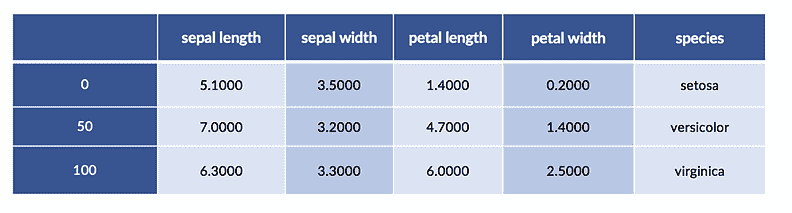

如果我们观察萼片长度的平滑图，我们会看到它是一个相当好的隆起。

```py
plt.subplots(1,1,figsize=(4,3))

ax = sns.distplot(iris_df['sepal length'], hist=False, rug=True)

ax.set_ylabel("Approximate %");
```

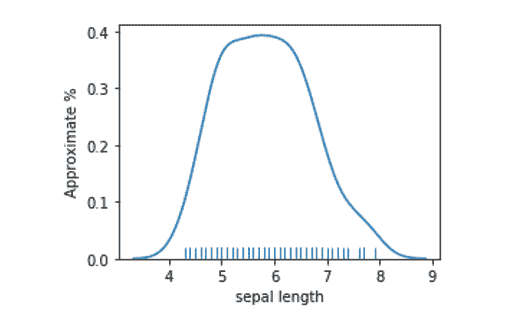

一种简单的离散化方法是在平均值或中值处将值分为低和高。

```py
# apply binary threshold to numeric with sklearn is tricky

column = iris_df[['sepal length']] # keep 2Dness because sk complains

col_mean = column.mean().values # and sk fails with Series/DF

both = column.copy()

both['&amp;gt; Mean'] = skpre.binarize(column, col_mean).astype(np.bool)

print('Column Mean:', col_mean)

display(both.iloc[[0,50,100]])
```

```py
Column Mean: [5.8433]
```

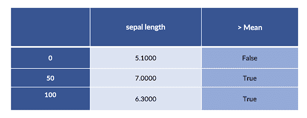

我们还可以使用一两分钟前展示过的`pd.cut`函数进行同样的离散化。

```py
sep_len_series = iris_df['sepal length']

breaks = [sep_len_series.mean(),

    sep_len_series.max()]

# ugly to extract

print(pd.cut(sep_len_series, breaks).cat.codes[[0, 50, 100]])
```

```py
0 -1

50 0

100 0

dtype: int8

```

但是，坦率地说，使用原始 np 会产生一个相当可读的解决方案，其中包含最少的幕后魔术。

```py
# an easy button:

np.where(column &amp;gt; column.mean(), True, False)[[0,50,100]]
```

```py
array([[False],

    [ True],

    [ True]])
```

即使我们完成了计算，在中间破坏这样良好的数据有意义吗？两个非常相似的萼片长度值——平均值加一点和平均值减一点——被强制放入不同的桶中。大峰也意味着大多数值都在平均值附近的区域。我们希望他们在一起还是分开？只有我们的预测问题可以肯定地告诉我们。但是，就个人而言，我更愿意把中间的放在一起，把特别长的和特别短的放在它们自己的桶里。因此，我们会有短期、中期和长期，其中大多数例子都属于中期。

如果我们有领域知识，我们可能有其他的理由来选择某些分割点。例如，会计师可能会在税级阈值处引入分割点。在这里，有强大的信息可用，我们可能不需要担心过度拟合。我们总是可以交叉验证和比较。如果我们没有专家信息的来源，我们可能会尝试一系列的分割点可能性，并交叉验证它们，以确保我们不会过度拟合。

让我们实际一会儿。你应该使用哪种技术？现在，我要开始玩我的老把戏了。答案是*视情况而定*。你可能不是一个 NumPy 忍者，所以最后一个选项可能对你没有意义。但是如果您有更复杂的数字数据，您可能会通过使用 NumPy 获得一些其他的优势。熊猫和`sklearn`选项之间有更多的权衡。Pandas 选项放在交叉验证循环中不会非常方便。`sklearn`方法将使用管道直接插入交叉验证。但是，如果您需要进行数据探索和处理来得出分割点，请坚持使用 Pandas。

## 10.5 分类编码

到目前为止，我们一直在使用 iris 数据集的精确形式:我们从花朵的数字测量中预测物种。但是我们可以重新整理数据，做其他的学习任务。例如，假设我们想要根据其他特征(包括物种)来预测花瓣长度。现在，我们把物种作为已知的输入特征，花瓣长度作为未知的目标。数据看起来是这样的:

```py
# close your eyes Francis, this is about to get ugly

# this pandas voodoo is simply to produce a labeled dataframe

# so you can *see* the learning problem I am describing in the text

new_iris_df = pd.DataFrame(iris_df, columns=['petal length',

    'petal width',

    'species'])

new_iris_df.columns = pd.MultiIndex([['input ftrs', 'target ftr'],

    new_iris_df.columns],

    [[1, 0, 0], [0,1,2]])

new_iris_df.sort_index(axis='columns', inplace=True)

display(new_iris_df.iloc[[0,50,100]])
```

物种没有直接的数字解释。没有一个定义好的顺序，我们可以用它来表示 setosa = 1 < versicolor = 2\. We could use numbers to represent categories—think class 0, class 1, class 2\. However, if we pass this column to linear regression, what would it mean for a species coefficient to be multiplied by these different values? We’d be treating the *categories* 为数值，而它们实际上只是类标识符。我们*不希望*将数值差 1 解释为预测花瓣长度的加减。

我们编码离散数据的一般技术称为*编码分类变量*。几分钟后，我们将在更广泛的背景下研究它。现在，让我们从一个让老派统计学家满意的有用技术开始:一键编码。它将具有多个值的单个列转换为具有一个且只有一个 on 值的多个列。示例的 on 值通常是二进制 1(或 True ),其他列值是 0(或 False)。以下是一次性编码的鸢尾物种:

```py
# start with category numbers

print("Numerical categories:",

    iris.target[[0, 50, 100]], sep='\n')

# produces sparse representation

sparse = skpre.OneHotEncoder().fit_transform(iris.target.reshape(-1,1))

# densify it

print("One-hot coding:",

    sparse[[0,50,100]].todense(), sep="\n")
```

```py
Numerical categories:

[0 1 2]

One-hot coding:

[[1\. 0\. 0.]

[0\. 1\. 0.]

[0\. 0\. 1.]]

```

这里有几个技术点值得一提。`OneHotEncoder`需要数值输入。它不喜欢弦乐。它还需要一个 2D 输入—因此调用了`reshape`。最后，如果我们一步到位，结果中会有很多很多的零。记住，在所有展开的列中，每个示例只有一个值是打开的。即使只有几个合法值的源列也会导致大量的零——除了一个选项之外，其他选项并没有在每个示例中使用。因此，`sklearn`很聪明，它以一种压缩格式存储数据，这种格式很好地处理了稀疏性——这是一个技术术语，指含有大量零的数据。它不是到处记录值，而是只记录非零项，并假设其他所有项都为零。

有一些学习方法可以有效地处理稀疏数据；他们知道许多值是零，并且聪明地不做额外的工作。如果我们想以通常的、完整的形式查看数据，我们必须要求使数据变得密集。您可以想象，当我们填写稀疏表单时，我们有一个有点像瑞士奶酪的表:它有许多洞。我们必须用实际的零来填补这些漏洞——这些值被认为是零。这样我们就有了一个坚固的——密集的——表，到处都是条目。我们通过最后一行中的`.todense()`调用来实现。

我们也可以用`pandas`进行一键编码。一个好处是，我们可以要求它给一个热点列提供漂亮的标签。

```py
# can use drop_first to get treatment coding

# can request sparse storage

encoded = pd.get_dummies(iris_df, prefix="is")

encoded.iloc[[0,50,100]]
```

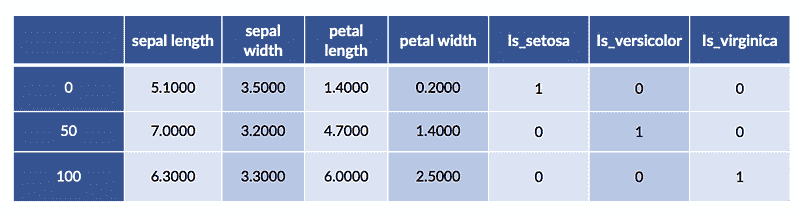

我们可以用原始数据来娱乐和获利。我们可能希望将编码和原始物种值之间的关系可视化。这是:

```py
# splicing dataframes together by merging

# recall `iris.target` is in terms of 0, 1, 2, not symbolic (setosa, etc).

encoded_species = pd.get_dummies(iris.target)

encoded_df = pd.merge(iris_df, encoded_species,

    right_index=True, left_index=True)

encoded_df.iloc[[0,50,100]]
```

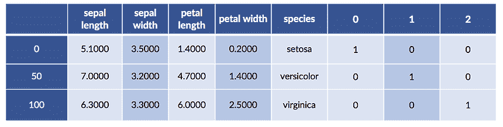

## 10.5.1 编码的另一种方式和遗漏截取的奇怪情况

这是实现一键编码的另一种方法。在统计领域，一键编码被称为*处理*或*虚拟编码*。有些细节我会绕着跳踢踏舞，但我会在这一章的结尾多留几条注释。`patsy`是一个很好的系统，它允许我们以一种方便的方式指定一些特征工程和建模思想。这是我们马上要用到的一个长版本:

```py
import patsy.contrasts as pc

levels = iris.target_names

coding = (pc.Treatment(reference=0)

    .code_with_intercept(list(levels)))

print(coding)
```

```py
ContrastMatrix(array([[1., 0., 0.],

                      [0., 1., 0.]

                      [0., 0., 1.]]),

              ['[setosa]', '[versicolor]', '[virginica]'])

```

我提出另一个选择的原因不是让你不知所措。实际上，我想继续讨论一些我们可以用`patsy`完成的有用的特性工程任务，并加深你对分类编码含义的理解。现在，我声称这是一个很好的系统，可以做一些像一次性编码这样的事情。但是，大声哭出来，以前的细胞是可怕的。让我们按下简单按钮。

```py
encoded = patsy.dmatrix('species-1',

    iris_df,

    return_type='dataframe')

display(encoded.iloc[[0,50,100]])
```

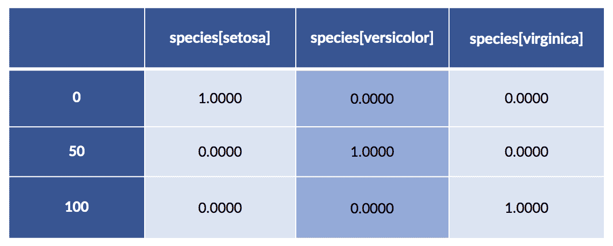

`'species-1`中的-1 发生了什么？让我们看看当我们忽略它时会发生什么。

```py
encoded = patsy.dmatrix('species',

    iris_df,

    return_type='dataframe')

display(encoded.iloc[[0,50,100]])
```

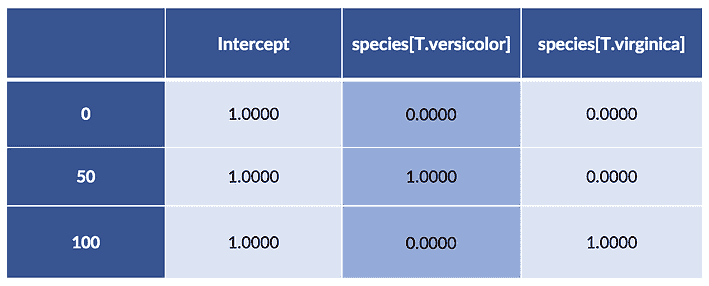

我们得到两个显式编码的特性，并得到一列名为 Intercept 的所有特性。顺便说一下，`patsy`实际上为我们执行了+1 技巧，并将其命名为 Intercept。那么，为什么我们必须做`-1`来得到简单的结果呢？为什么`species`的`dmatrix`给我们一列*和*——貌似！—忽略其中一个物种(没有针对 *setosa* 的列)？我们一会儿会回到这个话题。

## Patsy 型号

让我们用手电筒照一下刚才发生的事情。我们正在构建设计矩阵— `dmatrix`生物——有两个主要元素:(1)建模思想的一些规范，以及(2)我们希望通过该模型运行的数据。设计矩阵告诉我们如何从原始数据获得我们想要的数据形式，以通过建模过程的底层数字处理。绝对是范例时间。

我们可以指定我们想要从花瓣宽度和种类预测花瓣长度——我们对虹膜数据的回归扭曲。如果我们的列名有下划线(`petal_length`)而不是空格(`petal length`)，那么规范将被写成`(petal_length - petal_width + C(species. Treatment)'`。该规范要求运行线性回归，将波浪号`~`的左侧作为目标，将右侧项作为输入特征。`C()`表示我们希望在运行线性回归之前对`species`进行编码。名称中有空格会使事情稍微复杂一些，但是我们马上会解决这个问题。

下面是我们可以用`patsy`公式做的基本事情的快速参考:

*   `tgt ~ ftr_1 + ftr_2 + ftr_3:`型号`tgt`来自右手边的特征
*   注意时髦的名字
*   `tgt ~ ftr_1 + C(cat_ftr, Some_Coding):`模型`tgt`上的`ftr_1`和分类编码`cat_ftr.`
*   `ftr_1`上的`tgt ~ ftr_1 - 1:`型号没有截击。默认情况下，公式包含一个截距:我们必须手动删除它。我们也可以从 RHS 中移除特征:`tgt ~ ftr_1 + ftr_2 - ftr_1M\`等价于 M `tgt ~ ftr_2.`这里有一些移除特征的有用案例。

现在，我想研究包含或不包含某些变量编码会发生什么。为了做到这一点，我们需要一些我们可以在头脑中处理的琐碎数据。我们开始吧:

```py
pet_data = pd.DataFrame({'pet' :['cat', 'cat', 'dog'],

    'cost':[20.0, 25.0, 40.0]})

pet_df = pd.get_dummies(pet_data)

display(pet_df)
```

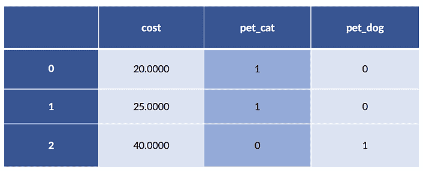

在本例中，卡特彼勒成本为 20 英镑和 25 英镑。单身狗的例子成本为 40。快速记住平均猫成本是 22.50 英镑。

## (貌似)无拦截模式

我们几乎从未具体研究过工厂机器上设置的旋钮值。让我们在这儿做那件事。在我们`fit`之后，线性回归将选择特定的旋钮值，ws 或 m，b。在下面，你可能会注意到我在线性回归构造函数中加入了一个`fit_intercept=False`。它有一个非常好的理由，我将在几分钟后回到它。它与默认的`dmatrix`密切相关，默认的【】有一列全是 1，没有明确地编码所有三个物种。请记住，我们没有明确地适合一个`b`项(常数或截距)。

```py
def pretty_coeffs(sk_lr_model, ftr_names):

    ' helper to display sklearn results in a nice dataframe '

    lr_coeffs = pd.DataFrame(sk_lr_model.coef_,

        columns=ftr_names,

        index=['Coeff'])

    lr_coeffs['intercept'] = sk_lr_model.intercept_

    return lr_coeffs
```

让我们做一点数据处理，让我们的建模步骤更愉快:

```py
# massage

sk_tgt = pet_df['cost'].values.reshape(-1,1)

sk_ftrs = pet_df.drop('cost', axis='columns')

# build model

sk_model = (linear_model.LinearRegression(fit_intercept=False)

    .fit(sk_ftrs, sk_tgt))

display(pretty_coeffs(sk_model, sk_ftrs.columns))
```

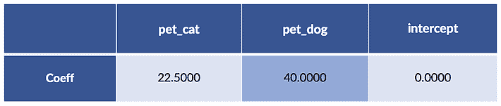

我们没有安装截距—这相当于将其值固定为零。对解释`pet`条目的快速评论。两个特征值(对于`pet_cat`和`pet_dog`)中有且仅有一个不为零。基本上，我们选择其中一列，结果选择我们的成本。您可能还注意到，cat 值是两个 cat 案例的平均值；狗值就是单身狗值。对于这两者，我们已经将 0 和 1 的虚拟编码变成了可切换的权重——其中只有一个是开启的——以添加到我们的宠物护理成本模型中。

回到我的主要故事。这里有另一种方法来生成相同的模型和旋钮设置。

```py
import statsmodels as sm

import statsmodels.formula.api as smf
```

```py
# patsy formula that explicitly removes an intercept

formula = 'cost ~ pet - 1'

sm_model = smf.ols(formula, data=pet_data).fit()

display(pd.DataFrame(sm_model.params).T)
```

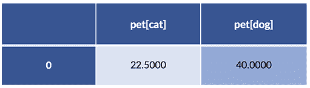

这两种方法得出了相同的系数——我们对此非常高兴。让我们回到丢失截击的问题。在`sklearn`示例中，我省略了`fit_intercept=False`。如果你开始摆弄这些`patsy`公式，你会发现很难为物种*和*得到一个显式的三列伪编码，为截距得到一列全 1。我最后来回答:

*   为什么编码一个分类变量，默认情况下，似乎遗漏了一个变量值？
*   为什么默认公式包含截距？

## 10.5.1.3 具有明确截距的模型

让我们重新创建 sklearn 模型，这次使用截距:

```py
sk_tgt = pet_df['cost'].values.reshape(-1,1)

sk_ftrs = pet_df.drop('cost', axis='columns')

sk_model = (linear_model.LinearRegression() # fit_intercept=True by default!

.fit(sk_ftrs, sk_tgt))

display(pretty_coeffs(sk_model, sk_ftrs.columns))
```

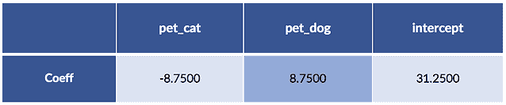

现在，让我们用`patsy`和`statsmodels`做*同样的*模型搭建。我们必须做一些诡计来说服`statsmodels`(1)为宠物使用完全显式的一键编码，以及(2) *和*使用全 1 的列。我们将这样做:(1) `pet - 1` 用猫和狗对宠物进行编码，以及(2)我们将使用一个人造的`ones`列来强制拦截。

```py
pet[cat] pet[dog] ones

10.5 Categorical Coding 339

pet_data_p1 = pet_data.copy() # don't muck the original data

pet_data_p1['ones'] = 1.0 # manual +1 trick

# remove coding intercept ..... add manual ones == add manual intercept

formula = 'cost ~ (pet - 1) + ones'

sm_model = smf.ols(formula, data=pet_data_p1).fit()

display(pd.DataFrame(sm_model.params).T)
```

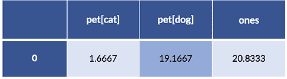

好像有点不对劲，汤姆少校。系数不一样。让我们快速浏览一下这两个模型的预测:

```py
# row-slicing is annoying, but have to get to single-D things

# and .flat gives a warning in the DF constructor

df = pd.DataFrame({'predicted_sk' : sk_model.predict(sk_ftrs)[:,0],display(df)

    'predicted_sm' : sm_model.predict(pet_data_p1),

    'actual' : sk_tgt[:,0]})

display(df)
```

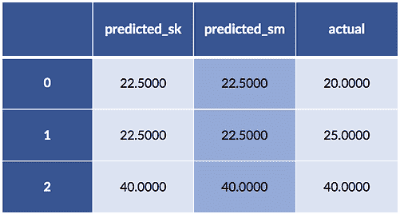

然而预测是一样的。到底是怎么回事？

## 解开谜语

让我们看看当我们指定一个没有截距的 pet 公式时会发生什么。这是我们的数据，包括一栏:

```py
display(pet_data_p1)
```

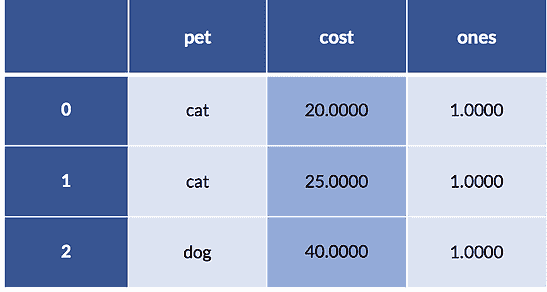

这些数据的编码——没有从分类编码中截取——给了我们。

```py
print('pet - 1 coding')

print(patsy.dmatrix('pet - 1', data=pet_data_p1))
```

```py
  pet - 1 coding

  [[1\. 0.]

  [1\. 0.]

  [0\. 1.]]

```

如果我们将所有编码创建的列加起来，我们可以验证每个示例只有一个“on”值:

```py
# what happens when we add up the coding columns

print("column sum:")

full_coding = patsy.dmatrix('pet - 1',

    data=pet_data_p1,

    return_type='dataframe')

display(pd.DataFrame(full_coding.sum(axis='columns')))
```

```py
column sum:
```

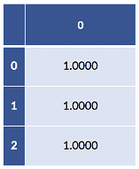

如果我们将包含两个 pet 列的完全显式编码的列相加，我们会得到一个全为 1 的列。此外，我们的两个模型——默认情况下`sklearn`有`fit_intercept=True`，而我们的`statsmodels`有明确的 1 列——其中*已经有了 1 列。所以，我们在数据中隐藏了一个冗余的 1 列。这种冗余正是*为什么有截距的回归模型有两种不同但预测等价的答案。当我们移除截距但保留完整编码时，我们*仍然*具有来自编码列之和的类似截距的项。**

对于线性模型，有一些关于什么构成冗余的规则。如果某些列的线性组合等于其他列的线性组合，则存在冗余。那么，对于我们的线性回归系数，我们不能准确地得到一个且只有一个答案:有许多——无限个——同样正确的答案。我们可以在一个系数上加一点，在另一个系数上减一点，它们就会平衡。你会注意到，就预测而言，这对我们来说似乎不是什么大问题。在更大的画面中，冗余问题被称为*共线性*，当你超越预测的水平，开始进入统计和因果推理的领域时，它更令人担忧。正如我所提到的，我们在本书中将这些问题一笔带过。然而，这些问题正是为什么`statsmodels`让你大费周章地包含完整编码和显式拦截。

## 10.6 关系和互动

特征构造非常强大。事实上，它是如此强大，它实际上可以*取代*我们通常在模型构建中执行的步骤。适当构造的特征可以模拟我们用模型预测时产生的目标。这里有两个例子:

1.  在我们的分段常数回归示例中，最困难的步骤是确定每个输入值属于哪个区域或切片。这样做之后，我们只需选择适当的常数。这几乎就像使用带有复杂键的 Python 字典一样。困难的工作是生成密钥——查找几乎是微不足道的。如果我们将数据预处理到正确的箱中，我们的模型几乎没有什么可做的了。我们可以用一个稍微复杂的预处理步骤和一个琐碎的模型构建步骤来代替我们更复杂的模型构建过程。
2.  要从线性回归过渡到多项式回归(使用曲线形状建模)，我们可以花费大量精力定义一种自定义方法来将多项式拟合到数据，或者我们可以简单地创建多项式要素并将其传递给标准线性回归拟合器。

许多复杂的学习方法可以实现为(1)复杂的方法或(2)特征构造加基本方法。通常，后者的劳动强度较小。如果我们分离出特征工程，我们需要确保用评估独立方法的同样方式评估组合方法——通常是交叉验证。

## 手动特征构造

我认为特征工程可以非常强大，因为它可以消除学习的需要。足够强大的离散化和特征构造方法可以从本质上为我们解决学习问题。让我们停止挥臂，让那个想法更加明确。这里有一个经典的很麻烦的学习例子。我将为 xor 函数创建一个非常简单的示例表。xor 是一个布尔函数，只有当它的一个或另一个输入为真时才为真，而不是两个都为真。数据如下:

```py
xor_data = [[0,0,0],

    [0,1,1],

    [1,0,1],

    [1,1,0]]

xor_df = pd.DataFrame(xor_data,

    columns=['x1','x2','tgt'])

display(xor_df)
```

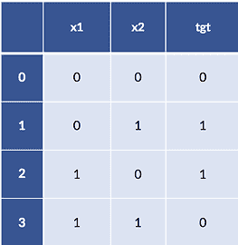

如果我们试图用一个简单的线性分类器来模拟 xor，事情就不那么顺利了。我们在训练集上预测样本中的数据时遇到了问题——我们甚至还没有看到任何新的 T2 测试数据。

```py
model = linear_model.LogisticRegression().fit(xor_df[['x1', 'x2']],

    xor_df['tgt'])

model.predict(xor_df[['x1', 'x2']])
```

```py
array([0, 0, 0, 0])
```

我们怎么会这么坏？好吧，让我们来看一个用输出颜色表示的数据值的图表。

```py
fig, ax = plt.subplots(1,1,figsize=(2,2))

ax.scatter('x1', 'x2', data=xor_df, c='tgt')

ax.set_xlim(-1, 2)

ax.set_ylim(-1, 2);
```

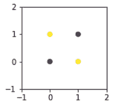

从根本上说，不可能用一条线把这些点分开，只把它们放在类似的类中。至少，我们需要两条线来隔离一条对角线上的点和另一条对角线上的点。但是如果我们能创造一个巧妙的特征呢？

```py
xor_df['new'] = (-1)**xor_df['x1'] * (-1)**xor_df['x2']

print(xor_df)
```

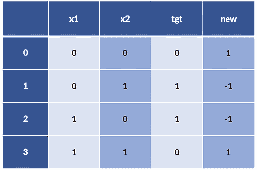

现在事情看起来相当不错:即使是一个超级简单的规则，xor_df['new'] < 0 == True，也能给出我们的目标。事情是这样的:

```py
model = linear_model.LogisticRegression().fit(xor_df[['new']],

    xor_df['tgt'])

model.predict(xor_df[['new']])
```

```py
array([0, 1, 1, 0])
```

有时候，我们需要发明一个新的词汇——像`new`这样构造的栏目——来让我们的学习系统*学习*。

## 互动

一种特定类型的构造特征是现有特征之间的相互作用。功能交互有两种主要方式:(1)通过像字典中的键一样一起工作来选择类或目标值，以及(2)通过基于它们的*乘积*(乘法)而不是它们的总和(加法)一起行动。第二是一种非常复杂的说法，即当我们将两个特征相乘时，我们在考虑它们相互作用的方式。多级交互可以包括越来越多的特征。

这里我们考虑数字特征之间的双向交互——所有数字特征对——与`sklearn`:

```py
# parameters:

# degree: degree of terms

# interaction_only: no x**2, only x*y (and x,y)

# include_bias: constant term

quad_inters = skpre.PolynomialFeatures(degree=2, # degree of terms

interaction_only=True, # no x**2, only x*y

    include_bias=False) # constant term

subset = iris_df.loc[[0, 50, 100], ['sepal length', 'sepal width']]

new_terms = pd.DataFrame(quad_inters.fit_transform(subset),

    index=[0, 50, 100])

new_terms.set_axis(['sep length', 'sep width', 'sep area'],

    axis=1, inplace=True)

# note: creating the interaction *also*

# includes the base terms in the interaction

display(new_terms)
```

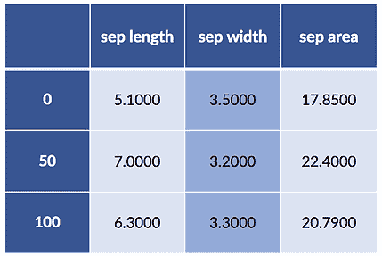

这种表示可能已经足够好了，特别是如果我们想让这些步骤成为`sklearn`管道的一部分。然而，我们可以使用`patsy`获得更精细的控制。

## 10.6.2.1 通过 Patsy 公式进行交互

现在，我们可以通过使用 patsy 公式获得重大胜利。Patsy 让我们指定与`:`或`*`的交互。不同的是，`:`只包括两者之间的交互——`sepal_width * sepal_length`——像`skpre.PolynomialFeatures`中的 interaction_only=True。

```py
design_df = patsy.dmatrix("Q('sepal length'):Q('sepal width') - 1",

    data=iris_df.iloc[[0, 50, 100]],

    return_type='dataframe')

design_df
```

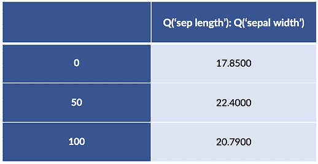

如果我们使用 patsy `*`来连接两个特性`ftr_1 & ftr_2`，我们将得到三列:`ftr_1`、`ftr_2`和产品`ftr_1 x ftr_2`。在两个分类特征之间，一个 patsy `*`意味着我们取笛卡尔乘积——每个值的所有可能组合。让我们构建一个可能用到它的场景。

在我们讨论了萼片长度和宽度一段时间后，你可能会开始想，作为一种近似，我们可以将两者相乘得到一个萼片面积。实际上，我们正在讨论创建一个新的特征 s *萼片面积=萼片宽度×萼片长度*。当从长轴和短轴计算时，我们可以通过诉诸矩形的面积或椭圆的近似面积来证明这一点。我们很乐意将宽度和长度这两个原始概念与一个更具表现力的概念联系起来。如果我们与一位植物学家交谈，他说以她的专家观点来看，是的，近似值足够有效*和*区域在确定物种方面更有用，我们可能会更高兴。这种方法是由背景知识驱动的——所以我们可能不需要费很大力气来交叉验证它。然而，我们*会*想要一个坚持测试集来确保我们不会在面积的价值上误导自己。不像中世纪的经院哲学家们满足于在没有证据的情况下争论和辩论，我们坚持用数据和评估来证明我们的主张。

让我们*也*将花区域的概念与离散化结合起来，找到*大的*区域。最后，我们将创建较小和较大的花瓣和萼片的组合。

```py
# create some areas

sepal_area = iris_df['sepal length'] * iris_df['sepal width']

petal_area = iris_df['petal length'] * iris_df['petal width']

# discretize

iris_df['big_sepal'] = sepal_area &amp;gt; sepal_area.median()

iris_df['big_petal'] = petal_area &amp;gt; petal_area.median()

display(iris_df.iloc[[0,50,100]])
```

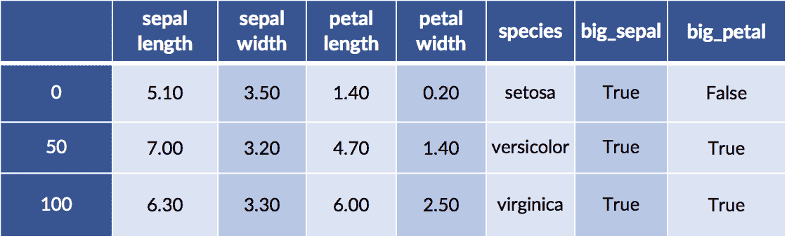

```py
design_df = patsy.dmatrix("big_sepal:big_petal - 1",

    data=iris_df.iloc[[0, 50, 100]],

    return_type='dataframe')

# breaking up the long column names

display(design_df.iloc[:, :2])

display(design_df.iloc[:,2: ])
```

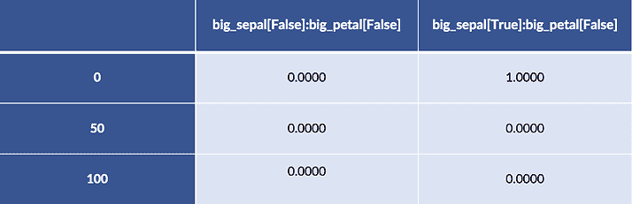


例 50 和例 100 都有大萼片和花瓣。例 0 有一个大萼片和一个小花瓣。

当我们在分类特征和数字特征之间创建交互时，我们实际上为我们考虑的每个类别的数字特征获得了一个权重:

```py
# we (Q)uote sepal length because it has a space in the name

design_df = patsy.dmatrix("C(species,Treatment):Q('sepal length') - 1",

data=iris_df.iloc[[0, 50, 100]],

   return_type='dataframe')

# breaking up the long column names

display(design_df.iloc[:,[0]])

display(design_df.iloc[:,[1]])

display(design_df.iloc[:,[2]])
```

![display(design_df.iloc[:,[0]])](img/98f6959fe4fbc1768d875bd86ff56e92.png)

![display(design_df.iloc[:,[1]])](img/f248870a2290939e1308d2600b0f5c79.png)

![display(design_df.iloc[:,[2]])](img/b00884ff39c4bb344fe9d7d0e4f5498e.png)

如果我们深入研究数据，我们会看到这些值来自哪里——当萼片长度在该类别中时，列值正好是萼片长度的选定值。它是(1)物种的一键编码*乘以* (2)萼片长度的基本乘法。

```py
print(iris_df.iloc[[0, 50, 100]]['sepal length']
```

```py
0                   5.1000

50                  7.0000

100                 6.3000

Name: sepal length, dtype: float64

```

## 10.6.2.2 从 Patsy 到 sklearn

我们还可以看一个连接`patsy`公式和`sklearn`模型的快速例子。本质上，我们手工构建设计矩阵，即原始特征和我们用来学习参数的数据之间的映射，手工应用它，然后运行模型。

```py
import statsmodels as sm
import statsmodels.formula.api as smf

# we can build a design matrix and send it to sklearn

design = "C(species,Treatment):petal_area"

design_matrix = patsy.dmatrix(design, data=iris_df)

# intercept is already in design matrix

lr = linear_model.LinearRegression(fit_intercept=False)

mod = lr.fit(design_matrix, iris_df['sepal width'])

print(mod.coef_)
```

```py
[ 2.8378  1.402  -0.0034  0.0146]
```

```py
# hey, we get the same results!

formula = "Q('sepal width') ~ C(species,Treatment):petal_area"

res1 = smf.ols(formula=formula, data=iris_df).fit()

print(res1.params)
```

```py
Intercept                                                   2.8378

C(species, Treatment)[setosa]:petal_area                    1.4020

C(species, Treatment)[versicolor]:petal_area               -0.0034

C(species, Treatment)[virginica]:petal_area                 0.0146

dtype: float64
```

幸运的是，我们得到了相同的结果——这里面有一些舍入——无论我们做一些手动破解来将数据输入到`sklearn`还是使用自包含的`statsmodels`方法。

## 10.6.3 使用变压器添加功能

如果我们想要与 sklearn 更紧密地集成，我们可以使用`FunctionTransformer`为独立函数定义特性转换，或者使用`TransformerMixin`为类继承。如果从训练集到测试集，我们不需要记住或学习任何东西——如果转换是完全自包含的，比如取数据绝对值的对数——那么我们就不需要增加基于类的方法的复杂性。我们将开始重新创建一个干净的`DataFrame`的初始区域特征。

```py
iris_df = pd.DataFrame(iris.data, columns=iris.feature_names)

iris_df['species'] = iris.target_names[iris.target]

area_df = pd.DataFrame({"sepal_area" : iris_df['sepal length'] *

    iris_df['sepal width'],

    "petal_area" : iris_df['petal length'] *

    iris_df['petal width']})
```

现在，如果我们只想与整个数据集的中值进行比较，而不是训练和测试差异，我们可以像下面这样快速地制作一个转换器:

```py
def median_big_small(d):

    return d &amp;gt; np.median(d)

transformer = skpre.FunctionTransformer(median_big_small)

res = transformer.fit_transform(area_df)

print("Large areas as compared to median?")

print(res[[0, 50, 100]])
```

```py
Large areas as compared to median?

[[ True False]

 [ True False]

 [ True  True]]

```

如果我们想*学习*训练数据的中位数，然后将我们基于学习到的中位数的离散化应用于测试数据，我们需要更多一点的支持。我们必须计算训练数据的中位数，然后将这些中位数作为训练或测试数据的阈值。

```py
from sklearn.base import TransformerMixin

class Median_Big_Small(TransformerMixin):

    def __init__(self):

        pass

    def fit(self, ftrs, tgt=None):

        self.medians = np.median(ftrs)

        return self

    def transform(self, ftrs, tgt=None):

        return ftrs &amp;gt; self.medians
```

使用模式与内置的 transformer 相同，并且非常类似于标准的学习模型。由于我们使用了一个`train_test_split`，这里我们得到了随机选择的例子。

```py
# training-testing split

training, testing = skms.train_test_split(area_df)

# create and run the transformer

transformer = Median_Big_Small()

train_xform = transformer.fit_transform(training)

test_xform = transformer.transform(testing)

# the dataframes survived!

print('train:')

display(train_xform[:3])

print('test:')

display(test_xform[ :3])
```

```py
train:
```

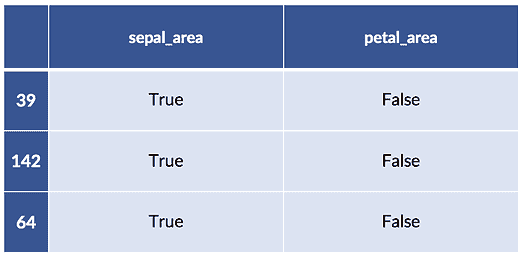

```py
test:

```

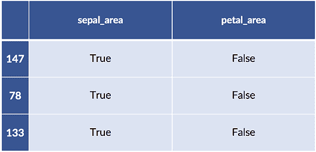

## 10.7 手动特征工程:操纵数据以获取乐趣和利润

在线性回归模型中，您可能会听到以下建议:

*   对输入要素进行变换主要是为了校正输入要素和目标之间的非线性关系。
*   变换目标值可纠正输入要素和目标之间未说明差异的问题。

我补充几点意见。校正非线性意味着特征和目标之间的基本关系不是线性的。线性回归模型正在*特别是*寻找一条最佳直线。超越好线的约束意味着解决线性回归的偏差。

*无法解释的差异问题*是我们的预测和现实之间的误差特征。这些都是本书中第 7.3.2 节[的残差。我们可能会看到的两种模式是(1)系统行为，如输入 *x* 值越大，误差越大，以及(2)以*非正态方式*分布。非正态性意味着预测线上下的误差可能不平衡，或者误差不会迅速减小。](http://www.informit.com/store/machine-learning-with-python-for-everyone-9780134845623?utm_source=Referral&utm_medium=DominoLabs&utm_campaign=Fenner&utm_term=MLPython)

我们可以大胆地把这些翻译出来，给出处理建模问题的一般经验法则。

*   在我们的模型中，操纵输入主要是解决*偏差*。
*   操纵目标主要是解决噪声如何影响输入和目标之间的关系。这个噪声出现在关系中——它不是我们估计参数的变化。

## 操作输入空间

让我们通过观察第一条规则——校正非线性关系，或者更一般地说，偏差——如何发挥作用来使这些想法更加具体。

```py
x = np.linspace(1,10,50)

n1 = np.random.normal(size=x.shape)

comparison = pd.DataFrame({"x" : x,

    "d1" : 2*x+5 + n1,

    "d2" : 2*x**2+5 + n1})

comparison['x'] = x

melted = pd.melt(comparison, id_vars=['x'])
```

两个数据列中的一个与另一个不同:

```py
sns.lmplot(x='x', y='value',

    data=melted, col='variable', ci=None,

    size=3);
```

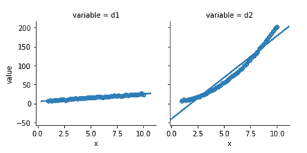

从下面看，为关联`d1`和`x`而构建的模型表现良好。它的残差看起来有点正常——尽管我们只使用了 50 个数据点，所以我们不会看到一个超级平滑的正常形状。来自`d2`模型的残差与正常曲线没有明显的关系。

```py
fig, axes = plt.subplots(1,2,figsize=(8,3))

for ax, variable in zip(axes, ['d1', 'd2']):

    predicted = (smf.ols("{} ~ x".format(variable), data=comparison)

        .fit()

        .predict())

    actual = comparison[variable]

    sns.distplot(predicted - actual, norm_hist=True, rug=True, ax=ax)

    ax.set_xlabel(variable)

    ax.set_ylabel('residual')

fig.tight_layout();
```

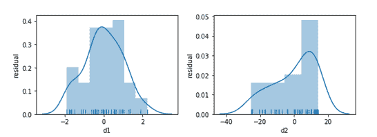

在我们恐慌之前，让我们看看当我们试图将稍微不同版本的`x`、x2 与`d2`联系起来时会发生什么。我们还会看看残差。

```py
magic = pd.DataFrame({"d2" : 2*x**2+5+n1,

    "x_sq" : x**2})

melted = pd.melt(magic, id_vars=['x_sq'])

fig, (ax1, ax2) = plt.subplots(1,2,figsize=(8,3))

sns.regplot(x='x_sq', y='value',

    data=melted, ci=None, ax=ax1)

predicted = (smf.ols("d2 ~ x_sq", data=magic)

    .fit()

    .predict())

actual = comparison['d2']

sns.distplot(predicted - actual, rug=True,

    norm_hist = True, ax=ax2)

    ax2.set_title('histogram')

    ax2.set_xlim(-3,3)

    ax2.set_ylim(0,.45)

    ax2.set_ylabel('residual');
```

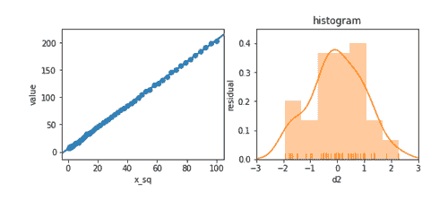

残差看起来很棒。 *Et voilà* ！或者像英国人说的，“鲍勃是你的叔叔。”通过操纵特征，我们可以调整特征和目标之间不寻常的非线性关系。

## 操纵目标

我们可以做一个类似的练习，让我们清楚什么时候应该试图操纵目标。在这里，我们将为我们的关系注入截然不同的噪音:

```py
x = np.linspace(1,10,50)

n1 = np.random.normal(size=x.shape)

n2 = .5*x*np.random.normal(size=x.shape)

comparison = pd.DataFrame({"x" : x,

    "d1" : 2*x+5+n1,

    "d2" : 2*x+5+n2})

comparison['x'] = x

melted = pd.melt(comparison, id_vars=['x'])
```

同样，其中一个与另一个不同:

```py
sns.lmplot(x='x', y='value',

    data=melted, col='variable', ci=None,

    size=3);
```

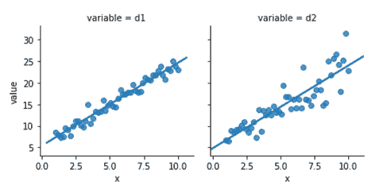

右侧的图`d2`似乎明显有问题。我没有评论我们*是如何产生*数据的——但是让我们关注我们*看到的*。误差——从点到线的垂直距离——随着`x`的增加而增加。下面是`d1`和`d2`的残差直方图:

```py
fig, axes = plt.subplots(1,2,figsize=(8,3))

for ax, variable in zip(axes, ['d1', 'd2']):

    predicted = (smf.ols("{} ~ x".format(variable), data=comparison)

        .fit()

        .predict())

actual = comparison[variable]

sns.distplot(predicted - actual, norm_hist=True, rug=True, ax=ax)

ax.set_xlabel(variable)

ax.set_ylabel('residual')

fig.tight_layout();
```

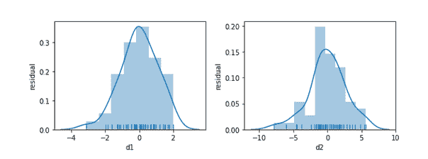

再说一遍，我们尽量不要惊慌。相反，让我们试着通过取目标的对数来施展一点魔法:

```py
magic = pd.DataFrame({"log_d2" : np.log(comparison['d2']),

    "x" : x})

melted = pd.melt(magic, id_vars=['x'])

fig, (ax1, ax2) = plt.subplots(1,2,figsize=(8,3))

sns.regplot(x='x', y='value', data=melted, ci=None, ax=ax1)

predicted = (smf.ols("log_d2 ~ x", data=magic)

    .fit()

    .predict())

actual = magic['log_d2']

sns.distplot(predicted - actual, rug=True, ax=ax2)

ax2.set_title('histogram')

ax2.set_xlim(-.7, .7)

ax2.set_ylim(0,3)

ax2.set_ylabel('residual');
```

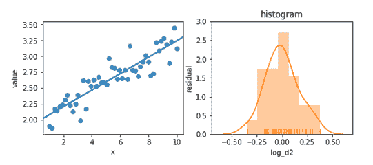

残差现在表现得相当好。这些例子有些做作；你不会总是从简单的转换中看到这种改进。但是它们很容易尝试——你可能会从中获得一些改进。

## 10.8 EOC 总结

我们以一种非常不同的方式增加了我们的工具箱。我们现在可以解决数据本身的问题。这些方法非常有用:不管我们使用什么样的学习方法，这些特征工程步骤都是必要的。然而，这些方法也有局限性。它们需要人工干预，我们需要小心不要过度拟合它们，它们只是随意地解释目标和特征之间的关系。当我们开始处理明显非表格的数据时，如图像和文本，这些方法也需要补充。

## 注释

`sklearn`有一个标准化函数，其目的是使行总和为 1。这与我们一直在做的事情不同:我们一直在谈论列的规范化。

我们简要讨论了稀疏数据存储。可以编写一些学习方法来利用稀疏性:它们将知道未填充的值是零，并避免对这些条目进行不必要的数学运算。我还没有在`sklearn`中找到一个方便的稀疏感知方法列表。你必须在文档中找到面包屑。

我们已经讨论了一键编码，也称为虚拟编码或治疗编码。还有其他编码分类变量的方法可以避免截距问题。这些方法被称为对比编码方案。他们不是依赖一对一，而是以一个值作为基线，并与其他值进行比较。通过采用隐式基线，他们没有我们上面讨论的共线性问题。

用谷歌快速搜索会得到关于`patsy`和`statsmodels`的文档:

*   [https://patsy.readthedocs.org/en/latest/quickstart.html](https://patsy.readthedocs.org/en/latest/quickstart.html)
*   http://statsmodels.sourceforge.net/devel/example_formulas.htmlhttp://statsmodels.sourceforge.net

您将在统计文献中找到大量关于数据转换(特征工程)的信息。它通常仅限于讨论线性回归。这里有几个例子:

*   *数据转换*来自【https://onlinecourses.science.psu.edu/stat501/node/318】T2。
*   第八章*现实回归与方差分析*在 R by 远方
*   Shalizi 的*第 2.2.4 节从初级角度进行高级数据分析*

## 10.8.3 练习

1.  当我们试图预测目标时，我们可能会以哪些方式将无意的关系引入我们的特征，从而给自己带来不适当的优势？换句话说，我们该如何处理那些在训练中可能有效，但在实践中却很失败的严重过度拟合的特征呢？
2.  有哪些可能引导我们*手动*从数据集中选择特征的知识示例？在大型数据集中，我们可能会遇到许多不同的预测问题，从不同的特征集到不同的目标。根据目标的不同，我们可能会受到逻辑、法律、科学或其他因素的不同约束。要有创意！
3.  研究基于一种方法的特征选择在用于其他方法的学习时是如何工作的。使用套索回归( *L1* 正则化)执行特征选择，然后使用不基于线性回归的东西建模，例如 *k* -NN-R 或决策树回归器。
4.  假设您有多模态数据，也就是说，要素的值形成一个双峰(或更多峰)。将这些数据标准化后会发生什么？动手吧！您可以通过合并两个不同正态分布的结果来创建双峰值(比如，一个平均值为 5，另一个平均值为 10)。
5.  我们对虹膜数据做了一些非常基本的离散化处理。你能做得更好吗？这里有一个提示:尝试构建一个决策树分类器，并查看它使用的分裂点。手动应用其中一些，然后尝试不同的分类器。
6.  使用`mystery_df`(如下)，对照其他每个特征绘制`x`。现在，尝试取 x 的对数(`np.log`)，另一个变量，或者两者都取，然后把这些值用图形表示出来。您应该能够直观地评估线性回归是否适合这些图表。线性回归何时会成功？

```py
x = np.linspace(1,8,100)

n1 = np.random.normal(size=x.shape)

n2 = x * np.random.normal(size=x.shape)

mystery = {'m1':5 + n1,

    'm2':5 + n2,

    'm3':x + n1,

    'm4':x + n2,

    'm5':np.log2(x) + n1,

    'm6':np.log2(x) + n2,

    'm7':np.exp2(x + n1),

    'm8':np.exp2(x + n2)}

mystery_df = pd.DataFrame(mystery)

mystery_df['x'] = x
```