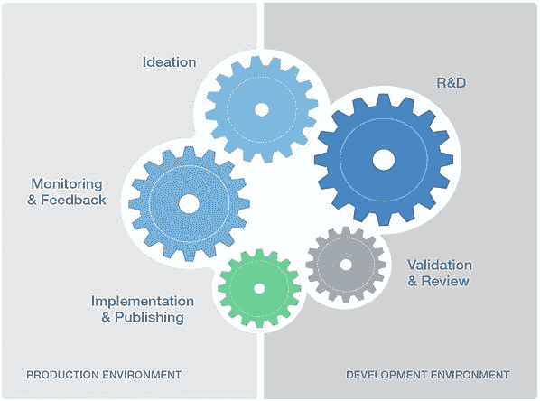

# 衡量数据科学团队的商业价值和成功

> 原文：<https://www.dominodatalab.com/blog/measuring-data-science-business-value>

*这篇博文涵盖了帮助数据科学领导者确保他们团队的工作与商业价值保持一致的指标。*

数据科学经理和高管，无论是来自技术部门还是经理部门，都在努力为他们的团队提供可见性，以及团队的工作如何与业务价值保持一致。很难主动管理您的团队以及他们与业务的互动。当你发现一个项目交付了一个不相关的发现，或者企业已经做出了决定，因为工作交付得不够快时，你通常已经太晚了。在这篇博文中，我提供了一些指标来帮助数据科学领导者确保他们团队的工作符合商业价值。这些指标是基于我从[领导和建立数据科学团队](/quick-tips-for-building-a-data-science-team)中学到的东西以及从我的同事那里获得的经验。

## 为什么指标有帮助

正如任何其他部门使用运营指标来衡量其组织的效率和有效性一样，数据科学也需要这样做。销售团队使用漏斗指标来衡量他们的团队将潜在客户转化为成交客户的效率。工程团队使用 sprint burndown 和团队速度来衡量他们的团队在给定时间内完成工作的效率。监控领先指标使这些团队能够在错过收入数字或产品功能延迟之前快速调整。

对于数据科学团队来说，识别关键信息非常重要，例如当数据科学家花费宝贵的时间复制别人已经完成的东西时。或者在项目交付为“完成”之前，业务利益相关者没有得到反馈。领先指标是一个有用的工具，我用它来了解我的团队在整个数据科学生命周期中所做的工作。

## 数据科学生命周期的非传统指标

正如构建销售指标是为了衡量和跟踪销售漏斗的不同阶段一样，数据科学指标也应该衡量和跟踪数据科学生命周期的不同阶段。但与销售漏斗的线性流动不同，数据科学生命周期可以遵循非常非线性的路径。这意味着您不能使用传统的度量来跟踪从一个阶段到另一个阶段的转换。因此，了解您试图在团队中推动哪些行为以及这些行为如何映射到任何数据科学项目将经历的生命周期非常重要:

您可以使用这个生命周期作为一个框架来定义重要的接触点和要跟踪的活动。然后，根据我们团队的目标，制定可操作的衡量标准，使您能够尽早纠正错误，并学习改进您团队的运作方式。

## 三种类型的指标

为您的团队选择正确的 KPI 应该从明确团队的目标开始。根据我管理数据科学团队的经验，衡量数据科学组织的产出有三个主要目标:管理团队的生产力和可见性；管理个人的生产力和可见性；并报告团队对商业价值的贡献。

### 在团队层面管理生产力和可见性

管理您的数据科学团队的生产力和成功在很大程度上依赖于您对团队正在进行的项目的洞察力。这意味着了解项目在数据科学生命周期中所处的位置、一段时间内每个项目中正在进行的活动类型，以及团队成员和利益相关方之间的协作。您的 KPI 应该帮助您衡量正在产生的洞察力的 ***质量*** 和 ***比率*** 。

### 衡量正在产生的洞察力的质量

您需要有领先的指标来帮助您尽早发现问题，根据新学到的知识或不断变化的业务需求重新确定项目方向，或者根据反馈快速迭代。您团队的信誉取决于您为组织提供的工作的质量和有用性。以下是一些建议:

|   | ***公制*** | ***如何使用*** |
| ***质量*** | 重用已有工作的项目数量 | 团队是否协作并重用现有的高质量工作？防止有人重新发明轮子。 |
| 团队成员对每个活动项目的审核次数 | 代码评审和反馈在你的团队中发生了吗？了解谁需要更多反馈，谁没有提供反馈。 |
| 利益相关者对每个活动项目进行的审核数量 | 在这个项目中有多少风险承担者进行了检查？尽早从业务部门获得更多信息，防止事情走向错误的方向。 |

在下面的例子中，您可以看到一个活动项目的列表、构建它们的现有父项目，以及对每个项目进行的审核的数量和不同类型。在这种情况下，当我看到新项目*直邮目标*没有从现有的父项目中分支出来时，我会主动调查为什么该项目没有重用现有的工作。或者，我可以看到在那个项目上没有发生涉众评审。这使我能够通过获得早期反馈，潜在地为数据科学家节省大量时间，同时确保他们利用我们已经完成的高质量工作。

### 衡量见解产生的*速率*

这些指标应该帮助您优化团队的工作方式，以便您更快地向企业交付成果。这意味着不要错过推动影响，因为业务已经向前发展了。或者，扩大你的影响范围，因为你能够更快地获得对业务的更多见解。以下是一些建议:

|   | ***公制*** | ***如何使用*** |
| ***息*** | 按预期交付日期列出的项目数 | 你期望什么时候向企业交付工作或里程碑？确保你没有对你的团队承诺过多或过少。 |
| 未分配的项目数 | 企业正在等待的积压有多大？我们达到容量了吗？确保当你计划做重要的事情时，它还没有变得无关紧要。 |
| 生命周期每个阶段的数据科学家人数以及每个阶段的时间 | 我看到我的团队中有很多人停留在实验阶段吗？主动取消阻止处于某个阶段时间过长的项目。 |

在下面的例子中，您可以看到团队可能过度承诺在第 6/15 周的星期二交付工作。由此，我可以进一步深入了解工作是什么(例如，它只是一个里程碑检入还是一个最终产品)，团队中的谁正在处理它，以及业务中的谁依赖于该工作，以便我可以有效地重新确定优先顺序并转移工作。我还可以看到在第 6/22 周交付很少，并找出是什么阻止我们在那一周拥有接触点或向业务交付迭代。

## 在个人层面管理生产力和可见性

如果个人工作效率不高，项目和数据科学团队的工作就不会成功。你不希望你的数据科学家走进密室，几个月不露面。管理团队的工作，了解每个团队成员在一段时间内所做的活动类型。这将使站立和状态更新更有成效，用更少的时间谈论正在做什么，用更多的时间解决如何解决问题的实质。这里有一些建议:

|   | ***公制*** | ***如何使用*** |
| ***团队状态*** | 每个团队成员在一段时间内积极参与的项目数量 | 每个团队成员的产量是多少？随着时间的推移，产量趋势如何？知道谁需要更多的指导，如何让他们和团队其他成员一样做出贡献。 |
| 每位团队成员的新评论数量 | 谁与团队合作最多，并帮助提升质量标准？蔻驰:那些不为他人做出贡献或帮助他人的人。 |
| 每个团队成员新发布的工件数量 | 谁在为企业提供可交付成果？推动您的团队发布他们的工作，供利益相关者使用。 |

在这个例子中，我可以看到我的团队中每个人在过去一个月中参与的活动项目的数量。根据其他团队成员的评论历史，我还可以看到谁最积极地做出贡献并与他们合作。在团队中并排比较这些数字有助于我积极地管理生产力，并尽早解决潜在的问题。例如，Mac 可能没有很多活跃的项目，但他对团队的贡献非常大。另一方面，John Joo 对团队和项目工作的贡献很小，所以这将是一个深入了解情况的机会。

## 报告团队工作与业务目标的一致性

数据科学领导者最重要的工作之一是报告数据科学团队为企业带来的价值。衡量团队工作的投资回报率非常困难。第一步是了解您的团队已经发布的哪些工件正被业务中的不同涉众积极使用。除了衡量回报，提供团队资源使用的可见性也同样重要。这些类型的测量将帮助您向高层领导提供有意义的更新，展示您的团队为企业带来的价值，并更好地帮助您的 CIO/ DevOps 支持您的团队。以下是一些建议:

|   | ***公制*** | ***如何使用*** |
| ***向领导汇报*** | #按部门或业务线发布的工件 | 你对整个企业的贡献有多大？谁从您团队的工作中受益？ |
| 与项目相关的成功指标/KPI 的变动 | *项目影响的 KPI 的基线测量与 KPI 中的预期/实际提升* |
| 每天的资源使用和成本 | 谁消耗的资源最多？什么商业项目最贵？将成本归因于用户或团队，以实施成本控制策略。 |

在这个例子中，我可以通过跟踪我的团队消耗的资源、团队中谁消耗的最多，以及业务的哪些项目推动了这些成本，来提高我的 DevOps 团队的透明度。这些信息可以帮助他们实施智能成本控制策略，并更准确地进行预测。

数据科学领导者面临越来越大的压力，需要提供证据证明他们团队的工作提供了商业价值。是的，很难，但不是不可能。这篇博文中涵盖的指标是一个很好的起点，可以用来衡量您的数据科学团队的效率以及它对组织的贡献。跟踪团队的生产力、可见性以及报告工作的价值是耗时的，但是收益是巨大的。

