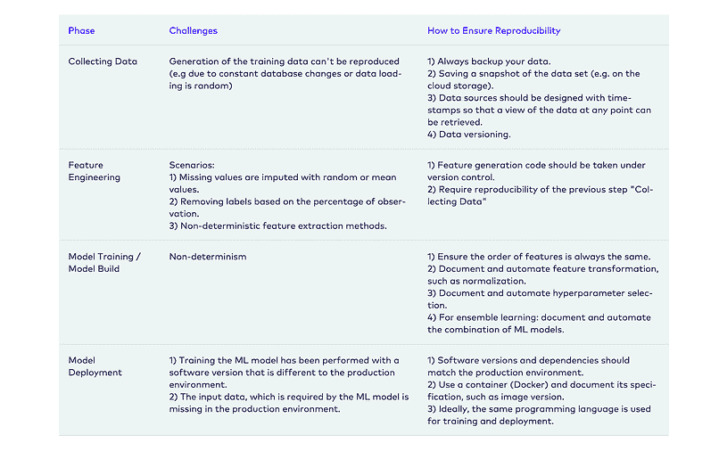

# 大型组织的 5 种最佳实践

> 原文：<https://www.dominodatalab.com/blog/mlops-best-practices-for-large-organizations>

机器学习操作(MLOps)不仅仅是人工智能(AI)和机器学习(ML)社区的最新流行语。许多公司意识到他们需要一套实践来有效地建立模型并投入生产，而 MLOps 正好做到了这一点。

[MLOps](https://www.dominodatalab.com/resources/a-guide-to-enterprise-mlops/) 在整个 [数据科学生命周期](https://blog.dominodatalab.com/how-enterprise-mlops-works-throughout-the-data-science-lifecycle) 中，简化、标准化和自动化 ML 模型的开发和部署，包括 ML 模型的部署后监控和维护。

目前，数据科学家的组织中有几款 [工具支持 MLOps](https://www.mihaileric.com/posts/mlops-is-a-mess/) 。然而 [由于与模型开发和部署相关的技术挑战以及高层组织挑战，87%的机器学习模型](https://venturebeat.com/2019/07/19/why-do-87-of-data-science-projects-never-make-it-into-production/)从未投入生产 。 如果你想在你的 ML 项目中取得成功，你需要整合 MLOps 最佳实践来帮助你快速高效地前进。

在本文中，您将了解 MLOps 团队的五种最佳实践，以及知名组织使用的 MLOps 实践示例。

### 为什么您应该采用 MLOps 最佳实践？

将一个 ML 模型从构思到部署和监控是一个复杂而耗时的过程。此外，当组织试图 [扩展数据科学](https://blog.dominodatalab.com/how-enterprise-mlops-supports-scaling-data-science) 时，这种复杂性会迅速增加。如果没有 MLOps 实践和支持基础架构，组织将被迫手动开发、验证、部署、监控和管理模型。这是一项大规模的工作，涉及多个团队、涉众和技能集，并且经常陷入困境，因为每个模型都是根据用例以不同的方式创建和部署的。

MLOps 创建了由技术支持的标准实践，简化了数据科学生命周期中的步骤。没有 MLOps 需要几个月才能完成的任务可以在几天内完成。

一个关键要素是自动监控模型，以确保它们继续按预期执行或快速得到补救。最终结果是生产中的模型更加准确、健壮和可靠。

## MLOps 团队的最佳实践

实现数据科学和机器学习的全部承诺是复杂的，并伴随着许多挑战。

以下列出的 MLOps 最佳实践可通过支持自动化和减少在生产中管理、开发、部署和监控 ML 模型所花费的时间来帮助缓解挑战。

## 数据集验证

数据验证是构建高质量 ML 模型的关键第一步。为了改进 ML 模型的预测，验证数据集以及训练模型以生成值并提供更好的结果是很重要的。从长远来看，检测数据集中的错误是至关重要的，并且直接对 ML 模型的性能负责。

在实践中，您可以从识别重复项、处理缺失值、过滤数据和异常并清理它开始。这样做提高了 ML 模型 的 [精度，减少了整体花费的时间。。](https://towardsdatascience.com/mlops-practices-for-data-scientists-dbb01be45dd8)

当数据集变得非常大和复杂，具有不同的来源和格式时，验证数据集的最大挑战就出现了。

自动化数据验证确保 ML 系统的整体性能不会受到负面影响。例如，TensorFlow 有助于在 规模下进行详细的 [数据验证。](https://cloud.google.com/architecture/analyzing-and-validating-data-at-scale-for-ml-using-tfx)

## 促进协作文化

推动 ML 创新突破的创意来自自发的互动和非线性的工作流程。团队在开发模型时各自为政，进而面临效率低下的问题，包括同事之间的重复工作、浪费时间搜索过去的脚本/硬件配置，以及启动时间短。

通过消除 MLOps 流程中的协作障碍，团队可以同步工作，同时管理层可以监督项目阻碍因素。拥有一个集中的中心，无论 ML 使用什么工具或语言，都可以轻松地共享工作、协作项目和共享上下文，从而合成知识并提高模型速度。但这不会一蹴而就。它依赖于培养一种协作流程的文化以及使能技术。确保您的数据科学家融入到您的业务中，并交流来自不同领域的想法，这将使全球团队能够采用有益的实践，而这些实践是他们原本不会意识到的。

 在实践中，全球最大的保险公司之一 SCOR 通过他们的数据科学卓越中心开发了[一种协作文化](https://www.dominodatalab.com/blog/data-science-at-scor-governing-data-science-by-example-instead-of-edict)，这使得客户至上模式的开发只需通常所需时间的一小部分。

## 应用程序监控

ML 模型依赖于干净和一致的数据，当输入数据集容易出错或偏离其训练数据的特征时，将无法做出准确的预测。因此，在采用 MLOps 时，监控管道是重要的一步。

更进一步，自动化[连续监控(CM)](https://ml-ops.org/content/mlops-principles) 可以给你在生产中发布模型所需的信心，同时确保模型性能降级被快速捕获和补救。s .根据用例，客户或员工可以实时利用 ML 模型的输出，以便快速做出决策。因此，还需要监控操作指标，如延迟、停机时间和响应时间。

例如，如果网站上有一个巨大的销售，而 ML 提供了不相关的推荐，那么将用户的搜索查询转化为购买的成功率就会降低，并影响整个业务。部署后的数据审计和模型性能监控有助于运营顺畅的 ML 管道，从而减少人工干预的需求。

在现实世界中，企业公司部署这种策略的一个例子是 DoorDash 的监控框架，用于收集洞察和统计数据， [生成要监控的指标](https://doordash.engineering/2021/05/20/monitor-machine-learning-model-drift/) 。

## 再现性

ML 中的再现性是一项具有挑战性的任务，需要跟踪模型工件，如代码、数据、算法、包和环境配置。众所周知，许多数据科学家在 Jupyter 笔记本上手动开始模型开发，手动跟踪版本。这种方法通常缺乏对精确模型工件的文档化，并且使得它不可能在另一个系统上重现。

为了容易地再现模型，需要有一个中央存储库来捕获所有的工件及其版本。关键是要能够旋转出一个精确的复制品，这个模型将提供完全相同的结果。虽然这对于一些建模项目来说是可能的，但是如果没有合适的技术来简化这些细节，随着项目数量的增加，这就变得不可能了。无法重现模型使得数据科学家更难展示模型如何传递输出，验证团队也更难重现结果。这也使得遵守法规要求变得困难。此外，如果一个不同的团队不得不接手一个模型的工作，或者想要将它作为工作的起点，那么快速地重新创建工作可以确保工作不会被浪费。

[【ml-ops.org】](http://ml-ops.org/)

Airbnb 使用一个名为 [ML Automator](https://medium.com/acing-ai/airbnbs-end-to-end-ml-platform-8f9cb8ba71d8) 的内置框架，帮助实现可复制的模型。

## 实验跟踪

通常，数据科学团队会同时为各种业务用例开发多个模型。在确定和验证用于生产的候选模型之前，要进行大量的实验。对脚本、数据集、模型、模型架构、超参数值、不同实验及其结果的各种组合进行跟踪和版本控制，是跟踪模型中发生的事情以及生产中应该使用哪个模型的核心要求。构建可重复的 ML 模型。

有效管理数据集和实验是一项基本要求，可以由 MLOps 团队使用各种工具有效协调，如[Domino Enterprise MLOps Platform](https://www.dominodatalab.com/blog/announcing-domino-3-3-datasets-and-experiment-manager)。

## 结论

对大多数公司来说，投资 MLOps 是必要的。它可以使模型高效地投入生产，并确保它们继续可靠地运行。MLOps 帮助各种规模的组织简化和自动化其数据科学生命周期的流程，并解决大型复杂数据集、模型、管道和基础架构的可扩展性问题。

采用 MLOps 的诸多好处中，提高生产率、可靠性和更快地部署 ML 模型只是其中的一部分。实施前面提到的最佳实践将有助于组织从 ML 模型中获得更多的投资回报。

如果您正在寻找企业级 MLOps 平台，请查看 [Domino 企业 MLOps 平台](https://www.dominodatalab.com/product/domino-enterprise-mlops-platform) 。它是领先的 MLOps 解决方案，帮助 J & J 和 Lockheed Martin 等许多大型企业解决可伸缩性问题，并通过提供 ML 工具、基础设施、可审计性和治理来加速开发和部署——所有这些都具有集成的安全性。

